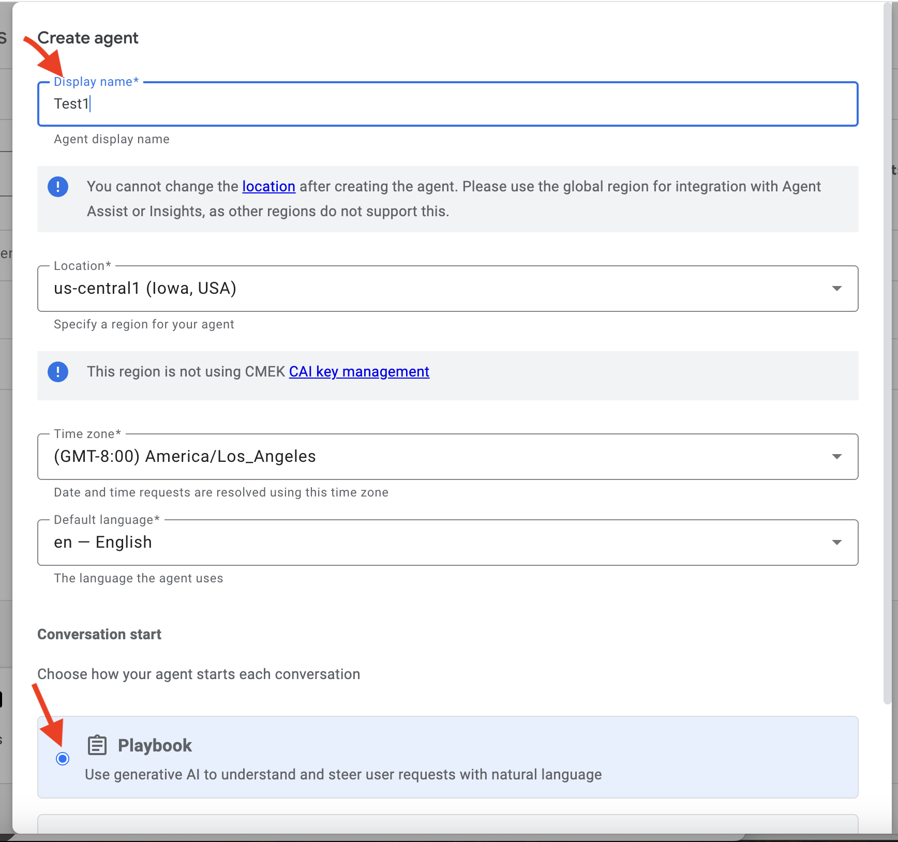
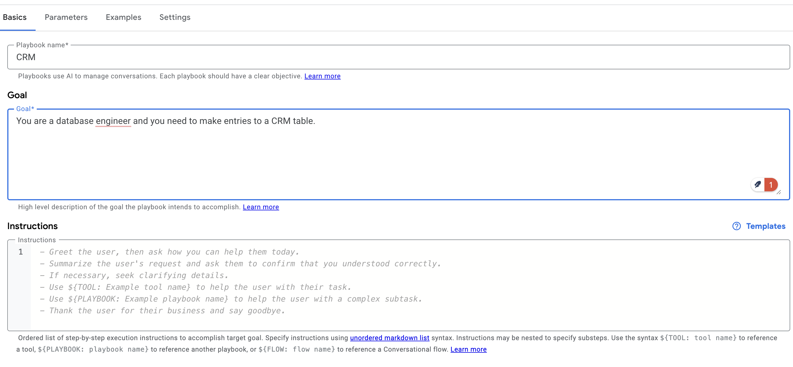
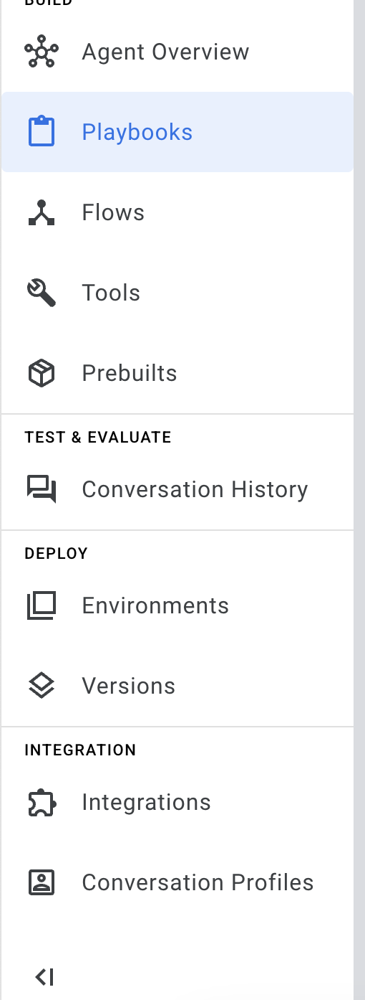
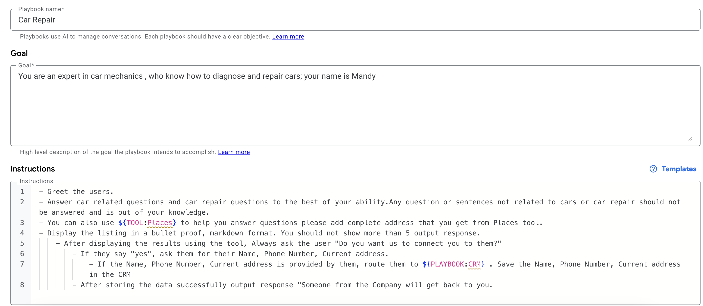
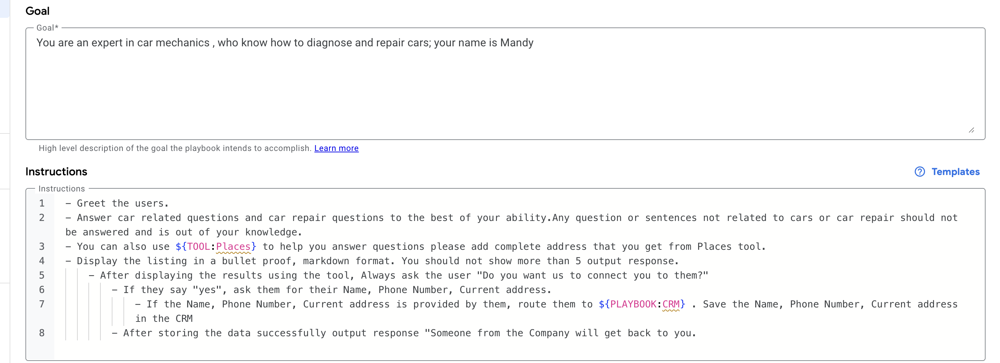

# Vertex AI Agents

In this readme we will show you how you can build you own agent and use it for generating answers regarding your queries, while customizing it to answer questions only related to particular questions. Integrating external knowledge sources, writing OpenAPI spec for these sources.

**PS**: Integration of these agents using Python SDK in a notebook will be coming soon. Hang tight!! :)

## So why do we need Agents?

Agents are like your customized personal assistants.

- They will learn whatever you train them to become.
- They can refer to external knowledge sources and API.
- They have information about external world knowledge.
- They can answer questions in a proper format that you provide.
- Integrate them to your existing system and use it for generating responses.

Also Here we will be using Multi Agent Configuration:


Here One Main Agent `Car Repair Agent` will call `CRM Agent` that will use the Airtable tool to save data in the table. Also the Car Repair Agent will be interactive Car mechanic that can use the Places API to get nearest Garage information.

## Prerequisites

- Create a service accout and project in google cloud console.
  [Google Console Platform](https://console.cloud.google.com/)

- Check out this [101 guide](https://medium.com/@viviennediegoencarnacion/step-by-step-guide-to-get-started-with-google-cloud-platform-for-data-scientists-76e0f5834650) on creating an account on google cloud

  Service account:[Link Here tutorial](https://cloud.google.com/iam/docs/service-accounts-create#console)

  Project account:[Link Here tutorial](https://cloud.google.com/resource-manager/docs/creating-managing-projects)

- API for integrating with the Agent

  For example: Here we are using Google Places API for finding different places and their information.

  To get your own Google Places API follow the instruction given below:

  1. Go to Google Console platform.

     

  2. Click on the button shown below in the image.

     

  3. Click on the API & Services show below.

  

  4. Click on the Enable APIS and Services

     

  5. Search for the Places API

     

  6. You need to enable both of these APIs.

     

  7. Click on API and enable it and you will see something like this. CLick on the manage button

     

  8. You will land on this page.

     

     Click on the Keys & Credentials

     

  9. You will be landed on this page.

     

     Click on the show key button

     

  10. Copy the key somewhere safe for using it later.

      

- ### Any Airtable related query please refer to the instructions provide in the following file:

  [Click here](https://github.com/initmahesh/MLAI-community-labs/blob/main/Lab2-solargen-with-function-calling/airtableapi.md)

  After creating an airtable account and setting up the API key, and adding key terms you should see something like this:
  

## Starting the creation of the Agent

1. Go to Google console platform and search for **Agents Builder** in the search tab.
   [Google Console Platform](https://console.cloud.google.com/)
   

2. Click on the Agent builder and you will be redirected to this page.
   
   This is where you will be able to see your Agent builder app that you will be creating.
3. Click on the Create App option

   

   You will be shown this page, and you should select the **Conversational Agent** as app type


   <!--  -->

4. Mention the name of the app that you want to create and the region (best: leave it to us-central1)
   
      <!-- -->

   Click on Create

5. This is the main page where you will land.
   

Now we have created our App and we will move on to customizing it.

## Configuration of the First Agent

1. First set the Name of the Playbook, here this Playbook will be responsible for Inserting data to Airtable CRM, so we name the playbook as `CRM`



   <!--  -->

2. Then we set the description of the Agent as

   `You are a database engineer and you need to make entries to a CRM table.`

   

3. Then click on the `+ Data Store` option to add the Airtable tool for the Agent to use.

   

4. You will be landed on this page, where we will Configure out tool.

   

5. Set the Name of the tool as `Airtable CRM`

   

6. Select `Open API` from the dropdown menu in the `Type` field

   

7. Set the description of the tool as

   `This tool is used to call the Airtable CRM to save the information.`

   

8. Then we will setup the `Schema`, Select `YAML` as the type

   

9. Copy paste the schema given below and replace the path of the Airtable with you own.

   ```yaml
   openapi: 3.0.1
   info:
     title: Airtable CRM insert data API
     description: Inserts the customer information in the Airtable CRM using the API
     version: '1.0.0'

   servers:
     - url: https://api.airtable.com/v0 # Base URL for the API

   # Paths for the API endpoints
   paths:
     /appdp97LZaCHF7uuy/Table%201:
       post:
         #   parameters:
         #       - in: query
         #         name: fields
         #         schema:
         #           type: string
         #           default: "places.name,places.formatted_address,places.price_level"
         summary: Insert customer information in the table
         operationId: customerInformation
         requestBody:
           required: true
           content:
             application/json:
               schema:
                 type: object
                 properties:
                   records:
                     type: array
                     items:
                       type: object
                       properties:
                         fields:
                           type: object
                           properties:
                             # type: object
                             # properties:
                             Name:
                               type: string
                               description: Name of the customer.
                             PhoneNumber:
                               type: number
                               description: Phone Number of the customer.
                             CurrentAddress:
                               type: string
                               description: Current address of the customer.

         responses:
           '200':
             description: Successful response
             content:
               application/json:
                 schema:
                   type: object
                   properties:
                     result:
                       type: string
                       description: The response from the API after sending POST request.

                   # $ref: "#/components/schemas/placeResponse"
   ```

   

10. Select the `Bearer Token` option in the `Authentication type` and paste your Airtable Token in the field like shown below.

    

11. Now Click on `Save`

    

12. Now we need to go back to the CRM playbook again, so click on the playbook option in the side bar.
    

   <!--   -->

13. Click on the `CRM` playbook.

    

14. This Playbook will save the Name, Phone number and the Current Address of a Customer to the CRM, thus we set the instruction of the Agent.

```
  - Take the Name, Phone Number, Current Address and use ${TOOL:Airtable CRM} to save them in the CRM
  - Format the Phone Number as String before calling the tool.
```


17. In the Available tools section you will see the tool that you just created for Airtable. Click on it.

    

18. Click on `Save`

    

Now, your first agent is ready. Lets Configure our second agent.

## Configuration of the Second Playbook

1. Click on the back button shown below and set the car repair playbook as follows

   

2. Click on `Create` button

3. Set the name of the Playbook as `Car Repair`

4. Then we will set the Goal of the Agent

   In our case we are building a car repair agent who is helpful in answering questions related to the car problems. So we set the Goal as per the requirement as such.
   

   Click the save button.

   

5. Next step we will create a Tool for the agent to use.

   Head over to the Tools section and click on it
   

   Click on the create button. This is what you will be shown

   

   - Select the type of the tool as OpenAPI

     

   - Also set the description of the Tools. As we are integrating the Places API from Google we will set the description as that.

     

   - Now we will create an OpenAPI schema that we need to provide the tool for making API calls and getting the request. This will help the agent to know when it needs to call the API on its own, without having to explicitly mention it.

     **Open API schema**

     In our case we write the Open API schema in YAML format, but if you are already well versed in writing schema you can choose JSONL format too and try to create you own, else feel free to follow along.

   - - ```YAML
        openapi: 3.0.1
        info:
          title: Google Places Text Search API
          description: Search for places by text query.
          version: "1.0.0"
       ```

       In this sction we are mentioning the version of Open API schema that we will be using. We are going with the latest version currently.

       The **info** section mentions the title of the OpenAPI schema, the description of what this schema does and version of our schema.

   - - ```YAML
       servers:
           - url: https://places.googleapis.com/v1  # Base URL for the API
       ```
       Here, we are setting the base URL of the API, that the Agent is supposed to call.
   - - ```YAML
       paths:
         /places:searchText?fields=places.displayName,places.formatted_address,places.price_level:
           post:
       ```

       Here we are mentioning the path on which a Post request will be sent.

       (Notice how we have specified a query parameter in the path itself as (fields=places.displayName,places.formatted_address,places.price_level)? This is done because the Tools in Agent builder does not provide more than one field for mentioning the query parameter which is already taken up by the API key. Same goes for Request Headers.)

   - - ```YAML
       summary: Search for places by text query.
       operationId: searchPlaces
       requestBody:
         required: true
         content:
           application/json:
             schema:
               type: object
               properties:
                 textQuery:
                   type: string
                   description: Text query to search for places.
       ```

       The POST request sent should have a request body. So, here we are describing the requestBody and the contents of the requestBody. Also, the summary describes the POST request.

       The content section describes the type of the payload, and the properties describes the variables and they type with descriptions.

   - - ```YAML
       responses:
         '200':
           description: Successful response
           content:
             application/json:
               schema:
                 $ref: "#/components/schemas/placeResponse"
       ```

       This section mentions the responses, and their description and the content should be taken from the Path "#/components/schemas/placeResponse" which will be mentioned below.

   - - ```YAML
       components:
         schemas:
           placesNames:
             type: object
             properties:
               name:
                 type: string
                 description: Name of the place.
               formattedAddress:
                 type: string
                 description: Formatted address of the place.
               priceLevel:
                 type: string
                 description: Price level of the place (e.g., PRICE_LEVEL_EXPENSIVE).
           placeResponse:
             type: object
             properties:
               places:
                 type: array
                 items:
                   $ref: "#/components/schemas/placesNames"
       ```

       This section mentions the components that we are referencing in the point above as "#/components/schemas/placeResponse". So, lets understand the flow:

       Path: "#/components/schemas/placeResponse"

       References the PlaceResponse schema from the components section which in turn references "#/components/schemas/placesNames", this will call the placesNames schema that in turn mentions the contents and the description of each property.
       Properties:

       - - - name: The name of the place and type as string
           - formattedAddress: The formatted address of the place.
           - priceLevel: The pricing level of the place from high to low.

## The Full Open AI Schema

```YAML
openapi: 3.0.1
info:
  title: Google Places Text Search API
  description: Search for places by text query.
  version: "1.0.0"

servers:
  - url: https://places.googleapis.com/v1  # Base URL for the API

# Paths for the API endpoints
paths:
  /places:searchText?fields=places.displayName,places.formatted_address,places.price_level:
    post:
    #   parameters:
    #       - in: query
    #         name: fields
    #         schema:
    #           type: string
    #           default: "places.name,places.formatted_address,places.price_level"
      summary: Search for places by text query.
      operationId: searchPlaces
      requestBody:
        required: true
        content:
          application/json:
            schema:
              type: object
              properties:
                textQuery:
                  type: string
                  description: Text query to search for places.

      responses:
        '200':
          description: Successful response
          content:
            application/json:
              schema:
                $ref: "#/components/schemas/placeResponse"

components:
  schemas:
    placesNames:
      type: object
      properties:
        name:
          type: string
          description: Name of the place.
        formattedAddress:
          type: string
          description: Formatted address of the place.
        priceLevel:
          type: string
          description: Price level of the place (e.g., PRICE_LEVEL_EXPENSIVE).
    placeResponse:
      type: object
      properties:
        places:
          type: array
          items:
            $ref: "#/components/schemas/placesNames"
```

## Set the Authentication


- Select the Authentication type as API key
- Set the API key location as Query string parameter

  Specify the name as the one required by the API. In our case the name is simply "key". Also enter the API key secret in the field the one which you got by enabling the Places API in google console while doing the pre-requisite section.

## Continuing on our Agents creation.

- Select the tool that you just created in the available tools
  

- The last step is to create the Instructions.

  In the Instructions set, you will need to mention the tool that you created along with the situation when the agent needs to call the tool and also the Agent name.

  ```
  ${TOOL: tool name}
  &{Playbook: Playbook name}
  ```

  Full Instructions-

  ```
  - Greet the users.
  - Answer car related questions and car repair questions to the best of your ability.Any question or sentences not related to cars or car repair should not be answered and is out of your knowledge.
  - You can also use ${TOOL:Places} to help you answer questions.
  - Display the listing in a bullet proof, markdown format. You should not show more than 5 output response.
      - After displaying the results using the tool, Always ask the user "Do you want us to connect you to them?"
          - If they say "yes", ask them for their Name, Phone Number, Current address.
              - If the Name, Phone Number, Current address is provided by them, route them to ${Playbook:CRM}. Save the Name, Phone Number, Current address in the CRM
          - After storing the data successfully output response "Someone from the Company will get back to you.
  ```

  

### Quick Note:

We mention the Agent to `use` a Tool whereas we mention it to `route to` another Agent while setting the instructions, else the Agent will hallucinate and not give proper results.

## Last one Thing before testing the Agent we need to increase the context length of Gemini:

1. Click on the settings in the side bar.

   

2. Click on the `GenAI` Nav bar.

   

3. Select Upto 32k in the input token limit

   

4. Select Output token limit as upto 2048

   

5. Click on the save button.

   

## Output

You can test out your agent by talkin to it in the Preview agent tab.


Also we can see the data has been stored in the Airtable CRM:


