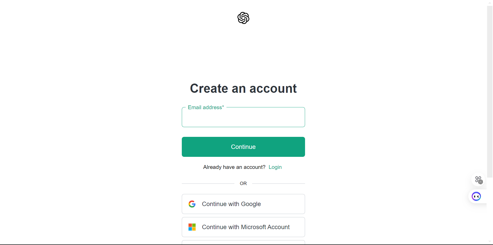

# Open the Jupyter Notebook in Google Colab

You can open this Jupyter notebook directly in Google Colab by clicking the link below:

/notebook.ipynb>)

# Contract Analysis Using CrewAI Agents
## Overview

### In this lab, we will demonstrate how to analyze contracts using **CrewAI agents**. The goal is to extract critical terms from contract documents, compare them with predefined reference data, and generate a detailed report highlighting any mismatches. This framework uses a modular approach, with specialized agents handling different aspects of the task.

#### Overview of the Model Structure:
 -[![Click Here]](https://drive.google.com/file/d/1JHwZSvCJ6DwIW7yWb8H74osdPhbqqnOn/view)

By the end of this lab, you will:
- Understand how to initialize and use CrewAI agents.
- Extract contract terms from PDF files.
- Compare extracted terms against predefined reference data.
- Generate a compliance report identifying mismatches.

---

## Key Components of the Framework

### 1. **CrewAI Agents**
Agents are the backbone of this framework. Each agent is configured with a specific role, tools, and an underlying language model to perform its assigned task.

#### Agent Details
- **PDF Data Extractor**: Extracts key terms from the uploaded contract document.
- **Data Comparison Analyst**: Compares the extracted terms with reference data.
- **Compliance Report Generator**: Creates a detailed report highlighting mismatches and compliance issues.

---

### 2. **Tasks**
Each task corresponds to a distinct phase in the contract analysis workflow. Tasks are assigned to agents for execution.

#### Task Details
- **PDF Extraction Task**: Extracts contract terms from the PDF.
- **Comparison Task**: Compares extracted terms with reference values.
- **Final Report Task**: Generates a compliance report summarizing findings.

---

### 3. **Reference Data**
The framework uses predefined reference values as a benchmark for comparison. These reference terms cover standard contract conditions like liability limitation, notice periods, agreement duration, etc.

---

## Step-by-Step Guide

### Step 1: Install Required Packages
Start by installing the necessary dependencies. Run the following command:

### Step 2: Add the OPEN_API_KEY & AgentOP API Key

### Step 3: How to Generate OPEN_API_KEY:
1. Go this URL [Click Here](https://openai.com/index/openai-api/)
2. Click on SignUp and Create an Account
    
3. Click on Start Building
    
4. Add Organisation Name and click on Save Organisation
    
5. Add team email address and click on continue
    
    
6. Give the API key name and Project name you can skip and click on Generate API key
    
7. Copy the API key and add in you enviroment configuration.
    

### Step 4: How to Generate Agentops.ai:
1. Go to this URL [Click Here](https://app.agentops.ai/signin)
2. Create Account
    
3. Fill all the details select all the libraries and frameworks and click on next button
    
4. Select all the field and click on next.
    
    
5. Click on Submit
    
6. A default project will be created.
    
7. Click on three dots and click on the view API key.
   
8. Copy the API key and paste it in the .env configuration file.
    

## Task Creation for Contract Analysis Workflow

### Purpose

This Python script defines a function, `create_tasks`, which creates and initializes tasks for an automated contract analysis workflow. Each task is assigned to a specific agent, ensuring a structured and efficient process from data extraction to compliance reporting.

---

### Tasks Created

1. **PDF Data Extraction Task**:
   - **Description**: 
     - Uses the `PDF Reader` tool to process the input file and extract key contract terms.
   - **Assigned Agent**: `researcher_agent` (PDF Data Extractor).
   - **Expected Output**: A dictionary containing the extracted contract terms.

2. **Data Comparison Task**:
   - **Description**:
     - Compares the extracted terms against predefined reference data to identify mismatches.
   - **Assigned Agent**: `writer_agent` (Data Comparison Analyst).
   - **Expected Output**: A list of mismatches between the extracted data and the reference values.

3. **Report Generation Task**:
   - **Description**:
     - Creates a detailed analysis report summarizing the findings and recommendations.
   - **Assigned Agent**: `review_agent` (Compliance Report Generator).
   - **Expected Output**: A comprehensive report containing findings and actionable insights.

---

### Key Features

- **Task Definition**:
  - Each task is clearly defined with a detailed description, specifying its objective and expected output.
- **Agent Assignment**:
  - Tasks are assigned to the appropriate agent based on their role and expertise, ensuring alignment with the workflow goals.
- **Expected Outputs**:
  - Clearly defines the deliverable for each task, providing a measure of completion and success.
- **Dynamic Input Handling**:
  - Accepts the `input_file` parameter, making the script reusable for analyzing different PDF files.

---

### Workflow

1. **PDF Data Extraction**:
   - The first task involves reading the PDF file and extracting key terms using the `PDF Reader` tool.
2. **Data Comparison**:
   - The second task compares the extracted data with reference values to identify mismatches.
3. **Report Generation**:
   - The third task generates a comprehensive compliance report summarizing findings and deviations.

---

### Interactive Display

- The `boxen` utility is used to print formatted details of each task, making it visually clear and easy to understand.

---

### Example Use Case

This script is part of a larger automated workflow for contract analysis:
1. Input a contract PDF file (`contract.pdf`) into the system.
2. Execute the tasks sequentially:
   - Extract key terms from the PDF.
   - Validate and compare the terms against reference data.
   - Generate a detailed compliance report.

---

### Code Initialization

The function is called with:
- **Agents**: `researcher_agent`, `writer_agent`, `review_agent` (previously initialized).
- **Input File**: `contract.pdf`.

It returns the created tasks for further processing in the workflow.

## Agent Creation for Contract Analysis Workflow

### Purpose

This Python script defines a function, `create_agents`, which initializes three specialized AI agents designed to process and analyze contract data. Each agent has a unique role in the workflow, equipped with specific tools, goals, and memory capabilities.

---

### Agents Created

1. **PDF Data Extractor Agent**:
   - **Role**: `PDF Data Extractor`
   - **Goal**: Extract key contract terms from PDF files.
   - **Backstory**: An expert in identifying and extracting important contractual information from PDFs.
   - **Tools Used**: `PdfReadTool` for processing PDF content.
   - **Memory**: Enabled for maintaining context during task execution.
   - **LLM**: Uses `ChatOpenAI` with a temperature of 0.7 and the `gpt-4` model for generating context-aware responses.

2. **Data Comparison Analyst Agent**:
   - **Role**: `Data Comparison Analyst`
   - **Goal**: Compare the extracted contract terms against predefined reference values.
   - **Backstory**: A specialist in analyzing and validating contract data for accuracy.
   - **Tools Used**: `ReferenceDataTool` for accessing the standard reference data.
   - **Memory**: Enabled for maintaining contextual continuity during analysis.
   - **LLM**: Utilizes `ChatOpenAI` with a temperature of 0.7 and the `gpt-4` model.

3. **Compliance Report Generator Agent**:
   - **Role**: `Compliance Report Generator`
   - **Goal**: Generate a detailed compliance report highlighting deviations in contract terms.
   - **Backstory**: An expert in drafting compliance documentation based on contract analysis.
   - **Tools Used**: `ReferenceDataTool` for retrieving reference values for comparison.
   - **Memory**: Enabled for efficient report creation and historical context.
   - **LLM**: Powered by `ChatOpenAI` with a temperature of 0.7 and the `gpt-4` model.

---

### Key Features

- **Role Definitions**: Each agent is assigned a distinct role with a clear goal and relevant tools to perform specific tasks in the contract analysis process.
- **Backstory**: Provides a narrative for each agent, enhancing its contextual and operational understanding.
- **Memory**: Ensures that agents can retain and use context throughout their task execution.
- **Tools Integration**: Associates each agent with the necessary tools (`PdfReadTool` or `ReferenceDataTool`) to perform their tasks effectively.
- **Verbose Mode**: Enabled for detailed logging of each agent's operations.
- **Interactive Display**: Utilizes `boxen` to display formatted profiles for each agent, making their roles and goals visually clear.

---

### Workflow

1. **Initialization**: 
   - The `create_agents` function initializes and configures the three agents.
2. **Display Profiles**:
   - Each agent's profile (role, goal, and backstory) is printed in a visually styled box for clarity.
3. **Return Agents**:
   - Returns the three agents: `researcher_agent`, `writer_agent`, and `review_agent` for further use in the workflow.

---

### Example Use Case

This setup is ideal for automating the following contract analysis workflow:
1. Extract terms from a contract using the **PDF Data Extractor Agent**.
2. Validate and compare the terms with predefined reference values using the **Data Comparison Analyst Agent**.
3. Generate a compliance report highlighting any deviations using the **Compliance Report Generator Agent**.