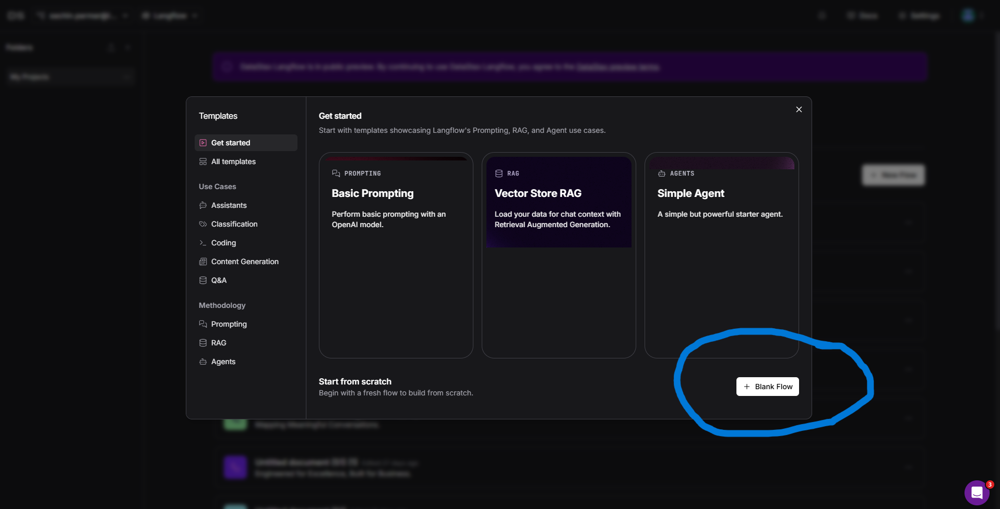

## Prerequisites

Before starting this lab, please ensure you have the following:

1. **OpenAI API Key:**
   - Follow this [Instruction](https://medium.com/@lorenzozar/how-to-get-your-own-openai-api-key-f4d44e60c327) to get the open api key.
   - Ensure you have at least $5 credit in your OpenAI account
   - Keep your API key secure and never share it publicly
     <br>
2. **Required Documents:**

   - [Download MSA Document](https://drive.google.com/file/d/1ZgnpgX6CeMpqLQCzPOqOOaqMETAavm5D/view?usp=sharing) - The reference document for this lab
   - [ Download JSON File](https://drive.google.com/file/d/17v3b2SXulWZrnhqmm-qUDHzssmPNypU1/view?usp=sharing) - Contains the flow diagram for Langflow
<br>

3. **Langflow Login Setup**
   - Follow the instructions provided in the Langflow Login Guide:  
   - üìò [Langflow Login Guide](../../Lab-0(Pre-requisites)/Langflow-Login-Guide/Readme.md)

---

## Objective

By the end of this lesson, you will:

- Understand the fundamentals of prompt engineering.
- Learn how to design effective prompts to get accurate and relevant responses from AI models.
- Develop practical skills in structuring prompts for different use cases.
- Experiment with different types of prompts and analyze their outcomes.
- Apply prompt engineering techniques to optimize AI-generated outputs.

## High-Level Summary

This lab focuses on prompt engineering using Langflow, a no-code tool for designing and testing AI prompts. Here's what we'll do:

1. Set up the environment:

   - Upload pre-created flow in JSON format
   - Upload MSA document as input
   - Configure OpenAI API key
   - Ensure all components are properly connected

2. Test and experiment:
   - Use the Playground to test prompts
   - Analyze responses
   - Adjust parameters for optimal results

This lab is part of the Data Understanding and Data Preparation phases of the CRISP-DM process, where we're exploring how to effectively interact with AI models and prepare our prompts for optimal results.

- 🔗 **[Click here](https://app.eraser.io/workspace/PM7tvkjIPm8WEhp1kn6I?origin=share) to view the flow diagram** and see how the lab is working. 🛠️

  ***

## What is Prompt Engineering?

Prompt engineering is the practice of designing and refining inputs (prompts) to effectively interact with AI models. The goal is to craft clear, structured, and precise prompts that guide the AI in generating relevant, accurate, and useful responses.

AI models, such as ChatGPT, Gemini etc process natural language inputs and generate text-based outputs based on their training data. The way a prompt is phrased significantly impacts the quality of the response.

---

## Experience with Langflow

To better understand **Prompt Engineering**, we will be using **Langflow**, a no-code tool that allows us to design and experiment with AI prompts interactively.

### **Why Langflow?**

- Provides a **visual interface** to create and test AI prompts.
- Helps in **understanding how different prompts impact AI responses**.
- Allows us to **iterate and refine prompts** for better accuracy.
- Enables **rapid prototyping** of AI-driven applications without coding.

By using Langflow, you will gain **practical experience** in crafting, testing, and optimizing prompts, reinforcing key concepts in prompt engineering.

#### **üîó Want to learn more about Langflow? [Click Here](https://docs.langflow.org)**

---

## Visual Example: LLM Workflow in Langflow

Below is an example of how the basic building blocks of an LLM workflow or AI agent are visually represented in Langflow:

### **Key Components in the Workflow**

| Component Type     | Example in Langflow         | Purpose/When to Use                       |
| ------------------ | --------------------------- | ----------------------------------------- |
| Input              | File, Chat Input            | Upload documents, type questions          |
| Data Processing    | Data to Message, Parse Data | Convert/clean/structure input for the LLM |
| Prompt Engineering | Prompt (PromptTemplate)     | Standardize and optimize prompts          |
| Model/LLM          | OpenAI                      | Generate responses                        |
| Output             | Chat Output                 | Display results to the user               |

### **How to Decide What Components to Include**

1. **Start with your use case:**
   - Are you analyzing documents, answering questions, summarizing, or extracting data?
2. **Identify your inputs:**
   - Will users upload files, type questions, or both?
3. **Consider preprocessing needs:**
   - Do you need to parse, clean, or split the data before sending it to the LLM?
4. **Design your prompt:**
   - Will you use a static prompt, or do you need a template that changes based on user input?
5. **Choose your model:**
   - Which LLM fits your needs (e.g., GPT-3.5, GPT-4)?
6. **Plan your output:**
   - How should results be displayed or used? (chat, table, file, etc.)
   
---

# **Deep Dive : Prompt Engineering and Best Practices**

## **Building Blocks of a Prompt:**

Prompts are not created equal and have ways to get different responses. Here are the building blocks that make a prompt:

- **Instruction** - A specific task or instruction you want the model to perform:  
  _"Find the capital of the top 10 countries by GDP?"_
- **Context** - Can involve external information or additional context that can steer the model to better responses.  
  _Context (You are a student listing all countries and their capitals as comma-separated files); Instruction (Find the capital of the top 10 countries by GDP?)_
- **Input Data** - The input or question that we are interested in finding a response for.  
  _Context (You are a student, preparing a list of countries and capitals in any order); Input (Can you list the capital of the USA in that format?)_
- **Output Indicator** - Indicates the type or format of the output.  
  _Context (You are a student, preparing a list of countries and capitals in any order); Input (Can you list the capital of the USA in the given output format?); Output Format: "Paris; France", "New Delhi; India"_

Like Legos, you can pick up all or any combination of these prompts to perform the task at hand.

---

## **Methods Used in Prompts**

There are different types of prompts that you can use to interact with large models based on your task:

### **1) Instructions**

Here, you simply tell the machine what to do, and it does that for you. For example:

**INPUT:**

```text
Read the following sales email. Remove any personally identifiable information (PII), and replace it with the appropriate placeholder. For example, replace the name "Mahesh Yadav" with "[NAME]".

Hi John,

I'm writing to you because I noticed you recently purchased a new car. I'm a salesperson at a local dealership (Cheap Dealz), and I wanted to let you know that we have a great deal on a new car. If you're interested, please let me know.

Thanks,
Mahesh Yadav
Phone: 410-805-2345
Email: initmahesh@gmail.com
```

**OUTPUT:**

```text
Hi [NAME],

I'm writing to you because I noticed you recently purchased a new car. I'm a salesperson at a local dealership, and I wanted to let you know that we have a great deal on a new car. If you're interested, please let me know.

Thanks,
[SALESPERSON]
Phone: [PHONE]
Email: [EMAIL]
```

### **2) Role Prompting**

Here, you assign a role and then ask questions based on that role.

**INPUT:**

```text
You are a frontend engineer. Now estimate what it takes to build a stunning website for a startup with 10 pages, with very basic interactions and simple functionality. Just give the estimate in weeks, restrict your answer to 2 lines.
```

**OUTPUT:**

```text
A stunning website for a startup with 10 pages, basic interactions, and simple functionality could take approximately 4-8 weeks to complete. However, the actual time required may vary depending on project-specific requirements and available resources.
```

---

## **Parameters You Can Tweak**

We have seen how we can use the above blocks, tune our model response, or get different responses. Here are some parameters that affect the results:

- **Temperature** - Controls randomness. A lower temperature leads to more predictable responses, while a higher value increases creativity.
- **Top_p** - Controls response diversity. A lower value gives exact answers, while a higher value encourages varied responses.

üìå _Recommendation: Alter only one of these at a time._

- **Penalty** - Discourages overuse of specific words or patterns in the response.

---

# **How AI Models Process Prompts**

AI models like GPT work by predicting the most likely next word based on the input prompt. The way you structure the prompt **directly influences** the response quality.

- **A vague prompt** results in **ambiguous** or **generic** responses.
- **A detailed, structured prompt** provides **precise, high-quality** responses.

---

# **Let's Start Learning Prompt Engineering with Hands-On Experience!**

The best way to learn **Prompt Engineering** is by practicing it in real-time.
üöÄ **Let's dive in and start experimenting with prompts!**

## Setup the Project

- Follow this [Langflow Login Guide](../../Lab-0(Pre-requisites)/Langflow-Login-Guide/Readme.md) to log in to your Langflow account.

- Click the **New Flow** button on your Langflow dashboard.


 
- Choose **Blank Flow** to start with a clean canvas.



- Once logged in, click on the **Untitled Document** at the top, then select the **Import** option from the dropdown.  
  Import the provided JSON flow file from the following link to view your pre-built flow diagram:  
  [Download JSON Flow File](https://drive.google.com/file/d/1e-WctnpHV1b7rwIgtM9wGjL4FJ-jL571/view?usp=drive_link)


.png>)

- Now, you will see that your project has been successfully imported, and you can view all the components.

# **⚠️ Note: Sometimes while uploading your JSON file the links can be disconnected from each other, so make sure all the links are connected to each other as shown in the screenshot provided to you below.**

.png>)

- Now the first step is you have to provide the document in the first component you want to chat with. We are using a reference MSA document, you can upload yours as well. Click on the blue circle icon to upload your document.

Reference MSA Document link: [MSA document link](https://pragyaallc-my.sharepoint.com/:b:/g/personal/sachin_parmar_legalgraph_ai/EbFs56xdcD1Kh24AX7pKkYYBP3AJCwUCjgrOor6C8Ddjog?e=vi8N2c)

.png>)

---

⚠️ **Important Note**

- Provide your **OpenAI API Key** to the agent and the **OpenAI Model** component to enable authentication and access.
- **[Follow this article](https://medium.com/@lorenzozar/how-to-get-your-own-openai-api-key-f4d44e60c327)** to generate an OpenAI API key. üîë
- Ensure that the **API key is securely stored** and used **only for authorized requests** to prevent misuse.

.png>)

---

- Now, click on the **Playground Section**.

.png>)

---

- In the **Playground section**, enter a query such as:

```
Please analyze the uploaded document and provide a comprehensive summary of its content. Specifically:

1. What is the main purpose of this document?
2. What are the key sections and provisions included?
3. What parties are involved in this document?
4. What are the most important terms and conditions?
5. Are there any notable or unusual clauses that should be highlighted?

Please organize your response in a clear, structured format that helps me understand the core elements of this document.
```

The system will fetch and display the output based on the document that you have uploaded.

.png>)

- **⚠️ Note: If no document is found in the upload document, the file uploader component will fail, and the output generation will not proceed**.

---

## **Improving Prompt Quality: From Basic to Optimized**

Let's explore how the quality of your prompt dramatically affects the results you get from AI assistants. We'll compare outputs from poor prompts versus well-crafted ones.

### **🔴 Basic Poor Prompt:**

```text
Input
Extract these Information from the document: Key Term, Description, and Location in Contract.
```

.png>)

```text
Output
Here are some key terms extracted from the document along with their descriptions and locations in the contract:

1. **Key Term:** Kaseya Master Agreement
   **Description:** A binding legal contract between Kaseya and the entity making purchases under this Agreement.
   **Location in Contract:** Introduction (Effective as of April 1, 2024)

2. **Key Term:** Scope
   **Description:** Governs the interactions between the customer and Kaseya, including access to Kaseya portals and platforms, and the right to purchase Kaseya Products.
   **Location in Contract:** Section 1(a)

3. **Key Term:** Product Terms of Use
   **Description:** Terms applicable to the use, marketing, resale, and distribution of Kaseya Products.
   **Location in Contract:** Section 1(a)

4. **Key Term:** License
   **Description:** The right to use a Product pursuant to the terms of the Agreement and as defined in the applicable Documentation.
   **Location in Contract:** Section 2(c)

5. **Key Term:** End User
   **Description:** The person or entity that purchases a Product for its own use and owns, licenses, or uses Content.
   **Location in Contract:** Section 16

6. **Key Term:** Confidential Information
   **Description:** Any business, operational, and/or technical information that is designated as confidential or that a reasonable person would believe to be confidential.
   **Location in Contract:** Section 7(a)

7. **Key Term:** Termination for Convenience
   **Description:** Either party may terminate the Agreement at any time without cause upon 30 calendar days written notice.
   **Location in Contract:** Section 9(b)

8. **Key Term:** Indemnification
   **Description:** Obligations of Kaseya and the customer to defend and hold harmless against certain claims.
   **Location in Contract:** Section 11

9. **Key Term:** Governing Law
   **Description:** The laws of the State of Delaware, USA, govern all disputes arising out of the Agreement.
   **Location in Contract:** Section 14(a)

10. **Key Term:** Fair Use
    **Description:** Policies that prohibit excessive use of Products that harms Kaseya's resources or circumvents the intended use of the Product.
    **Location in Contract:** Section 2(f)

These terms provide a foundational understanding of the Kaseya Master Agreement and its key components.
```

**⚠️ Issue With This Prompt**
When you give an AI an prompt like:

- You might get a response, but it might not be structured the way you expected. The reason? You didn't specify how you want the output to be formatted.
- Imagine you're asking a friend to summarize a book. If you don't tell them whether you want bullet points, a table, or a short paragraph, they might just ramble on in their own way.

---

### **üü° Better Prompt**

```text
Input
 Create a table with the following columns: Key Term, Description, and Location in Contract. Populate it with the extracted details of the service provider name, customer name, and termination clauses.
```

.png>)

```text
Output
Here's a table with the requested details extracted from the Kaseya Master Agreement:

| Key Term                     | Description                                                                                     | Location in Contract                       |
|------------------------------|-------------------------------------------------------------------------------------------------|-------------------------------------------|
| Service Provider Name         | Kaseya US, LLC (for customers in the United States)                                           | Exhibit A                                 |
| Customer Name                 | The entity making purchases under this Agreement (referred to as "you")                       | Introduction (first paragraph)            |
| Termination for Convenience    | Either party may terminate the Agreement at any time, without cause, upon 30 days written notice. | Section 9(b)                             |
| Termination for Material Breach | Each party may terminate the Agreement upon notice if the other party materially breaches and fails to cure within 30 days. | Section 9(c)                             |
| Effect of Termination         | Upon termination, the customer may not order or sell additional Products without consent, and all rights and licenses will terminate. | Section 9(d)                             |

This table summarizes the key terms related to the service provider name, customer name, and termination clauses as specified in the Kaseya Master Agreement.
```

‚úÖ Why This Works:
You see, when we clearly define the format of the output, the AI follows our instructions and provides the response in the exact structure we need. Instead of a random or unstructured reply, we now get information that is neatly organized.

- Example, in this case, we used a table format, which ensures that the AI categorizes key terms properly. Each term is placed under three distinct columns:
  - **Key Term** – What is being defined.
  - **Description** – A brief explanation.
  - **Location in Contract** – Where it is found in the document.

By setting this structure in the prompt, we eliminate ambiguity, making the AI's response clear, concise, and easy to navigate. This approach enhances readability and ensures that we receive the information in a way that is practical and useful.

---

### **🟢 Optimized Prompt:**

```text
Create a comprehensive contract analysis table with three columns: 'Key Term', 'Description', and 'Location in Contract (Section/Page)'. Extract and populate this table with the following specific elements:

1 Service Provider Name (including full legal entity name and any DBA names)
2 Customer Name (including full legal entity name)
3 All Termination Clauses (including for-cause and without-cause termination provisions, required notice periods, and any termination fees)
4 Contract Term/Duration (initial term and renewal provisions)
5 Payment Terms (including due dates, late fees, and escalation clauses)

```

.png>)

```text
Output:

Here's a comprehensive contract analysis table based on the provided Kaseya Master Agreement:

| Key Term                       | Description                                                                                                                                                                                                 | Location in Contract (Section/Page) |
|--------------------------------|-------------------------------------------------------------------------------------------------------------------------------------------------------------------------------------------------------------|-------------------------------------|
| Service Provider Name          | "Kaseya US, LLC" (for customers in the United States) and other entities for different countries as specified in Exhibit A.                                                                                 | Exhibit A, Page 1                   |
| Customer Name                  | The entity making purchases under this Agreement, as specified by the customer during the registration process.                                                                                             | Section 1, Page 1                   |
| Termination Clauses            | **For-Cause Termination:** "Kaseya may terminate this Agreement... for: (i) non-payment that is not cured within ten (10) days after notice; or (ii) your violation of Section 2 (Use of Products and Restrictions)." <br> **Without-Cause Termination:** "Either Party may terminate this Agreement, at any time, without cause, upon 30 calendar days written notice." <br> **Termination Fees:** "You are required to continue to make payments for a Trailing Subscription until its expiration." | Section 9, Page 12                  |
| Contract Term/Duration         | "This Agreement will commence upon the earlier of: (i) your acceptance of this Agreement... and then will continue until terminated in accordance with the provisions of this section." <br> "Committed Service Terms set forth in Orders will automatically renew for additional Committed Service Terms equal in length to the expiring Committed Service Term unless either party gives notice to the other of non-renewal at least thirty (30) days prior to the end of the relevant Committed Service Term." | Section 9, Page 11                  |
| Payment Terms                  | "You agree to pay all charges applicable to the Products ordered by you including... Fees and payments will be calculated by us based on records maintained by us." <br> "If you are more than thirty (30) days overdue on payments, you agree that Kaseya has the right to... charge interest/late fees at the rate of 2.0% per month." | Section 6, Page 8                   |

This table summarizes the key terms of the Kaseya Master Agreement, providing direct quotes and plain-language summaries for clarity, along with specific locations for easy reference.
```

‚úÖ Why This Works:

- Specifies exactly what information to extract (5 key elements versus just 3)
- Requests specific formatting (markdown table)
- Details what should be included in each column
- Asks for both direct quotes and plain-language summaries
- Requests precise location information (both section and page numbers)
- Clarifies the depth of analysis needed for each element (especially for termination clauses)
- Structures the request in a numbered list for clarity

---

## **Top 10 Best Practices Walkthrough**

Using our _Contract Summarization App_, you can playaround and apply these ten best practices for prompt engineering:

1. **Be Specific with Information Requests**  
   üìå _Example:_ Extract the service provider name, start and end date of the contract, and the total deal value.

2. **Supply Examples for Context**  
   üìå _Example:_ Given the format "Service Provider Name: [Name], Start Date: [Date], End Date: [Date], Deal Value: [Amount]", summarize accordingly.

3. **Include Relevant Data**  
   üìå _Example:_ Referencing Section 1.5, summarize the deal value and billing frequency terms.

4. **Specify Desired Output Format**  
   üìå _Example:_ Create a table with "Key Term", "Description", and "Location in Contract" columns.

5. **Use Positive Instructions**  
   üìå _Example:_ Extract key terms including 'termination for breach' and 'limitations of liability' in JSON format.

6. **Assign a Persona or Frame of Reference**  
   üìå _Example:_ Imagine you are a legal analyst. Summarize auto-renewal terms, notice periods, and liabilities.

7. **Implement Chain of Thought Prompting**  
   üìå _Example:_ Identify 'termination without cause' clauses ‚Üí Summarize ‚Üí Explain implications.

8. **Break Down Complex Tasks**  
   üìå _Example:_ Identify and summarize indemnification terms. Then extract coverage for attorney fees.

9. **Acknowledge the Model's Limitations**  
   üìå _Example:_ Extract governing law and indemnification terms. Flag unclear sections for expert review.

10. **Take an Experimental Approach**  
    üìå _Example:_ Extract 'termination for cause' using a bullet list, then as a paragraph. Compare clarity.

---

## **Optimized Example Prompt for Contract GPT**

.png>)

```xml
Input:

<Role>
You are an in-house general counsel trained to find liabilities and other clauses from contracts.
</Role>

<Instruction>
Use your legal expertise to review the provided contract document. Your primary goal is to extract and summarize specific terms accurately, following the structured format specified.
</Instruction>

<Task>
1. Extract key terms including 'Service Provider Name', 'Start Date', 'End Date', and 'Deal Value'. Present these in a list format.
2. Review and identify clauses related to 'termination for breach', 'data breach notice', and 'limitations of liability'. Provide a summary in JSON format.
3. Analyze 'auto-renewal' terms and specify the required notice period.
4. Summarize 'indemnification' and 'attorney fees' coverage terms separately.
5. Highlight any ambiguous or unclear language, suggesting further review if necessary.
</Task>

<Guardrails>
1. Be specific and concise in term extraction.
2. Provide summaries in the specified format (JSON, table, or bullet points as directed).
3. Emulate a legal analyst persona.
4. Use positive instructions: focus on terms to include, rather than avoid.
5. Acknowledge model limitations: flag uncertain sections for professional review.
</Guardrails>
```

.png>)

```xml
Output:

1. Key Terms Extraction
   Service Provider Name: Kaseya US, LLC (for the United States) / Kaseya Australia Pty Ltd. (for Australia) / Kaseya International Deutschland GmbH (for Germany) / Kaseya Software India Private Limited (for India) / Datto Europe Limited (for the UK and certain Crown Dependencies) / Kaseya Limited (for all other countries).
   Start Date: April 1, 2024 (Effective Date of the Agreement).
   End Date: Not explicitly stated; subject to the Committed Service Term as specified in individual Orders.
   Deal Value: Not explicitly stated; subject to Fees as defined in the Agreement.

2. Clauses Summary in JSON Format

json
{
  "termination_for_breach": {
    "summary": "Either party may terminate the Agreement upon notice if the other party materially breaches the Agreement and fails to cure such breach within thirty (30) days after receiving written notice. Kaseya may terminate immediately for non-payment not cured within ten (10) days or for violations of specific sections."
  },
  "data_breach_notice": {
    "summary": "The Agreement does not explicitly detail a data breach notice clause; however, it implies that parties must notify each other of unauthorized access or use of Portal Accounts."
  },
  "limitations_of_liability": {
    "summary": "Kaseya's liability is limited to direct damages equal to the fees received related to the specific hardware unit or product service subscription in the six (6) months prior to the incident. Kaseya disclaims liability for indirect, incidental, special, consequential, or punitive damages."
  }
}

3. Auto-Renewal Terms Analysis
Auto-Renewal: The Committed Service Terms will automatically renew for additional terms equal in length to the expiring term unless either party gives notice of non-renewal at least thirty (30) days prior to the end of the relevant Committed Service Term.

4. Indemnification and Attorney Fees Coverage Terms
-Indemnification:
   Kaseya agrees to indemnify and hold the customer harmless from third-party claims that a Product infringes on intellectual property rights, with certain exclusions (e.g., modifications made by the customer).
   The customer agrees to indemnify Kaseya for claims arising from breaches of the Agreement, negligence, or failure to secure content.
- Attorney Fees:
   Kaseya is entitled to recover reasonable attorney fees, costs, and other expenses if it commences litigation of a claim.

5. Ambiguous or Unclear Language
Ambiguities:
   The terms regarding the "End Date" of the Agreement are not explicitly defined, as they depend on the Committed Service Term specified in individual Orders. This could lead to confusion regarding the duration of obligations.
   The "Deal Value" is not clearly stated in the Agreement, which may lead to uncertainty regarding financial commitments.

Recommendation: Further review is necessary to clarify the duration of the Agreement and the financial obligations associated with the Deal Value.
```

---

### üìå Conclusion

Effective prompt engineering is an iterative process. Start with these patterns and adapt them based on your specific needs and the AI model's capabilities. Remember to:

- Be specific and clear
- Provide structured formats
- Include examples when possible
- Iterate and refine based on results

üí° **Note:** In the upcoming weeks, we will dive into **advanced prompt engineering techniques**, including **reasoning models** and their real-world applications. Stay tuned! üöÄ

---

# **⚠️ Important Warnings:**

1. **Component Updates Required:**

   - If you see a message saying "Some components need to be updated", click "Update All" to ensure all components are running the latest version
   - This helps prevent compatibility issues and ensures smooth operation of the flow

2. **JSON File Connection:**

   - Sometimes while uploading your JSON file the links can be disconnected from each other
   - Make sure all the links are connected to each other as shown in the screenshot provided below

3. **API Key Security:**
   - When sharing the flow or images of it with others, make sure to hide the API key for security purposes
   - Never share screenshots or recordings that show your API key
   - If you accidentally expose your API key, regenerate it immediately in your OpenAI account

---

# **🎮 Ways to Play Around**

Now that you've mastered the basics, here are some ways to experiment and learn more:

1. **Try Your Own Prompts:**

   - Create different types of prompts (instruction-based, role-based, etc.)
   - Experiment with different prompt structures and formats
   - Test how different phrasings affect the output quality

2. **Use Different Models:**

   - Try different OpenAI models (GPT-3.5, GPT-4)
   - Compare responses between models
   - Observe how model capabilities affect output quality

3. **Adjust LLM Parameters:**

   - Experiment with temperature settings (0.0 to 1.0)
   - Try different top_p values
   - Test penalty settings
   - Observe how these parameters affect response creativity and accuracy

4. **Test with Different Documents:**
   - Upload non-MSA documents (e.g., technical documentation, articles)
   - Compare how the model handles different types of content
   - Test the model's ability to extract and summarize different document structures

Remember: The best way to learn is through experimentation! üöÄ

---

© **All rights reserved Mahesh Yadav Institute**. No part of this course can be reproduced, distributed, or transmitted in any form without permission.
