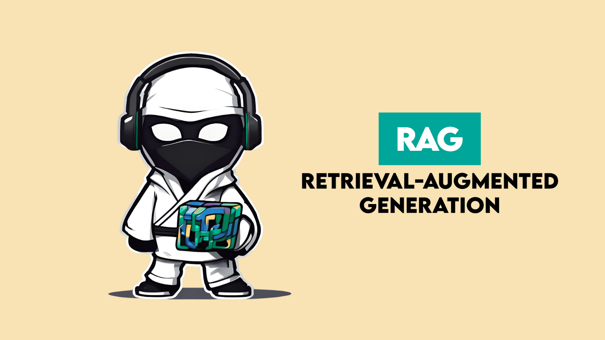
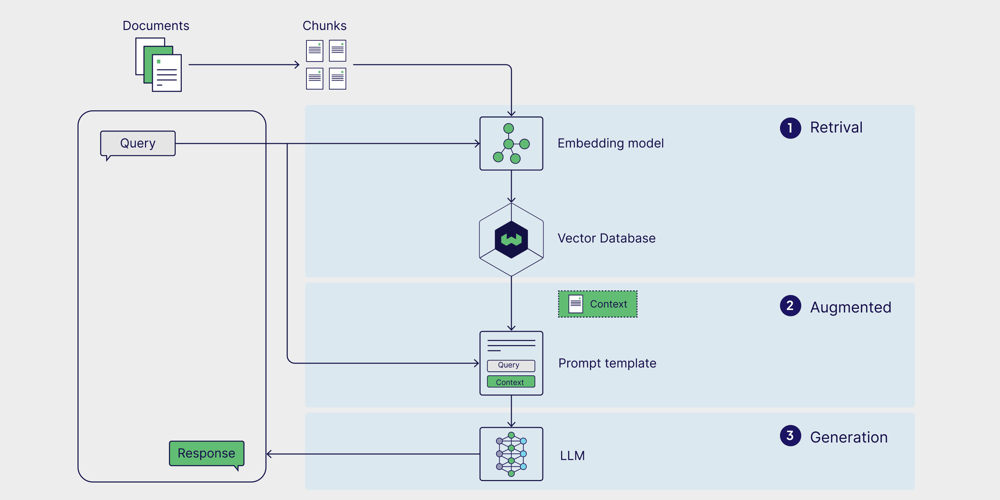
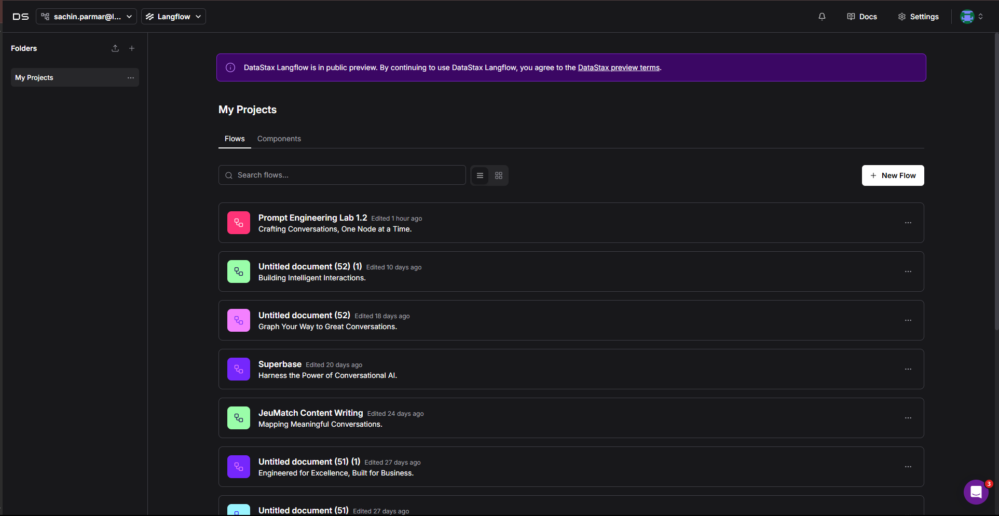

# Buildig RAG Application using Langflow

## Limitations of Large Language Models

Despite powerful capabilities with many tasks, Large Language Models (LLMs) are not know-it-alls. If you've used ChatGPT or other models, you'll have experienced how they can’t reasonably answer questions about proprietary information. What’s worse, it isn’t just that they don't know about proprietary information, they are unaware of their own limitations and, even if they were aware, they don’t have access to proprietary information. That's where options like Retrieval Augmented Generation (RAG) come in and give LLMs the ability to incorporate new and proprietary information into their answers.

For instance, in a previous lab exercise, we observed how Large Language Models (LLMs) struggle when provided with documents that exceed their context window. This limitation highlights the need for more effective methods of supplying external information to the model this is precisely where Retrieval-Augmented Generation (RAG) becomes valuable.

#### In this Lab we will show you how to Generated/analyse contracts using GPT-3.5-turbo 16k context length and adding RAG to solve the issue that we face in Lab 2.1.

---

## Retrieval-Augmented Generation (RAG)

RAG, or Retrieval-Augmented Generation, is a framework designed to overcome the limitations of large language models (LLMs). Traditional LLMs are trained on fixed datasets and can only respond based on what they learned during training.

This means they are unaware of any information released or created after their training cutoff date. RAG addresses this issue by allowing LLMs to retrieve relevant external documents in real time and generate responses based on those documents. In essence, RAG combines the strengths of information retrieval with natural language generation to produce more accurate, fact-based answers.

Here’s how it works:  

1. **Retrieve** — When you ask a question, the system searches your documents, databases, or other sources for the most relevant pieces of information.  
2. **Augment** — These pieces are added to your question so the AI has all the important details right in front of it.  
3. **Generate** — The AI uses both its general knowledge and the new context to write a clear, accurate answer.  

---

## Prerequisites

Before getting started with this RAG application, you'll need to download the following resources:

1. **Document for Processing**

   - Download the document from: **[Document Link](https://drive.google.com/file/d/1GYAKFyXLitx83xCMVWkh-cc2OcIxq3d-/view?usp=sharing)**
   - This document will be used as the knowledge base for the RAG system

2. **Langflow JSON Flow File**
   - Download the pre-configured flow from: **[Flow File Link](https://drive.google.com/file/d/1ntOfttJ-BacL6ru-nVXTOEyxUFqKC1q7/view?usp=sharing)**
   - This JSON file contains the complete Langflow configuration for the RAG pipeline
   - Import this file into your Langflow instance to get started quickly

3. **Langflow Login Guide**
   - Follow the instructions provided in the Langflow Login Guide:  **[Click Here](../../Lab-0(Pre-requisites)/Langflow-Login-Guide/Readme.md)**
---

## Importing the Flow in Langflow

Follow these steps to import and set up the RAG flow in Langflow:

### Step 1: Log in to Langflow Web
Ensure you are logged in to Langflow web. Refer to the login guide if you have not completed this step.

### Step 2: Create a New Flow
Click the **New Flow** button on your Langflow dashboard.

---

### Step 3: Select Blank Flow

1. In the flow creation menu, click on "Blank Flow" to start with an empty template
2. This will open a new workspace where you can build your RAG application

.png>)

---

### Step 4: Import JSON Flow File

1. Click on the "Import" button in the upper toolbar
2. Select the downloaded JSON flow file from your computer
3. Wait for the import process to complete
4. The RAG flow components will be automatically loaded into your workspace

.png>)

---

### Step 5: View Imported Flow

After successfully importing the JSON file, you will see the complete RAG flow in your workspace. The flow will include:

All components will be properly connected, showing the data flow from input to output. You can now proceed to configure the components and test the flow.

> # **Important Note:** After importing, always verify that all nodes are properly connected to each other. Sometimes during import, nodes might become disconnected. Check the flow diagram carefully and reconnect any disconnected nodes by dragging the connection points between them. The data flow should be continuous from the input to the output nodes.

.png>)

---

### Step 6: Setup Document Processing (Part 1)

The RAG flow is divided into two main parts. Let's set up Part 1 which handles document processing and vector storage:

1. **Document Upload**

   - Click on the "Document Loader" component
   - Upload your document file (PDF, TXT, or other supported format)
   - Configure the loader settings if needed

2. **Text Splitting**

   - The document will be automatically split into chunks
   - Configure chunk size and overlap in the "Text Splitter" component
   - This ensures optimal processing of the document content

3. **Vector Storage**

   - The split chunks will be processed by the "Vector Store" component
   - This component converts text into vector embeddings
   - The vectors are stored for efficient retrieval later

4. **OpenAI API Key Configuration**
   - Click on the "Language Model" component.
   - In the configuration panel, locate the "API Key" field.
   - Enter your OpenAI API key.
   - Save the configuration.

.png>)

---

### Step 7: Run Part 1 of the Flow

1. Locate the "Run" button in the upper toolbar (highlighted in the screenshot)
2. Click the "Run" button to execute Part 1 of the flow
3. The system will:
   - Process your uploaded document
   - Split it into chunks
   - Generate vector embeddings
   - Store them in the vector database
4. Wait for the process to complete - you'll see progress indicators for each step
5. Verify that all components show successful completion

.png>)

---

### Step 8: Question Answering (Part 2)

Now that your document is processed and stored in the vector database, you can ask questions about its content:

> ## **Important:** Before proceeding, make sure to configure the embedding model component:
>
> 1. Click on the "Embedding Model" component
> 2. In the configuration panel, locate the "API Key" field
> 3. Enter your OpenAI API key (same key used for the language model)
> 4. Save the configuration

.png>)

> ## **Note:** Also add your OpenAI API key to the OpenAI component in the flow.

.png>)

---

### Step 9: Access Playground

1. Go to the top of the interface
2. Click on the "Playground" section
3. This will open the interactive

.png>)

---

### Step 10: Ask Questions and Get Answers

1. In the playground interface, type your question about the document content
2. The system will:
   - Search the vector database for relevant information
   - Generate a response based on the retrieved content
   - Display the answer
3. Each response will be based on the actual content of your uploaded document

> **Tip:** Try asking questions that:
>
> - Test specific details from the document
> - Require understanding of the document's context
> - Compare different parts of the document
> - Ask for summaries or explanations

.png>)

---

## Conclusion
You now know how to :
   - Break massive documents into context-rich chunks for smarter retrieval  
   - Empower language models to answer with precision and depth  
   - Build a visual, no-code/low-code AI workflow in Langflow  
   - Turn dense, hard-to-navigate information into something your users can query like a live expert  
