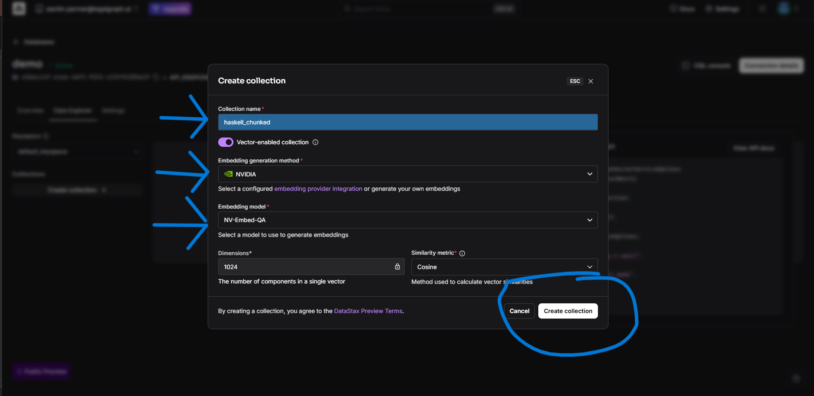
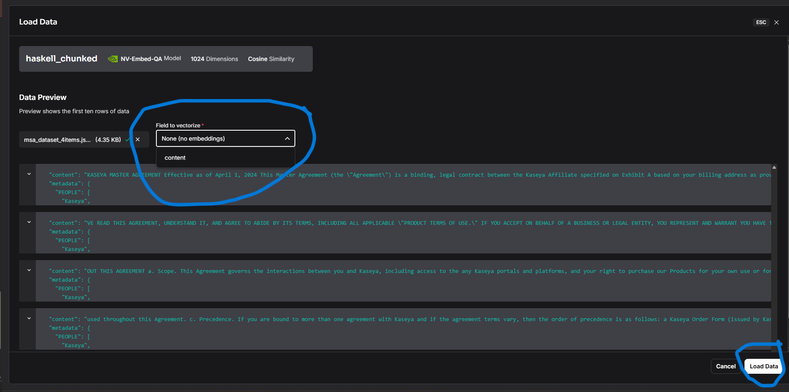

# Build Your First Agentic Graph RAG System with Langflow

## Overview

Imagine this:

You're an AI Product Manager working with Master Service Agreement documents. Your users keep asking complex questions that span multiple sections:

- "What are the payment terms and how do they relate to the termination clauses?"
- "Can you compare the liability sections across different agreement types?"
- "What happens if a client breaches the service level agreement?"

Basic RAG systems give individual answers, but they can't **connect the dots** between different parts of the document. It's like having a brilliant assistant who can only read one paragraph at a time.

That's where **Agentic Graph RAG** comes in.

**What is Agentic Graph RAG?**

- **Agentic**: The system can make decisions about what information to retrieve next, just like a human would think through a problem step by step
- **Graph**: We use graph components in Langflow to create connections between different pieces of information, making the system understand relationships in our data
- **RAG**: We still retrieve relevant information and generate answers, but now with intelligence and context

**What we're building:**
In this lab, you'll create an intelligent document assistant that can work with Master Service Agreement data. You'll:

1. Upload your dataset to Astra DB for storage
2. Build a flow in Langflow using graph components
3. Create an agentic system that can reason through complex document queries

This approach gives you more than just keyword matching — you get a system that can understand context, make decisions, and provide intelligent answers.

## RAG vs Agentic Graph RAG

| Feature                       | Basic RAG                           | Agentic Graph RAG                           |
| ----------------------------- | ----------------------------------- | ------------------------------------------- |
| **Query Processing**          | Single retrieval, one-shot answer   | Multi-step reasoning, iterative retrieval   |
| **Context Understanding**     | Limited to retrieved chunks         | Builds context across multiple retrievals   |
| **Decision Making**           | No internal reasoning               | Makes decisions about what to retrieve next |
| **Information Relationships** | Treats chunks independently         | Understands connections between data points |
| **Complex Queries**           | Struggles with multi-part questions | Handles complex, multi-step queries         |
| **User Experience**           | Basic Q&A                           | Intelligent conversation with follow-up     |
| **Use Cases**                 | Simple document search              | Complex analysis and reasoning tasks        |

## Prerequisites

Before starting this lab, make sure you have the following:

1. **Download the JSON Dataset** - **[Click here to download the Master Service Agreement dataset](https://drive.google.com/file/d/1c4NssYx_f2I2eASCqRCrc2suH9H8ltQa/view?usp=sharing)**
2. **Download Langflow Flow** - **[Click here to download the pre-built flow](https://drive.google.com/file/d/1zYgBFdpl6DZft6VJguVgXZEZrFsWEzE9/view?usp=sharing)**
3. **Langflow Login Guide** - **[Step-by-step login instructions](../../Lab-0(Pre-requisites)/Langflow-Login-Guide/Readme.md)**
4. **OpenAI API Key** - **[How to generate your OpenAI API key](https://medium.com/@lorenzozar/how-to-get-your-own-openai-api-key-f4d44e60c327)**

> **Note:** Make sure you have all prerequisites ready before proceeding to the lab steps.

## Let's Start Building

### Step 1: Set Up Astra DB

**What is Astra DB?**
Astra DB is a serverless vector database built on Apache Cassandra that's specifically designed for AI applications. It provides fast vector similarity search, making it perfect for storing and retrieving document embeddings for our RAG system.

**Why are we using Astra DB?**

- **Vector Storage**: Stores document embeddings for semantic search
- **Fast Retrieval**: Enables quick similarity-based document retrieval
- **Scalable**: Handles large datasets without performance issues
- **AI-Optimized**: Built specifically for AI/ML workloads

1. Go to **[Astra DB](https://astra.datastax.com/)**
2. Click **"Sign Up"** if you don't have an account, or **"Sign In"** if you do

### Step 2: Navigate the Astra DB Interface

Once you are logged in, you will see an interface that looks something like below. Now, click on **"Create Database"** at the top right.

### Step 3: Configure Your Database

1. **Database Name**: Enter a name for your database (e.g., "msa_rag_database")
2. **Provider**: Should be selected by default (usually "AWS" or "Google Cloud")
3. **Region**: Select a region closest to your location for better performance
4. Click **"Create Database"** to proceed

### Step 4: Wait for Database Activation

After clicking "Create Database", wait for some time. Initially, you'll see the database in a **"Pending"** state. After a few minutes, you'll see a **green signal** indicating the status has changed to **"Active"**.

> **Note:** This process typically takes **7-8 minutes** to complete.

### Pending State

### Active State

### Step 5: Generate Your Token

Once your database is **Active**, click on the **"Generate Token"** button located at the right side corner of the interface.Copy the generated token and store it somewhere.

### Copy the token and store it somewhere

### Step 6: Navigate to Data Explorer

Once your database is active and you have generated your token, click on the **"Data Explorer"** tab to access the database management interface where you can view, query, and manage your data.

In the Data Explorer interface, click on the **"Create New Collection"** button to create a new collection where you can store and organize your data.

## Step 7: Configure and Create Collection

1. Provide a name for your collection
2. Choose **"NVIDIA"** as the model provider
3. Select your desired model from the available options
4. Click on **"Create Collection"** to finalize the setup

### Step 8: Load Data into Collection

After your collection has been successfully created, click on the **"Load Data"** button to start uploading and importing your data files into the newly created collection.

### Step 9: Upload JSON Dataset

1. Select **"Structured Data"** as the data type
2. Upload the JSON file dataset that you downloaded in prerequisite step 1
3. Confirm the file upload to proceed

### Step 10: Select Content Field and Load Data

1. From the dropdown menu, select **"Content"** as the field type
2. Click on **"Load Data"** to begin processing the uploaded dataset

### Step 11: Data Upload Complete

You can now verify that your data has been uploaded successfully and is ready for use in your collection.

### Step 12: Create a New Blank Flow in Langflow

1. Log in to your **Langflow**.
2. Click on **New Flow**.

3. Select **Blank Flow** from the options.

### Step 13: Upload the Prebuilt Langflow Flow

1. In **Langflow**, locate and click the **Upload** button.
2. Select the prebuilt Langflow flow file that you downloaded in **Step 2** of the *Prerequisites* section.

3. Wait for the flow to load completely before proceeding make sure all the nodes are connected to each other.

### Step 14: Configure Token, Database, and Collection

1. Provide the **token** that was stored earlier as instructed.
2. From the **Database** dropdown menu, select the correct database.
3. In the **Collection Name** field, enter the specific collection name to be used.
4. Confirm that all details are correct before saving the configuration.

### Step 15: Graph RAG – Defining Entities in Edge Definition

In the **Graph RAG** configuration, you can define **entities** within the edge definition.  
Entities represent specific types of information or objects that your data will recognize, track, and connect in the knowledge graph.

For example:
- **PEOPLE** – Refers to individuals, such as names of persons.
- **AGREEMENT** – Refers to legal or contractual documents.

**What are Entities?**  
Entities are key concepts, objects, or categories extracted from text or data.  
They act as *nodes* in the knowledge graph, allowing you to link related pieces of information.  
Each entity type tells the system what kind of data to identify and how to connect it with other entities.

By defining entities, you make your RAG (Retrieval-Augmented Generation) graph more structured and semantically rich, enabling more accurate retrieval and reasoning.

### Step 16: Provide OpenAI API Key and Access Playground

1. In the **OpenAI** component, paste your valid **OpenAI API Key** into the designated field.
2. Save the changes to ensure the key is stored securely.
3. Navigate to the **Playground** section within Langflow.
4. Use the Playground to test and validate the flow configuration.

### Step 17: Sample Questions for Testing

- Which agreements involve Kaseya?  
- What are the places associated with the parties?  
- List all agreements where a Legal Entity is a participant.  

## Conclusion  

Boom, is it done? 🎉  

yes

You’ve just built your very own **Agentic Graph RAG system** — not just a simple Q&A bot, but an intelligent assistant that can connect the dots, reason through complex queries, and truly understand context.  

You’ve now experienced firsthand how to:  

- **Think beyond basic retrieval** and design multi-step reasoning systems  
- **Structure knowledge as a graph** so relationships between data points come to life  
- **Empower AI agents** to make decisions and iterate their own search process  
- **Integrate modern AI tools** like Langflow and Astra DB into a real, working solution  

  
