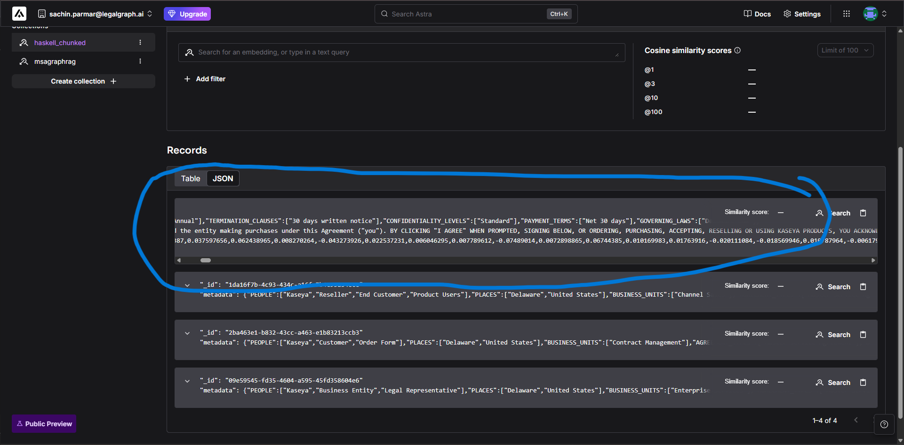

# How Our Dataset Works On Agentic GraphRAG System



```
Sample Dataset :

{"_id":"11e060e9-e47a-4daa-a060-e9e47abdaa30","metadata":{"PEOPLE":["Kaseya","Customer","Legal Entity"],"PLACES":["Delaware","United States"],"BUSINESS_UNITS":["Enterprise Services"],"AGREEMENT_TYPES":["Master Service Agreement"],"DOCUMENT_CATEGORIES":["Legal Contract"],"RISK_LEVELS":["Medium"],"COMPLIANCE_STATUS":["Compliant"],"REVIEW_FREQUENCIES":["Annual"],"TERMINATION_CLAUSES":["30 days written notice"],"CONFIDENTIALITY_LEVELS":["Standard"],"PAYMENT_TERMS":["Net 30 days"],"GOVERNING_LAWS":["Delaware Law"]},"$vectorize":"KASEYA MASTER AGREEMENT Effective as of April 1, 2024 This Master Agreement (the \"Agreement\") is a binding, legal contract between the Kaseya Affiliate specified on Exhibit A based on your billing address as provided by you to Kaseya during the registration process (\"Kaseya,\" \"we\" or \"us\") and the entity making purchases under this Agreement (\"you\"). BY CLICKING \"I AGREE\" WHEN PROMPTED, SIGNING BELOW, OR ORDERING, PURCHASING, ACCEPTING, RESELLING OR USING KASEYA PRODUCTS, YOU ACKNOWLEDGE YOU HAVE READ THIS AGREEMENT","$vector":[0.009147644,-0.022872925,0.06628418,0.045654297,0.033111572,0.025222778,-0.023284912,0.0066070557,-0.04067993,-0.012954712,0.070251465,0.03387451,0.0049858093,-0.0014095306,-0.039276123,0.033111572,-0.022903442,-0.0024738312,0.048187256,0.006855011,-0.039794922,-0.027542114,0.024215698,-0.002462387,0.037597656,0.062438965,0.008270264,-0.043273926,0.022537231,0.006046295,0.007789612,-0.07489014,0.0072898865,0.06744385,0.010169983,0.01763916,-0.020111084,-0.018569946,0.010787964,-0.0061798096,-0.009170532,-0.026748657,0.037597656,0.023071289,-0.032958984,-0.013381958,-0.03817749,-0.0048599243,0.0049209595,-0.037139893,0.003709793,0.01612854,0.009963989,0.012519836,-0.030471802,0.0068359375,0.07720947,0.035339355,-0.0036258698,0.018936157,0.01134491,-0.01676941,0.009101868,-0.04296875,-0.031677246,0.023773193,0.0009870529,0.031158447,-0.0032653809,-0.004009247,0.03274536,0.008834839,0.03527832,-0.048980713,0.01953125,-0.026611328,-0.023132324,0.023147583,0.041748047,0.068481445,-0.026062012,-0.02658081,-0.041778564,-0.03189087,0.07647705,-0.025375366,0.049865723,-0.005088806,0.037200928,-0.012763977,-0.0001693964,-0.016281128,0.024765015,-0.014564514,0.0038375854,-0.019699097,0.015136719,-0.0012292862,-0.0010108948,-0.01033783,-0.015266418,-0.05154419,-0.034820557,-0.031555176,0.008369446,-0.0016078949,-0.035186768,-0.006816864,0.0015048981,0.01322937,-0.035461426,-0.061187744,-0.0]}
```
Imagine our AI system as a **detective with a mind map** — except the "map" is actually a **graph of knowledge** created from our dataset.  
Our dataset isn’t just text — it’s *structured intelligence*, full of metadata like:

- **People:** `Kaseya`, `Business Entity`, `Legal Representative`
- **Places:** `Delaware`, `United States`
- **Business Units:** `Enterprise Services`
- **Agreement Types:** `Master Service Agreement`
- **Document Categories:** `Legal Contract`
- **Risk Levels:** `High`
- **Compliance Status:** `Under Review`
- **Clauses, Laws, and Payment Terms** like `Immediate termination`, `Strict confidentiality`, `Delaware Law`

And behind the scenes, each document is transformed into a **vector embedding** — a mathematical fingerprint of its meaning.

---

## 🗺 Step-by-Step Story of a Query

### **1. The User Asks a Question**
> “What is the termination clause in Kaseya’s Master Service Agreement under Delaware law?”

The agent hears this and thinks:
- "I need to find information involving `Kaseya`, `Master Service Agreement`, `Delaware Law`, and `Termination Clauses`."

---

### **2. The Graph Comes Alive**
Our **graph** is like a network of clues:
- Nodes represent **entities** (companies, agreements, laws, clauses).
- Edges represent **relationships** (e.g., *Agreement is governed by Law*, *Agreement includes Clause*).

When the query comes in, the agent:
1. Jumps to the **Kaseya** node.
2. Travels along the **has_agreement** edge to find `Master Service Agreement`.
3. Follows the **governed_by** edge to `Delaware Law`.
4. Searches connected clauses for anything tagged **Immediate termination**.

---

### **3. Vector Search Adds Depth**
Even if the user phrases the question differently, the **vector embeddings** let the system *understand meaning*, not just keywords.  
It finds documents whose meaning is closest to:
> “termination clause in Kaseya’s MSA under Delaware law”

---

### **4. Agentic Reasoning**
This is where **agentic AI** takes over:
- The agent doesn’t just retrieve — it **reasons**.
- It may verify the clause’s compliance status (`Under Review`).
- It decides whether to pull additional context from related agreements or governing laws.

---

### **5. The Final Response**
The AI replies with:
- The exact termination clause text (`Immediate termination`).
- The related governing law (`Delaware Law`).
- Context like risk level and confidentiality level.
- Possibly a recommendation:  

---

## 🎯 Why This Works
- **GraphRAG** gives *precision*: following entity relationships like a human expert.
- **Vector search** gives *recall*: catching relevant info even if phrased differently.
- **Agentic AI** gives *judgment*: interpreting, cross-checking, and presenting the most useful answer.

---

**In short:**  
Our dataset isn’t just stored — it’s **activated** into a living, searchable map of knowledge.  
When you ask a question, the agent walks the graph, dives into meaning through vectors, reasons through connections, and serves you a confident, context-rich answer.
