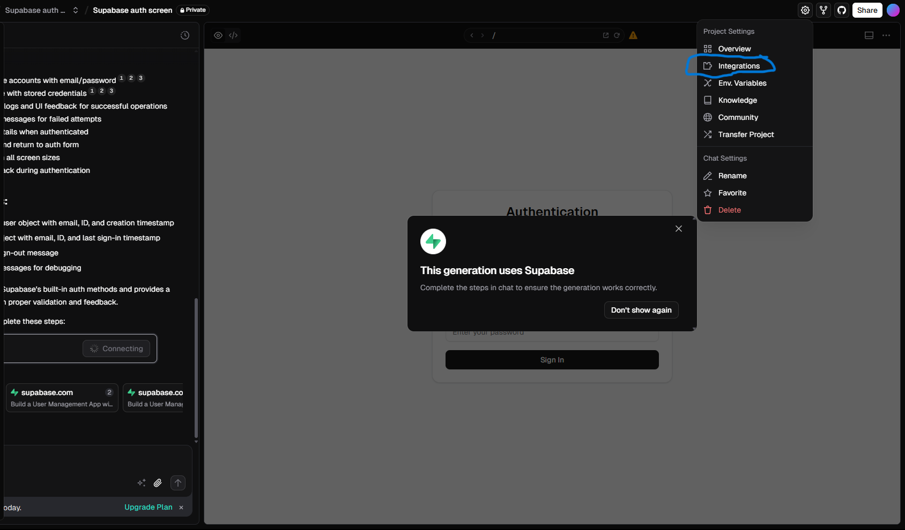
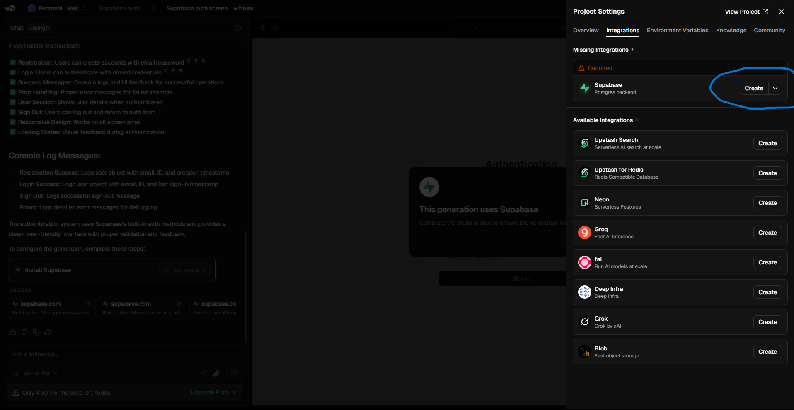
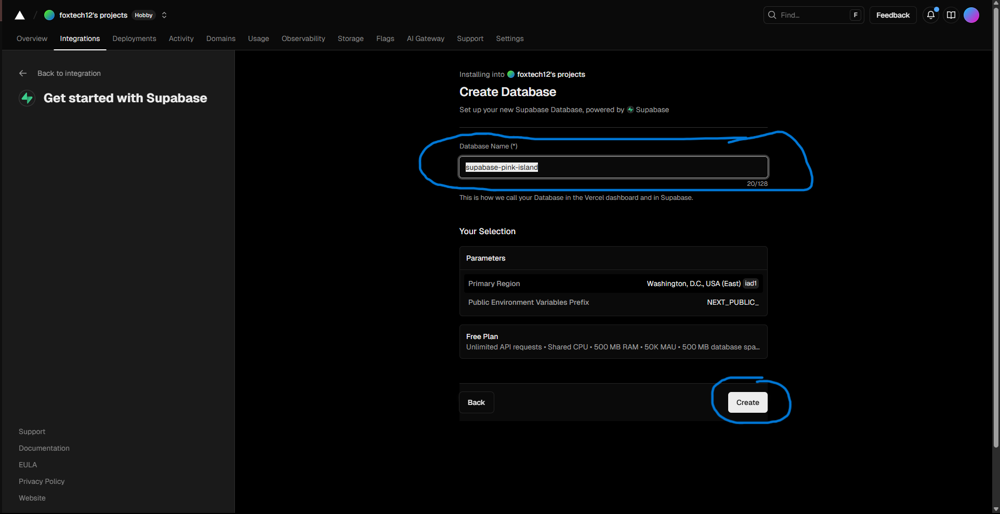
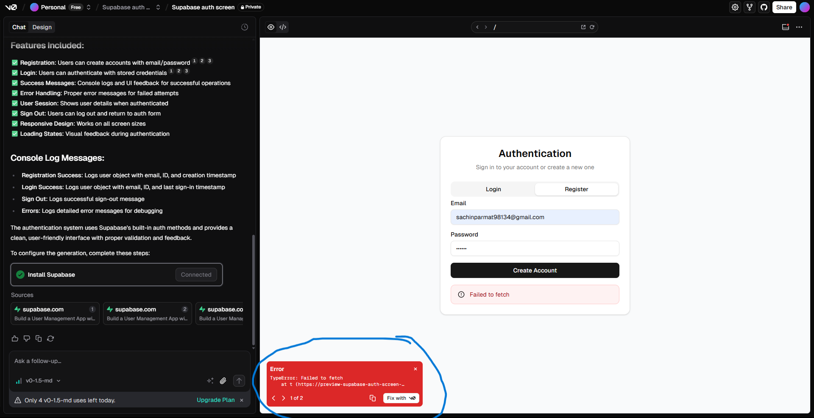
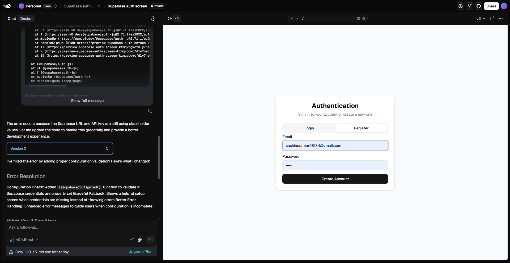
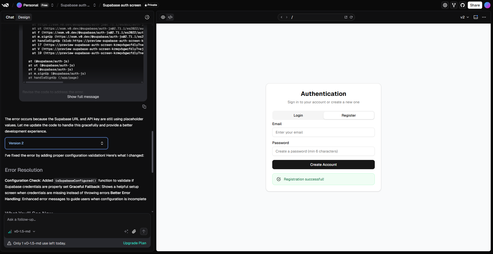
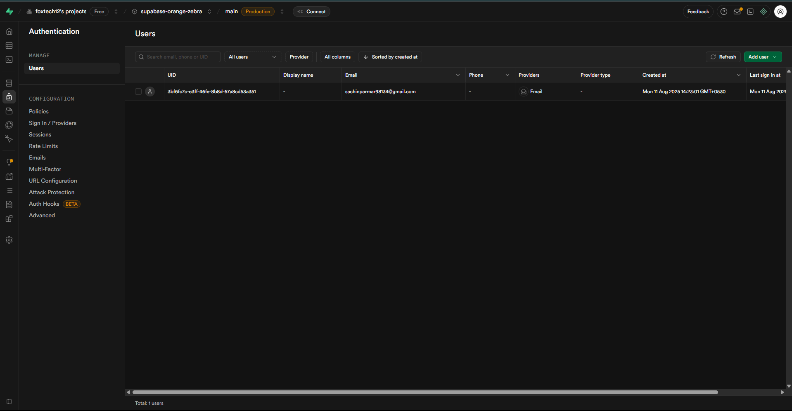

# Building a Secure Authentication System with V0 and Supabase


## Overview

Imagine this:

You’re an AI Product Manager working on a platform that delivers powerful AI-driven insights — but before users can interact with your models, you need a secure way for them to register, log in, and keep their sessions safe.

That’s exactly what we’re building in this lab.

This authentication system could be the foundation of a larger AI product — think personalized dashboards, AI assistants, or data analytics portals. In this session, you’ll create:

- A **Sign-Up Page** so new users can create an account.
- A **Login Page** so returning users can access their data.
- **Secure Session Handling** so only authenticated users can use your AI features.
- Integration between **V0.dev** (for building the interface) and **Supabase** (for handling authentication and data).

By the end of this lab, you’ll see how quickly you can turn an idea into a **secure, production-ready authentication system** — without writing complex backend code.

No backend team. No complicated infrastructure. Just you, your product vision, and AI.

## What is Supabase ?
Supabase is an open-source, Firebase alternative that provides a suite of backend tools and services for building applications. It's essentially a Backend as a Service (BaaS) platform that simplifies backend development by offering features like a PostgreSQL database, authentication, file storage, and serverless functions, all in one place. 

Learn More **[Click Here](https://supabase.com/docs)**

## Let’s Get Started


### Step 1: Access V0.dev
1. Open your browser and navigate to **[V0.dev](https://v0.app/)**.
2. This is where we’ll design and prototype our authentication interface without writing all the frontend code from scratch.
3. Make sure you’re logged in to your V0 account. If you don’t have one, create it — it’s free and only takes a minute.


### Step 2: Write Your Prompt in the V0 Chat Interface
1. Type or paste a clear, detailed prompt specifying the authentication system you want.
2. You can use the sample prompt below and modify it as needed:

> **Note:** Prompt may be not be optimal, Iterate and follow up a few times to get good results.

**Sample Prompt:**
```
Build an authentication screen integrated with Supabase that supports both registration and login. Registration page: Ask the user for their email and password, then store these credentials in Supabase.Login page: Authenticate the user using their email and password stored in Supabase. You need to create a Supabase project first, and also provide me with the option to access the environment keys, so that I can configure it. If the user registers successfully and logs in successfully, show me a log message, and hardcode the Supabase keys 
```


### Step 3: Integrate Supabase with V0
1. Once your authentication UI is generated in **V0.dev**, we need to connect it with Supabase.
2. Navigate to the **Settings** tab in the V0 interface (as highlighted in the lab guide screenshot).


### Step 4: Click on Integration
1. In the **Settings** tab of V0, find and click on the **Integration** option.
2. This section allows you to connect V0 with external services like **Supabase**.

### Step 5: Create the Supabase Integration
1. Once you click on **Integration**, a side panel will appear.
2. From the list of available integrations, select **Supabase**.
3. Click on the **Create** button to establish the connection between V0 and your new Supabase project.
4. After selecting **Create**, you will be redirected to another screen where you can configure your Supabase project details.

### Step 6: Choose Your Supabase Plan
1. On the redirected screen, click on the **Continue** button to proceed with your project setup.
2. When prompted to select a plan, choose the **Free** plan — this is sufficient for our lab and includes all the features we need.

### Step 7: Set Up Your Database
1. In the setup screen, provide a **Database Name** for your Supabase project.  
2. Once you’ve entered the name, click on the **Create** button to initialize your Supabase project.

### Step 8: Set Up Your Database
1. When the database is created successfully, click on the **Done** button.
2. You will then be redirected back to your **V0** account to continue the integration process.

### Step 9: Configure Supabase Settings in V0
1. Back in your **V0** account, click on the **Settings** tab again.

2. Navigate to the **Integration** section.

3. Locate the **Supabase** integration you created earlier and click on the **Manage** button.

### Step 10: Open the Authentication Tab in Supabase
1. Click on  **Open In Supabase** dashboard, open the project you just created.

2. From the left-hand sidebar, click on the **Authentication** tab.

3. This is where you can manage sign-up and login configurations, authentication providers, and security policies for your project.

### Step 11: Configure Sign-In Providers
1. Inside the **Authentication** tab in Supabase, click on **Sign-in / Provider** from the top menu.

2. Here, you can configure the methods users will use to authenticate — for this lab.

### Step 12: Configure Sign-In Providers
1. Make sure to **disable** the **Confirm Email** option.  
   - By default, Supabase sends a verification email when a new user registers.  
   - For this lab, we don’t require email verification, so disabling this will allow immediate access after registration.
   
2. Click on the **Save Changes** button to apply your settings.

> **💡 Important Note:**  
> If you face any issue while authenticating **V0** with **Supabase**, don’t worry.  
> Sometimes there can be minor connection or configuration errors. In such cases:  
> - Simply ask **V0** to fix it via the chat interface.  
> - Or click on the **Try Fix** option in V0.  
> This usually resolves most integration issues automatically.


### 🎉 Step 13: Test Your Authentication System
1. You’ve now successfully built and integrated your authentication system using **V0** and **Supabase**.

2. Go ahead and **register yourself** as a new user through the interface you just created.

3. In the **Supabase** dashboard, navigate to:
   - **Authentication → Users**
   - Here, you will see a list of all registered users in your application.



# You did it! 🎉 
In just a short time, you went from concept to a fully functional authentication system — complete with **registration**, **login**, and **secure session handling** — all powered by **V0** and **Supabase**.

What you’ve built here is more than just a login screen. It’s the **foundation of any secure, scalable AI product**.  
You’ve taken a key step that every successful product manager and developer must master — creating a safe, seamless way for users to interact with your platform.

---

## 🏆 Challenger Homework

Now that you’re familiar with **Langflow**, **Supabase**, and **V0**, it’s time to put your skills together into one complete project.

### Your Mission:
Build a **secure AI chatbot application** where users must log in before they can interact with the chatbot.

### Steps to Complete the Challenge:
1. **Create a Chatbot in Langflow**
   - Design a simple chatbot flow in [Langflow](https://www.langflow.org/).
   - The chatbot could:
     - Answer FAQs
     - Summarize text
     - Tell jokes
     - Or any creative idea you have

2. **Connect Langflow to V0**
   - Build a frontend in **V0** that sends user input to your Langflow chatbot and displays the chatbot’s responses.

3. **Add Supabase Authentication**
   - Integrate **Supabase** authentication with your V0 app.
   - **Rule:** If a user is **not logged in**, they cannot access or interact with the chatbot.
   - If a user **is logged in**, they should have full access.

4. **Test the Flow**
   - Log out and try accessing the chatbot you should be redirected to login.

---

