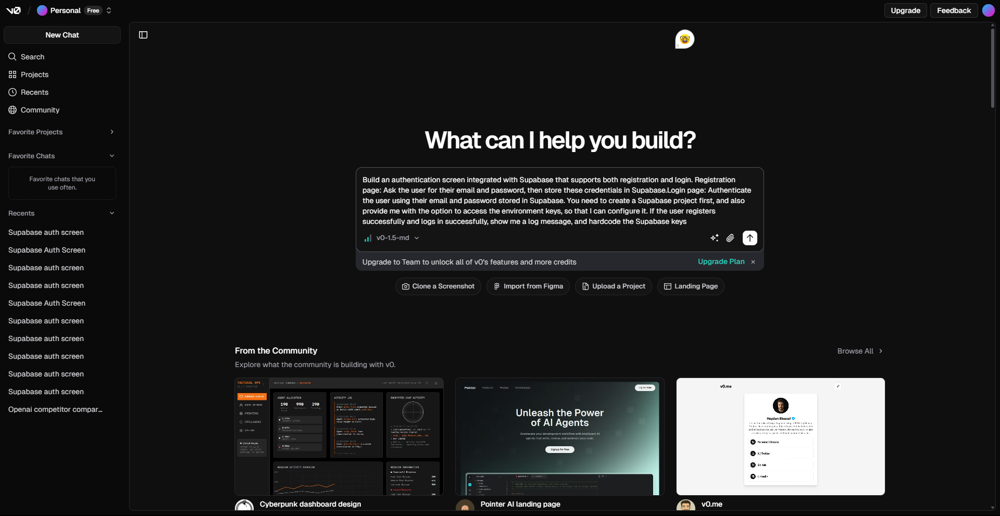
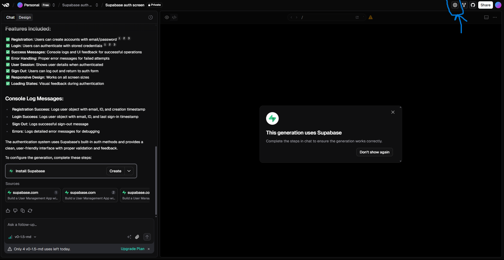
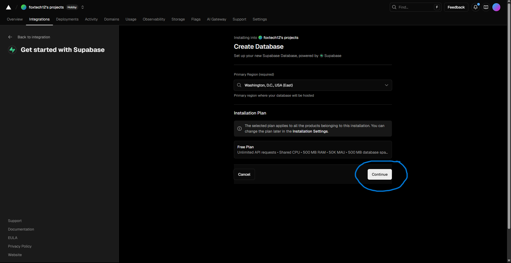
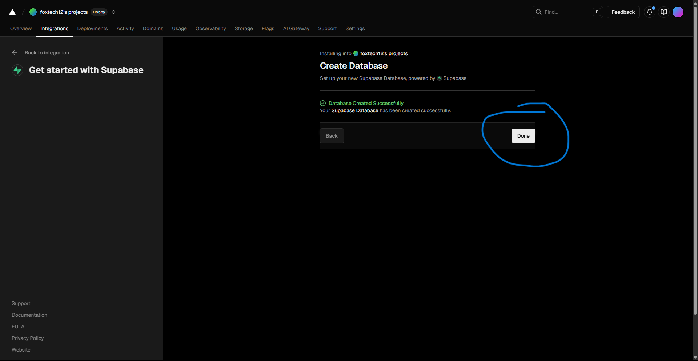
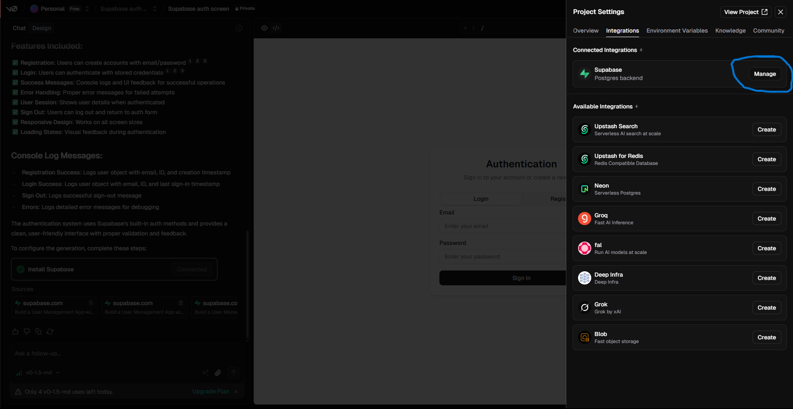
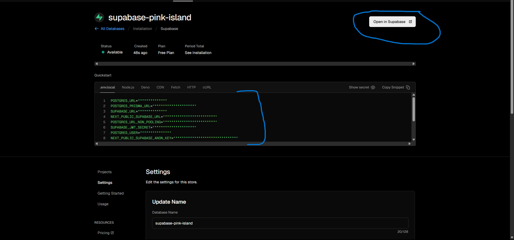
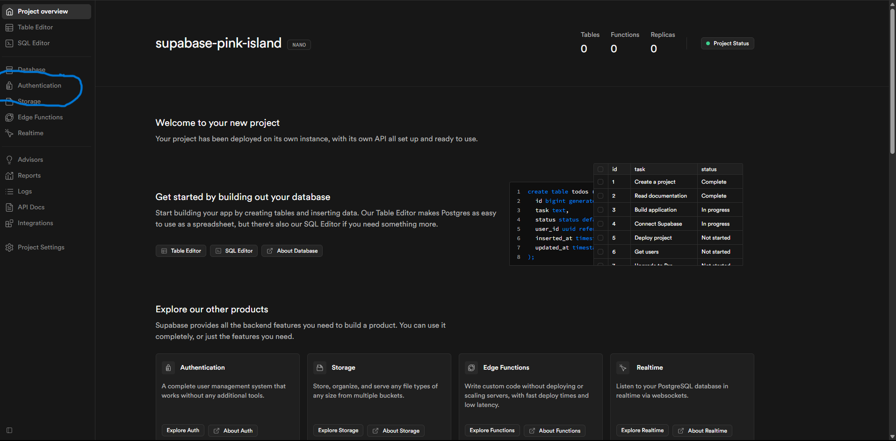
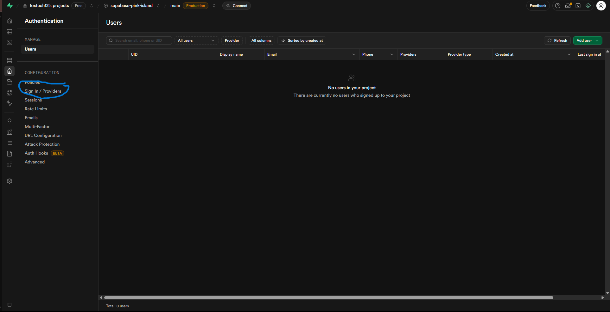

# Building a Secure Authentication System with V0 and Supabase


## Overview

Imagine this:  

You’re an **AI Product Manager or Builder** working on a platform that delivers powerful AI-driven insights. But before users can interact with your application, you need a **secure way for them to register, log in, and manage sessions**.  

That’s exactly what this lab helps you build.  

You’ll design a **production-ready authentication system** that forms the foundation of any AI product — whether it’s a personalized dashboard, an AI assistant, or a data analytics portal.  

By the end of this lab, you’ll have:  

- A **Sign-Up Page** so new users can create accounts.  
- A **Login Page** so returning users can access their data.  
- **Secure Session Handling** powered by Supabase’s authentication.  
- A seamless integration between **V0.dev** (for building the UI) and **Supabase** (for managing auth + data).  
- A **Feedback Capture Flow** so users can share their thoughts directly in the app — helping you improve your product with real user insights.  

The best part? You’ll achieve all this **without writing complex backend code** — no dedicated infra, no DevOps headaches. Just you, your product vision, and AI.  


## What is Supabase ?
Supabase is an open-source, Firebase alternative that provides a suite of backend tools and services for building applications. It's essentially a Backend as a Service (BaaS) platform that simplifies backend development by offering features like a PostgreSQL database, authentication, file storage, and serverless functions, all in one place. 

Learn More **[Click Here](https://supabase.com/docs)**

## Let’s Get Started


### Step 1: Access V0.dev
1. Open your browser and navigate to **[V0.dev](https://v0.app/)**.
2. This is where we’ll design and prototype our authentication interface without writing all the frontend code from scratch.
3. Make sure you’re logged in to your V0 account. If you don’t have one, create it — it’s free and only takes a minute.


### Step 2: Write Your Prompt in the V0 Chat Interface
1. Type or paste a clear, detailed prompt specifying the authentication system you want.
2. You can use the sample prompt below and modify it as needed:

> **Note:** Prompt may be not be optimal, Iterate and follow up a few times to get good results.

**Sample Prompt:**
```
Build a full-stack web app with the following functionality:  

### Part 1: Authentication (Supabase Integration)
- Create an authentication screen with two flows:  
  - **Registration Page**:  
    - Ask user for email + password.  
    - Store these credentials in Supabase Auth.  
  - **Login Page**:  
    - Authenticate the user using Supabase Auth with email + password.  
- Once registration and login are successful:  
  - Show a log message confirming success.  
  - Redirect the user to the landing page.  
- Provide an option for me to configure Supabase environment keys (hardcode them in the project after login).  

### Part 2: Landing Page (AI Competitor Analysis Tool)
- Create a clean, modern landing page with:  
  - Input fields for two company names.  
  - A settings tab (top-right) where users securely enter their **OpenAI API key**.  
- Use the **OpenAI SDK** (`createOpenAI` from `@ai-sdk/openai`) with the user’s API key (dynamically, per request — not hardcoded).  
- Send a structured prompt to the LLM instructing it to return **only raw JSON** (no markdown or wrappers).  
- Parse this JSON and display a concise, side-by-side comparison of the two companies in a **clean, structured table**.  

### Part 3: Feedback System
- Add a feedback section (1–5 stars).  
- Store feedback in Supabase, associated with the logged-in user.  

### Guardrails
- Ensure API calls dynamically use the user’s API key (never hardcode globally).  
- Configure the OpenAI client with `createOpenAI` inside the API route per request.  
- LLM must return only JSON (strict formatting).  
- Handle middleware properly — redirection should not depend on Supabase client alone.  
- Keep comparison concise, fact-based, and relevant.  
- UI should be clean, modern, and user-friendly.  

```



### Step 3: Integrate Supabase with V0
1.Once you provide the prompt, it will ask you to integrate Supabase with V0.You will see an option — simply click on the **Create** button and **jump to 6th Steps**.
.png)

## OR

2. Navigate to the **Settings** tab in the V0 interface (as highlighted in the lab guide screenshot).


### Step 4: Click on Integration
1. In the **Settings** tab of V0, find and click on the **Integration** option.
2. This section allows you to connect V0 with external services like **Supabase**.

### Step 5: Create the Supabase Integration
1. Once you click on **Integration**, a side panel will appear.
2. From the list of available integrations, select **Supabase**.
3. Click on the **Create** button to establish the connection between V0 and your new Supabase project.
4. After selecting **Create**, you will be redirected to another screen where you can configure your Supabase project details.

### Step 6: Choose Your Supabase Plan
1. On the redirected screen, click on the **Continue** button to proceed with your project setup.
2. When prompted to select a plan, choose the **Free** plan — this is sufficient for our lab and includes all the features we need.

### Step 7: Set Up Your Database
1. In the setup screen, provide a **Database Name** for your Supabase project.  
2. Once you’ve entered the name, click on the **Create** button to initialize your Supabase project.

### Step 8: Set Up Your Database
1. When the database is created successfully, click on the **Done** button.
2. You will then be redirected back to your **V0** account to continue the integration process.

### Step 9: Configure Supabase Settings in V0
1. Back in your **V0** account, click on the **Settings** tab again.

2. Navigate to the **Integration** section.

3. Locate the **Supabase** integration you created earlier and click on the **Manage** button.

### Step 10: Open the Authentication Tab in Supabase
1. Click on  **Open In Supabase** dashboard, open the project you just created.

2. From the left-hand sidebar, click on the **Authentication** tab.

3. This is where you can manage sign-up and login configurations, authentication providers, and security policies for your project.

### Step 11: Configure Sign-In Providers
1. Inside the **Authentication** tab in Supabase, click on **Sign-in / Provider** from the top menu.

2. Here, you can configure the methods users will use to authenticate — for this lab.

### Step 12: Configure Sign-In Providers
1. Make sure to **disable** the **Confirm Email** option.  
   - By default, Supabase sends a verification email when a new user registers.  
   - For this lab, we don’t require email verification, so disabling this will allow immediate access after registration.
   
2. Click on the **Save Changes** button to apply your settings.

> **💡 Important Note:**  
> If you face any issue while authenticating **V0** with **Supabase**, don’t worry.  
> Sometimes there can be minor connection or configuration errors. In such cases:  
> - Simply ask **V0** to fix it via the chat interface.  
> - Or click on the **Try Fix** option in V0.  
> This usually resolves most integration issues automatically.


### 🎉 Step 13: Test Your Authentication System

Now that you’ve successfully built and integrated your authentication system using **V0** and **Supabase**, it’s time to test it.

---

#### 1. Register a New User  
Go ahead and **register yourself** as a new user through the interface you just created.  


---

#### 2. Login and Access the Dashboard  
Once you log in successfully, you will be redirected to the **Dashboard**.  
From the **Settings Tab**, make sure to add your **OpenAI API Key**.  

  


---

#### 3. Verify Users in Supabase  
Open your **Supabase Dashboard** and navigate to:  
- **Authentication → Users**  
- Here, you will see a list of all registered users in your application.  


---

#### 4. Check Feedback Data  
In the **Supabase Table Editor**, you will also see three tables — one of them stores the **feedback** submitted by users.  


> 💡 **Note:** You may need to **iterate over your prompts** a few times to refine and get the final results. Don’t worry if it doesn’t look perfect at first — adjusting and improving prompts is part of the process.

# You did it! 🎉 
In just a short time, you went from concept to a fully functional authentication system — complete with **registration**, **login**, and **secure session handling** — all powered by **V0** and **Supabase**.

What you’ve built here is more than just a login screen. It’s the **foundation of any secure, scalable AI product**.  
You’ve taken a key step that every successful product manager and developer must master — creating a safe, seamless way for users to interact with your platform.

---

## 🏆 Challenger Homework

Now that you’re familiar with **Langflow**, **Supabase**, and **V0**, it’s time to put your skills together into one complete project.

### Your Mission:
Build a **secure AI chatbot application** where users must log in before they can interact with the chatbot.

### Steps to Complete the Challenge:
1. **Create a Chatbot in Langflow**
   - Design a simple chatbot flow in [Langflow](https://www.langflow.org/).
   - The chatbot could:
     - Answer FAQs
     - Summarize text
     - Tell jokes
     - Or any creative idea you have

2. **Connect Langflow to V0**
   - Build a frontend in **V0** that sends user input to your Langflow chatbot and displays the chatbot’s responses.

3. **Add Supabase Authentication**
   - Integrate **Supabase** authentication with your V0 app.
   - **Rule:** If a user is **not logged in**, they cannot access or interact with the chatbot.
   - If a user **is logged in**, they should have full access.

4. **Test the Flow**
   - Log out and try accessing the chatbot you should be redirected to login.

---

