# Building a RAG-Powered Chatbot with V0, Supabase & Langflow

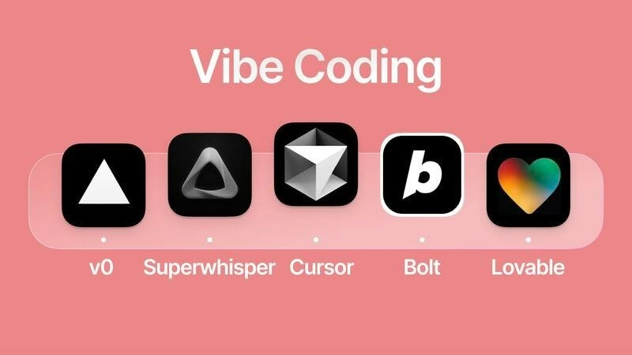

## What You'll Learn

By now, you've mastered the basics of Langflow, V0, and Supabase, and you understand how RAG (Retrieval-Augmented Generation) works. In this hands-on lab, we're going to bring all these technologies together to build something truly powerful - a chatbot that can answer questions based on your documents while storing conversation history.

## Project Overview

You'll be building a sophisticated chatbot that:

- **Connects to your Langflow RAG pipeline** for intelligent document-based responses
- **Shows or hides the source chunks** that were used to generate answers
- **Stores all conversations** in Supabase for future reference
- **Provides a clean, user-friendly interface** using V0

Think of it as creating your own AI assistant that remembers every conversation and can explain where its answers come from!

## Prerequisites

Before we begin, make sure you've completed the **Building RAG Application using Langflow** lab. This gives you the foundation we'll build upon.

> **Need to catch up?** [Click here to access the prerequisite lab](<https://github.com/initmahesh/MLAI-community-labs/tree/main/Class-Labs/Module-2(Understanding-Agentic-RAG)/Lab-2.3(Genereating-Response-with-Rag-Using-Langflow)>)

---

## Setup Guide

### Step 1: Verify Your RAG Pipeline

First, let's make sure your Langflow RAG pipeline is ready. You should have built something similar to this in your previous lab:

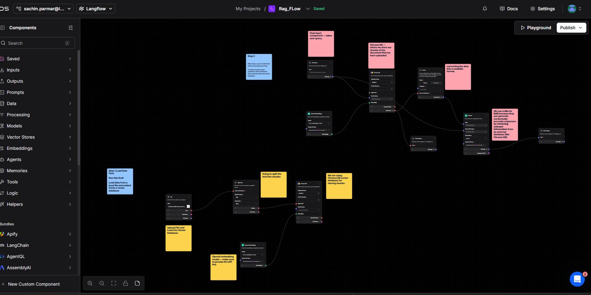

**Pro Tip:** This pipeline is the brain of your chatbot - it handles document retrieval and response generation.

---

### Step 2: Test Your Pipeline

Before we connect everything together, let's make sure your RAG pipeline works correctly:

1. Go to the **Playground** section in Langflow
2. Test your pipeline with a sample question
3. Verify you're getting the expected responses

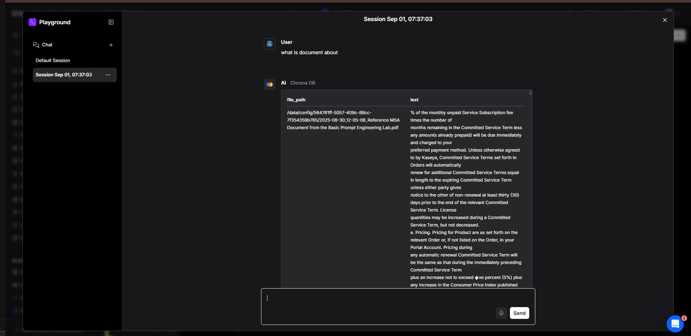

**Success Check:** If you're getting relevant answers, you're ready for the next step!

---

### Step 3: Access Your API

Now we need to connect your Langflow pipeline to your chatbot. Here's how:

1. Navigate to the **API Access** section in Langflow
2. This is where you'll get your connection credentials

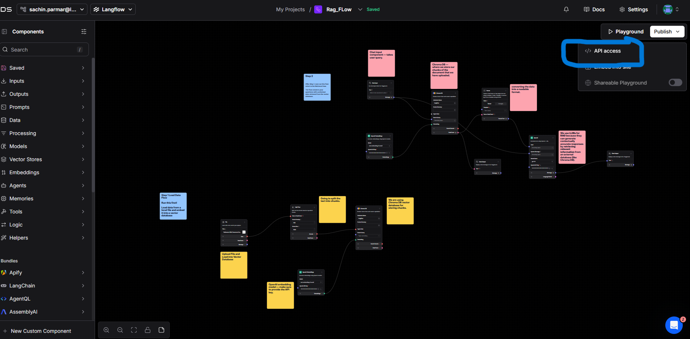

---

### Step 4: Get Your API Credentials

This is a crucial step - we need your API token and endpoint URL:

1. **Copy the cURL command** provided in the API Access section
2. **Click "Generate Token"** to create your authentication token
3. **Replace the placeholder** `<YOUR_GENERATED_TOKEN>` with your actual token

Here's what your cURL command should look like:

```bash
curl --request POST \
  --url 'https://api.langflow.astra.datastax.com/lf/54941d66-0c11-4ef7-9c95-c7c80194b2be/api/v1/run/564761ff-5057-409c-88cc-7f354359b765?stream=false' \
  --header 'Content-Type: application/json' \
  --header 'Authorization: Bearer <YOUR_APPLICATION_TOKEN>' \
  --data '{
  "input_value": "what is the name of the customer",
  "output_type": "chat",
  "input_type": "chat"
}'
```

> **Important:** Never share your actual token publicly. Always replace `<YOUR_GENERATED_TOKEN>` with your real token.

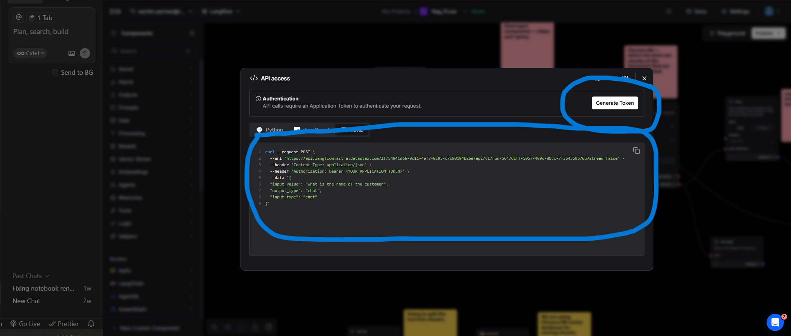

---

### Step 5: Create Your Chatbot Interface

Now let's build the user interface using V0:

1. **Go to V0:** [Click here to access V0](https://v0.app)
2. **Start a new project** for your chatbot

---

### Step 6: Build Your Chatbot

Paste this prompt into V0 to create your chatbot:

```plaintext
Build a chatbot that sends user queries to a Langflow backend.
Log the responses received from Langflow in the console.
Additionally, add a toggle button labeled 'Show Chunks' that allows turning this feature on or off.
User query will be passed in `input_value`.
Make sure to hardcode the bearer token and API call in the code only.
Use the following curl request structure for your backend call:
curl --request POST \
  --url 'https://api.langflow.astra.datastax.com/lf/54941d66-0c11-4ef7-9c95-c7c80194b2be/api/v1/run/564761ff-5057-409c-88cc-7f354359b765?stream=false' \
  --header 'Content-Type: application/json' \
  --header 'Authorization: Bearer AstraCS:wxYommHZaXuBRSiqWkrvPAaa:84bae312e3ef440a122dc7242cd8f43b0bb464fba0afff4d97d1e173c71c2bf0' \
  --data '{
    "input_value": "What is the customer name in the document?",
    "output_type": "chat",
    "input_type": "chat"
  }'
```

> **Remember:** Replace the URL and token with your own values from Step 4!

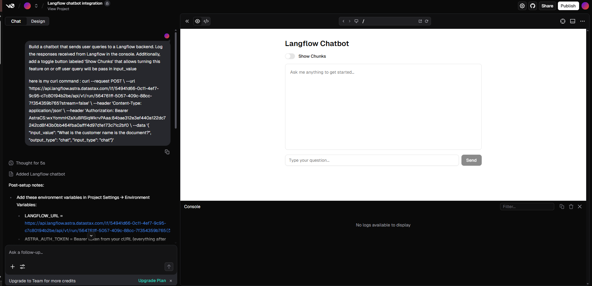

---

### Step 7: Test Your Connection

Let's make sure everything is working:

1. **Open your V0 frontend**
2. **Enter a test query** like "Give the name of the customer in the contract"
3. **Check the console** - you should see the Langflow response

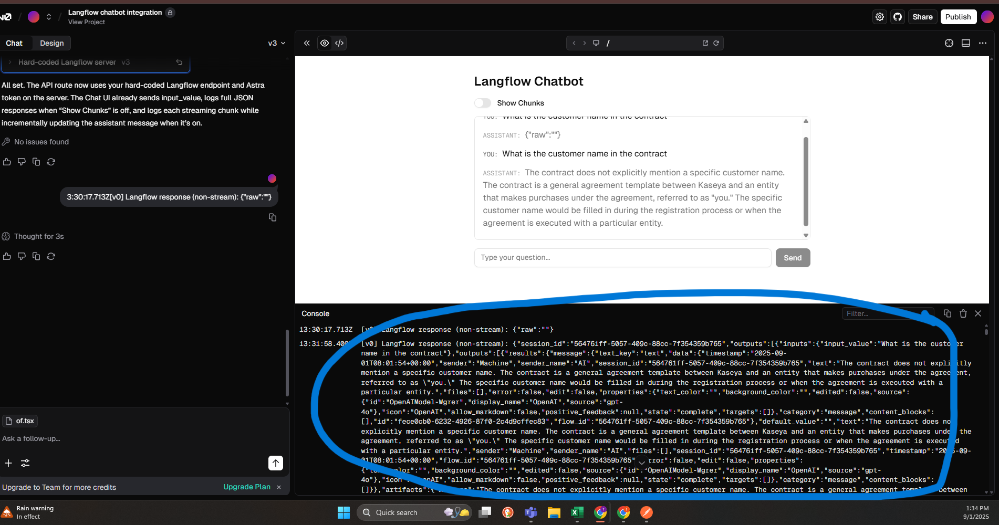

---

### Step 8: Enhance Your Chatbot

Now let's add the advanced features. Copy your console output and paste it in the chat, paste this prompt also at the same time:

```markdown
You will receive a response from Langflow with two outputs:

The actual message.

The chunks (metadata).

Your task:

If the user enables the "Show Chunks" option, display both the actual message and the chunks (example chunk:

{
"timestamp": "2025-09-01T08:01:06+00:00",
"sender": "Machine",
"sender_name": "AI",
"session_id": "564761ff-5057-409c-88cc-7f354359b765",
"text": "| file_path | text"
}

).

If the user disables the "Show Chunks" toggle, display only the actual message (hide chunks).

Regardless of the toggle state, always store the following in Supabase for every user query:

User query

Actual message (response)

Chunks
```

---

## Adding Database Storage

### Step 9: Connect Supabase

Let's add persistent storage to your chatbot:

1. **In V0**, when prompted for Supabase integration, click **"Create"**
2. **You'll be redirected** to a configuration screen

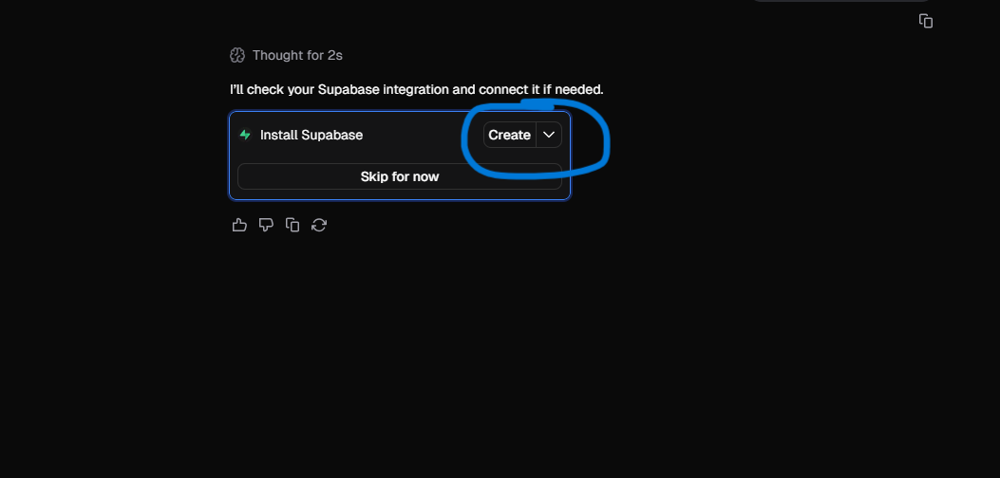

---

### Step 10: Choose Your Plan

1. **Select a plan** - just click **"Continue"** (Free plan is perfect for learning)
2. **No credit card required** for the free tier

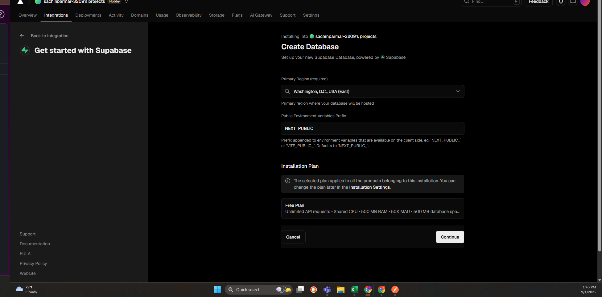

---

### Step 11: Create Your Database

1. **Provide a name** for your database (be creative!)
2. **Click "Create"** to set it up

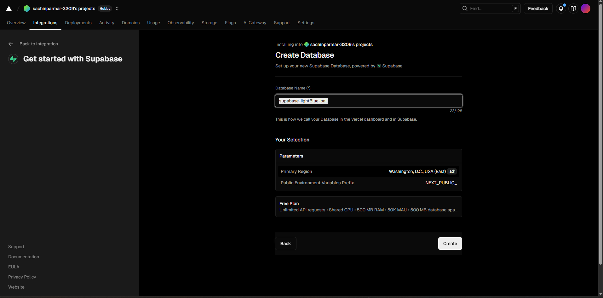

---

### Step 12: Success

**Congratulations!** Your Supabase is now connected to V0.

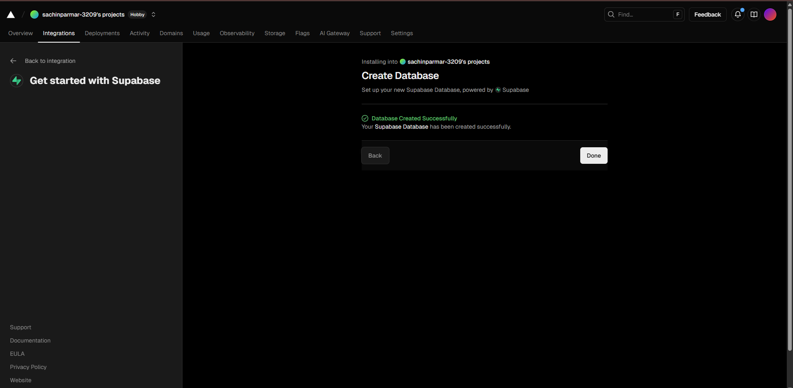
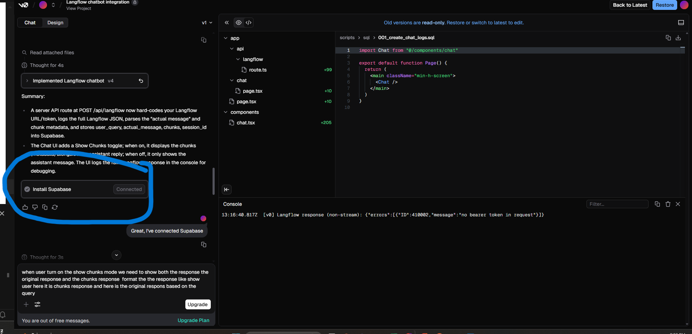

---

## Testing Your Complete System

### Step 13: Put It All Together

Now let's test your fully integrated chatbot:

1. **Ask a question** like "What is the customer name in the contract?"
2. **Toggle the "Show Chunks" button** to see different views

**With "Show Chunks" ON:**

- You'll see the answer PLUS the source chunks that were used
- This helps you understand where the information came from

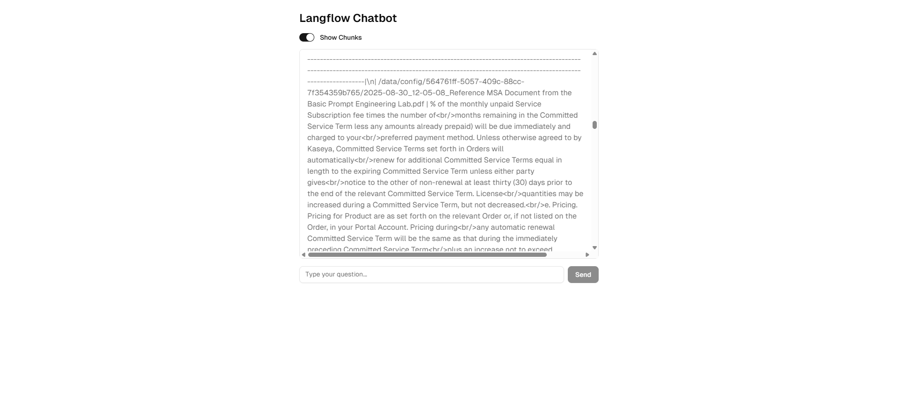

**With "Show Chunks" OFF:**

- You'll see just the clean, final answer
- Perfect for end users who don't need to see the technical details

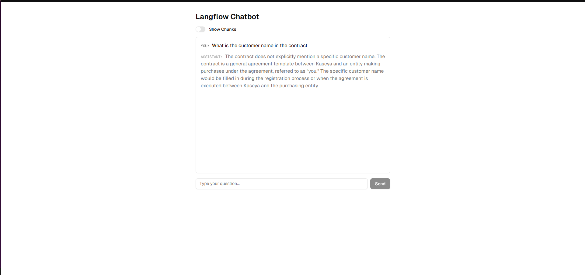

**Bonus:** Every conversation is automatically saved to your Supabase database for future reference!

---

## What You've Accomplished

You've successfully built a production-ready chatbot that:

- **Answers questions** based on your documents
- **Shows source information** when requested
- **Stores conversation history** automatically
- **Provides a professional interface**
- **Integrates multiple AI technologies** seamlessly

---

## Troubleshooting Common Issues

### API Integration Problems

**Issue: "Invalid API Key" or "Unauthorized" Error**

- **Solution:** Double-check your Bearer token in the code
- **V0 Fix:** Simply tell V0 "Fix the API authorization issue" and it will help resolve it

**Issue: "Network Error" or "Connection Failed"**

- **Solution:** Verify your Langflow endpoint URL is correct
- **V0 Fix:** Ask V0 "Fix the network connection issue" for automatic resolution

**Issue: "Invalid Response Format"**

- **Solution:** Check that your Langflow pipeline is returning the expected output format
- **V0 Fix:** V0 can automatically handle response parsing issues

**Issue: "Internal Server Error (500)"**

- **Solution:** This is a common Langflow server issue due to high load or slow processing
- **What to do:** Simply wait a few seconds and try your query again
- **Why it happens:** Langflow servers can be slow during peak usage times
- **V0 Fix:** Ask V0 "Handle server timeout issues" and it will add retry logic automatically

### Supabase Integration Issues

**Issue: "Database Connection Failed"**

- **Solution:** Ensure your Supabase credentials are correctly configured
- **V0 Fix:** Tell V0 "Fix the Supabase connection" and it will handle the configuration

**Issue: "Table Not Found" or "Schema Error"**

- **Solution:** V0 will automatically create the necessary database tables
- **V0 Fix:** Just mention "Set up the database schema" and V0 will handle it

### UI/UX Problems

**Issue: "Chat not responding"**

- **Solution:** Check the browser console for JavaScript errors
- **V0 Fix:** Tell V0 "Fix the chat interface" and it will resolve UI issues

**Issue: "Toggle button not working"**

- **Solution:** V0 can automatically fix component interaction issues
- **V0 Fix:** Ask V0 "Fix the toggle functionality" for automatic repair

**Issue: "Responsive design issues"**

- **Solution:** V0 handles responsive design automatically
- **V0 Fix:** Mention "Make it mobile-friendly" and V0 will optimize the layout

### General Troubleshooting Tips

1. **Always check the browser console** for error messages
2. **Use V0's built-in debugging** - it can identify and fix most issues automatically
3. **If something breaks, simply tell V0 what's wrong** - it will fix it for you
4. **V0 can handle complex integrations** - don't worry about technical details
5. **For persistent issues, ask V0 to "optimize the entire application"**

**Pro Tip:** V0 is designed to handle these integrations automatically. If you encounter any issues, just describe the problem to V0 and it will resolve it for you!
