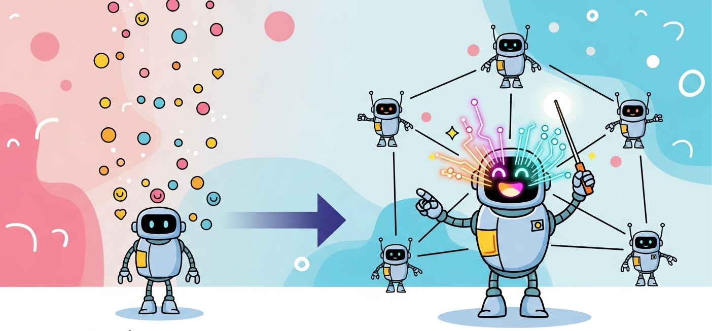
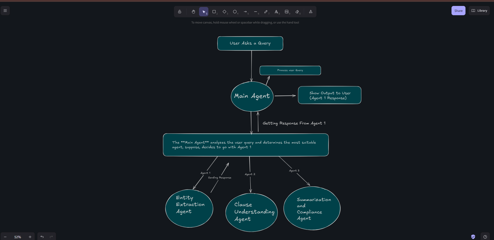
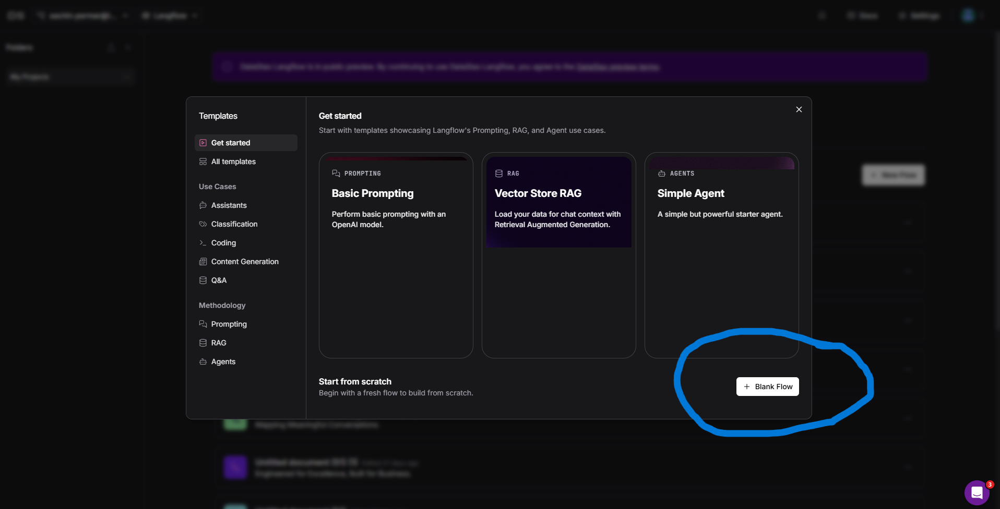
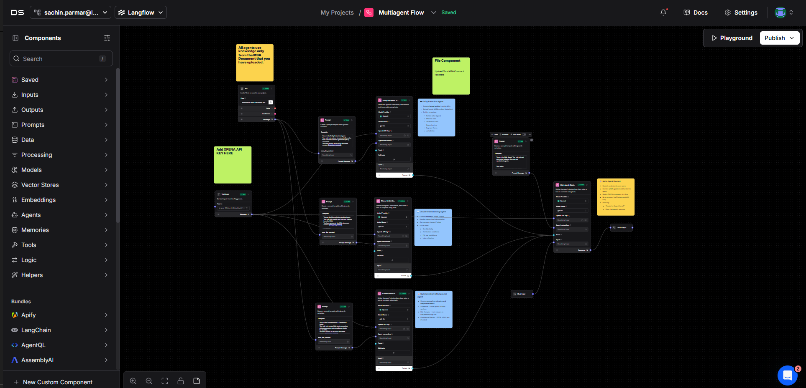
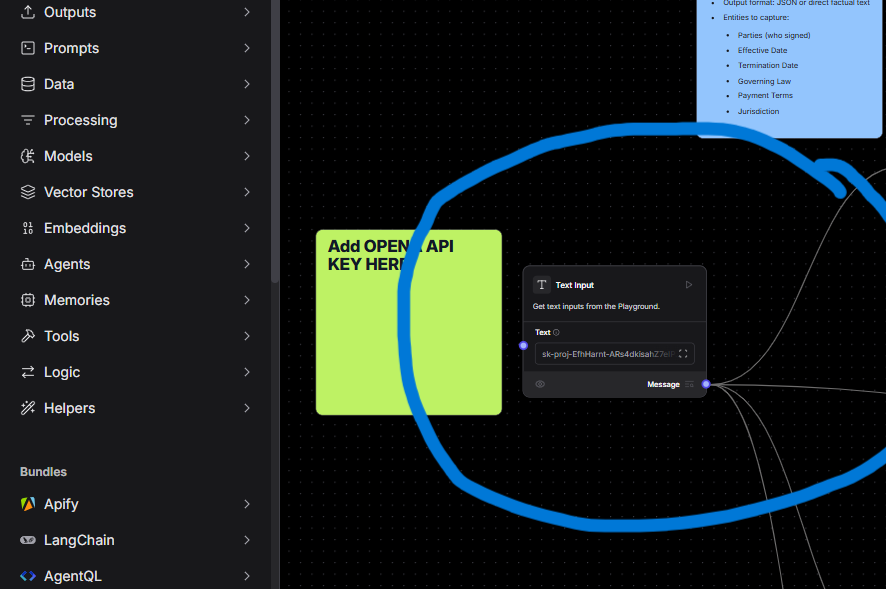
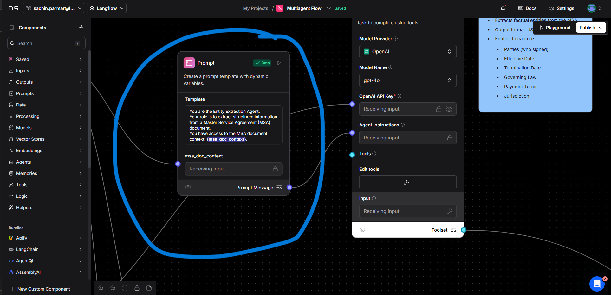
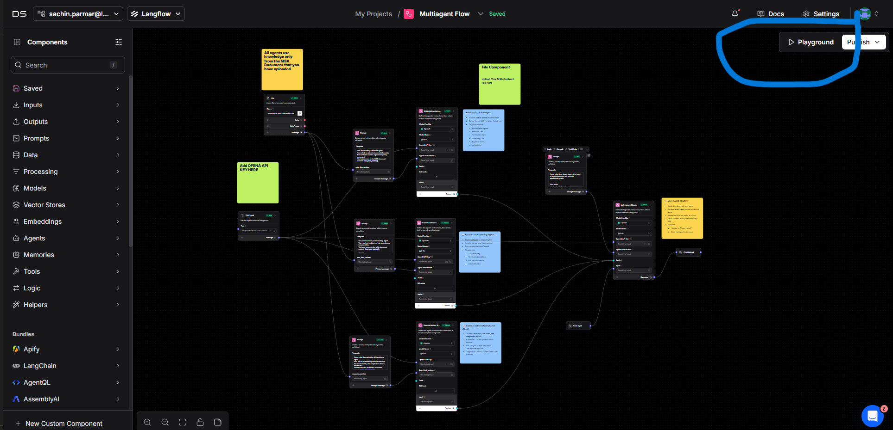
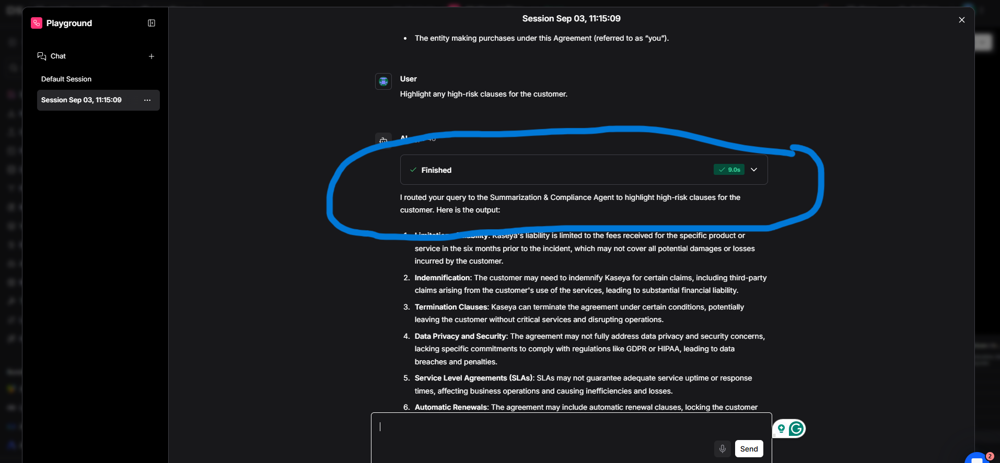
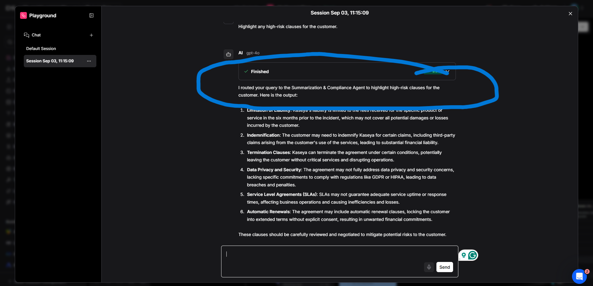

# Lab Overview: From Single Agent to Multi-Agent Systems

Till now, you have learned how a single agent works by taking an input, processing it, and returning the output. This is effective for simple and small tasks, but when the task becomes larger and more complex, such as analyzing a Master Service Agreement (MSA), a single agent struggles to handle everything efficiently. This is where the concept of a Multi-Agent System (MAS) comes into play. In a MAS, the work is divided among multiple specialized agents, while a Main Agent takes the role of orchestrator, deciding which specialized agent should be called based on the user’s query.

In this lab, we focus on the use case of analyzing an MSA document. The Main Agent receives the query and routes it to the appropriate specialized agent. Each agent has a defined role to ensure the task is broken down and handled effectively.

- The first specialized agent is the **Entity Extraction Agent**, which is responsible for pulling out structured information such as the parties involved, the effective date, termination date, governing law, and payment terms. For example, if the user asks “Who signed this agreement?” or “When does the agreement start?”, the Entity Extraction Agent will extract those details and store them in a structured format for reuse.

- The second specialized agent is the **Clause Understanding Agent**, which deals with clause-specific or legal reasoning questions. Its role is to explain what a clause means in simple English, compare two clauses such as termination versus renewal, and detect obligations, risks, or penalties hidden in the document. For example, queries like “What are the conditions for termination?” or “Does this agreement allow automatic renewal?” will be routed to this agent for accurate interpretation.

- The third specialized agent is the **Summarization and Compliance Agent**, which provides higher-level insights, summaries, and compliance checks. It can summarize the entire MSA in plain English, highlight potentially risky clauses such as limitations of liability or confidentiality loopholes, and compare the contract against compliance checklists like GDPR, HIPAA, or internal company policies. For example, a user could ask “Summarize the payment obligations in 5 bullet points” or “Are there any clauses that might be risky for the vendor?”, and this agent will generate the appropriate summary or compliance note.

By combining these agents under the control of the Main Agent, the system can handle end-to-end contract analysis from extracting raw entities to providing clause interpretations and compliance checks. Through this lab, you will move beyond the idea of a single agent and learn how multiple agents can collaborate to solve complex, real-world problems in a scalable and efficient way.

---

## Introduction to Multi-Agent Systems

A Multi-Agent System (MAS) is a setup where multiple specialized agents work together to solve complex tasks that a single agent cannot handle efficiently. Instead of one agent doing everything, the workload is divided each agent focuses on a specific role such as extraction, analysis, or summarization while a Main Agent acts as the orchestrator, deciding which agent should be called for a given query. This makes the system more scalable, efficient, and accurate for handling large, real-world problems like analyzing contracts or documents.

---

## Prerequisites

Before starting this lab, please ensure you have the following:

1. **OpenAI API Key:**
   - Follow this [Instruction](https://medium.com/@lorenzozar/how-to-get-your-own-openai-api-key-f4d44e60c327) to get the open api key.
   - Ensure you have at least $5 credit in your OpenAI account
   - Keep your API key secure and never share it publicly
      
2. **Required Documents:**

   - [Download MSA Document](https://drive.google.com/file/d/1ZgnpgX6CeMpqLQCzPOqOOaqMETAavm5D/view?usp=sharing) - The reference document for this lab
   - [ Download JSON File](https://drive.google.com/file/d/1zyqI4GVQoVAHURlgsle587223scoY_MP/view?usp=sharing) - Contains the flow diagram for Langflow
      

3. **Langflow Login Setup**
   - Follow the instructions provided in the Langflow Login Guide:
   - 📘 [Langflow Login Guide](<../../Lab-0(Pre-requisites)/Langflow-Login-Guide/Readme.md>)

---

## Setup the Flow

### Step 1: Log in to Langflow
- Follow the [Langflow Login Guide](<../../Lab-0(Pre-requisites)/Langflow-Login-Guide/Readme.md>) to log in to your Langflow account.
- On the dashboard, click **New Flow**.

- Choose **Blank Flow** to start with a clean canvas.

---

### Step 2: Import the Pre-built Flow
- Once logged in, click on **Untitled Document** at the top, then select the **Import** option from the dropdown.  
- Import the provided JSON flow file from the following link:  
  [📥 Download JSON Flow File](https://drive.google.com/file/d/1zyqI4GVQoVAHURlgsle587223scoY_MP/view?usp=sharing)

.png>)

- After import, you should see the pre-built flow diagram with all components.

⚠️ **Note:** Sometimes, after uploading the JSON, the links between components may disconnect. Please ensure all links are connected as shown in the reference screenshot.

---

### Step 3: Configure the Flow
- Add your **OpenAI API key** to the text input component.

- **Configure Agents and Edit Prompts**  
  - Review the pre-configured agents to understand their roles.  
  - To customize an agent’s behavior, open its configuration and edit the instructions/prompt.  
  - The **Main Agent** will automatically orchestrate which specialized agent is called.

---

### Step 4: Test in Playground
- Go to the **Playground** section to test your flow.

---

### Step 5: Try Sample Questions

#### Entity Extraction Agent
_Targets factual data lookup_
- Who are the parties in this agreement?  
- What is the effective date of this agreement?  
- What is the governing law mentioned in this contract?  

#### Clause Understanding Agent
_Targets clause-level explanation and interpretation_
- Can you explain the confidentiality clause in simple terms?  
- What are the restrictions on using Kaseya products?  
- What happens if I exceed the fair use policy?  

#### Summarization & Compliance Agent
_Targets summaries, risks, and compliance checks_
- Summarize the payment obligations in 5 bullet points.  
- Give me a plain-English summary of the confidentiality obligations.  
- Highlight any high-risk clauses for the customer.  

---

### Results
- Main Agent routing to the **Entity Extraction Agent**:  
    

- Orchestrator routing to the **Summarization & Compliance Agent**:  
    
