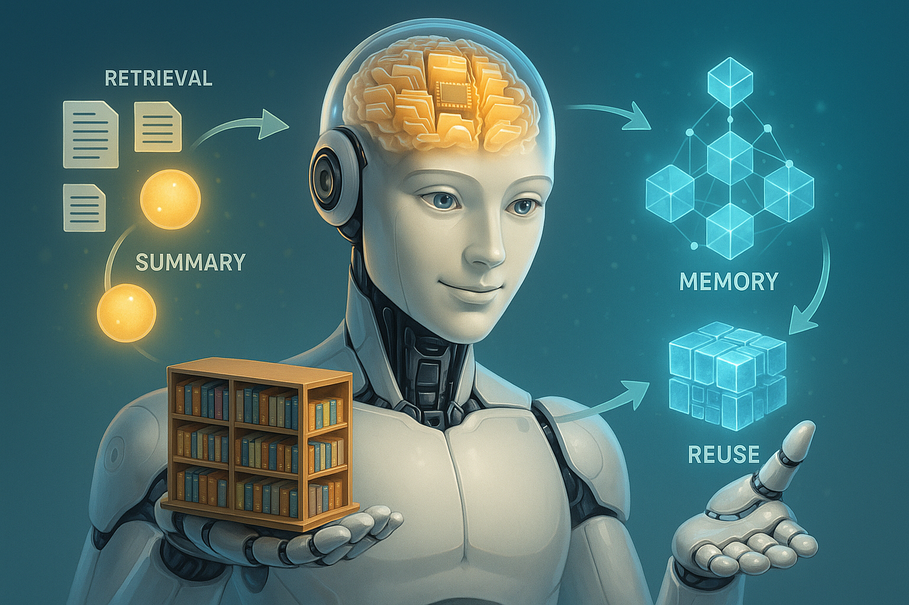
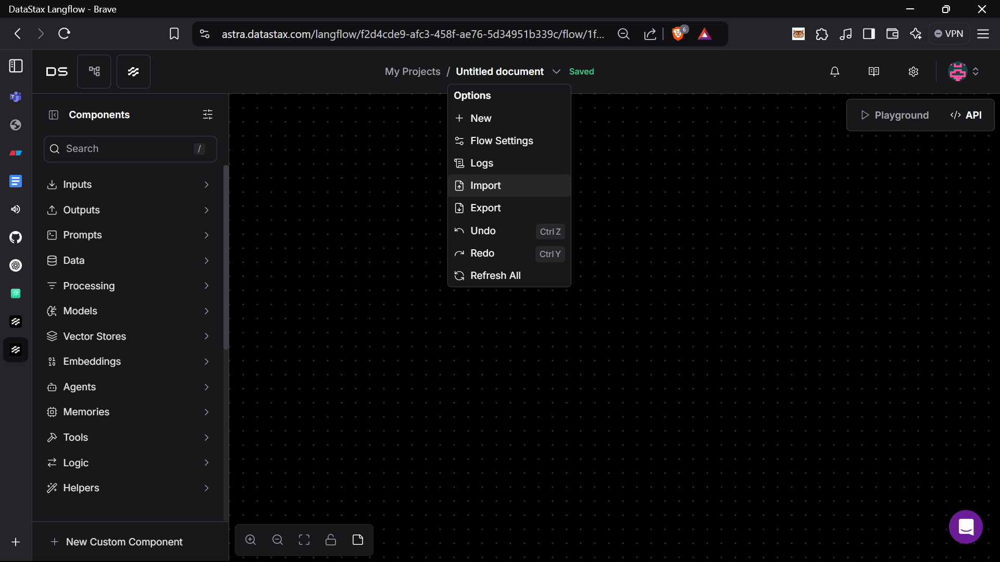
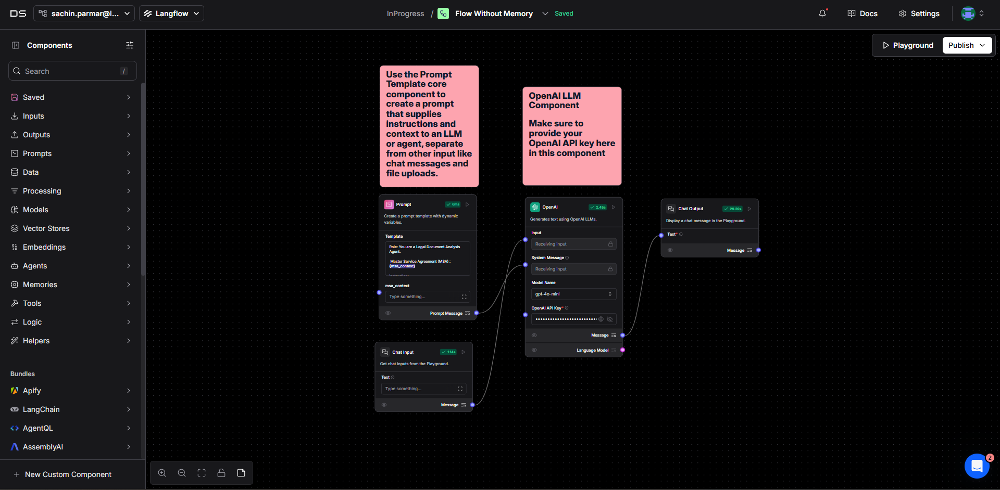
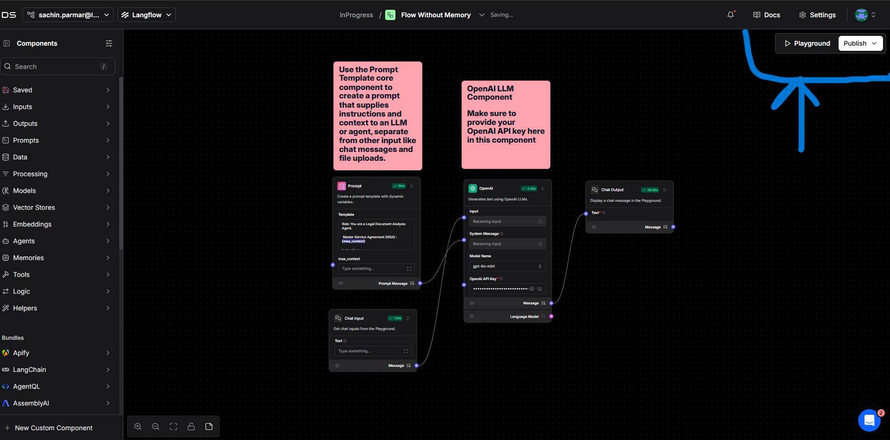
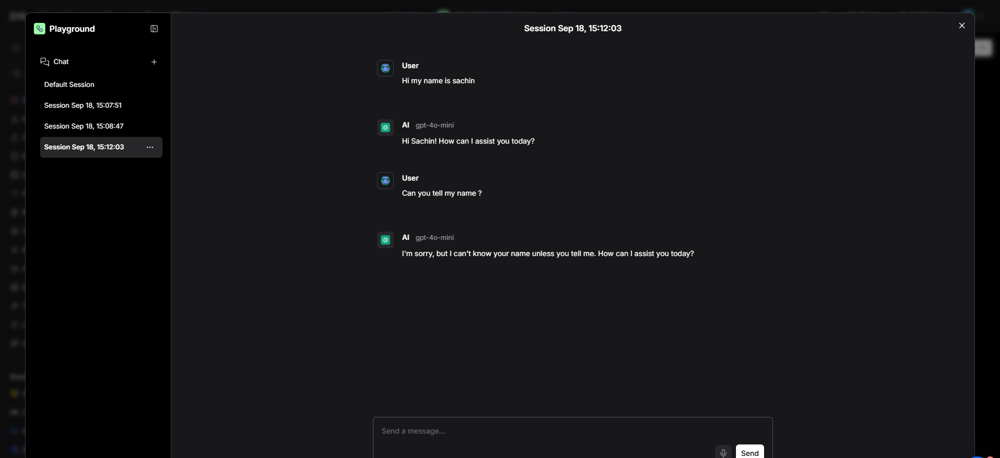
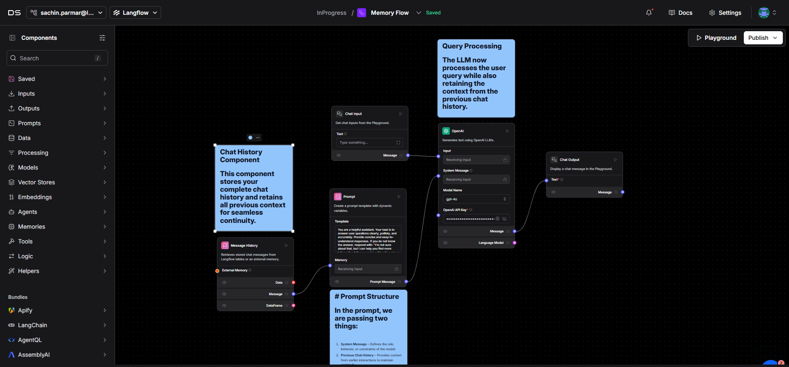
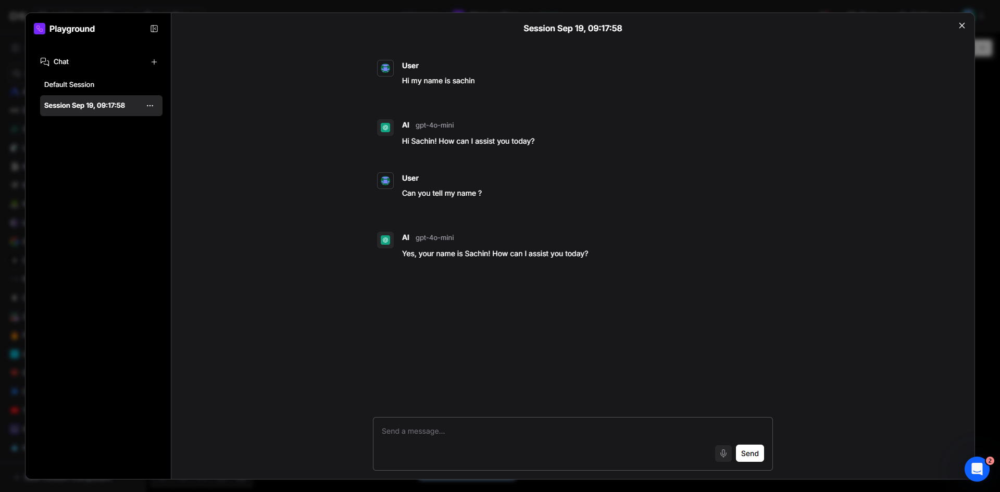

# Memory Integration In Langflow

In this lab, we will explore the role of memory in agents. An agent is built on four main pillars: Memory, Retrieval, Planning, and Tools. So far, we have already discussed planning, explored retrieval, and worked with tools like Tavily. The last pillar we will now focus on is memory.  

To understand its importance, we will be working with two flows. The first flow will demonstrate how an agent behaves without memory, where each interaction is treated as a new request without any context of the previous conversation. The second flow will show how the behavior changes once memory is integrated using the Memory component in Langflow. This will help us clearly see the difference between a stateless agent and a context-aware agent powered by memory.

---

## Understanding Memory in Agents

Memory is one of the four core pillars of an agent, along with Retrieval, Planning, and Tools. It plays a crucial role in enabling agents to carry out meaningful, context-aware conversations. Without memory, every interaction is treated independently, as if the agent is meeting the user for the first time. This means the agent cannot recall previous questions, answers, or any context from past interactions.  

With memory, the agent can store and recall past conversations, allowing it to maintain context across multiple turns. This makes interactions more natural, coherent, and personalized. For example, if a user asks, *"What is Langflow?"* and then follows up with, *"Can you explain its memory feature?"*, an agent with memory will understand that the second question refers to Langflow, while an agent without memory will treat it as a completely separate query.  

---

## Types of Memory in Agents

Memory in agents can be broadly divided into the following types:

### 1. Short-Term Memory
- Stores recent interactions for a limited number of turns.  
- Helps the agent maintain context within a single conversation.  
- Example: If a user says, *"My name is Sachin,"* and later asks, *"What’s my name?"*, the agent recalls it during the same session.  
- In Langflow, short-term memory can be set up by defining a **context window** that keeps track of a specific number of past messages.

### 2. Long-Term Memory
- Stores information across multiple sessions over a longer period.  
- Allows the agent to remember user details, preferences, or facts even after the conversation ends.  
- Example: If a user tells the agent their favorite color today and comes back tomorrow, the agent should still recall it.  
- This often requires a **persistent storage backend** (like a database or vector store) instead of just in-memory storage.

### 3. Episodic Memory
- Remembers specific events or conversations (episodes) the user had with the agent.  
- Useful for recalling past sessions in detail.  
- Example: The agent might say, *"Last week you asked me about Langflow memory integration."*

### 4. Semantic Memory
- Stores general knowledge or facts learned over time.  
- Not tied to one conversation but helps the agent build a broader understanding.  
- Example: Remembering that *"Langflow is an open-source no-code platform for building LLM applications."*

---
## Prerequisites

Before getting started with this RAG application, you'll need to download the following resources:
1. **Langflow JSON Flow File (Without Memory)**
   - Download the pre-configured flow from: **[Flow File Link](https://drive.google.com/file/d/1H26ikDSiXqb3IdZn1dG1PNWocPJ1TKPP/view?usp=sharing)**
   - This JSON file contains the Langflow configuration for the flow demonstrating an agent without memory.
   - Import this file into your Langflow instance to get started quickly.

2. **Langflow JSON Flow File (With Memory)**
   - Download the pre-configured flow from: **[Flow File Link](https://drive.google.com/file/d/1V9jyANOkoiLc5vVjXM58BTr04sR1PnAP/view?usp=sharing)**
   - This JSON file contains the Langflow configuration for the flow demonstrating an agent with memory.
   - Import this file into your Langflow instance to get started quickly.

3. **OpenAI API Key**
   - You will need an OpenAI API key to run the LLM components within the Langflow flows.
   - Ensure you have a valid API key ready to be configured in the Langflow interface.

3. **Langflow Login Guide**
   - Follow the instructions provided in the Langflow Login Guide:  **[Click Here](../../Lab-0(Pre-requisites)/Langflow-Login-Guide/Readme.md)**
---

---

## Let's Get Started

##### Step 1: Login to Langflow Account
Before starting the lab, make sure you are logged into your Langflow account.  

- If you already have an account, simply log in with your credentials.  
- If you are new to Langflow and don’t have an account yet, please follow the **prerequisite instructions** provided earlier, where we explained how to create and log in to your Langflow account.  

##### Step 2: Create a New Flow
- Once you are logged into your Langflow account, you will see the main interface/dashboard.  
- On this screen, click on the **“New Flow”** button to start creating your flow.  

##### Step 3: Start with a Blank Flow
After clicking on **New Flow**, you will be prompted to choose a template or start fresh.  
Select **“New Blank Flow”** to begin with an empty canvas where we will build our flow from scratch.

##### Step 4: Import the First Flow (Without Memory)

##### **Note:** In this lab, we will be working with two flows one **without memory** and one **with memory**.  

After you click on **New Blank Flow**, you will be redirected to the **Langflow canvas**. From here:  
1. Click on the **“Import Flow”** button.  
2. **Download the JSON file** for the first flow (Without Memory) from **[this link](https://drive.google.com/file/d/1H26ikDSiXqb3IdZn1dG1PNWocPJ1TKPP/view?usp=sharing)**.  
3. Upload the JSON file into Langflow to load the first flow.  

This flow will help us understand the default behavior of an agent where each user query is treated as a separate request without remembering previous interactions.

##### Step 5: Configure and Run the First Flow

Once you upload the first flow, your flow will look something like a normal Langflow canvas with the components connected.  

- Locate the **OpenAI component** in your flow.  
- Provide your **OpenAI API key** in the component settings.  
- Once the API key is set, your flow is ready to run.  

##### Step 6: Test the Flow in Playground

- Go to the **Playground** section in Langflow.  

- Start asking queries to the agent, for example:  
  First Query - "My name is Sachin."  
  Second Query - "What is my name?"  

Observe how the agent responds **without memory** — it will treat each query independently and will not remember previous interactions.  

##### Step 7: Integrate Memory into the Flow

Now that we have tested the flow without memory, we will integrate **History Message Component** to make the agent context-aware.  

Go back to your flow on the Langflow canvas and create a **new blank flow** (as we did in Steps 2 & 3). This will serve as the canvas for building the flow with memory enabled.

##### Step 9: Import the Flow with Memory

1. Go back to your Langflow account and open the canvas.  

2. Click on **New Blank Flow** to create a fresh flow (as done in Steps 2 & 3).  

3. Click on **Import Flow**. 

4. **Download and import [click here to download the JSON file](https://drive.google.com/file/d/1V9jyANOkoiLc5vVjXM58BTr04sR1PnAP/view?usp=sharing)** for the flow that includes **Memory.**

Once imported, the flow will have the Memory component integrated and ready for configuration.

5. Go to the **Playground** section in Langflow.
- Start asking the same queries to the agent that we asked earlier, for example:
  First Query - "My name is Sachin."
  Second Query - "What is my name?"
- Observe how the agent now responds **with memory** it should remember previous interactions and correctly answer your name.

---

# Conclusion

This lab highlights the significant impact of integrating memory components, such as the History Message Component, on an agent's ability to maintain conversational context. By preserving previous interactions, the agent can generate more coherent, relevant, and effective responses, demonstrating a clear advantage over stateless interactions.
