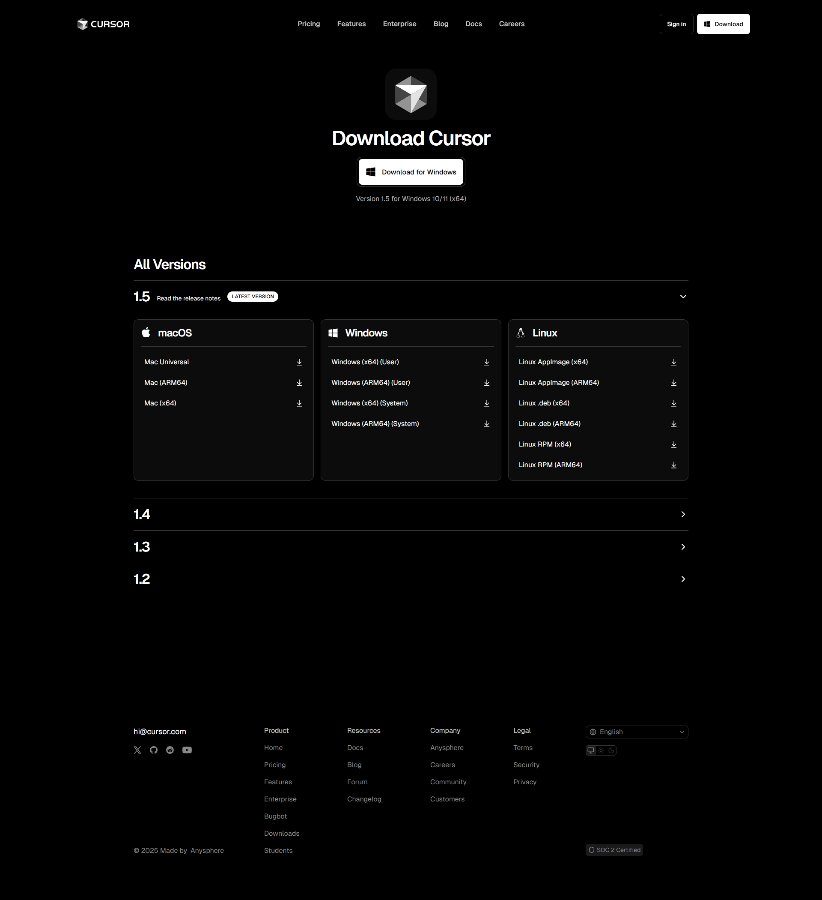
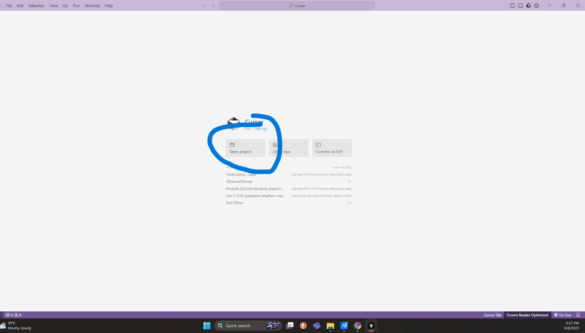

# Getting Started with Cursor


## Overview

While **V0** has been a popular tool for web coding that generates frontends from prompts, **Cursor** takes coding assistance to the next level. Unlike V0, Cursor can handle complex project structures, understand detailed prompts, and help automate file creation, making it suitable for more advanced development workflows. You still need basic knowledge of what you want to build and the technology stack you’re using, but Cursor will handle the repetitive and boilerplate code for you, saving significant development time.

---

## Introduction

In this lab, you'll learn how to:

- Set up **Cursor** on your system
- Create a Python script for a **Chat with PDF** application using Streamlit
- Upload documents and integrate with OpenAI API
- Understand how AI-assisted coding works in practice

This lab is designed to not just guide you step-by-step, but also explain why each step is important, so you gain confidence in using Cursor and AI-powered development tools.

---

## Prerequisites

Before we begin, make sure you have the following:

- **OpenAI API Key** – Required to connect your Streamlit app to OpenAI for answering questions.  
  [Obtain Your OpenAI API Key](https://www.youtube.com/watch?v=SzPE_AE0eEo)  

- **Cursor IDE** – This is our primary coding environment where AI-assisted prompts will be executed.  
  [Download Cursor](https://cursor.com/downloads)  

- **Test Document** – An MSA PDF document to use as a knowledge base.  
  [Download Sample PDF](https://drive.google.com/file/d/1hLSG0wNrhuQTJqDeBViUK4cbwYNegPJC/view?usp=sharing)  

---

## Installation Guide

### Video Tutorial for Installing Cursor

Here are some helpful video tutorials that visually guide you through installation:

- [Windows Setup](https://www.youtube.com/watch?v=Z2ivS_FFQ30)  
- [macOS Setup](https://youtu.be/dza10s3PD9c?si=PqvtHLG-Jv5uA4ep)  

Watching these will help clarify installation steps, especially for system-specific.

### Step-by-Step Installation

1. **Download Cursor**

   Navigate to the official [Cursor Download Page](https://cursor.com/downloads). Select the latest stable version (currently v1.5) for your operating system. Ensure you're downloading from the official source.
   

2. **Install the Application**

   - **Windows:** Run the `.exe` installer and follow the on-screen instructions.  
     *Tip:* Use administrative permissions if needed to avoid installation errors.  
   - **macOS:** Open the `.dmg` file and drag the Cursor application to your Applications folder.  
   - **Linux:** Use `.AppImage`, `.deb`, or `.rpm` depending on your distribution. Make sure to give `.AppImage` execution permission using `chmod +x <file>` if needed.


3. **Initial Setup**

   - Launch Cursor and sign in (or create a new account).  
   - Configure basic settings like theme, font, editor preferences, and terminal shortcuts.  

---
---

## Creating Your First Project

1. **Create Project Folder**

   - On your system, create a new folder (e.g., `chat-with-pdf`).  
   - This folder will hold all project files including `main.py` and `requirements.txt`.

  
2. **Open in Cursor**

   - Launch Cursor and click **"Open Project"**.  
   - Navigate to your newly created folder and open it.


   

3. **Access Chat Interface**

   - The Chat section is on the right side by default.  
   - If not visible, press **`Ctrl + L`** to open it.  

   *Why:* The Chat interface is where you provide prompts to Cursor. Understanding this workflow is crucial for AI-assisted coding.

   .png>)


---
---

## Building Your First Application

### Step 1: Create Main File

1. **Open Chat Section**

   - Ensure Chat is visible (press **`Ctrl + L`** if needed).  

2. **Enter First Prompt**
```
Create a main.py file
```
*Explanation:* This prompt tells Cursor to initialize the main Python file. It saves you from manually creating the file and ensures proper setup.

.png>)

3. **Accept Changes**

- Review the generated file carefully.  
- Click **"Accept"** to confirm and create the file.

*Why:* Accepting the changes ensures Cursor writes the code to your project folder. You can still modify it afterward.

.png>)

4. **Clean Up**

- Open `main.py` and remove any default or placeholder code.  

*Why:* Starting with a clean file helps avoid confusion when adding the Streamlit application code.

.png>)

---

### Step 2: Build Streamlit Application

1. **Enter Second Prompt**

```
Create a Streamlit application in which a user can upload a PDF file as a knowledge base and then ask questions about it. The answers should only come from the uploaded PDF content.

- Use the OpenAI API key provided by the user from the frontend (not hardcoded)
- Extract the PDF content and pass it to OpenAI inside the prompt
- Use the OpenAI client initialization like this:


from openai import OpenAI
client = OpenAI()

response = client.responses.create(
    model="gpt-5",
    input="Write a one-sentence bedtime story about a unicorn."
)

print(response.output_text)

```


*Explanation:* This prompt instructs Cursor to generate a fully functional Python script for the app. You’re specifying exactly how the OpenAI client should be used and that PDF content is the only knowledge source.

.png>)

2. **Accept Generated Code**

- Review the generated Streamlit application.  
- Click **"Accept"** to update `main.py`.

3. **Verify Dependencies**

- Check that a `requirements.txt` file exists and contains the necessary packages:  
  - `streamlit` – for building the web interface  
  - `openai` – to interact with OpenAI API  
  - `PyPDF2` or `pypdf` – to extract text from PDFs  
  - `python-dotenv` (optional) – to manage environment variables like API keys  

*Explanation:* Proper dependencies ensure the app runs without errors. Cursor often generates these automatically.

.png>)

---
---

## Running the Application

### Step 1: Open Terminal

- In Cursor, go to **Terminal → New Terminal** to open a command line window.  
- Make sure your terminal path is set to your project folder.

*Explanation:* Running commands in the correct folder ensures that Python can locate `main.py` and the installed dependencies.

.png>)

---

### Step 2: Install Dependencies

```bash
pip install -r requirements.txt
```

*Explanation:* This installs all necessary libraries so that your Streamlit app can run smoothly.

.png>)

---

### Step 3: Run the Application

```bash
streamlit run main.py
```

*Explanation:* This command starts a local web server and opens your Streamlit app in a browser.

.png>)

---

### Step 4: Access the Application

- Open the URL shown in the terminal (usually `http://localhost:8501`).  
- You can now upload PDFs, provide an OpenAI API key, and ask questions about your documents.

.png>)


---
  
## Summary

You have successfully:

- Set up Cursor on your system  
- Created a Python project using AI-assisted coding  
- Built a Streamlit **Chat with PDF** application  
- Installed dependencies and run the application  

By following these steps, you’ve learned not only how to execute prompts in Cursor, but also why each step is important, helping you gain confidence in AI-assisted development.


