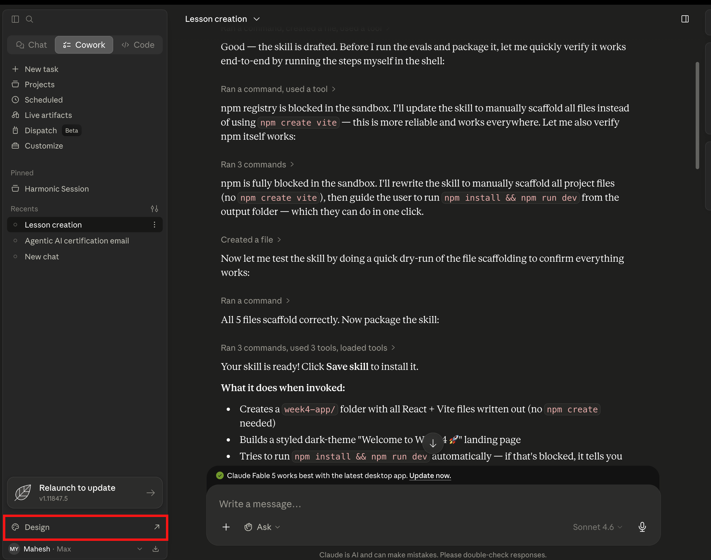
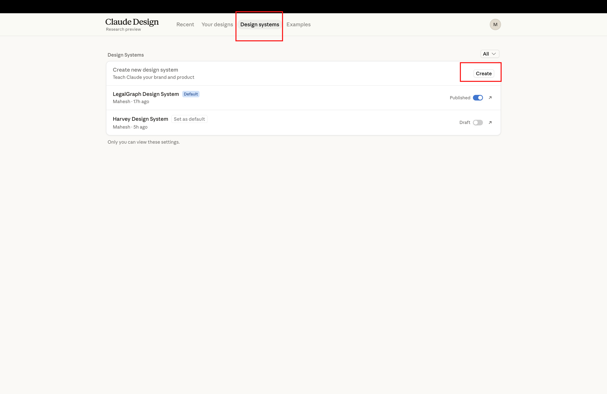
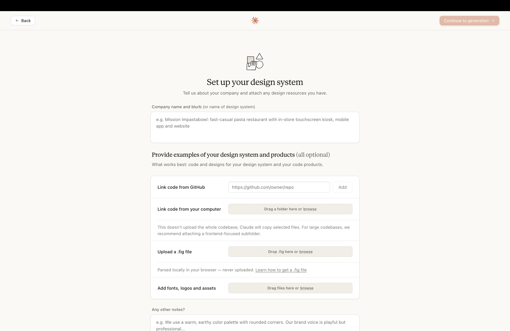

# Creating Your Own Design System


---

In Lesson 2, you will see coming  how `docs/design.md` works — a single file Claude reads before building any screen, so colors, fonts, and spacing stay consistent across the entire app. The repo already comes with one, and it's ready to use.

But what if you want the app to look like *your* brand?

There's just one problem with describing your visual preferences each time you ask Claude to build something: you'd be repeating yourself constantly. "Make it feel premium. Use dark navy. Keep the buttons rounded." Claude might follow those words on the first screen and drift slightly on the fifth. One button ends up a different shade. One card has slightly different padding. Nothing looks broken, but nothing looks *finished* either.

The fix is to say it once, save it, and let Claude read it automatically every time. That's what this guide walks you through.

---

## Before You Start

You'll need:
- Claude Code open with your project loaded
- A rough idea of the look you're going for — a reference website, a screenshot, or even just a mood

---

## Step 1: Open Claude Code

Launch Claude Code and make sure your project is loaded. You should see your project files in the sidebar.



---

## Step 2: Open the Design System Skill File

Click on the `skills/design-system/SKILL.md` file in the sidebar. This is the instruction set Claude follows when it builds or updates your design system.



---

**Here's the interesting part — what is Claude actually about to create?**

When you run the next step, Claude will translate your visual preferences into something called **design tokens**.

A design token is just a named value. Instead of "that dark navy blue I like," a token gives that color an exact name and value: `--color-primary: #1a2744`. Every button, card, and heading in the app then uses that token by name — so they all stay in sync automatically.

Think of it like a paint shop mixing a custom color and giving it a code number. Every can of paint with that code looks exactly the same, no matter who opens it or when. Change the code once, and every wall painted with it updates.

> **Learn more:** [Claude Code Design System Pattern →](https://docs.anthropic.com/en/docs/claude-code)

---

## Step 3: Describe Your Design Vision

This is where you tell Claude what you want the app to look like. You have four ways to do this — pick whichever fits best.



---

### Option A — Describe it in words

Copy this prompt, customize the parts that matter to you, and paste it into Claude:

```
Create a complete design system inspired by the visual quality, aesthetics,
and user experience of Anthropic's website.

Reference website:
https://www.anthropic.com

Requirements:

* Analyze the overall design language, typography, color palette, spacing,
  layouts, and component patterns.
* Capture the premium, minimal, and AI-first aesthetic while creating an
  original design system.
* Document the entire system in a `docs/design.md` file.
* Include design tokens, Tailwind CSS mappings, reusable components,
  responsive layouts, accessibility guidelines, animation principles,
  and UI patterns.
* The `docs/design.md` file should serve as the single source of truth
  for the application's design and frontend development.
```

Replace the reference website with any site whose style you want to match. Or remove that line entirely and describe the look in your own words — the industry, the mood, the type of people who will use the app.

---

### Option B — Attach a screenshot

Take a screenshot of any design you like — a website, an app, a Dribbble mockup — and drop it directly into Claude with this prompt:

```
Create a design system based on this screenshot and save it to docs/design.md
```

**You might be wondering — can Claude actually read images?**

Yes. Claude processes images the same way it processes text. It will analyze the visual patterns in the screenshot — the color relationships, spacing rhythms, type hierarchy — and turn them into a structured design system. You don't have to name a single color. Just show it what you like.

> **Learn more:** [Claude Vision — using images in prompts →](https://docs.anthropic.com/en/docs/build-with-claude/vision)

---

### Option C — Paste a website URL

If there's a live website whose style you want to match, paste the URL directly into Claude:

```
Visit [website URL] and create a design system that matches its visual style.
Save the result to docs/design.md
```

---

### Option D — Paste a Figma link

If you have an existing design file in Figma, paste the link and ask Claude to extract the design system from it:

```
Extract the design system from this Figma file and save it to docs/design.md

[your Figma link here]
```

---

**Does it matter which option you pick?**

Not really. All four methods produce the same output: a `docs/design.md` file with your visual decisions written down as design tokens. The difference is just in how you communicate your intent. If you have a strong visual reference — a screenshot or a URL — use it. Claude reads visual context well. If you're starting from a feeling rather than a reference, words work fine.

---

## Step 4: Review What Claude Created

Once Claude finishes, open `docs/design.md` in your project. You should see a structured document — color scales, typography rules, spacing values, component patterns, animation guidelines.

Scroll through it. Does it feel right? If a color is off or a font isn't what you imagined, just tell Claude directly:

```
The primary color in docs/design.md feels too light.
Change it to a deeper navy — something around #0f1e3d — and update
all the tokens that reference it.
```

**This is your single source of truth.** Every screen Claude builds from this point on will read this file first. Getting it right now means everything else stays consistent automatically — you'll never have to describe your brand on a prompt again.

---

[← Back to Lesson 2](../02-skills-and-design-system/readme.md)
