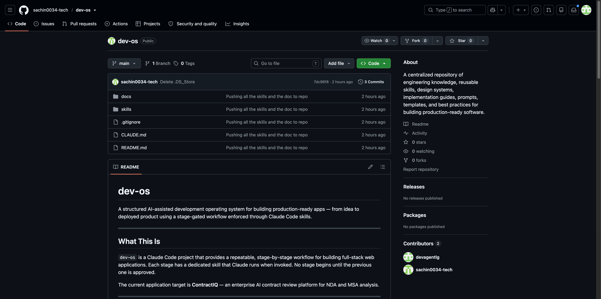
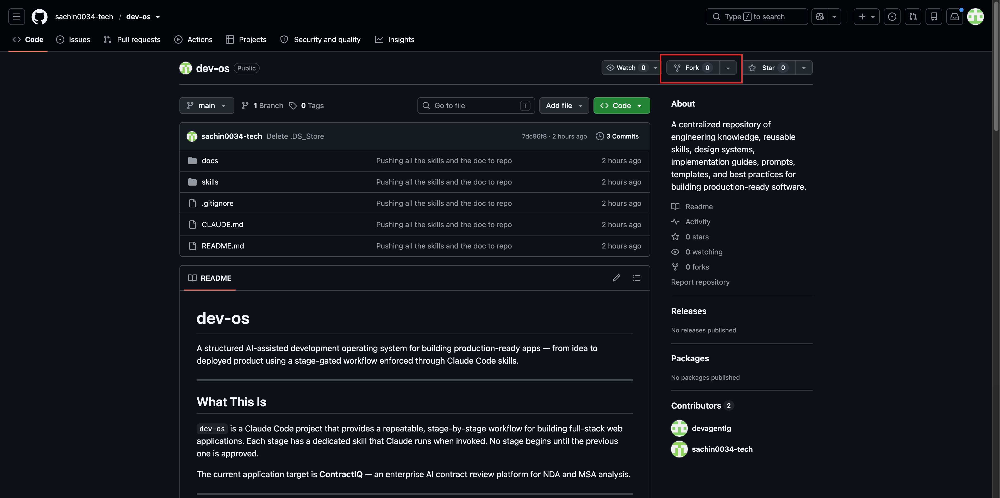
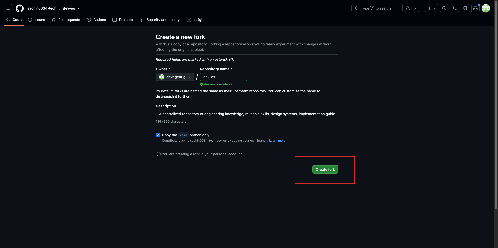
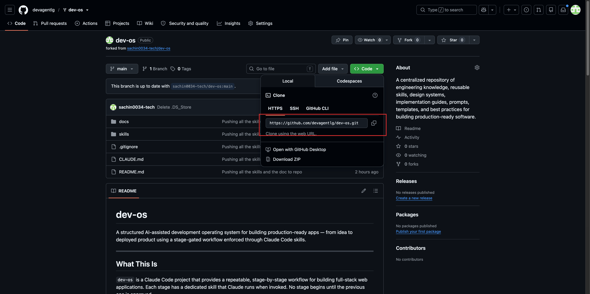
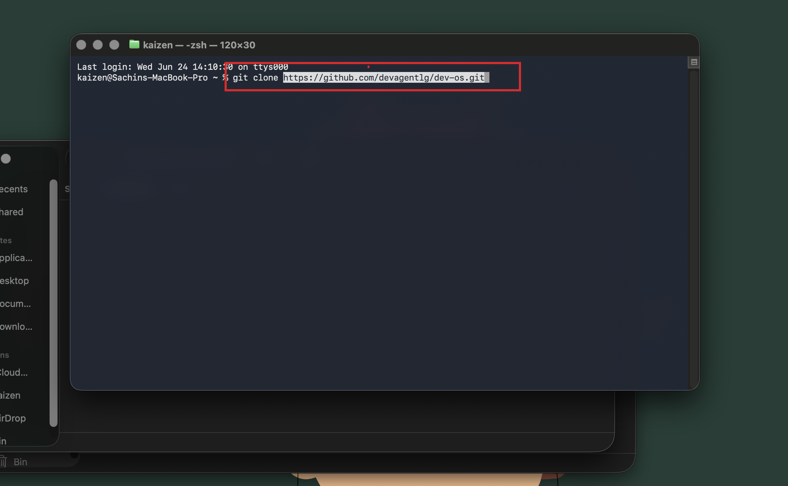
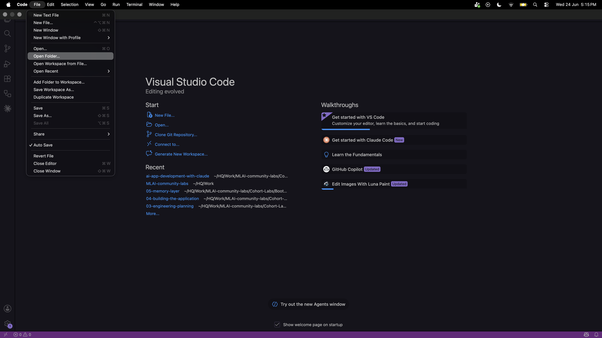
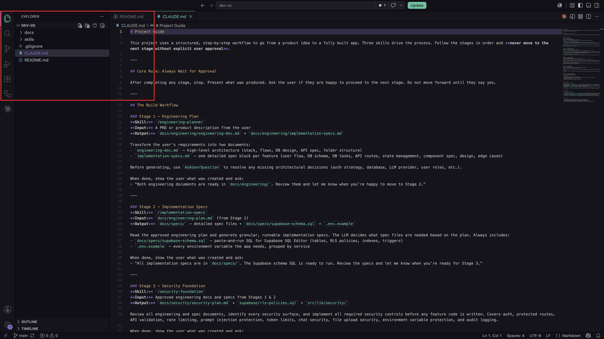

[← Back to Lab 1 Overview](../readme.md)

**Lesson 1** | [Lesson 2 →](../02-skills-and-design-system/readme.md)

---

# Lesson 1 — Project Foundation


---

Picture a founder at a 20-person SaaS company.

A potential enterprise client sends over a 30-page Master Service Agreement. She needs to sign it by end of week. She has no in-house lawyer, so she either spends 90–120 minutes reading every clause herself — or she pays $400 for an hour of legal time to get a summary she barely understands.

She does this ten times a month.

It's slow. It's expensive. And she still worries she's missing something — an auto-renewal trap, a liability clause that could sink the company, an IP assignment she didn't notice buried on page 24.

This is not a rare edge case. It's the daily reality for hundreds of thousands of founders, operations managers, and freelancers who sign contracts without the legal training to know what they're agreeing to.

---

## The Problem Has Two Layers

Here's what's interesting about this problem.

The founder's problem is obvious: she doesn't have time to read every contract, and legal help is expensive.

But there's a second problem underneath it — and this is the one you're here to solve.

If you open Claude and paste in a contract, it will answer your questions. It knows legal terminology. It can summarise clauses. It can find the termination date.

But it doesn't know:

- Which answer format the user actually needs
- How confident to be when the clause is ambiguous
- What to do when the contract references another document
- How to attribute its answer back to a specific page
- What the acceptable risk thresholds are for this type of user

The AI has the raw intelligence. What it doesn't have is **product context** — the rules, constraints, and design decisions that turn a capable model into a reliable application.

That gap is what this entire course is about.

---

## What We Are Building

We are building **ContractIQ** — a web application where a user uploads a contract PDF and within 30 seconds sees a structured breakdown of every term that matters: what it says, where in the document it appears, and how confident the AI is in its reading.

If something looks off, the user can click into that term and see the exact sentence the AI pulled it from. They can also correct it. And when they have a specific question — *"what happens if I miss a payment?"* — they can ask it in plain English and get an answer grounded in the actual document, not a generic legal explanation from the internet.

The tool does not replace a lawyer for high-stakes situations. It gives people enough understanding to know when they need one — and saves them the hours they would otherwise spend getting to that point.

---

## Where You Are in the Process

Before a single line of code gets written, the project needs a foundation. Not code — documents. Rules. Structure. Context.

Here's the full lifecycle of what you're building:

```
Idea
↓
Research
↓
PRD (Product Requirements)
↓
Engineering Document
↓
Implementation Specs
↓
Build
↓
Memory Layer
↓
Deployment
↓
Iteration
```

Right now you are at the very beginning. Today's lesson is about understanding what you're building and why, getting the starter project onto your machine, and learning how it's designed to work with Claude.

---

## Why the Setup Matters

Most developers skip this part.

They open a blank editor, start a new project, and begin typing. It feels productive. Files appear. The app takes shape.

Then three days later they paste a prompt into Claude asking it to "add user authentication." Claude does something — but it doesn't match the design system. So they paste another prompt fixing that. Then Claude's next change breaks the folder structure they'd set up. Then they spend an hour explaining context that should have been written down from the start.

The problem isn't Claude. The problem is that Claude starts every session with no memory of decisions you've already made. Without a written foundation — the rules, the architecture, the design choices — you re-explain everything from scratch, every time.

Real engineering teams solve this with documentation written before the build begins. Project rules. Architecture decisions. Design standards. These documents don't slow development down. They make every AI-assisted step faster because the context is already there.

That's exactly what the starter project gives you.

---

## Step 1 — Fork the Starter Repository

A starter repository has already been set up with the project structure, configuration files, and workflow rules you will need throughout this course. Your first move is to make your own copy of it.

Go to this URL in your browser: [https://github.com/sachin0034-tech/dev-os](https://github.com/sachin0034-tech/dev-os)



In the top-right corner of the page, click the **Fork** button. GitHub will ask you where to fork it — select your own account and click **Create fork**.





---

**What does "forking" actually mean?**

On GitHub, a repository is a project folder stored in the cloud. The problem is: it belongs to someone else. You can't save your work into their copy.

Forking creates your own version under your account. Think of it like photocopying a recipe from someone's cookbook — you get the full original, and now you can scribble notes in the margins without touching their book. The original stays untouched. Your fork is yours to commit to, experiment on, and build from.

> **Learn more:** [GitHub forks →](https://docs.github.com/en/pull-requests/collaborating-with-pull-requests/working-with-forks/fork-a-repo)

---

## Step 2 — Clone Your Fork to Your Computer

The fork now exists on GitHub — but it's still in the cloud. To work with the files, you need them on your local machine.

Click the green **Code** button on your fork's page, make sure **HTTPS** is selected, and copy the URL shown.



Open your terminal and run:

```bash
git clone <paste the URL you copied here>
```



---

**What did that command just do?**

Cloning downloads the entire repository from GitHub onto your machine. It's the difference between a document you can only read online and one you can open, edit, and save locally. From this point on, you work on the local copy and push changes back to GitHub when you're ready to save them.

> **Learn more:** [Git cloning →](https://docs.github.com/en/repositories/creating-and-managing-repositories/cloning-a-repository)

---

## Step 3 — Open the Project in VS Code

Open VS Code. Go to **File > Open Folder** and select the `dev-os` folder that was just created by the clone command.



You'll see a file tree on the left side.



```
dev-os/
├── CLAUDE.md
├── docs/
│   ├── design.md
│   └── ContractIQ_PRD.md
└── skills/
    ├── engineering-planner/
    │   └── SKILL.md
    ├── implementation-specs/
    │   └── SKILL.md
    ├── security-foundation/
    │   └── SKILL.md
    ├── frontend-setup/
    │   └── SKILL.md
    └── design-system/
        └── SKILL.md
```

This might look simple. But every file here exists for a specific reason — and understanding why is more important than understanding what it contains.

---

## Understanding the Project Structure

This project is not just organised for you. It's organised for Claude.

Every file in this structure is something Claude reads before it acts. Let's walk through each one and understand why it exists.

---

### `CLAUDE.md` — The Project Constitution

Every time you open a Claude Code session inside this project, Claude reads this file first — before doing anything else.

It defines:
- What stage of development you're in
- Which rules apply right now
- What Claude is allowed to do and what it should avoid

**Here's why this matters.**

Every new Claude session starts completely fresh. Claude has no memory of what you built yesterday, what architecture decisions you made last week, or what conventions you've established. Without `CLAUDE.md`, you would re-explain all of that context from scratch at the start of every session.

`CLAUDE.md` solves this. It's a permanent record of your project's rules that Claude re-reads every session automatically. Think of it as your project's constitution — the rules that stay in effect no matter when you open the project or who is working on it.

> **Learn more:** [CLAUDE.md and persistent context →](https://docs.anthropic.com/en/docs/claude-code/memory)

---

### `docs/ContractIQ_PRD.md` — The Source of Truth

This is the Product Requirements Document. It defines the problem, the users, the features, the database schema, the pricing, and the success metrics. Every technical decision in this course traces back to something written here.

When you run the engineering planner skill, Claude reads this document to understand what it's building before producing a single line of output. The PRD is the foundation every other document is built on top of.

---

### `docs/design.md` — The Visual Contract

The design system for ContractIQ — the colors, typography, spacing rules, and component patterns that every page in the app will follow.

When Claude builds a new screen, it refers here first so the product looks and feels consistent without you having to describe the visual style on every prompt. One document, enforced everywhere.

---

### `skills/` — The Most Important Folder in the Project

This is where everything connects.

The `skills/` folder contains five subfolders, each named after a capability. When you type `/engineering-planner` into Claude Code, Claude reads the `SKILL.md` file inside that folder and follows its instructions exactly — every time, for every session.

Think of a skill like a detailed job description you write once and hand to Claude. Instead of explaining the same task from scratch each session, the instructions live in a file. Claude executes them consistently.

Here's what each skill does and when you'll use it:

| Skill | What it does | When |
|-------|-------------|-------|
| `/engineering-planner` | Reads the PRD and produces an architecture plan, data models, and API contracts | Lab 1, Lesson 3 |
| `/implementation-specs` | Takes the architecture plan and breaks it into file-by-file build instructions | Lab 2, Lesson 1 |
| `/frontend-setup` | Scaffolds the Next.js application with the design system already baked in | Lab 2, Lesson 1 |
| `/design-system` | Enforces the rules in `design.md` at the component level throughout all UI work | Lab 2, Lesson 1 |
| `/security-foundation` | Audits the planned code for security gaps before anything ships | Lab 3 |

> **Learn more:** [The Complete Guide to Building Skills for Claude →](https://resources.anthropic.com/hubfs/The-Complete-Guide-to-Building-Skill-for-Claude.pdf)

---

## How Real Engineering Teams Set Up Projects

Here's something worth knowing.

The best engineering teams don't start projects by writing code. They start by writing rules.

A **Tech Lead** writes the architecture decision records — the choices that were made, why they were made, and what alternatives were rejected. An **Engineering Manager** establishes the coding conventions so every engineer writes in the same style. A **Product Manager** writes and maintains the PRD so every technical decision can be traced back to a user problem.

These documents aren't bureaucracy. They're the reason a team of ten engineers can build in the same direction without constant meetings to re-align on decisions already made.

What you've set up today — `CLAUDE.md`, the PRD, the design system, the skills — is the AI-native version of exactly that. The rules are written. The context is permanent. Every session starts informed.

---

## What You Accomplished

You now have:

- A forked copy of the starter repo under your own GitHub account
- The project cloned to your local machine and open in VS Code
- An understanding of why every file in the project exists — not just what it contains

The project is open. The structure makes sense.

But `docs/engineering/` doesn't exist yet. There's no architecture plan, no database schema, no list of files to build. Before writing a single line of code, those documents need to exist — because code improvised without a plan falls apart mid-build, and code written from a solid plan holds together.

---

## What's Next

In Lesson 2, you'll look closely at the five skills and the design system before putting either to use — understanding what each one does and how they connect.

In Lesson 3, you'll run the first skill and watch an engineering plan generate itself directly from the PRD.

The foundation is set. Now let's build on it.

---

## Claude Concepts Covered in This Lesson

| Concept | Where it appeared | Learn more |
|---------|-------------------|------------|
| **CLAUDE.md** | **Step 3** — "Every time you open a Claude Code session inside this project, Claude reads this file first. It defines what stage of development you're in, which rules apply, and what Claude is allowed to do." | [Claude Code memory →](https://docs.anthropic.com/en/docs/claude-code/memory) |
| **Skills / slash commands** | **Step 3** — "Type `/engineering-planner` into Claude Code and Claude reads the `SKILL.md` file inside that folder and follows its instructions exactly — every time, for every session." | [Skills guide →](https://resources.anthropic.com/hubfs/The-Complete-Guide-to-Building-Skill-for-Claude.pdf) |
| **PRD as source of truth** | **Step 3** — "When you run a skill like `/engineering-planner`, Claude reads this document to understand what it's building before producing a single line of output." | [Prompt engineering →](https://docs.anthropic.com/en/docs/build-with-claude/prompt-engineering/overview) |

---

[← Back to Lab 1 Overview](../readme.md)

**Lesson 1** | [Lesson 2 →](../02-skills-and-design-system/readme.md)