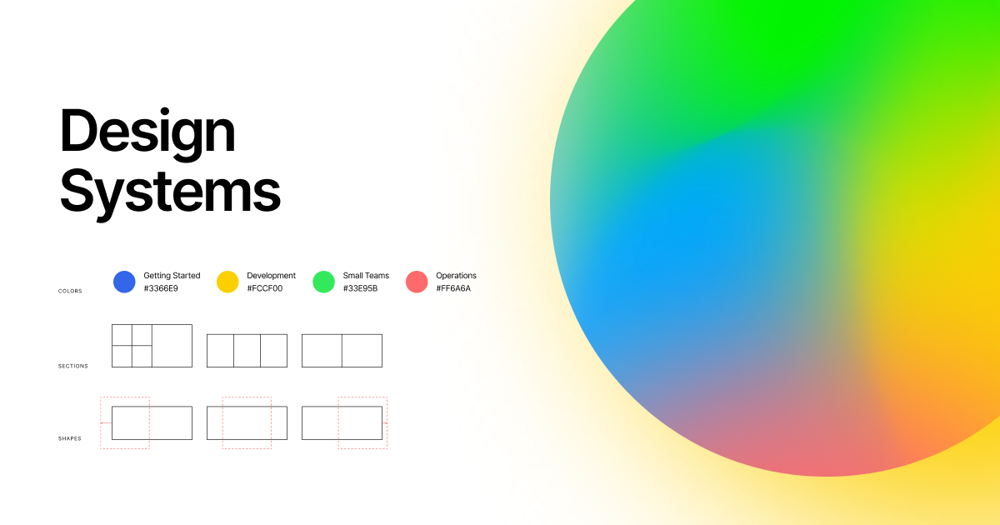
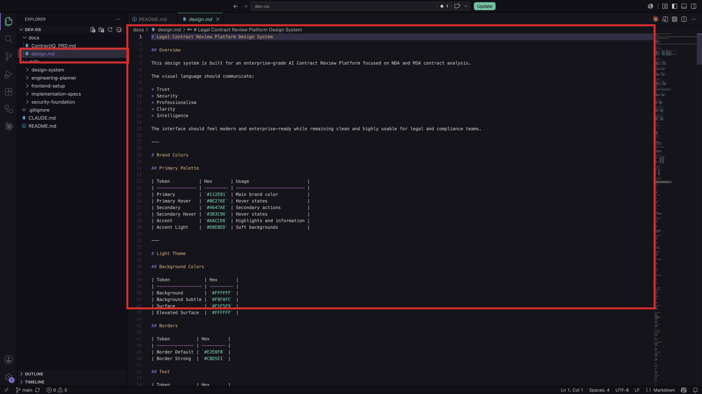

[← Back to Lab 1 Overview](../readme.md)

[← Lesson 1](../01-project-foundation/readme.md) | **Lesson 2** | [Lesson 3 →](../03-engineering-planning/readme.md)

---

# Lesson 2 — Skills and the Design System


---

In Lesson 1, you opened the project and saw the full file structure — `CLAUDE.md`, a `docs/` folder, and a `skills/` directory with five subfolders. The structure made sense at a high level.

But there's still a gap between seeing those files and knowing what happens when you actually put them to work. What does typing `/engineering-planner` into Claude Code actually trigger? Why is there a whole separate file just for colors and fonts? And why does any of this matter before you've written a single line of code?

This lesson closes that gap.

---

There's something that surprises most people the first time they work with AI on a real project. Every time you open a new conversation with Claude, it starts completely blank. No memory of the product you're building. No idea what color scheme you chose. No awareness of the rules you set in the last session.

It's like hiring a brilliant contractor who forgets everything at the end of each workday. Useful — but only if you re-brief them from scratch every morning.

There's just one problem with re-briefing Claude from scratch each session: it doesn't scale. What if a teammate opens the project? What if you return to it three weeks from now? What if you want Claude to follow the exact same process every time — not a slightly different version depending on how well you remembered to explain it?

That's the problem skills solve. Let's see how.

---

## Step 1 — Open a Skill File and Read It

In VS Code, open the file at `skills/engineering-planner/SKILL.md`.


Read through it. You're not running anything yet — just reading the plain text inside.

---

**Here's the interesting part — what you're looking at is Claude's job description.**

A skill is a saved set of instructions stored in your project. When you type `/engineering-planner` into Claude Code, Claude finds the `SKILL.md` file inside that folder and follows its instructions exactly — every time, for every session, for every teammate who opens this project.

Think of it like a recipe card. Instead of explaining the dish from scratch every time, you write the recipe once and anyone can cook it consistently. The recipe lives in the project, not in someone's memory.

Every `SKILL.md` file is written in four sections:

```
## Purpose
What does this skill do and when should someone run it?

## Inputs
Which files should Claude read before starting? List them by path.

## Instructions
What should Claude do, step by step? Be specific.

## Output
What files should exist when the skill finishes?
```

This structure gives the skill a clear contract. Purpose says what it does. Inputs say what it reads. Instructions say how it works. Output says what proof you have it finished.

> **Learn more:** [The Complete Guide to Building Skills for Claude →](https://resources.anthropic.com/hubfs/The-Complete-Guide-to-Building-Skill-for-Claude.pdf)

---

## Step 2 — Walk Through the 5 Skills in Order


These five skills form a pipeline — the output of each one becomes the input to the next. Understanding that sequence is what makes the whole build make sense.

---

**`/engineering-planner`** — *Run in Lesson 3*

Reads the PRD and turns it into an organized build plan. It figures out which features are essential for launch and which can wait, maps out all the data the product needs to store and how it connects, and breaks the build into stages so you can ship something working early. It saves everything to `docs/engineering/` for the next skill to read.

---

**`/implementation-specs`** — *Run in Lesson 3*

Takes the engineering plan and turns it into a detailed blueprint — a room-by-room guide before construction begins. It breaks the build into clear sections (upload, analyze, display results, login), describes exactly what needs to be built in each section and in what order, and flags every place two features have to work together so nothing gets discovered by accident. It saves everything to `docs/specs/`.

---

**`/security-foundation`** — *Run in Lab 3*

Reviews the plan for safety issues before any building starts — like a safety inspector walking through blueprints before a single nail goes in. It checks that private data can only be accessed by the person it belongs to, verifies that uploaded files are validated before being processed, and makes sure secret keys are stored safely. It produces a labeled checklist: what to fix before launch versus what to fix before going live.

---

**`/frontend-setup`** — *Run in Lab 2*

Builds the empty shell of the application with the design system already baked in. It reads `docs/design.md` first so brand colors and fonts are built in from day one. It creates the folder structure so every future file has a logical home, sets up reusable interface pieces (buttons, forms, cards) wired to your brand colors, and creates the connection to the database.

---

**`/design-system`** — *Used throughout Lab 2*

The skill you use most. Every time Claude builds a new screen, this skill makes sure it matches everything else. It reads `docs/design.md` at the start of every session — never works from memory — and uses named colors and spacing values from the design system rather than inventing new ones.

---

**You might be wondering — why run them in this exact order?**

Because each skill depends on what the previous one produced. `/engineering-planner` needs the PRD to exist. `/implementation-specs` needs the engineering plan. `/frontend-setup` needs the implementation specs. `/design-system` needs the design file. Skip a step or run them out of order and the later skill has nothing meaningful to read.

Think of it like an assembly line — each station feeds directly into the next. The line only works if every station runs in sequence.

---

## Step 3 — Open the Design System File

Open `docs/design.md` in VS Code.



Scroll through it. You'll see colors defined by name, font choices, spacing scales, button shapes, animation rules, and component patterns — all written down before a single page of the app exists.



---

**Here's the interesting part — this file is what keeps the entire app visually consistent.**

A design system is a set of visual decisions you make once — colors, fonts, spacing, button shapes — written down so every new screen follows the same rules automatically.

Without it, each page you build drifts slightly from the last. Nothing looks broken. Nothing looks *finished* either. One button is slightly rounder than the one on the previous screen. A heading is a shade darker. Small things — but they add up to an app that feels assembled rather than designed.

In this project, `docs/design.md` is the single source of truth for everything visual. When Claude builds any screen in Lab 2, it reads this file first so every element matches everything else — without you having to describe your brand on every prompt.

The `design.md` file is already included in the repository you cloned, so you do not need to create it. If you want to swap it out for your own visual style — using a screenshot, a website URL, or a Figma file — the instructions are here: [How to Create Your Own Design System →](../00-resources/create-design-system.md)

> **Learn more:** [Design systems and Claude →](https://docs.anthropic.com/en/docs/claude-code)

---

## Bonus — Build Your Own Skill

You don't need to build a skill from scratch for this course — the five that ship with the project are all you need. But if you ever want to create one for a different job, here's how.

**1. Pick one clear job.** One skill, one purpose. If you can't describe what it does in a sentence, it's not ready.

**2. Create the folder and file.**
```
skills/your-skill-name/
└── SKILL.md
```
The folder name becomes the slash command.

**3. Write the four sections:**
- **Purpose** — what does it do and when should someone run it?
- **Inputs** — which files should Claude read first? List them by exact path.
- **Instructions** — what should Claude do, step by step?
- **Output** — what files should exist when it finishes?

**4. Name your files explicitly.** Don't say "read the design document" — say "read `docs/design.md`". Vague references produce inconsistent results.

**5. Test and refine.** Run the command, review the output, and tighten any instruction that produced something unexpected. Treat `SKILL.md` like code — update it, commit it, iterate.

---

### Let Claude Write the Skill for You

You don't have to write the `SKILL.md` yourself. Copy the prompt below, fill in the blanks, and paste it into Claude Code — it will create the skill file for you.

```
I want to create a new Claude Code skill.

Skill name: [what you want to type as a slash command, e.g. brand-voice]

Job: [one sentence — what should this skill do?]
Example: "Review any new page I build and make sure the writing matches our brand tone document."

Reference files: [any files Claude should read before running the skill]
Example: docs/brand.md, docs/PRD.md

Output: [what should exist when the skill finishes?]
Example: A revised version of the page with tone corrections applied.

Please create the folder skills/[skill-name]/ and write a SKILL.md file inside it
with Purpose, Inputs, Instructions, and Output sections.
```

**Example filled in:**

```
I want to create a new Claude Code skill.

Skill name: brand-voice

Job: Review any new page I build and rewrite the copy to match our brand tone.

Reference files: docs/brand.md

Output: A revised version of the page with tone corrections applied inline.

Please create the folder skills/brand-voice/ and write a SKILL.md file inside it
with Purpose, Inputs, Instructions, and Output sections.
```

---

All five skills are loaded in your project and the design system is in place. But nothing has actually run yet. The `docs/engineering/` folder doesn't exist — there's no architecture plan, no data model, no list of files to build. Without those documents, there's no foundation for the code.

In Lesson 3, you'll run `/engineering-planner` for the first time and watch it translate the PRD into a concrete technical blueprint. That document is what everything in Lab 2 is built from.

---

## Claude Concepts Covered in This Lesson

| Concept | Where we covered it | Learn more |
|---------|---------------------|------------|
| **Skills / slash commands** | **Step 1** — "When you type `/engineering-planner` into Claude Code, Claude finds the `SKILL.md` file inside that folder and follows its instructions exactly — every time, for every session, for every teammate who opens this project." | [Skills guide →](https://resources.anthropic.com/hubfs/The-Complete-Guide-to-Building-Skill-for-Claude.pdf) |
| **SKILL.md structure** | **Step 1** — "Purpose says what it does. Inputs say what it reads. Instructions say how it works. Output says what proof you have it finished." | [Skills guide →](https://resources.anthropic.com/hubfs/The-Complete-Guide-to-Building-Skill-for-Claude.pdf) |
| **Stage-gated pipeline** | **Step 2** — "Each skill depends on what the previous one produced. Skip a step or run them out of order and the later skill has nothing meaningful to read." | [Claude Code docs →](https://docs.anthropic.com/en/docs/claude-code) |
| **Design system as persistent visual context** | **Step 3** — "When Claude builds any screen in Lab 2, it reads this file first so every element matches everything else — without you having to describe your brand on every prompt." | [Claude Code docs →](https://docs.anthropic.com/en/docs/claude-code) |

---

[← Back to Lab 1 Overview](../readme.md)

[← Lesson 1](../01-project-foundation/readme.md) | **Lesson 2** | [Lesson 3 →](../03-engineering-planning/readme.md)