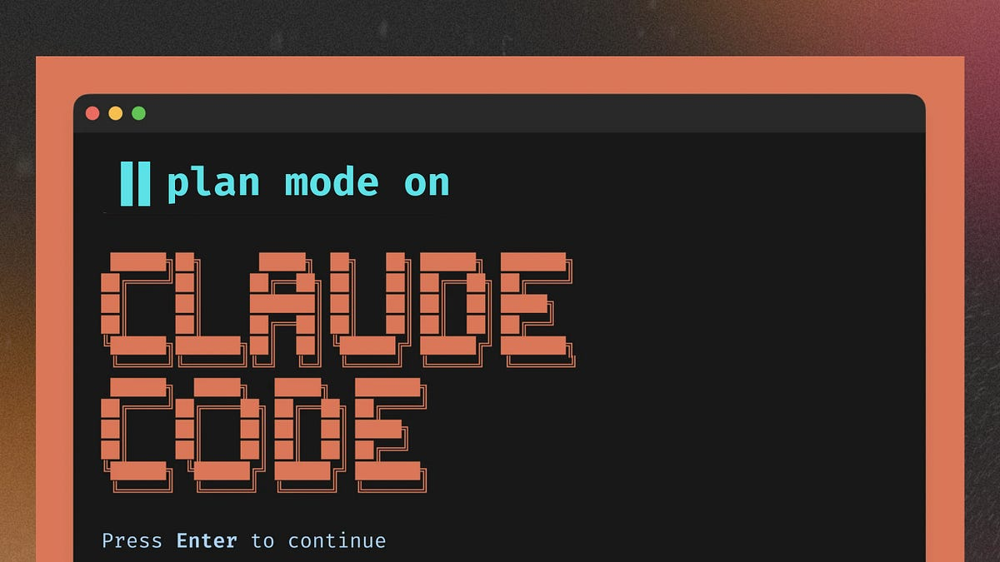
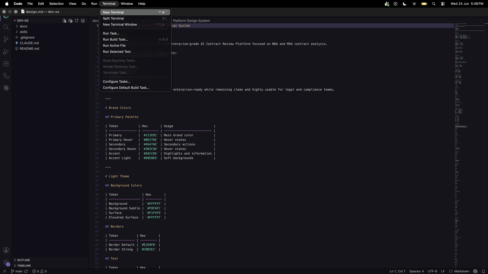
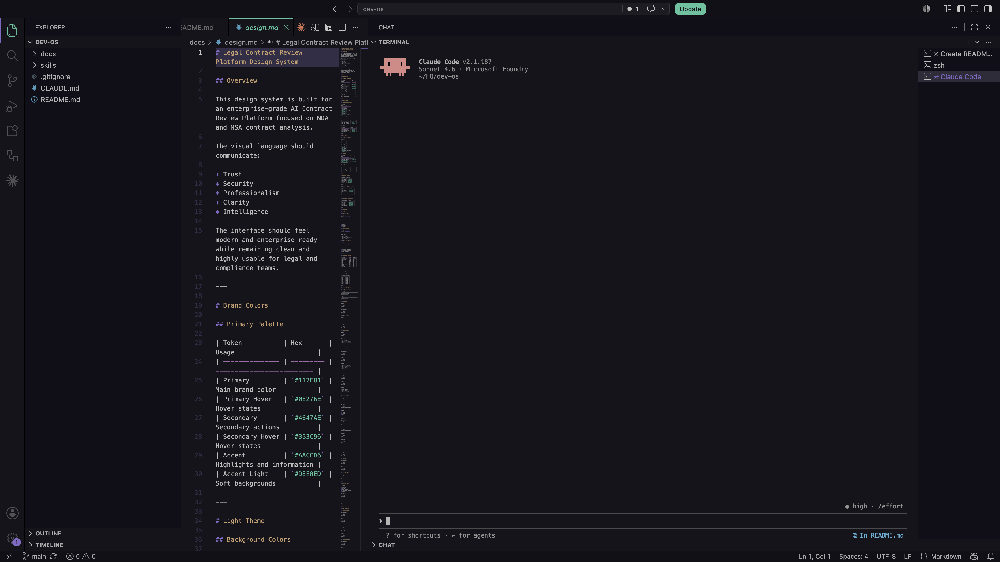
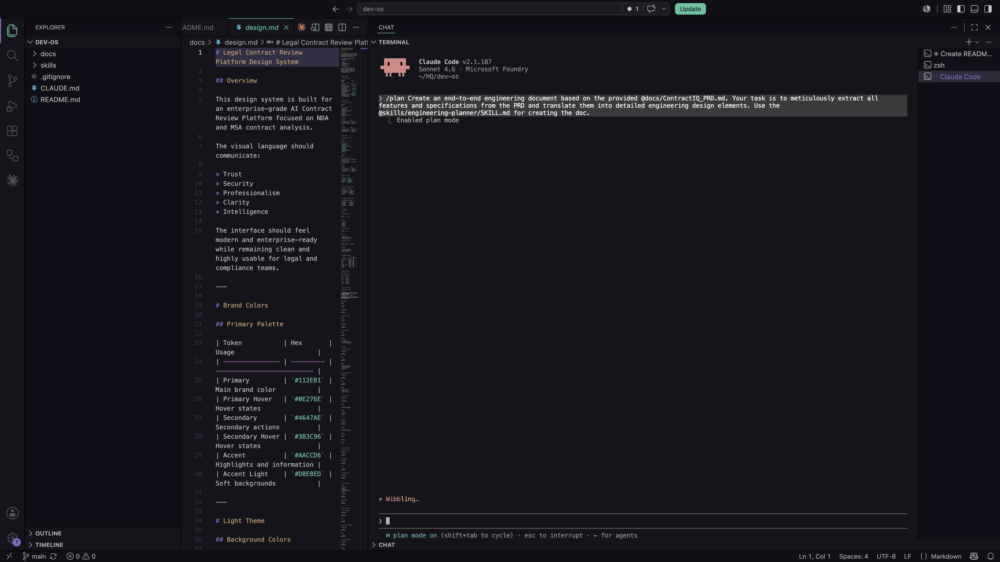
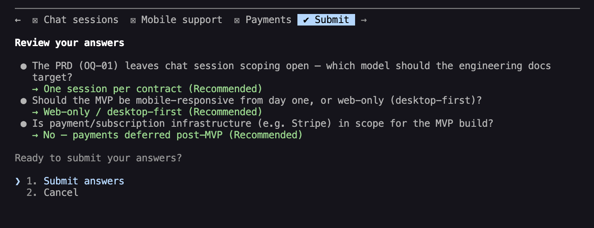

[← Back to Lab 1 Overview](../readme.md)

[← Lesson 2](../02-skills-and-design-system/readme.md) | **Lesson 3**

---

# Lesson 3 — Engineering Planning


---

You have a PRD. It describes the product in detail — the users, the features, the data, the edge cases.

Now imagine handing it to a senior engineer and saying: *"Build this."*

A good engineer doesn't open their editor and start typing. They ask questions first. What database tables do we need? What happens if a user uploads a corrupted file? Which features share the same data? What do we build first so we can ship something working — and what comes later?

They're turning a product description into an **engineering plan**.

That's exactly what this lesson does — except the senior engineer is Claude, and the plan gets written in minutes instead of days.

---

## The Problem With Jumping Straight to Code

Here's what happens when developers skip the planning step.

They paste the PRD into Claude and say *"build the frontend."* Claude builds something. Then they say *"now add authentication."* Claude adds it — but it doesn't quite match the database shape from the first prompt. Then they say *"now add the contract upload."* Claude builds it — but it assumes a file path structure that conflicts with what was set up in step one.

Each prompt produces working code in isolation. Together, they don't hold together.

The root cause is always the same: there was no shared plan. Every prompt started from scratch, making its own assumptions about how the pieces connect.

An engineering plan solves this. It answers all the structural questions once — data models, API contracts, build order, feature dependencies — so every prompt that follows is working from the same foundation.

---

## Where You Are in the Process

You've built the foundation (Lesson 1) and understood the tools (Lesson 2). Now it's time to generate the documents that Lab 2 is built from.

```
Idea
↓
Research
↓
PRD  ✓
↓
Engineering Document  ← YOU ARE HERE
↓
Implementation Specs
↓
Build
↓
Memory Layer
↓
Deployment
↓
Iteration
```

By the end of this lesson, `docs/engineering/engineering-doc.md` will exist — and the blueprint for everything in Lab 2 will be in place.

---

## What Is Plan Mode?



Before running anything, there's one Claude Code feature worth understanding: **Plan Mode**.

Plan Mode is a special state where Claude is allowed to **read and reason, but not write or change anything**.

When you prefix a prompt with `/plan`, Claude:

1. Reads every file you reference
2. Thinks through the full problem
3. Produces a structured plan as output
4. **Waits for your approval before doing anything**

No files are created. No code is touched. You see the complete plan first and decide whether to approve it or send Claude back to revise.

This matters because AI tools are most dangerous when they act before they think. Plan Mode forces a checkpoint. You stay in control of the direction before any work begins.

---

## When to Use Plan Mode

Use `/plan` whenever you're about to start something non-trivial and want to align on the approach before implementation begins.

| Situation | Use `/plan`? |
|---|---|
| Writing a single small function | No — just do it |
| Building a new feature with multiple files | Yes |
| Translating a PRD into architecture documents | Yes |
| Refactoring a module that touches shared state | Yes |
| Fixing a one-line bug | No |
| Starting a new application from scratch | Yes |

The rule of thumb: if reviewing the approach *before* the work would save you time, use Plan Mode.

---

## Step 1 — Open the Project in VS Code

Open VS Code. Go to **File > Open Folder** and select the `dev-os` folder you cloned in Lesson 1.

You should see the file tree on the left with `CLAUDE.md`, `docs/`, and `skills/` visible.

---

## Step 2 — Open a New Terminal

In VS Code, go to **Terminal > New Terminal** (or press `` Ctrl+` ``).

A terminal panel will open at the bottom of the screen, already pointed at your project folder.



---

## Step 3 — Launch Claude Code

In the terminal, type:

```bash
claude
```

Claude Code will start and show its interactive prompt. You are now in a Claude Code session scoped to your project. Claude can read all files in the folder and will follow the rules defined in `CLAUDE.md`.



---

## Step 4 — Run the Engineering Planning Prompt

Copy and paste the following prompt into the Claude Code terminal:

```
/plan Create an end-to-end engineering document based on the provided @docs/ContractIQ_PRD.md. Your task is to meticulously extract all features and specifications from the PRD and translate them into detailed engineering design elements. Use the @skills/engineering-planner/SKILL.md for creating the doc.
```

Press **Enter**.



> **Note:** Claude may ask a few clarifying questions before proceeding — go with the recommended option unless you have a specific reason to change it.



---

> **Note:** This step can take 10–15 minutes. Let Claude finish without interrupting — in the meantime, let's talk about the `@` symbol.

---

# The `@` File Reference Syntax

The `@` symbol is how you point Claude at a specific file or folder in your project. Instead of copying and pasting content into your prompt, you reference the path — Claude reads it directly.

```
@docs/ContractIQ_PRD.md       → reads a single file
@skills/engineering-planner/  → reads every file inside that folder
```

You can use `@` anywhere in a prompt and chain as many references as you need:

```
/plan Review @docs/ContractIQ_PRD.md and apply the rules in @skills/engineering-planner/SKILL.md
```

Claude reads each referenced file at the start of the task before it generates any output. Your prompt stays short, but Claude has the full context of every document you care about.

Use `@` whenever you want Claude to work from your actual project files rather than its own general knowledge. For engineering planning, this is essential — the plan must be grounded in what the PRD actually says, not a generic template.

---

## What This Prompt Does

There are three parts worth understanding:

**`/plan`**
Activates Plan Mode. Claude will read, reason, and show you a plan — but will not write any files until you approve.

**`@docs/ContractIQ_PRD.md`**
Points Claude at the product requirements document. Claude reads every feature, constraint, and data requirement in that file before producing any output — the plan is grounded in what the PRD actually says.

**`@skills/engineering-planner/SKILL.md`**
Points Claude at the engineering-planner skill. Claude reads its instructions for how the output should be structured — what sections to include, what level of detail to capture, and where to save the resulting documents.

---

## What Claude Will Produce

After Claude processes the PRD through the engineering-planner skill, it will generate a plan covering:

- **Architecture Overview** — The system components and how they connect: Next.js frontend, Supabase database, Claude AI API, and file storage
- **Data Models** — Every database table, its columns, types, relationships, and the Row Level Security rules that control access
- **API Design** — The server-side routes the application needs, what each one accepts, and what it returns
- **Feature Breakdown** — Each PRD feature mapped to the specific components, database tables, and API routes required to build it
- **Build Sequence** — The order in which features should be built so each stage produces something working before the next one starts


---

## Reviewing and Approving the Plan

When Claude finishes, read through the plan carefully before approving.

This is the most important step in the entire lab. A gap caught here — a missing table, a feature with no API route, a circular dependency in the build order — takes 30 seconds to fix in a document. The same gap discovered three days into Lab 2 takes hours to untangle.

Ask yourself:

- Does the data model capture everything described in the PRD? Can every piece of information the app needs to store actually be stored?
- Can every user action be handled end to end? If a feature exists in the PRD but has no corresponding backend step in the plan, it will silently break later.
- Does the build sequence make sense — does each stage produce something you could open in a browser and actually use?
- Is anything missing that the PRD clearly requires?

If the plan looks right, type `yes` or `proceed` to approve. Claude will write the engineering documents to `docs/engineering/`.

If something is off, describe the change and Claude will revise before asking again.

---

## What Gets Saved

Once approved, you will find a new file under `docs/engineering/`:

```
docs/
└── engineering/
    └── engineering-doc.md
```

This document is the technical foundation for everything that follows. Every future skill — `/frontend-setup`, `/security-foundation` — reads it to understand what has already been decided.


---

## How Real Engineering Teams Do This

In a professional software company, what you just did has a name: **architecture review**.

Before any significant feature gets built, a **Tech Lead** or **Staff Engineer** writes an architecture document — sometimes called an RFC (Request for Comments) or a design doc. It covers the same things Claude just produced: the data model, the API surface, the component breakdown, the build order.

Then the team reviews it. Not the code — the plan. Other engineers look for missing edge cases, circular dependencies, data shape mismatches, security gaps. They catch these in a document, not in a pull request review three sprints later.

The engineering document Claude just wrote is that document. The difference is it took 15 minutes instead of two days, and it was grounded in the PRD from the start.

---

## The Stage-Gated Principle

Every step in this lab — and the two labs that follow — follows the same pattern:

1. You run a command
2. Claude produces output for your review
3. You approve before anything is committed
4. The output becomes the input for the next stage

This is intentional. Real software projects fail when decisions are made without visibility. By making the plan explicit and reviewable at each stage, you stay in control of what is being built — even when the AI is doing most of the writing.

---

## This Lab Is Complete

You now have everything Lab 2 needs:

- A local clone of `dev-os`, open in VS Code
- An understanding of the five skills and the design system
- `docs/engineering/engineering-doc.md` — the complete architecture plan

Continue to **[Lab 2 — Building the Application](../../02-Building-the-Application-Lab/readme.md)**, where you'll scaffold the Next.js app, generate implementation specs, set up Supabase, and implement everything end to end.

---

## Claude Concepts Covered in This Lesson

| Concept | Where it appeared | Learn more |
|---------|-------------------|------------|
| **Plan Mode** | **Step 4** — "Claude will read, reason, and show you a plan — but will not write any files until you approve." | [Claude Code docs →](https://docs.anthropic.com/en/docs/claude-code) |
| **`@` file references** | **Step 4** — "Instead of copying and pasting content into your prompt, you reference the path — Claude reads it directly." | [Claude Code docs →](https://docs.anthropic.com/en/docs/claude-code) |
| **Stage-gated principle** | **Reviewing the plan** — "A gap caught here takes 30 seconds to fix in a document. The same gap discovered three days into Lab 2 takes hours to untangle." | [Prompt engineering →](https://docs.anthropic.com/en/docs/build-with-claude/prompt-engineering/overview) |

---

[← Back to Lab 1 Overview](../readme.md)

[← Lesson 2](../02-skills-and-design-system/readme.md) | **Lesson 3** | [Continue to Lab 2 →](../../02-Building-the-Application-Lab/readme.md)