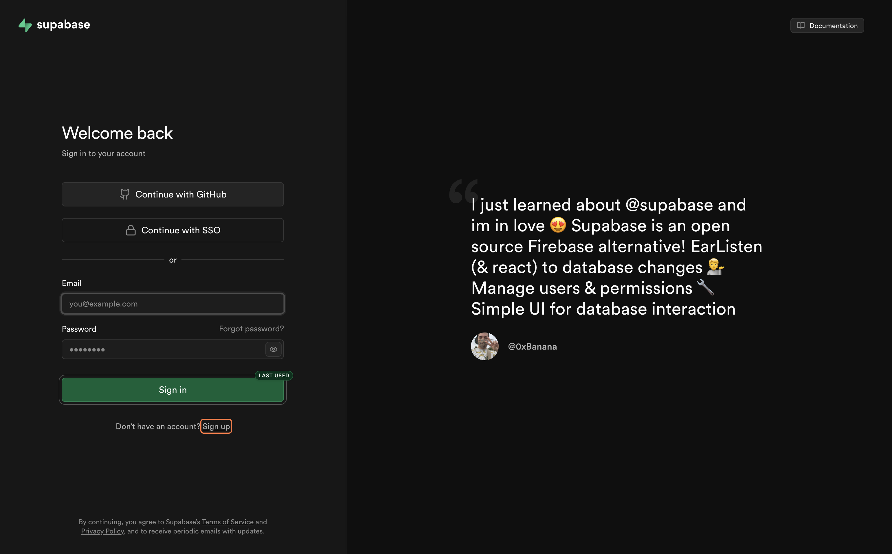
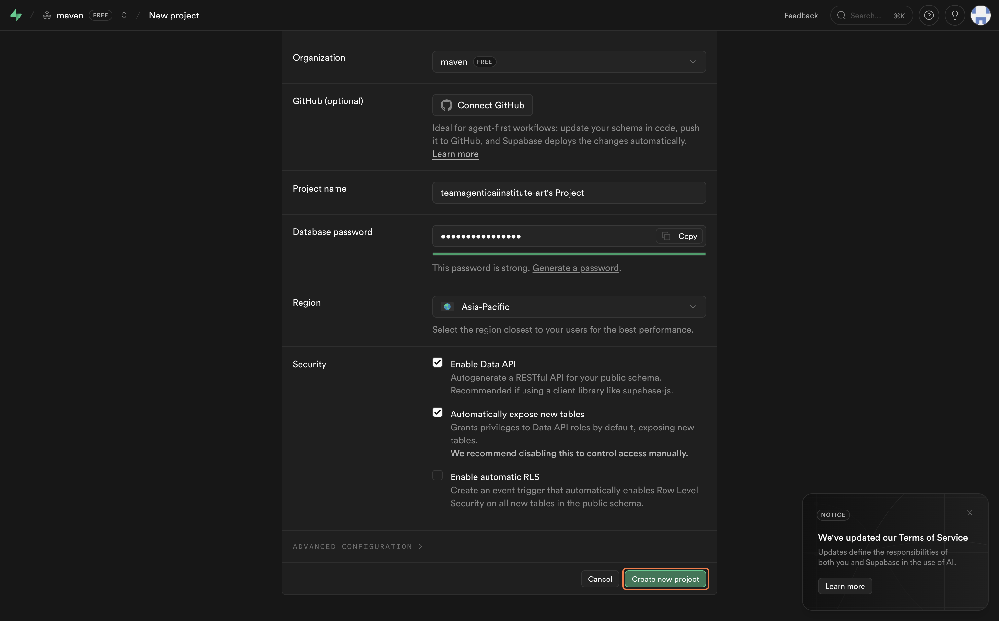
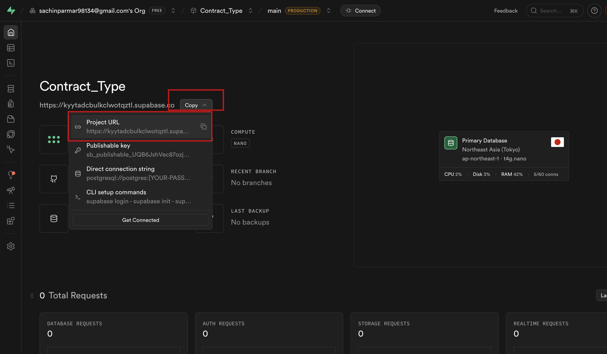
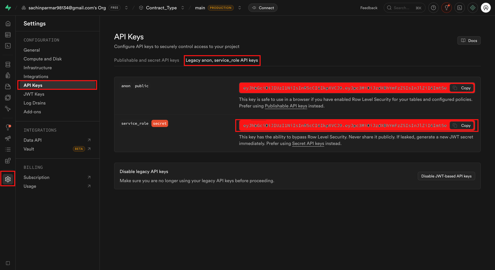
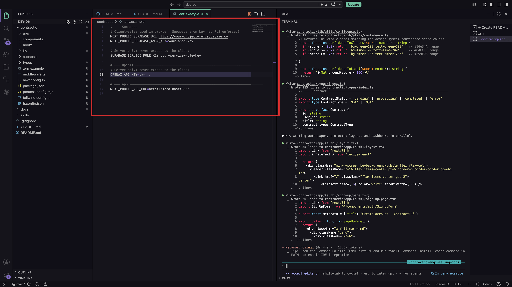
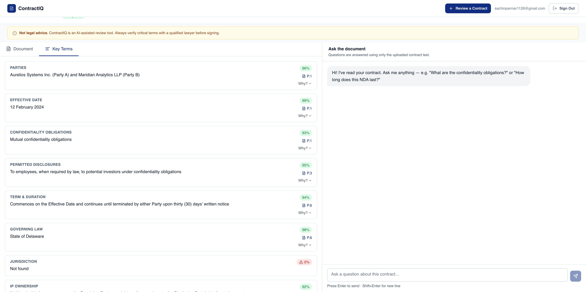

[← Back to Lab 2 Overview](../readme.md)

**Lesson 1** | [Lesson 2 →](../02-memory-layer/readme.md)

---

# Lesson 1 — Building the Application


---

You finished Lab 1 with two documents sitting in `docs/engineering/` — an architecture plan and a file-by-file implementation blueprint. You know what ContractIQ needs to do, how the data connects, and which files need to be built in which order.

Now comes the part where all of that planning turns into a real, running application.

There's just one problem. An app like ContractIQ needs somewhere to store things — user accounts, uploaded contracts, analysis results, chat messages. Right now there's nowhere. Before Claude can build a single screen, that foundation needs to exist.

That's what the first half of this lesson sets up. By the end, you'll have a live database connected to a running application you can open in a browser.

---

## Before You Build — Set Up Supabase

**You might be wondering — what is Supabase, and why do we need it?**

Every app that stores data needs a database. You could set up your own server, install PostgreSQL, configure authentication from scratch, and manage everything yourself. That's a weeks-long project on its own.

Supabase handles all of that for you. It gives you a hosted database, user authentication, and automatic API connections — all in one place, on a generous free tier.

Think of it like renting a fully staffed office. The filing cabinets (database), the security desk (authentication), and the mail room (API) all come with the building. You just move your project in.

> **Learn more:** [Supabase documentation →](https://supabase.com/docs)

---

## Step 1 — Create Your Supabase Account

Open your browser and go to [https://supabase.com/](https://supabase.com/). Click **"Start your project"**.


Sign up with **GitHub** (recommended — fastest) or with your email address.



---

## Step 2 — Create an Organization

After signing in, Supabase will prompt you to create an organization:

1. Enter a name (your name or team name works fine)
2. Select the **Free** plan
3. Click **"Create organization"**


---

## Step 3 — Create a New Project

Inside your organization, click **"New project"** and fill in the details:

1. Enter a **Project Name** — something like `contractIQ-db`
2. Set a strong **Database Password** — save this somewhere safe
3. Choose the **Region** closest to you
4. Click **"Create new project"**

Supabase will take 1–2 minutes to provision your database. Wait for it to finish before moving on.



---

## Step 4 — Copy Your Credentials

You need three values from Supabase. Here is where to find each one.

**Project URL**

Go to your project overview — the URL is shown at the top. It looks like `https://xyzxyzxyz.supabase.co`.



**Anon Key (public)**

1. Click **Project Settings** in the left sidebar
2. Click **API**
3. Scroll to **Project API keys** and copy the value next to **`anon` `public`**

**Service Role Key (secret)**

On the same **API** settings page, find **Legacy API keys** and copy the value next to **`service_role`**.



---

**Here's the interesting part — these two keys are very different things.**

The anon key is safe to use in your frontend code. It's meant to be public — it identifies your project but only gives users access to data they're allowed to see.

The service role key bypasses all access rules. It has full unrestricted access to your entire database. That makes it powerful for server-side operations — and dangerous if it leaks. It must never appear in your frontend code and must never be committed to GitHub.

Set both aside. You'll add them to your `.env` file in a few minutes.

> **Learn more:** [Supabase API keys →](https://supabase.com/docs/guides/api/api-keys)

---

## Open Claude Code

Open your project folder in **VS Code**, open the integrated terminal (**Terminal > New Terminal**, or `` Ctrl+` ``), and start Claude Code:

```bash
claude
```

Paste each prompt below into the same terminal session, one at a time, and let Claude finish completely before moving to the next one.

---

## Prompt 1 — Scaffold the Folder Structure

```
Use @skills/frontend-setup/SKILL.md to set up the frontend foundation for this project.
```

> Claude may ask whether to create a new subfolder or work in the current directory. Choose **current directory** and continue.


---

**Here's the interesting part — notice the `@` at the start of that prompt.**

That `@` tells Claude to read a specific file from your project before doing anything else. Instead of guessing how to set up the folder structure, Claude reads the exact instructions you wrote in `SKILL.md` and follows them precisely.

This is the same pattern you'll use throughout the build. Any time you want Claude to work from a specific document rather than general knowledge, you point it there with `@`.

When this prompt finishes, your project will have a complete Next.js 14 folder structure — every page, component folder, and API route — with your design system already baked into Tailwind:

```
apps/web/
├── app/
│   ├── (auth)/
│   │   ├── login/
│   │   └── signup/
│   ├── (dashboard)/
│   │   └── dashboard/
│   └── layout.tsx
├── components/
│   ├── ui/
│   └── shared/
├── lib/
│   ├── supabase/
│   └── utils/
├── types/
├── styles/
├── public/
├── .env.local.example
├── next.config.ts
├── tailwind.config.ts
└── package.json
```

Think of it as the empty shell of the building — every room exists, every door is in the right place, and the wiring is ready. No furniture yet.

Review the file tree once the skill finishes. If anything looks off, describe the issue to Claude and it will correct it before you move on.

> **Learn more:** [Claude Code `@` file references →](https://docs.anthropic.com/en/docs/claude-code)

---

### Add Your Credentials to `.env`

You'll now see a `.env.local.example` file in your project. Rename it to `.env.local`, then paste in the credentials you copied from Supabase:

```
NEXT_PUBLIC_SUPABASE_URL=https://xyzxyzxyz.supabase.co
NEXT_PUBLIC_SUPABASE_ANON_KEY=your-anon-key-here
SUPABASE_SERVICE_ROLE_KEY=your-service-role-key-here
OPENAI_API_KEY=sk-...
```

Replace each placeholder with the real values. Notice that `NEXT_PUBLIC_` variables are safe to expose to the browser — anything without that prefix stays server-side only.



---

## Prompt 2 — Implement the Application

Once the folder structure looks right, paste this prompt into the same Claude Code terminal:

```
Based on docs/engineering/engineering-doc.md and docs/engineering/implementation-specs.md, start implementing the application.

Before writing any code:
- Read and understand the Engineering Document.
- Read and understand all feature specifications.
- Identify dependencies between features.
- Create an implementation plan and execution order.

Implementation Rules:
- Follow the architecture defined in the Engineering Document.
- Follow the design system defined in docs/design-system.md.
- Follow all folder structure and naming conventions.
- Use TypeScript throughout the application.
- Create reusable and maintainable components.
- Write production-ready code only.
- Do not leave TODO comments or placeholder implementations.
- Implement proper loading, error, and empty states.
- Implement validation and security requirements defined in the specs.
- Keep code modular and scalable.
- Use the gpt-4o-mini model.
```


---

**You might be wondering — why does this prompt tell Claude to read the documents before writing any code?**

Because the order matters. If Claude starts writing a component that references the database before it understands the full data model, it'll make assumptions. Those assumptions create mismatches that surface three files later as errors that are hard to trace back.

Reading the engineering documents first gives Claude the complete picture — every feature, every dependency, every file that needs to exist before another one can reference it. It builds in the correct order, so nothing references something that doesn't exist yet.

This prompt takes the most time. Claude may ask clarifying questions before it begins — answer them fully. Do not interrupt mid-implementation unless something is clearly wrong.

Once Claude finishes, open a new terminal in VS Code and run the development server:

```bash
cd apps/web
npm run dev
```

Click the local URL that appears in the terminal, or open `http://localhost:3000` in your browser.


---

## Prompt 3 — Generate the Database Schema

The application code now exists, but the database is still empty — no tables, no structure, nowhere to store anything. This prompt tells Claude to read the data models from your engineering documents and produce a single SQL file you can run directly in Supabase.

```
Create a database.sql file that contains all SQL statements required to set up the database for the application. Based on the Engineering Document and Implementation Specifications, generate a complete production-ready database schema.
```


---

**Here's the interesting part — this SQL file does more than create tables.**

Claude reads the data models in your engineering documents and writes every table, every relationship, every index, and every Row Level Security policy the app needs.

Row Level Security means each user can only access rows in the database that belong to them — even if they're in the same table as other users' data. Think of it like giving everyone in a shared office their own locked drawer. They can open their own. Everyone else's stays shut.

Claude generates these access rules automatically from the data model, so they're in place from the moment the database goes live.

---

## Step 5 — Load the Schema into Supabase

1. Open your Supabase project dashboard
2. Click **SQL Editor** in the left sidebar


3. Open `database.sql` in VS Code, select all (`Cmd+A` / `Ctrl+A`), and copy
4. Paste the SQL into the Supabase SQL Editor
5. Click **Run** (or press `Cmd+Enter`)

Supabase will execute every statement. When it finishes without errors, your database tables are live and ready.

If you see an error, read the message — it usually names the exact line that failed. Common causes are a table being referenced before it's created (a foreign key ordering issue) or a typo in a policy name. Paste the error back into the Claude Code terminal and it will fix the specific line.

---

## Step 6 — Test the Application

Open a terminal in VS Code, make sure you're inside the frontend folder, and start the server:

```bash
npm run dev
```

Open `http://localhost:3000` and walk through these checks one by one:

| Check | What to Look For |
|---|---|
| Home page loads | No blank screen, no console errors |
| Sign up works | Create a test account; confirm the user appears in Supabase **Authentication > Users** |
| Log in works | Sign in with the test account |
| Dashboard loads | Authenticated route renders correctly |
| Core feature works | Upload a file or trigger the main feature of the app |
| Database writes | Check the relevant table in Supabase **Table Editor** to confirm data was saved |

If anything fails, open the browser dev console (`F12`) and read the error. Most issues at this stage come from a missing environment variable or a table name mismatch between the SQL schema and the application code. Paste the error into the Claude Code terminal with the relevant file path and it will fix it.



---

You now have a running application — real authentication, a live database, and the core features of ContractIQ working in a browser. The build is no longer a plan on paper.

But there's something missing. Right now, every conversation the user has with the app disappears the moment they close the tab. There's no memory of what was discussed, no context carried across sessions, no way for the app to feel like it knows who they are.

That's what the next lesson solves.

---

## Claude Concepts Covered in This Lesson

| Concept | Where we covered it | Learn more |
|---------|---------------------|------------|
| **`@` file references** | **Prompt 1** — "That `@` tells Claude to read a specific file from your project before doing anything else. Instead of guessing, Claude reads the exact instructions in `SKILL.md` and follows them precisely." | [Claude Code docs →](https://docs.anthropic.com/en/docs/claude-code) |
| **Engineering documents as build context** | **Prompt 2** — "Reading the engineering documents first gives Claude the complete picture — every feature, every dependency, every file that needs to exist before another one can reference it." | [Prompt engineering →](https://docs.anthropic.com/en/docs/build-with-claude/prompt-engineering/overview) |
| **Row Level Security** | **Prompt 3** — "Claude reads the data models and writes every table, relationship, index, and Row Level Security policy the app needs — so access rules are in place from the moment the database goes live." | [Supabase RLS →](https://supabase.com/docs/guides/database/postgres/row-level-security) |
| **Environment variable safety** | **Prompt 1 / Add credentials** — "`NEXT_PUBLIC_` variables are safe to expose to the browser — anything without that prefix stays server-side only." | [Next.js env vars →](https://nextjs.org/docs/app/building-your-application/configuring/environment-variables) |

---

[← Back to Lab 2 Overview](../readme.md)

**Lesson 1** | [Lesson 2 →](../02-memory-layer/readme.md)
