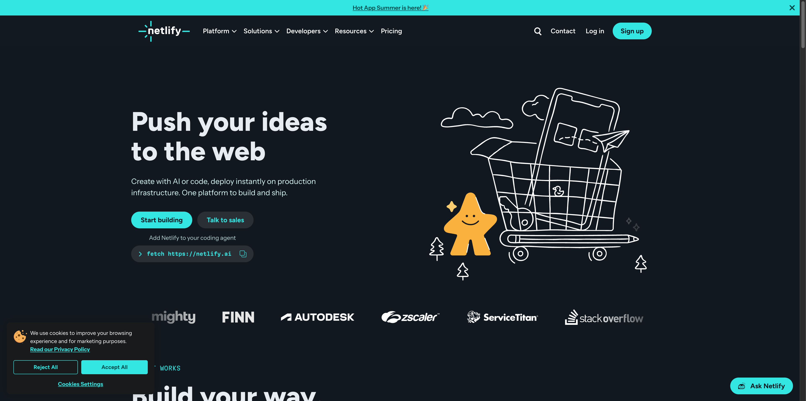
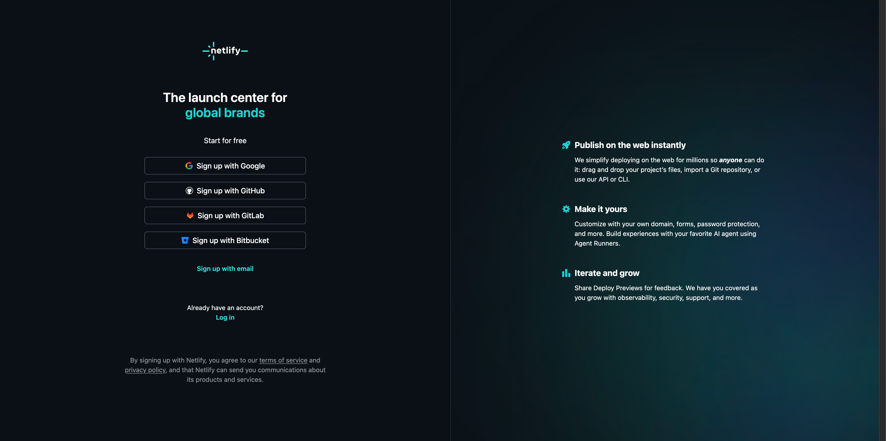
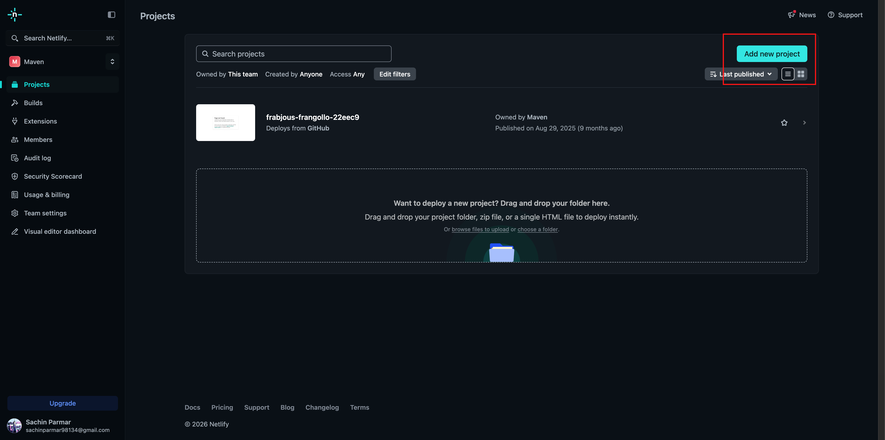
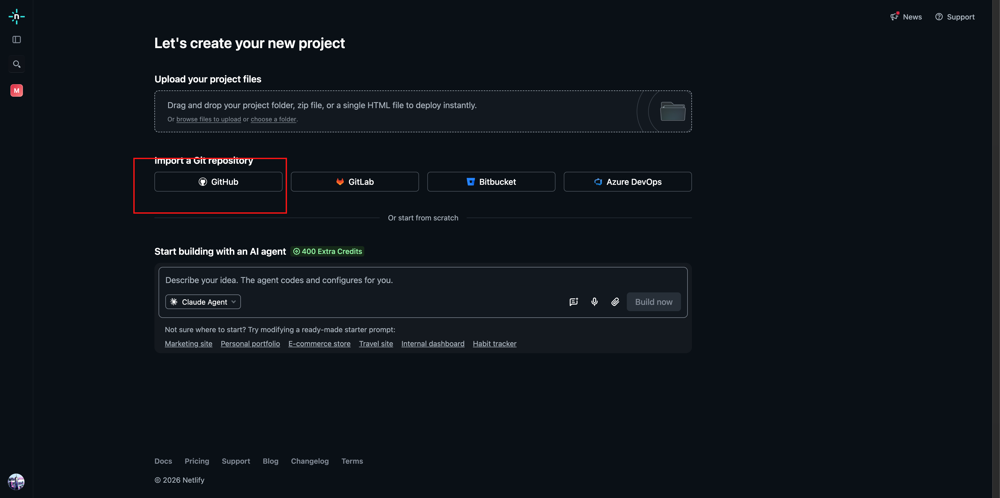
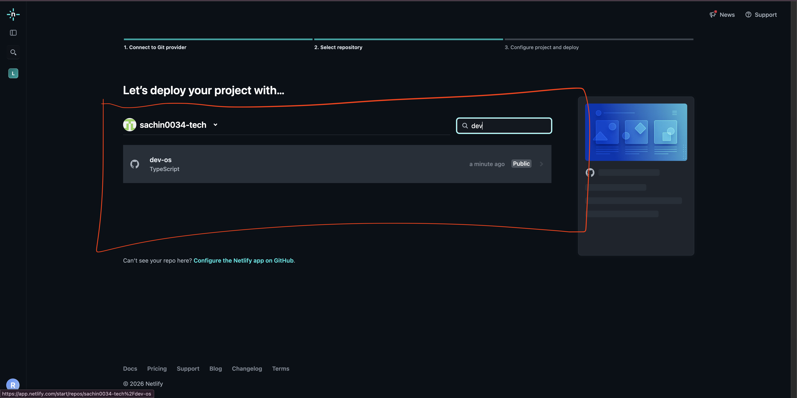
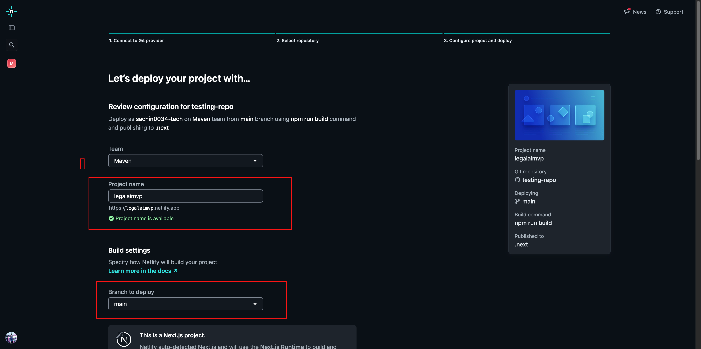
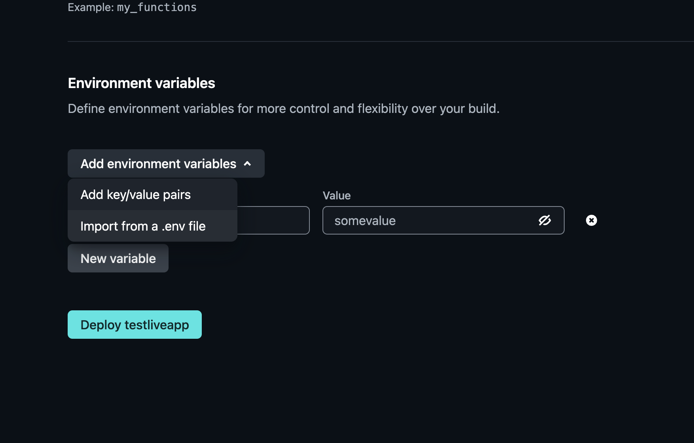
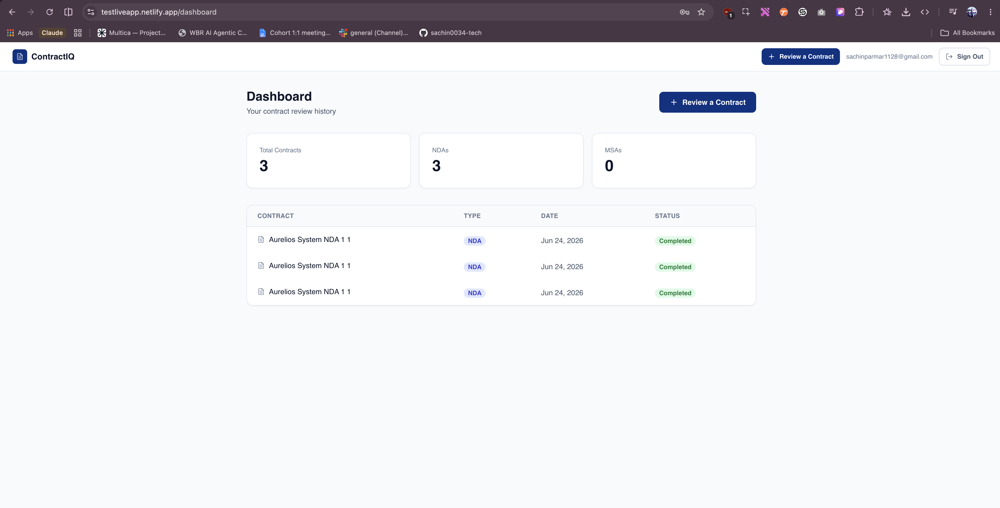
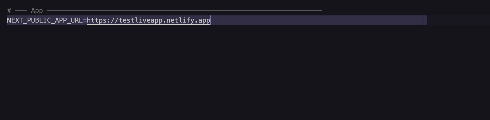
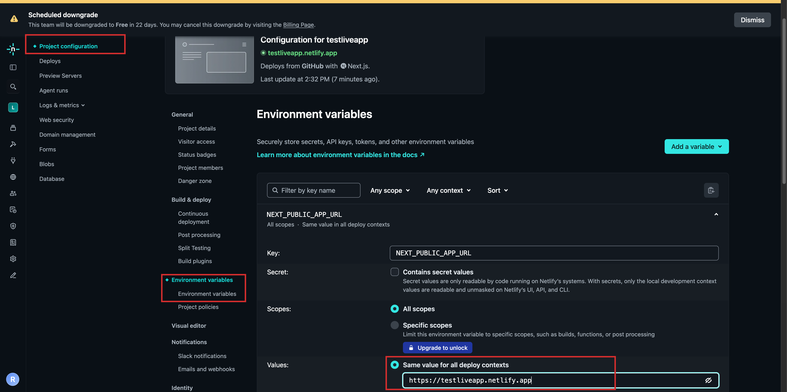

[← Back to Lab 3 Overview](../readme.md)

[← Lesson 1](../01-security-foundation/readme.md) | **Lesson 2**

---

# Lesson 2 — Deployment



---

Think about what you've built.

A user can sign up, upload a contract, get an AI-powered analysis back in seconds, ask follow-up questions in plain English, and return the next day to find their full conversation history exactly where they left it. The security vulnerabilities are patched. The data is protected.

It works perfectly.

On your machine.

The moment you close your laptop, the app disappears. Nobody else can use it. That URL — `http://localhost:3000` — only resolves on your computer. The moment someone else tries to open it, they get nothing.

This lesson changes that. By the end, your app will be live on a public URL, automatically redeploying every time you push new code, with your secrets stored securely outside the repository.

---

## Why Deployment Is a Design Decision

Here's something most tutorials skip.

There are dozens of ways to deploy a Next.js app. You could run it on a virtual machine. You could containerize it with Docker. You could deploy to AWS, GCP, Azure, or a dozen other cloud providers.

For a production application with real traffic and complex infrastructure requirements, those options matter. But you're not there yet. You're at the stage where the most important thing is getting a working, shareable URL as fast as possible — so you can get real feedback on the product.

For that goal, Netlify is the right choice:

| What you need | What Netlify gives you |
|---|---|
| Public URL immediately | Subdomain on `.netlify.app` within minutes |
| No server management | Netlify handles the infrastructure completely |
| Automatic redeploys | Every `git push` triggers a fresh build — no manual steps |
| Secure environment variables | Secrets stored encrypted, never in the repo |
| Free to start | No credit card required for personal projects |

The entire deployment pipeline — push code, Netlify builds, app goes live — becomes a single command:

```bash
git push origin main
```

---

## Where You Are in the Process

```
Idea
↓
Research
↓
PRD  ✓
↓
Engineering Document  ✓
↓
Implementation Specs  ✓
↓
Build  ✓
↓
Memory Layer  ✓
↓
Security Foundation  ✓
↓
Deployment  ← YOU ARE HERE
↓
Iteration
```

---

## Part 1 — Push Your Code to GitHub

Netlify deploys by reading your GitHub repository. Before Netlify can see anything, your code needs to be there.

---

### Step 1 — Check Your `.gitignore`

Before staging anything, confirm that `.env.local` is listed in `.gitignore`. This file contains your secret API keys — it must never reach GitHub.

Run:

```bash
cat .gitignore
```

Look for a line that says `.env.local`. If it's there, continue. If it's missing, add it now:

```bash
echo ".env.local" >> .gitignore
```

This is the last line of defence before your secrets go public. Don't skip it.

---

### Step 2 — Stage Your Changes

Add all new and modified files to the staging area:

```bash
git add .
```

Run `git status` to confirm. Files listed in green are staged and ready to commit. Verify that `.env.local` does **not** appear in the list — if it does, stop and check your `.gitignore`.

---

### Step 3 — Commit Your Changes

Create a snapshot of your project:

```bash
git commit -m "Build full-stack AI contract review app with Supabase and memory layer"
```

You'll see a summary of how many files changed. This snapshot is now saved in your local Git history.

---

### Step 4 — Push to GitHub

Send your committed changes to GitHub:

```bash
git push origin main
```

> If your default branch is called `master` instead of `main`, use `git push origin master`.

When it finishes, open your forked repo on GitHub in the browser — refresh the page and your new files will be there.

---

## Part 2 — Deploy with Netlify

---

### Step 5 — Sign Up and Connect GitHub

1. Open your browser and go to [netlify.com](https://netlify.com)
2. Click **Sign Up**


3. Choose **Sign up with GitHub** — this links Netlify directly to your GitHub account and lets it read your repositories



---

### Step 6 — Add a New Project

Once logged in:

1. Click **Add new project**



2. Click **Deploy with GitHub**



---

### Step 7 — Select Your Repository

Netlify will show a list of your GitHub repositories. Find and click on your forked repo.



---

### Step 8 — Configure the Build

On the project settings screen, fill in:

| Setting | Value |
|---|---|
| **Project name** | A name for your app — this becomes your URL (e.g. `your-app-name.netlify.app`) |
| **Branch to deploy** | `main` |
| **Build command** | `npm run build` |
| **Publish directory** | `.next` |



> **Note:** If your project is inside a subdirectory (e.g. `apps/web` or `contractiq`), set the **Base directory** field to that path before filling in the build command and publish directory.

---

### Step 9 — Add Your Environment Variables

Your deployed app needs the same secrets you have in your local `.env.local` file. Netlify stores these encrypted so they're available at build time and runtime — without ever being committed to your repo.

1. Scroll down to the **Environment variables** section
2. Click **Add environment variables**
3. Click **Import from .env file**
4. Open your local `.env.local` file, copy all of its contents, and paste them in
5. Click **Import**



All your keys — Supabase URL, Supabase API keys, Anthropic API key — will be imported automatically.

> **Important:** The Netlify environment variables panel is private and encrypted. This is the only place your secrets should live outside your local machine.

---

### Step 10 — Deploy

Click **Deploy project**.

Netlify will start building your app. This takes 1–2 minutes. A live build log will scroll as it compiles your Next.js app.

If the build fails, read the error message in the log — it names the exact line or file that caused the failure. See the Troubleshooting section at the end of this lesson for how to fix common build errors.

---

### Step 11 — Open Your Live App

When the build finishes, Netlify will show a green **Published** status and a URL like:

```
https://your-app-name.netlify.app
```

Click it. Your app is now live on the internet.



> From this point on, every `git push origin main` automatically triggers a redeploy. You never need to manually deploy again.

---

### Step 12 — Update `NEXTAUTH_URL` and Redeploy

Now that your app has a live URL, you need to update one environment variable. `NEXTAUTH_URL` tells your authentication library where the app is running — so login redirects land on the right URL, not back on `localhost`.

**Update locally:**

1. Open your `.env.local` file in VS Code
2. Find this line:
   ```
   NEXTAUTH_URL=http://localhost:3000
   ```
3. Replace it with your Netlify URL:
   ```
   NEXTAUTH_URL=https://your-app-name.netlify.app
   ```
4. Save the file



**Update in Netlify:**

1. Go to your Netlify project dashboard
2. Click **Project configuration** → **Environment variables**
3. Find `NEXTAUTH_URL` and click **Edit**
4. Replace the `localhost` value with your Netlify URL
5. Click **Save**



**Push and redeploy:**

```bash
git add .env.local
git commit -m "Update NEXTAUTH_URL to Netlify production URL"
git push origin main
```

Wait 1–2 minutes for Netlify to redeploy. Authentication will now work correctly on the live site.

---

## What You Built

Your application is:

- **Live on the internet** — accessible at a public URL, not just on your local machine
- **Automatically redeploying** — every `git push` to `main` triggers a fresh build with no manual steps
- **Securely configured** — all secrets are stored in Netlify's encrypted environment variable panel, not in your repository
- **Authentication-ready** — `NEXTAUTH_URL` is set to the production URL so login and redirect flows work correctly

---

## Troubleshooting — Let Claude Fix It

If your Netlify deploy fails or something is broken on the live site, open the Claude Code terminal and paste whichever prompt matches your situation.

---

**Build failed — error in the Netlify build log**

```
My Netlify deploy failed with this error: [paste the full error from the build log].
Fix it so the build succeeds.
```

> After Claude applies the fix, push the change to GitHub. Netlify will automatically pick it up and redeploy.

---

**The app deploys but shows a blank page or crashes on load**

```
My app deploys successfully on Netlify but when I open the URL I see a blank page
or crash. The browser console shows: [paste the error]. The app works fine locally.
Diagnose what is different about the production environment and fix it.
```

---

**Authentication redirects are going to localhost after login**

```
After logging in on the live Netlify site, the app redirects to localhost:3000
instead of the production URL. I need NEXTAUTH_URL to point to
https://my-app.netlify.app. Check .env.local and confirm the variable is set
correctly, then tell me exactly where to update it in Netlify.
```

---

**Environment variables are not being picked up in production**

```
The deployed app is throwing an error that suggests an environment variable is
missing or undefined. The variable exists in my local .env.local file but the
Netlify build cannot see it. The error is: [paste the error]. Check which variable
is missing and tell me exactly where to add it in the Netlify dashboard.
```

---

**A feature works locally but breaks on the live site**

```
This feature works perfectly locally but is broken on the live Netlify site:
[describe the feature]. The error shown in the browser console is: [paste the error].
Diagnose what is different between the local and production environments and fix it.
```

---

## You Shipped It

Take a moment to think about what just happened.

You started this course with a problem — a founder spending 90 minutes reading a 30-page contract she didn't fully understand. You turned that problem into a product: an AI-powered contract review tool with real authentication, a live database, persistent conversation memory, security hardened for production, and now a public URL anyone can open.

You did it in three labs, using Claude Code to plan, build, secure, and ship — the same workflow professional product teams use, compressed from weeks into hours.

The app is live.

**[Lab 1: Planning](../../01-Planning-and-Architecture-Lab/readme.md) → [Lab 2: Building](../../02-Building-the-Application-Lab/readme.md) → [Lab 3: Security & Deployment](../readme.md)**

---

## Claude Concepts Covered in This Lesson

| Concept | Where it appeared | Learn more |
|---------|-------------------|------------|
| **Claude Code for production debugging** | **Troubleshooting — Let Claude Fix It** — "If your Netlify deploy fails or something is broken on the live site, open the Claude Code terminal and paste whichever prompt matches your situation." | [Claude Code →](https://docs.anthropic.com/en/docs/claude-code) |
| **Descriptive prompting for accurate diagnosis** | **Troubleshooting — Let Claude Fix It** — "Diagnose what is different about the production environment and fix it." / "Check which variable is missing and tell me exactly where to add it in the Netlify dashboard." | [Prompt engineering →](https://docs.anthropic.com/en/docs/build-with-claude/prompt-engineering/overview) |

---

[← Back to Lab 3 Overview](../readme.md)

[← Lesson 1](../01-security-foundation/readme.md) | **Lesson 2**