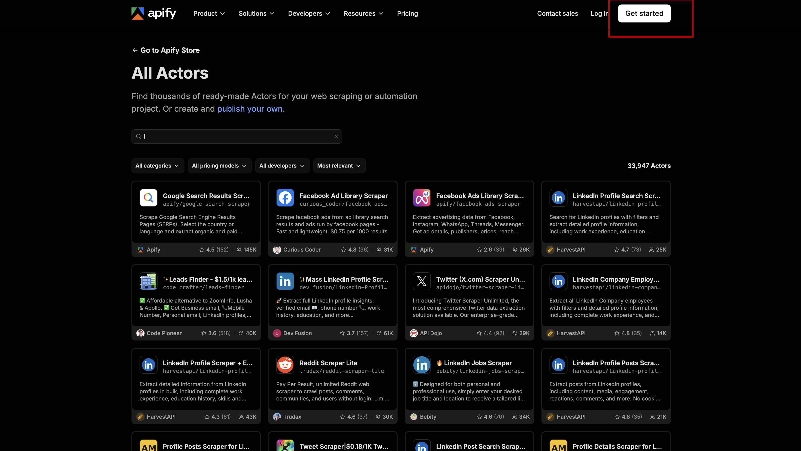
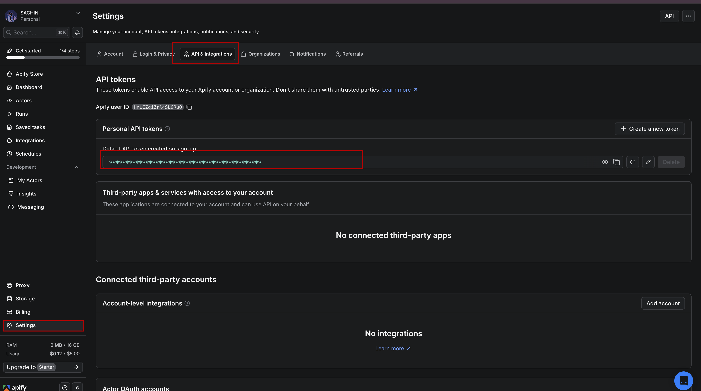
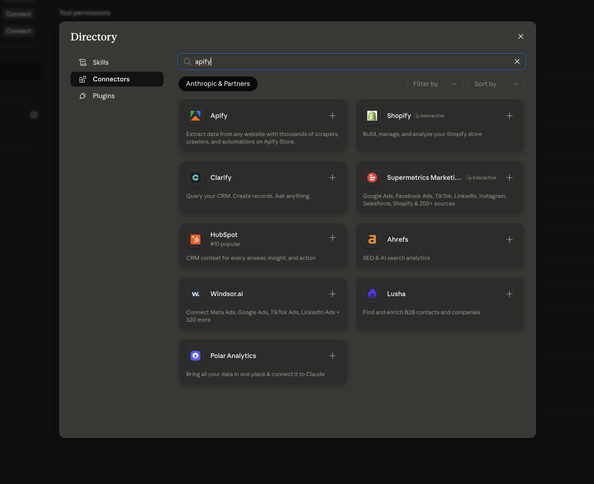

# Setting Up Apify

---

So we have Snowflake ready — a nice, organized space in the cloud waiting for data to arrive. But here's the thing: it's completely empty right now.

You might be wondering, "Okay, so where does the data actually come from?"

Great question. We're going to be working with real data from the web — things like LinkedIn profiles, YouTube channels, job listings, company names. All of that information already exists publicly online. The challenge is getting it into our application in a clean, usable format.

We could try to build our own scraper. But honestly, that's a rabbit hole — websites change their layouts constantly, scrapers break, and maintaining one is a part-time job on its own. There has to be a better way.

That's where Apify comes in.

Apify is a platform that already has hundreds of pre-built scrapers — they call them **Actors** — for all kinds of websites. LinkedIn, YouTube, Google, Amazon, Reddit — there's likely an Actor for it. You just pick the one you need, point it at a URL or a search query, and it hands you back clean, structured data. No building, no maintenance, no headaches.

Think of it like a vending machine for web data. You put in what you want, and it gives you the data.

Let's get your Apify account set up and connected to Claude so we can start using it.

---

## Step 1: Create Your Apify Account

Head over to the Apify store:

[https://apify.com/store](https://apify.com/store)


Click **"Get Started"**.



You can sign in with Google — that's the quickest option. Once you're in, you'll land on your Apify dashboard.


---

## Step 2: Copy Your API Token

Here's the thing — when Claude wants to fetch data from Apify, it needs a way to prove it's authorized to use your account. That's what the API token is for. It's basically a secret password that says "yes, Claude is allowed to act on my behalf."

Let's grab it.

1. Click your **profile icon** in the top-right corner
2. Go to **Settings**
3. Click on **API & Integrations**
4. Under **Personal API tokens**, copy the token that's already there

> Keep this token private. Anyone who has it can access your Apify account.



---

## Step 3: Install the Apify Connector in Claude

Now we're going to tell Claude that Apify exists and give it permission to use it.

1. Open the **Claude desktop app**
2. Click **Customize** in the top-right
3. Go to **Connectors** → **Browse Connectors**


4. Search for **Apify**
5. Click **Install**



---

## Step 4: Paste Your API Token

After you click Install, Claude will ask for your API token. This is how it authenticates with Apify.

1. Paste the token you copied in Step 2
2. Click **Connect**


---

## Step 5: Confirm It's Working

Once connected, you should see Apify show up in your connectors list with a green **Enabled** status. That means Claude can now trigger scraping jobs on your behalf.


---

## Step 6: Test It With a Real Prompt

Now for the fun part. Let's actually see if it works.

Open a new chat in Claude and paste this prompt exactly as it is:

```
Use Apify to search for LinkedIn profiles of AI engineers in San Francisco. Return the first 3 results with their name, job title, and company.
```

If everything is connected correctly, you'll see Claude reach out to Apify, run the search, and bring back real results right inside the chat. It might take 20–30 seconds — that's normal, it's actually going out and fetching live data.


Don't worry if the results look a little rough or have some missing fields. That's just how web data comes back sometimes. The important thing is that Claude is fetching real information from the web — which means the connection is working perfectly.

---

You've just given Claude the ability to go out and collect real data from the web. That's a big deal.

But right now, Claude is fetching that data and... what happens to it? Where does it go? It just disappears after the conversation ends — which isn't very useful.

In the next lesson, we're going to solve that using Composio — a tool that connects Claude directly to your Snowflake account. Once that's in place, every time Claude fetches data, it'll know exactly where to store it.

---

[Lab 02 — Connecting Everything with Composio →](../02-setup-composio/readme.md)