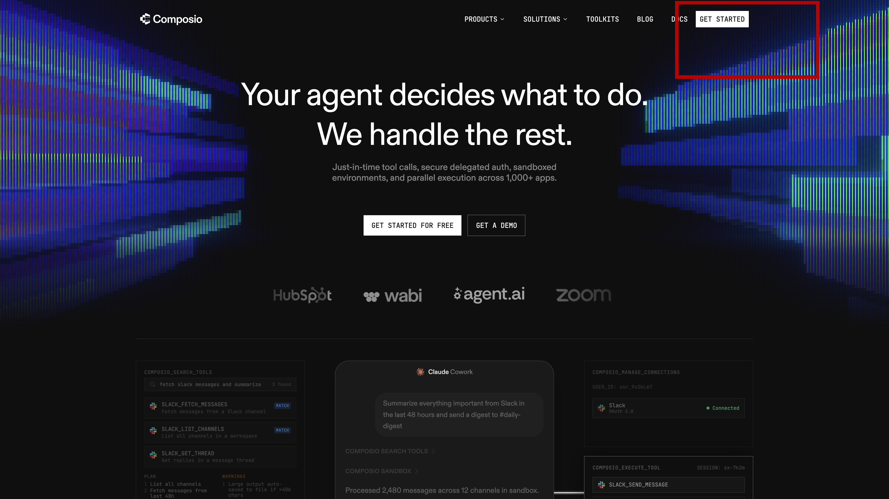
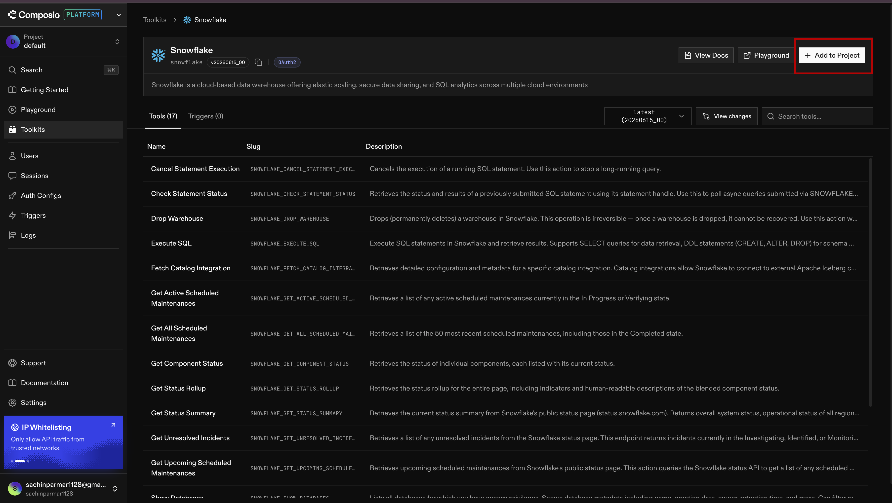
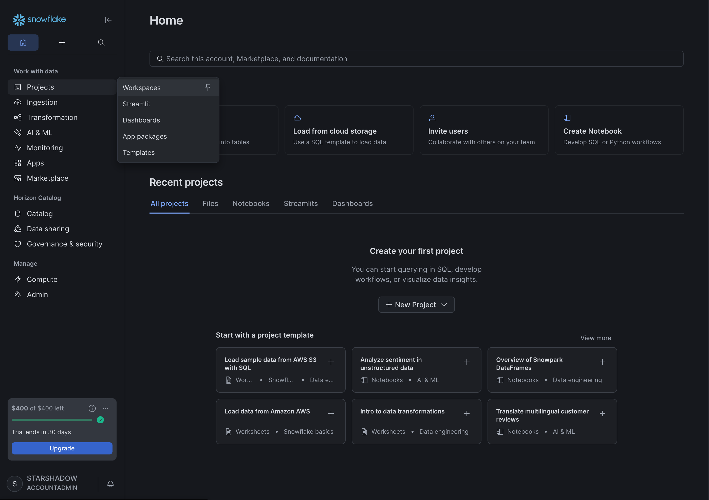
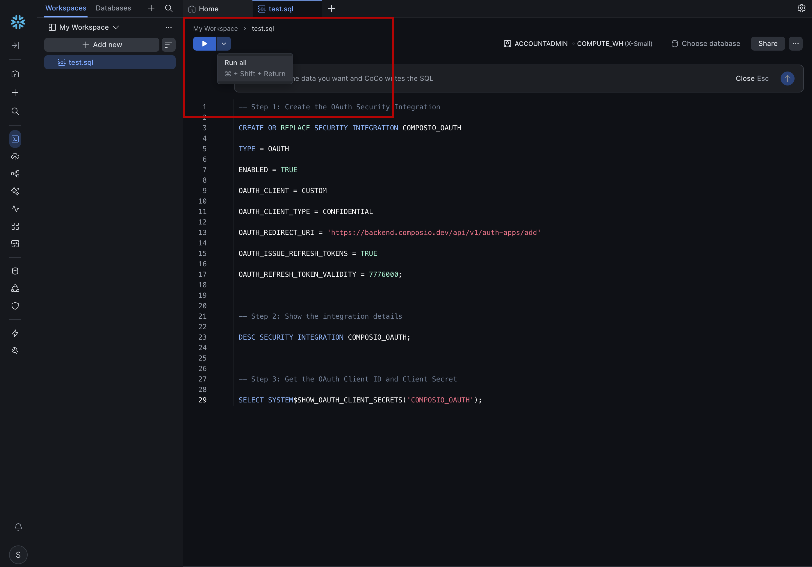
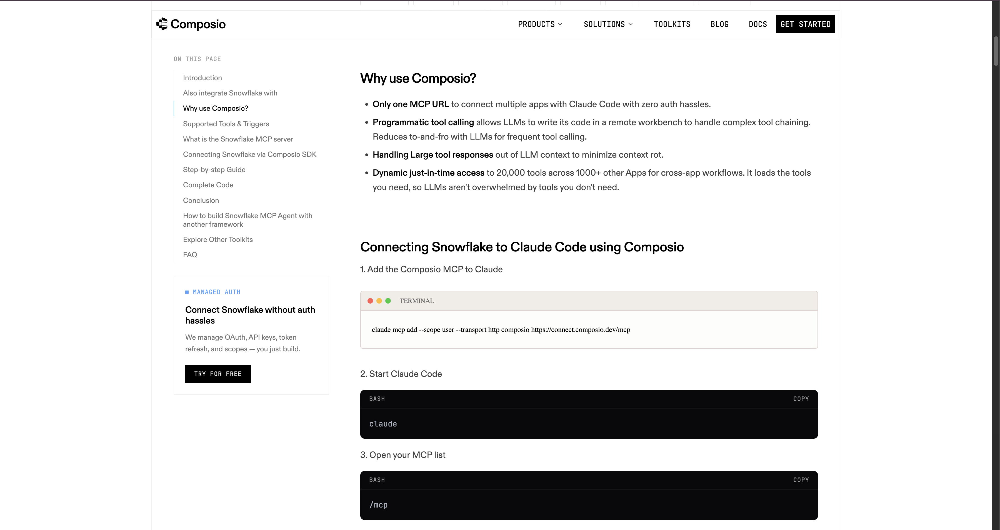
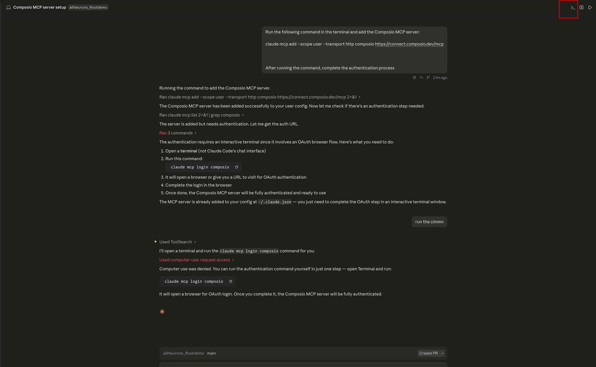
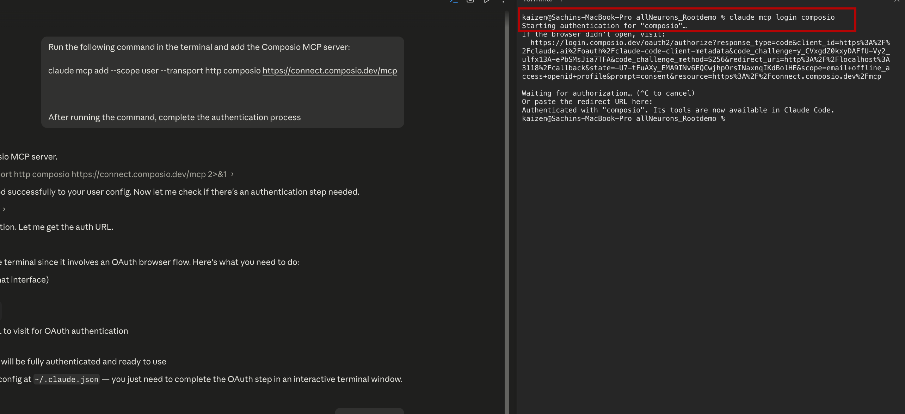

# Connecting Claude to Snowflake with Composio

---

Alright, so at this point we have two things set up:

- **Snowflake** — our storage space in the cloud, ready to hold data
- **Apify** — our way of fetching real data from the web

But here's the problem. Claude and Snowflake don't know each other yet. Right now, if you ask Claude to save something into Snowflake, it has no idea how to do that. They're two separate tools sitting in completely different places, and nothing is connecting them.

So how do we fix that?

That's where Composio comes in.

Think of Composio like a universal adapter — the kind you use when you're traveling and your plug doesn't fit the socket. Claude speaks one language, Snowflake speaks another, and Composio sits in the middle and makes them talk to each other. Once this is set up, Claude can read from Snowflake, write to it, and query it — all on its own, without you having to do anything manually.

Let's get this connected. There are a few steps here, but don't worry — we'll go through each one together.

---

## Step 1: Create a Composio Account

Composio is the platform that manages all our tool connections in one place. Instead of writing custom code every time we want Claude to talk to a new service, Composio handles that for us. Think of it as the control panel where you decide which tools Claude is allowed to use.

Head over to Composio and create a free account:

[https://composio.dev](https://composio.dev)

Click **Get Started** → **Sign In**. You can use Google or GitHub — whichever is easier.



Once you're in, you'll land on the Composio dashboard. This is where all your connected tools will live.


---

## Step 2: Add Snowflake as a Toolkit

In Composio, each tool you connect is called a **Toolkit**. A toolkit is basically a package that tells Composio "here's what this tool can do, and here's how to talk to it." When we add Snowflake as a toolkit, we're telling Composio that we want Claude to be able to interact with our Snowflake account.

1. In the left sidebar, click on **Toolkit**
2. Search for **Snowflake**


3. Click on it, then click **Add to Project**
4. A setup window will appear — click **Next**



Now here's the interesting part. Composio needs permission to access your Snowflake account — and it can't just walk in without an invitation. Snowflake uses something called **OAuth** to handle this. OAuth is a standard way for one application to get permission to access another, without you having to share your password. Think of it like a valet key — it lets Composio do specific things in Snowflake, but only what you've authorized.

Setting that up is what the next few steps are about.


---

## Step 3: Copy the Composio Redirect URL

When OAuth is happening between two systems, there's always a moment where Snowflake needs to send Composio a confirmation — like a callback saying "yes, this is approved." The **Redirect URL** is the address Snowflake will send that confirmation to.

Before we leave this window, copy the Redirect URL. It'll look something like this:

```
https://backend.composio.dev/api/v1/auth-apps/add
```

Keep it somewhere handy — you'll paste it into Snowflake in the next step.


---

## Step 4: Set Up the Connection Inside Snowflake

Now we need to go back into Snowflake and run a few lines of SQL. Don't worry — you don't need to understand SQL to do this. We're just running a script that registers Composio as a trusted application inside Snowflake. Think of it as adding Composio to Snowflake's guest list.

1. Log in to your **Snowflake account**
2. Go to **Projects** → **Workspace**



3. Click **+ Add** → **SQL** to create a new SQL file


4. Name it something like `composio-oauth-setup.sql`
5. Paste the SQL below into the file

### Note: Replace the `OAUTH_REDIRECT_URI` value with the Redirect URL you copied from Composio in Step 3.

```sql
-- Register Composio as a trusted OAuth app in Snowflake
CREATE OR REPLACE SECURITY INTEGRATION COMPOSIO_OAUTH
  TYPE = OAUTH
  ENABLED = TRUE
  OAUTH_CLIENT = CUSTOM
  OAUTH_CLIENT_TYPE = CONFIDENTIAL
  OAUTH_REDIRECT_URI = 'https://backend.composio.dev/api/v1/auth-apps/add'
  OAUTH_ISSUE_REFRESH_TOKENS = TRUE
  OAUTH_REFRESH_TOKEN_VALIDITY = 7776000;

-- Confirm it was created
DESC SECURITY INTEGRATION COMPOSIO_OAUTH;

-- Get the credentials we need
SELECT SYSTEM$SHOW_OAUTH_CLIENT_SECRETS('COMPOSIO_OAUTH');
```

What is this script actually doing? The first block creates the integration — it's telling Snowflake "Composio is a trusted app, and here's where to send confirmations." The second block just checks that it was created successfully. The third block generates the secret credentials that Composio will need to prove its identity going forward.

6. Click **Run All** to execute all three statements



---

## Step 5: Copy Your Credentials

After running that SQL, you'll see output appear at the bottom of the screen. The last statement returns a result that contains two important values:

- `OAUTH_CLIENT_ID` — this is like a username for Composio
- `OAUTH_CLIENT_SECRET` — this is like the password that goes with it

Together, these two values are how Snowflake will recognize Composio every time it tries to connect. Copy both of them.


---

## Step 6: Paste the Credentials into Composio

Now go back to the Composio window we left open in Step 2.

Paste the **Client ID** and **Client Secret** into their respective fields and complete the connection. Composio will use these to verify itself with Snowflake and confirm that the connection is active. From this point on, Composio has authorized access to your Snowflake account.

---

## Step 7: Generate Your MCP URL

Now we need to bring Claude into the picture.

Claude communicates with external tools using something called **MCP — Model Context Protocol**. It's essentially a standard language that Claude uses to say "I want to use this tool, here's what I need." Every tool that Claude connects to gets its own MCP URL — a unique address that Claude uses to reach it.

We need to generate that URL for our Snowflake + Composio setup.

Go to this page:

[https://composio.dev/toolkits/snowflake/framework/claude-code](https://composio.dev/toolkits/snowflake/framework/claude-code)

Click **Generate MCP URL** and copy the URL that appears.



---

## Step 8: Tell Claude About Composio

Now open the **Claude app** and start a new chat. We're going to give Claude the MCP URL so it knows where Composio lives. Paste this prompt and swap in the URL you just copied:

```
Run the following command in the terminal and add the Composio MCP server:

<paste your MCP URL here>

After running the command, complete the authentication process.
```

Claude will run the command and register Composio as a connected tool. Once it does, Claude will know how to reach Composio — and through it, your Snowflake account.

---

## Step 9: Authenticate the Connection

The last step is giving Claude permission to actually use the connection. Once the command runs, Claude will open a browser window asking you to authorize it. Just follow the prompts and approve it.



That's it. Claude now has a live, authorized connection to your Snowflake account.



---

You've just connected three things together — Claude, Composio, and Snowflake. That might not sound like much, but this is actually the backbone of everything we're about to build. Claude can now fetch data from the web using Apify, and store it directly into Snowflake — automatically, every time.

In the next lesson, we're going to put all of that to work and build our first real data pipeline.

---

[Lab 03 — Building the Data Pipeline →](../03-data-ingestion-pipeline/readme.md)
