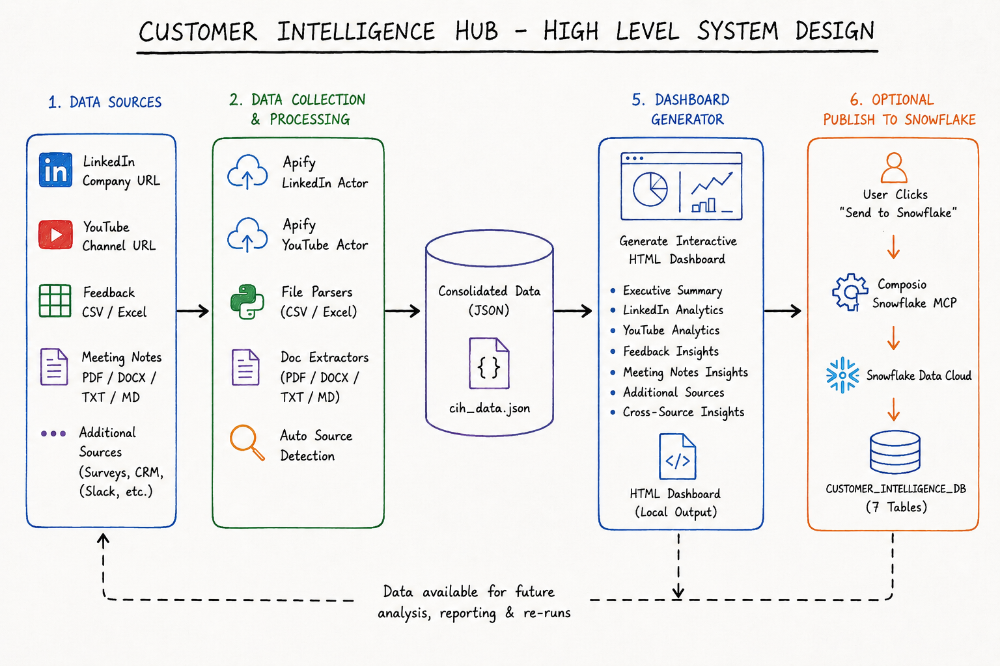
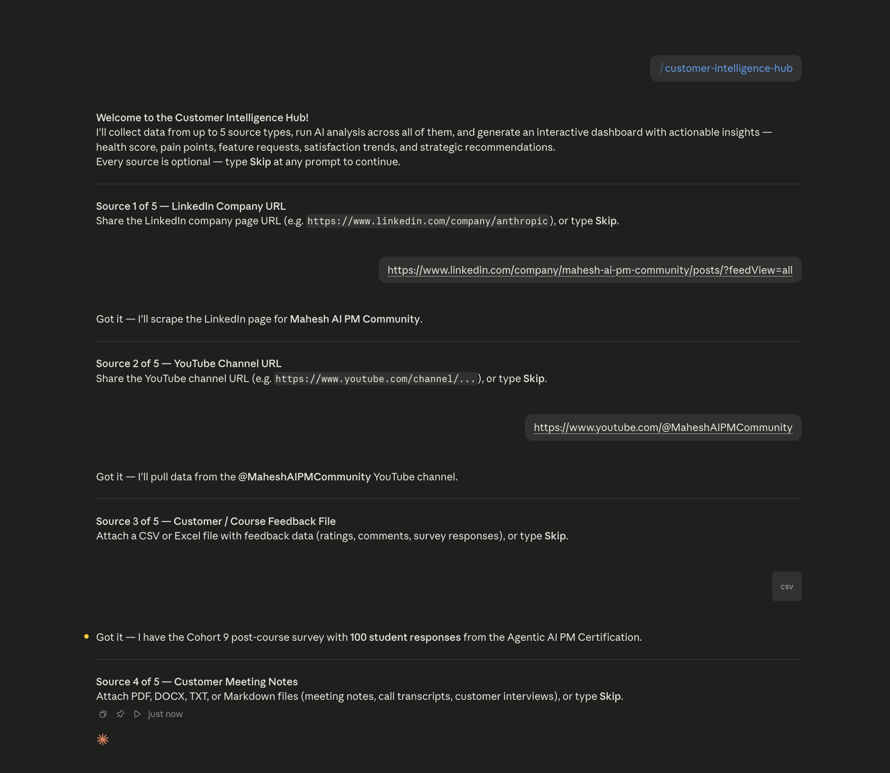
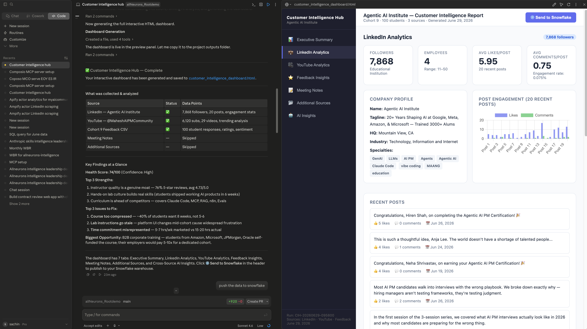
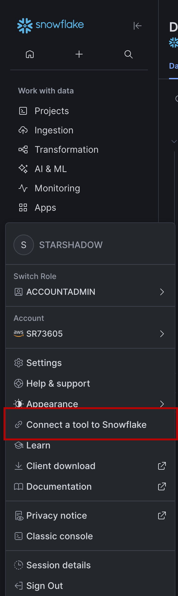
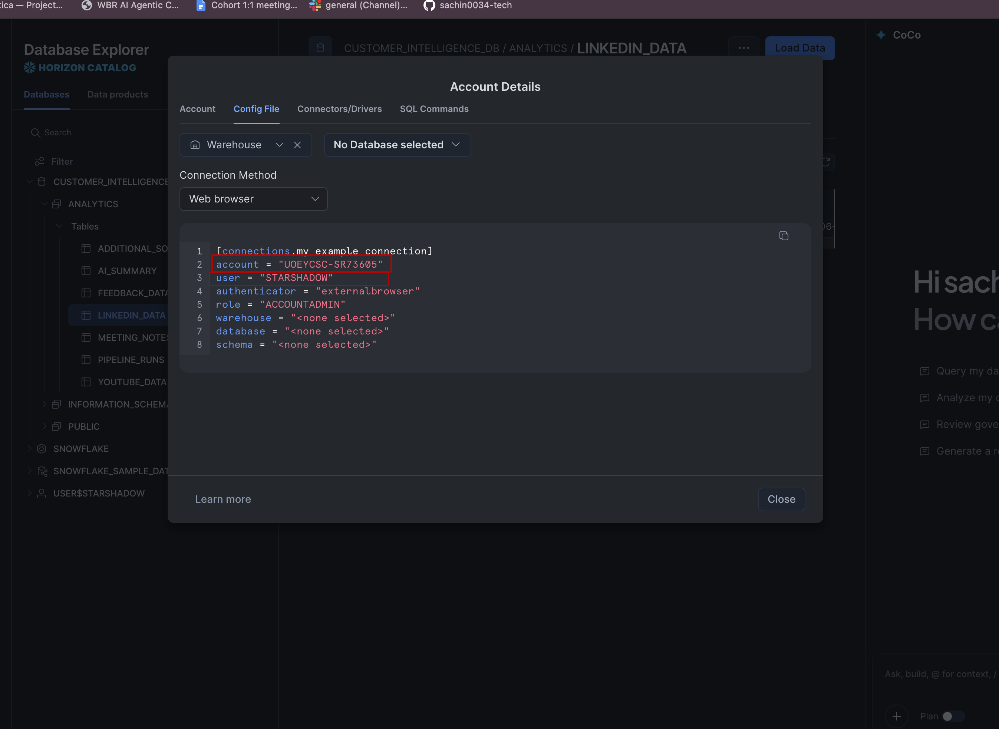
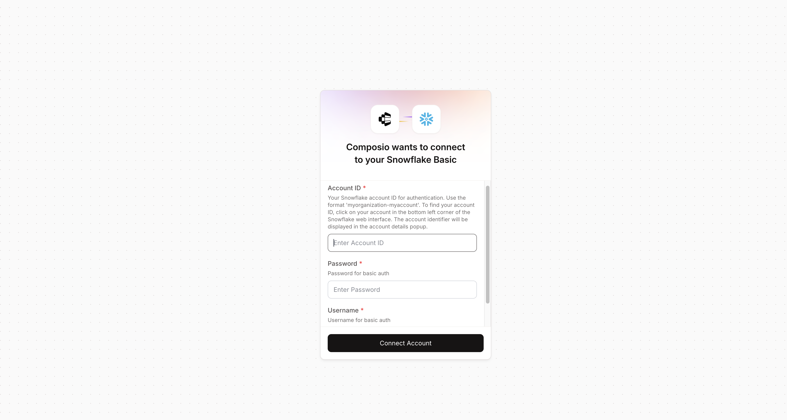
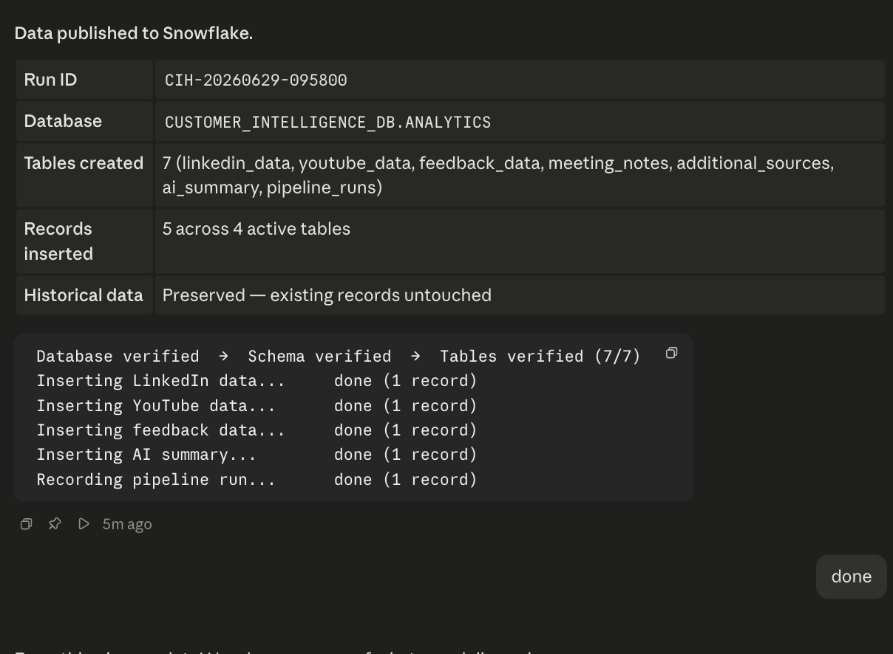
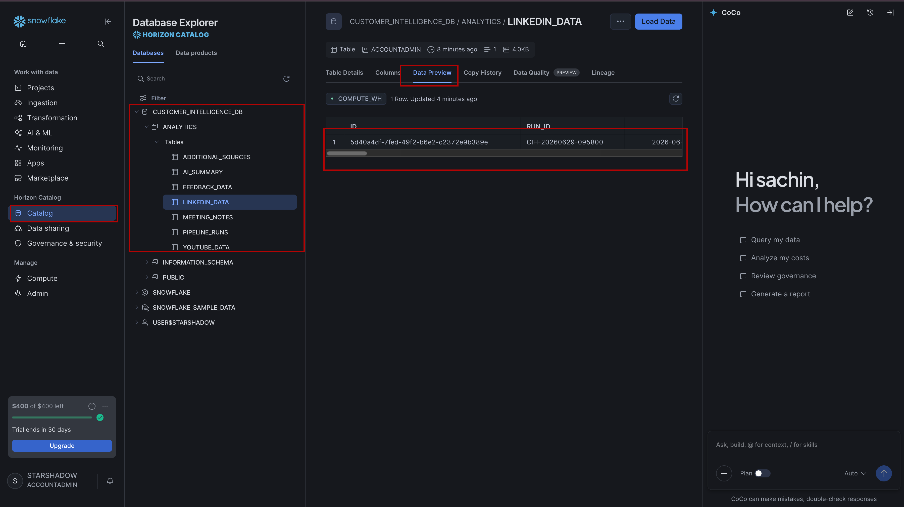

# Running the Data Ingestion Pipeline



---

Let's take a step back and look at what we've built so far.

You set up Snowflake as your data storage space, connected Apify so Claude can fetch real data from the web, and linked everything together through Composio so Claude and Snowflake can talk to each other.

That's a lot of pieces. And right now they're all just sitting there, waiting to be connected into something useful.

In this lesson, we're going to do exactly that. By the end, you'll run one command and watch Claude collect data, analyze it, generate a visual report, and save everything to your database — automatically.

Let's go.

---

## Before You Start

Make sure you've completed the previous lessons:

- [Lab 00 — Snowflake setup](../00-setup-snowflake/Readme.md)
- [Lab 01 — Apify setup](../01-setup-apify/readme.md)
- [Lab 02 — Composio setup](../02-setup-composio/readme.md)

You'll also need the Skill file and instructions for adding it to Claude:

- [Download the Skill file →](https://pragyaallc-my.sharepoint.com/:u:/g/personal/sachin_parmar_legalgraph_ai/IQBDcdh8Vfx4TKiGFk_GjPtPAV7sruWexnM8tBsjQBx0OPI?e=A8WT5p)
- [How to add a Skill to Claude →](https://github.com/sachin0034-tech/MLAI-community-labs/tree/main/Cohort-Labs/Cohort%209/week%200%20%20-%20foundation/how-to-add-skills-to-claude)

---

## Step 1: Confirm the Skill is Installed

Once you've added the Skill file, open the Claude desktop app, start a new chat, and type `/` — just the forward slash. You should see **customer-intelligence-hub** appear in the suggestions.

If you see it, you're ready. If you don't, go back and check the installation steps in the guide above.

---

**Here's the interesting part — what is a Skill, exactly?**

A Skill is a file that contains a complete set of instructions for Claude. Think of it like handing someone a very detailed job description — they read it once and they know exactly what to do, in what order, and what the output should look like. Once a Skill is installed, it becomes a **slash command** you can trigger anytime just by typing `/skill-name`.

The Skill we just installed is called `/customer-intelligence-hub`. When you run it, Claude knows: collect data from these sources, analyze it this way, generate this kind of report, and store the results in Snowflake. All of that logic lives inside the Skill file — you don't have to explain anything.

> **Learn more:** [Claude Skills Documentation →](https://code.claude.com/docs/en/skills)

---

## Step 2: Run the Pipeline

In a Claude conversation, type:

```
/customer-intelligence-hub
```

Claude will greet you and walk you through providing your data sources one at a time:

| Source | What to provide |
|--------|----------------|
| LinkedIn Company URL | e.g. `https://www.linkedin.com/company/anthropic` |
| YouTube Channel URL | e.g. `https://www.youtube.com/@anthropic-ai` |
| Customer Feedback | Upload a CSV or Excel file |
| Meeting Notes | Upload a PDF, DOCX, TXT, or MD file |
| Additional Sources | Any other files or URLs you have |

Don't have all five? No problem — type **Skip** at any prompt and Claude moves on without it.



---

**You might be wondering — what is Claude actually doing while this runs?**

Behind the scenes, the Skill breaks the work into six phases that run one after another automatically:

| Phase | What's happening |
|-------|-----------------|
| **1 — Source Collection** | Claude collects each source you provide |
| **2 — Data Collection** | Claude uses Apify to scrape LinkedIn and YouTube, and reads your uploaded files |
| **3 — Consolidation** | All collected data is merged into one structured file |
| **4 — AI Analysis** | Claude analyzes everything and generates 11 insight sections |
| **5 — HTML Dashboard** | Claude builds an interactive report you can open in your browser |
| **6 — Snowflake Publishing** | Claude pushes everything into your Snowflake database |

This is what's called **multi-phase orchestration** — Claude breaks a complex job into ordered steps and handles each one without you having to trigger them manually. It's the same idea as an assembly line: one step feeds directly into the next.

Notice Phase 2 specifically — Claude is reaching out to Apify in real time to fetch live data. This is your **Connector** at work. When you installed Apify in Lab 01, you gave Claude a key to that room. Now it's using it.

> **Learn more:** [Connectors & Integrations →](https://code.claude.com/docs/en/platforms) | [Common Workflows →](https://code.claude.com/docs/en/common-workflows)

---

## Step 3: Explore Your Dashboard

When the pipeline finishes, Claude will tell you where it saved your dashboard:

```
Dashboard saved to: /tmp/customer_intelligence_dashboard.html
```

Open that file in your browser. You'll see a fully interactive report with seven tabs:

- **Executive Summary** — health score and key metrics at a glance
- **LinkedIn Analytics** — follower count, post engagement
- **YouTube Analytics** — subscribers, top videos, engagement rate
- **Feedback Insights** — sentiment, ratings, recurring themes
- **Meeting Notes** — pain points, feature requests, action items, risks
- **Additional Sources** — insights from any extra files you provided
- **Cross-source Insights** — patterns that only appear when you look across all sources together

That last tab is the most valuable one. It surfaces connections no single source could show you alone.



---

**Here's the interesting part — Claude just created a real file.**

That HTML dashboard isn't just text in the chat. It's an actual file sitting on your computer that you can open in any browser, share with a colleague, or save for later. In Claude, files like this are called **Artifacts** — real, usable outputs that Claude generates as part of its work.

Artifacts can be HTML pages, JSON data files, CSVs, markdown documents, or anything else Claude produces and saves. The dashboard you just opened is one example. The data file it saves to Snowflake in the next step is another.

> **Learn more:** [Output Styles & Artifacts →](https://code.claude.com/docs/en/output-styles)

---

## Step 4: Save the Data to Snowflake

Your dashboard is great for right now — but it only lives in a temporary file. If you want this data to be searchable, comparable across future runs, or queryable later, you need to push it to Snowflake.

Tell Claude:

> "Push the data to Snowflake."

If Claude asks you to authenticate first, click the URL it provides, then in your Snowflake account go to **Profile → Connect a Tool → Config File** and fill in:



- **account** — your Snowflake account ID
- **user** — your Snowflake username



- **password** — the password you set when you created your account



Claude will create the database and tables automatically if they don't exist, then insert your data. You'll see a confirmation like this:

```
Data published to Snowflake.
Run ID: CIH-20260629-143201
Database: CUSTOMER_INTELLIGENCE_DB.ANALYTICS
Total records inserted: 6 across 7 tables
Historical data preserved — existing records untouched.
```

Every run is saved separately — nothing gets overwritten.



---

**This is your MCP connection doing its job.**

When Claude says "data published to Snowflake," it's not copying and pasting anything manually. It's using the live connection we set up through Composio — the MCP server from Lab 02.

MCP stands for **Model Context Protocol**. It's the standard that lets Claude reach outside the chat window and interact with real external tools — reading from them, writing to them, triggering actions. Without MCP, Claude could only work with whatever you paste into the conversation. With it, Claude can push data directly into your Snowflake database, post a message to Slack, or read files from Google Drive.

Composio is the MCP server sitting in the middle — it's the bridge that makes the Claude ↔ Snowflake connection possible.

> **Learn more:** [MCP Integration Documentation →](https://code.claude.com/docs/en/mcp)

---

### Verify the Data Made It

1. Go to **Catalog → Data Explorer** in Snowflake
2. Open **CUSTOMER_INTELLIGENCE_DB → ANALYTICS**
3. Click any table → **Data Preview**

You should see your records there.



---

## What You Can Do With This Data Now

Now that your data lives in Snowflake, Claude can query it anytime. Here are a few things you can ask:

**Weekly Business Review**
```
Using our Snowflake data, generate a Weekly Business Review summary
for last week's customer intelligence run. Highlight any change in
health score and the top 3 pain points.
```

**Executive Presentation**
```
From our Snowflake analytics, create an executive presentation outline
covering customer health, key risks, and recommended actions.
```

**Feature Prioritization**
```
Query the Snowflake feature requests data across all pipeline runs
and rank the top 10 most requested features by how often they appear.
```

---

## Claude Concepts Covered in This Lesson

| Concept | Where we covered it | Learn more |
|---------|-----------------|------------|
| **Skills** | **Step 1** — when you typed `/` and saw `customer-intelligence-hub` appear. We explained: *"A Skill is a file that contains a complete set of instructions for Claude — like handing someone a detailed job description."* | [Skills →](https://code.claude.com/docs/en/skills) |
| **Slash Commands** | **Step 1** — the `/customer-intelligence-hub` command itself. We explained: *"Once a Skill is installed, it becomes a slash command you can trigger anytime just by typing `/skill-name`."* | [Commands →](https://code.claude.com/docs/en/commands) |
| **Connectors** | **Step 2** — when the pipeline hit Phase 2 and Claude reached out to Apify. We explained: *"When you installed Apify in Lab 01, you gave Claude a key to that room. Now it's using it."* | [Platforms →](https://code.claude.com/docs/en/platforms) |
| **Multi-phase Orchestration** | **Step 2** — the 6-phase table showing how each step feeds into the next. We explained: *"Claude breaks a complex job into ordered steps and handles each one without you having to trigger them manually."* | [Common Workflows →](https://code.claude.com/docs/en/common-workflows) |
| **Artifacts** | **Step 3** — when Claude saved the dashboard as a real `.html` file. We explained: *"That HTML dashboard isn't just text in the chat. It's an actual file sitting on your computer that you can open, share, or save."* | [Output Styles →](https://code.claude.com/docs/en/output-styles) |
| **MCP (Model Context Protocol)** | **Step 4** — when Claude pushed data directly into Snowflake. We explained: *"MCP is the standard that lets Claude reach outside the chat window and interact with real external tools — reading from them, writing to them, triggering actions."* | [MCP →](https://code.claude.com/docs/en/mcp) |
| **Headless / Programmatic Use** | **Step 2** — when Claude ran all 6 phases automatically in the background. We explained: *"Claude breaks a complex job into ordered steps and handles each one without you having to trigger them manually."* | [Headless →](https://code.claude.com/docs/en/headless) |

---

You just ran a fully automated data pipeline. One command — and Claude handled the rest.

That's what all three previous lessons were building toward. Everything is now connected and working together as one system.

---

[Back to the course index →](../README.md)
