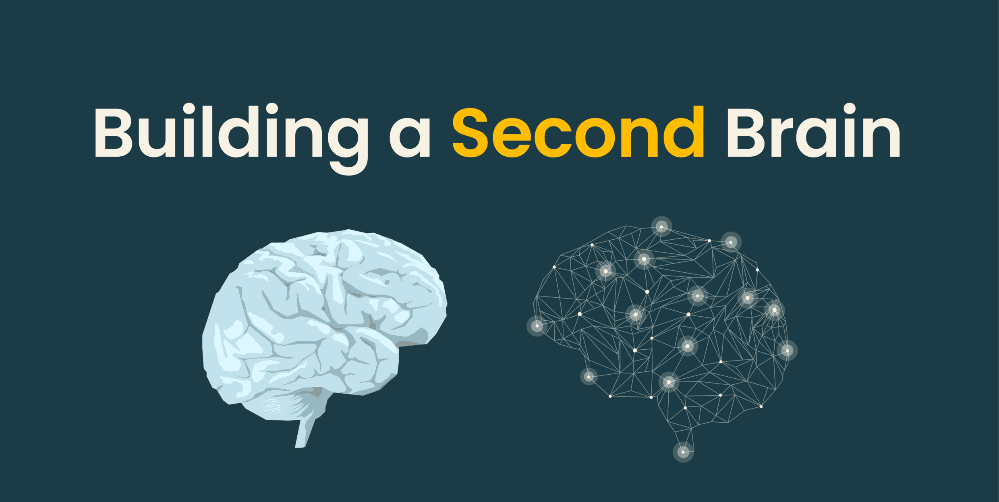

# Setting Up Your Second Brain Folder Structure



---

Before we build anything, let's talk about where everything is going to live.

Think about the last time you started a new project. You probably had files scattered across your Desktop, a Downloads folder full of random things, maybe a few docs in Google Drive, and some notes somewhere you can't remember. By week two, half your time was spent finding things instead of building things.

Now imagine working alongside Claude every day on a growing data lake project. Claude can only help you as well as your workspace allows. If your files have no structure, Claude has no structure to work with.

This is why we set up a **Second Brain** before doing anything.

---

## Today's Concept: The Second Brain

The folder we're creating is called `second-brain`.

It's not just a catchy name. The idea comes from the personal knowledge management world — a "second brain" is a trusted external system where you store everything you're working on, so your actual brain doesn't have to hold it all.

For us, it means one folder that contains:

- A place for raw channel data as it comes in — immutable, never modified
- A place for structured company and project documents you write and maintain
- A place for Claude skill files that power your pipeline
- A place for completed work worth keeping

---

## Step 1: Download the Template

Download the Second Brain folder structure used in this course:

> **[Download Second Brain Template](#)** ← add your link here

This gives you the exact folder layout with example files already in place. You don't need to create anything from scratch.

---

## Step 2: Replace the Company Folders With Your Own

Open the downloaded folder and go into `projects/`.

You'll see three example companies already set up:

```
second-brain/projects/
  ├── allneurons/
  │   ├── company-overview.md
  │   ├── product.md
  │   └── user-persona.md
  ├── legalgraph/
  │   ├── company-overview.md
  │   ├── product.md
  │   └── user-persona.md
  └── maven/
      ├── course-bootcamp.md
      └── course-genaipm.md
```

**Delete these folders and replace them with the companies or projects you're actually tracking.**

For each company, create a folder with its name and add the documents that make sense for it. You don't have to follow the exact file names — use whatever fits:

```
second-brain/projects/
  └── your-company/
      ├── company-overview.md    ← what they do, their positioning, team size
      ├── product.md             ← what they're building, pricing, features
      └── user-persona.md        ← who their customers are
```

These are the context files Claude reads when building your wiki and analyzing your pipeline data. The more you put in, the more useful the output.

---

## The Full Structure

Here's what the complete Second Brain looks like:

```
second-brain/
│
├── raw/                          ← immutable source data (ingested by push skill)
│   ├── LinkedIn-initmahesh.json
│   ├── MaheshAIPMCommunity.json
│   └── MaheshAIPMCommunity-topics.json
│
├── projects/                     ← your company and project knowledge docs
│   └── your-company/
│       ├── company-overview.md
│       ├── product.md
│       └── user-persona.md
│
├── skill/                        ← Claude skill files that power the pipeline
│   ├── push-data-to-snowflake.md ← pushes raw + projects → Snowflake
│   └── build-wiki.md             ← fetches Snowflake → compiles wiki pages
│
└── Archive/                      ← raw files move here automatically after being pushed
```

> **What about `wiki/`?** The wiki folder is created automatically when you run the `build-wiki.md` skill in a later lesson. You don't create it manually — Claude builds it for you.

---

## What Each Folder Does

| Folder | What it does |
|--------|-------------|
| `raw/` | Raw JSON files fetched from LinkedIn/YouTube — never touched after they land |
| `projects/` | Your own markdown docs about each company — overviews, products, personas |
| `skill/` | Claude instruction files — tells Claude how to push data and build the wiki |
| `Archive/` | Raw files move here automatically after they've been pushed to Snowflake |

---

## How Real Teams Think About This

Senior engineers don't skip this step.

In any serious engineering organization, workspace structure is a first-class decision — not an afterthought. Teams have conventions for where code lives, where documentation lives, where experiments go. New engineers get onboarded to the structure before they write anything.

What we just built follows the same logic. The specific names don't matter as much as the habit: **every project gets a home before it gets code.**

---

---

## What You've Learned

- The Second Brain folder structure and what each folder is for
- Why `raw/` is immutable and `projects/` holds your own documents
- How skill files in `skill/` power the entire pipeline without writing code
- That `wiki/` is auto-generated — you never create it manually

---

## What's Next

**[Lesson 0.2 → Create Your Composio Account](../0.2-creating-composioaccount/readme.md)**

Composio is the integration hub that connects Claude to YouTube, LinkedIn, and Snowflake. In the next lesson you'll create your account and get familiar with the dashboard — the foundation every lesson after this depends on.

---

[← Back to module index](../../README.md)
