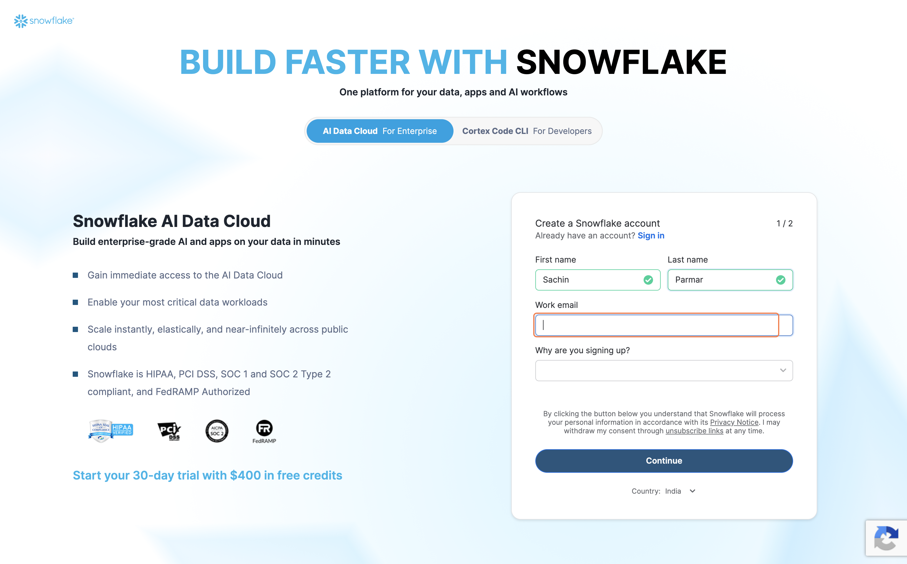

# Setting Up Snowflake

---

Think about the last time you worked on a big project and had a ton of files — spreadsheets, documents, notes — scattered everywhere. At some point you probably thought, "I need one place where all of this lives, so I can actually find and use it."

That's exactly the problem we're about to solve.

We're going to be collecting a lot of data from diff sources like linkedIn , Youtube. Profiles, links, job titles, company names — all kinds of information. And we need somewhere to put it so our application can find it, search through it, and make sense of it. Without that, we're just collecting data with nowhere for it to go.

That's where Snowflake comes in.

Snowflake is basically a giant, organized storage space in the cloud kind of like Google Drive, but built specifically for storing data that your application can search and use. You don't need to install anything, you don't need to manage anything, and they offer a free 30-day trial that's more than enough for this course.

Let's get you set up. It only takes a few minutes.

---

## Step 1: Go to the Snowflake Sign-Up Page

Open your browser and go to:

[https://signup.snowflake.com/](https://signup.snowflake.com/)

---

## Step 2: Click "Get Started"

Click the **"Get Started"** button at the top of the page.

---

## Step 3: Fill In Your Details

You'll see a simple sign-up form. Fill in:

- **First Name** and **Last Name**
- **Email Address** — use one you can check right now, because they'll send you a confirmation link
- **Why are you signing up** — just pick whatever feels closest

Click **"Continue"** when you're done.

---

## Step 4: A Few More Details

On the next screen, fill in:

| Field | What to Enter |
|---|---|
| **Company Name** | Your company, school, or just your own name — anything works |
| **Job Title** | Whatever your role is (e.g. `Student`, `Manager`, `Analyst`) |
| **Snowflake Edition** | Select **Standard** — this is the free one, and it's all we need |

Click **"Get Started"**.

---

## Step 5: Skip the Extra Questions

Snowflake might ask you a few questions about your background and what you're planning to build. These are just to personalize your experience — they don't affect anything.

Feel free to answer them or just click **"Skip"**.

---

## Step 6: Check Your Email

After you submit, Snowflake will send a confirmation email to the address you entered.

Go check your inbox now. Look for an email from Snowflake with the subject **"Activate your Snowflake account"**.

> Don't see it? Check your spam or junk folder — it sometimes ends up there.

---

## Step 7: Activate Your Account

Open that email and click the big **"CLICK TO ACTIVATE"** button.

It'll open a new tab in your browser where you can set your password and finish the setup. Follow the steps on screen — it's straightforward.

---

You now have your own space in the cloud where all your data will live. That's a big step.

But here's the thing — Snowflake is empty right now. We have the storage, but nothing to put in it yet. So the natural next question is: where does the data actually come from?

---

## What You've Learned

- What Snowflake is and why a cloud data warehouse is the right destination for your pipeline
- How to create and activate a free Snowflake account
- The difference between transient data (a chat window) and persistent data (a warehouse)
- That Snowflake is empty right now — the next lessons are about filling it

---

## What's Next

**[Lesson 1.0 → Enable Your Channels in Composio](../../01-channel-data-pipeline/1.0-enabling-channels%20-in-composio/readme.md)**

Before Claude can pull data from YouTube and LinkedIn, Composio needs authenticated access to both. In the next lesson you'll connect both channels in under 10 minutes.

---

[← Back to module index](../../README.md)
