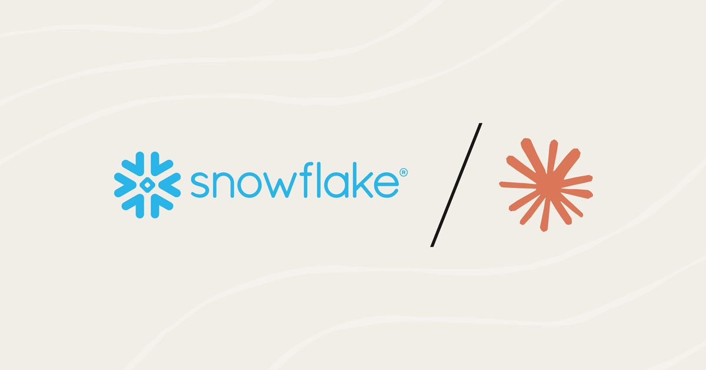
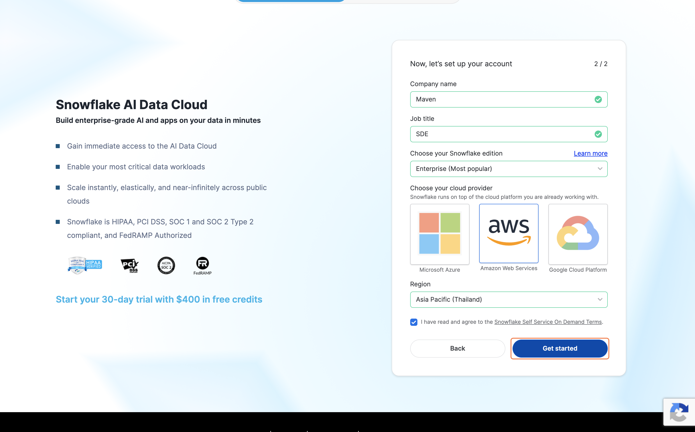
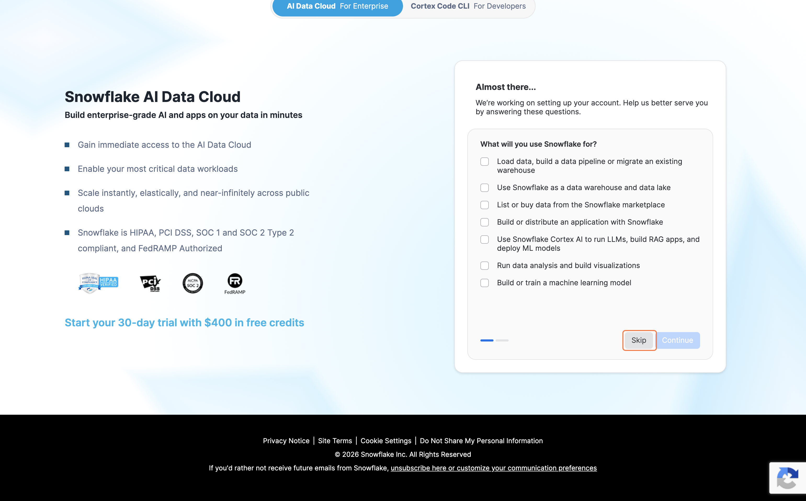
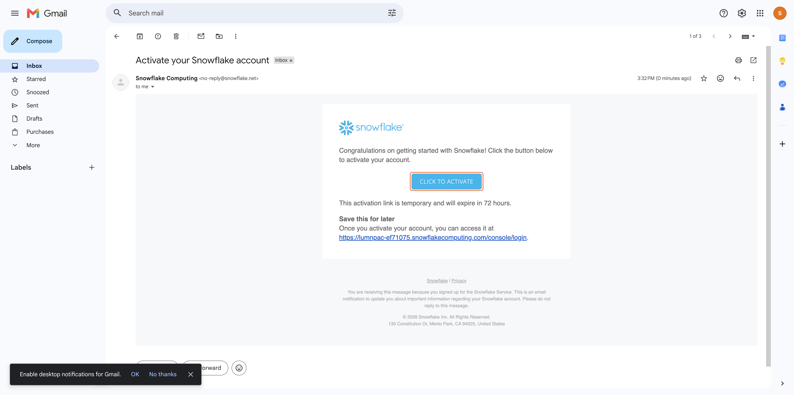

# Setting Up Snowflake

---

So far, we have been talking about collecting data and making it useful. But there is one big question left: where do we store all of it?

If we only keep data inside a chat or a temporary file, it is hard to reuse later. We need a place that is organized, reliable, and easy to access. That is where Snowflake comes in.

Snowflake is a cloud data warehouse. In simple terms, it is a strong and organized home for your data. You can store your data there, search it later, and use it in your workflow whenever you need it. It is also simple to set up for this course, and Snowflake gives you a free trial that is enough to get started.

This lesson will help you create your own Snowflake account and get ready for the next steps.

---

## Step 1: Go to the Snowflake Sign-Up Page

Open your browser and go to:

[https://signup.snowflake.com/](https://signup.snowflake.com/)

---

## Step 2: Click "Get Started"

Click the **Get Started** button at the top of the page.

---

## Step 3: Fill In Your Details

You will see a sign-up form. Fill in your details:

- **First Name** and **Last Name**
- **Email Address** — use one you can check right now because Snowflake will send you a confirmation link
- **Why are you signing up** — choose the option that feels closest to you

Then click **Continue**.

---

## Step 4: Add a Few More Details

On the next page, fill in the remaining information:

| Field | What to Enter |
|---|---|
| **Company Name** | Your company, school, or even your own name |
| **Job Title** | Your role, such as Student, Manager, or Analyst |
| **Snowflake Edition** | Select **Standard** |

Then click **Get Started**.

---

## Step 5: Skip the Extra Questions

Snowflake may ask a few extra questions. These are just for onboarding. You can answer them or simply click **Skip**.

---

## Step 6: Check Your Email

After you submit the form, Snowflake will send a confirmation email.

Open your inbox and look for an email from Snowflake with the subject **Activate your Snowflake account**.

If you do not see it, check your spam or junk folder.

---

## Step 7: Activate Your Account

Open the email and click **CLICK TO ACTIVATE**.

This will open a new page where you can create your password and finish the setup.

---

Now you have your own cloud space where your data can live. That is a big step.

But this space is still empty. We now have the storage, but we still need to fill it with real data. That is what we will work on next.

---

## What You Have Learned

By the end of this lesson, you should understand:

- what Snowflake is
- why we need a place to store data
- how to create and activate a Snowflake account
- why this step is important before we start moving data into our workflow

---

## What’s Next

**[Lesson 1.0 → Enable Your Channels in Composio](../../01-channel-data-pipeline/1.0-enabling-channels%20-in-composio/readme.md)**

In the next lesson, we will connect our channels in Composio so Claude can access the tools we need.

---

[← Back to module index](../../README.md)
