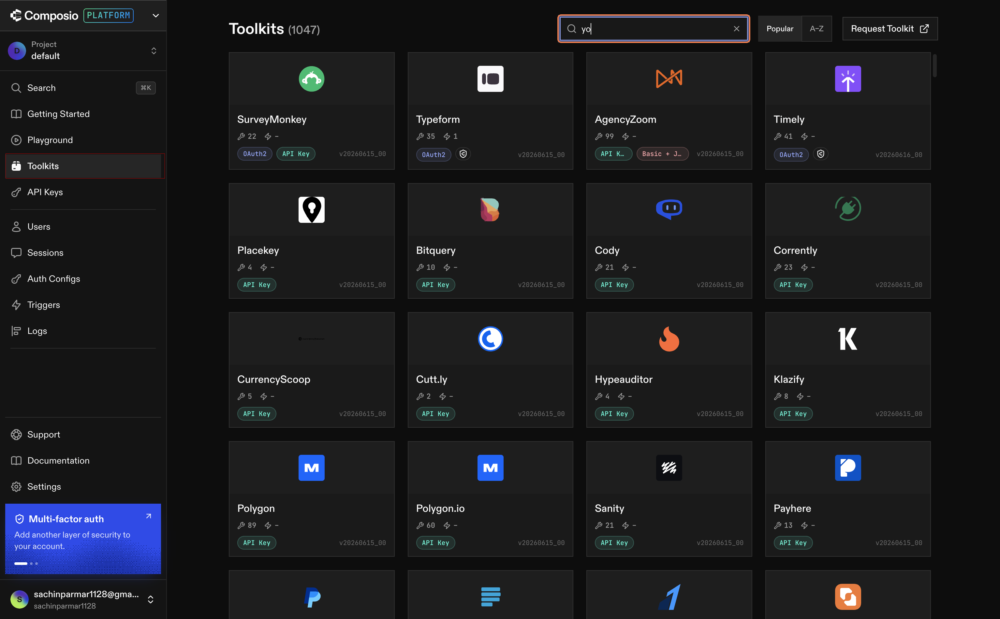
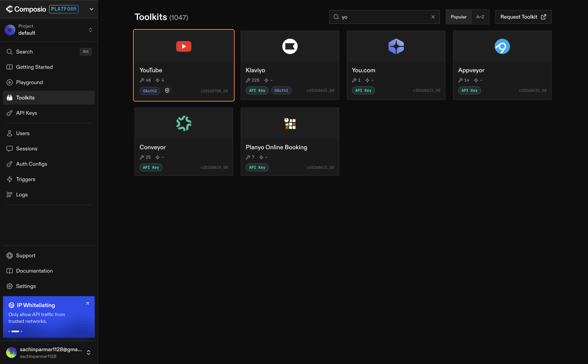
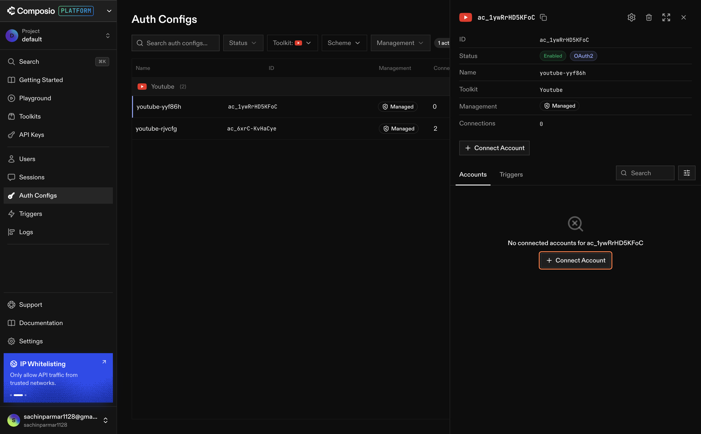
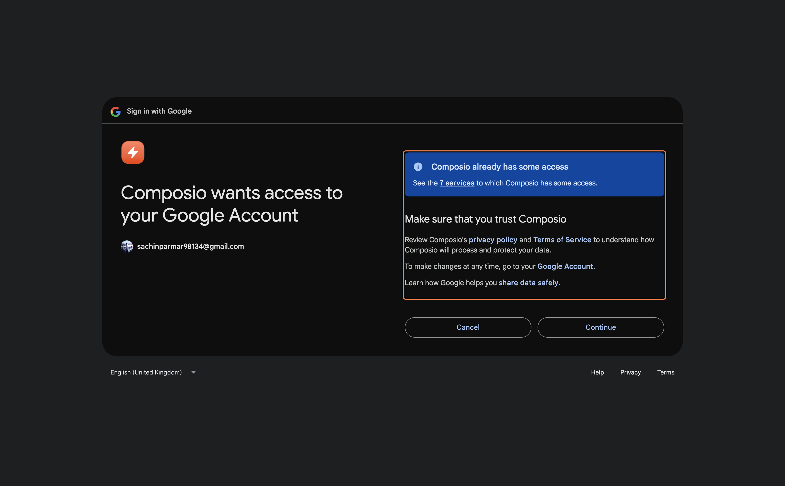
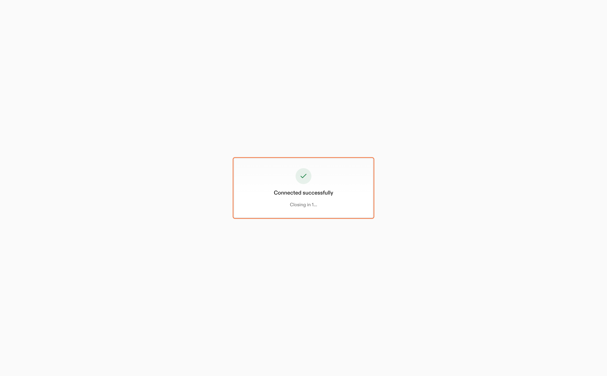

# Enabling Your Channels in Composio

---

## Toolkit Integrations in Composio

Composio is the MCP server that sits between Claude and the outside world. Every external platform Claude can talk to is connected through Composio as a **Toolkit integration**.

Think of each integration as a door. Right now there are no doors. By the end of this lesson, we'll have two: one into YouTube, one into LinkedIn.

```
Claude
  ↓  (MCP)
Composio
  ├── YouTube  ← we're building this door
  └── LinkedIn ← and this one
```

Once both are open, Claude can walk through either one on demand — pulling live data, reading comments, fetching analytics — without you having to log in or export anything manually.

Let's build them.

---

## Step 1: Connect YouTube

Open [Composio](https://app.composio.dev) and log into your account.

---

### 1.1 — Find the YouTube Toolkit

In the left sidebar, click **Toolkit**.

In the search bar, type **YouTube**.



You'll see the YouTube integration appear. Click on it.



---

### 1.2 — Add It to Your Project

Click **Add to Project**.


On the next screen, click **Next**.


---

### 1.3 — Create the Auth Config

You'll land on the authentication screen. Click **Create Auth Config**.

This is where Composio sets up the OAuth connection to YouTube's API — your credentials are handled securely and never stored in plain text.


---

### 1.4 — Connect Your Account

Click on the connect icon shown on screen.


A popup will open asking you to choose a Google account. Select the account that owns your YouTube channel.



Grant all the requested permissions — Composio needs these to read your channel data, video analytics, and comments on your behalf.



Click **Continue**.



---

### 1.5 — Confirm the Connection

You'll be redirected back to Composio. You should now see your YouTube channel listed as a connected account with a green status indicator.

That's it. Claude now has authenticated access to your YouTube data.


---

> **What just happened?**
>
> Composio registered an OAuth token on your behalf. From this point on, whenever Claude needs to pull YouTube data, it goes through Composio — which handles the authentication handshake automatically. You don't need to log in again or manage tokens manually.

---

## Step 2: Connect LinkedIn

Still in Composio, repeat the same process for LinkedIn.

---

### 2.1 — Find the LinkedIn Toolkit

In the left sidebar, click **Toolkit**.

In the search bar, type **LinkedIn**.

Click on the LinkedIn integration.

---

### 2.2 — Add It to Your Project

Click **Add to Project**, then click **Next**.

---

### 2.3 — Create the Auth Config

Click **Create Auth Config** on the authentication screen.

---

### 2.4 — Connect Your Account

Click the connect icon. A popup will open asking you to log into LinkedIn.

Sign in with the LinkedIn account you want to track and grant all the requested permissions.

---

### 2.5 — Confirm the Connection

You'll be redirected back to Composio. You should see LinkedIn listed as a connected account with a green status indicator.

---

> **What just happened?**
>
> Same as YouTube — Composio holds the OAuth token and manages the connection lifecycle. Claude can now reach your LinkedIn profile on demand without you doing anything manually.

Every time Claude runs your data pipeline, it will flow through this bridge. Composio holds the tokens, manages the authentication lifecycle, and presents Claude with a clean interface for each platform.

This is how real data engineering teams handle third-party integrations — not by embedding credentials directly in code, but by using a managed auth layer that can be rotated, scoped, and audited separately from the application logic.

---

## What You've Learned

- How Composio toolkit integrations work — each one is an authenticated door into a platform
- How to connect YouTube and LinkedIn to Composio via OAuth
- Why Composio manages credentials instead of storing them in your code
- That Claude can now reach both platforms on demand — no manual login required

---

## What's Next

**[Lesson 1.1 → Connect Claude to Composio via MCP](../1.1-connecting-claude-composioMCP/readme.md)**

You've connected your channels to Composio. Now it's time to connect Claude to Composio — the final link that lets Claude reach YouTube, LinkedIn, and Snowflake in a single conversation.

---

[← Back to module index](../../README.md)
