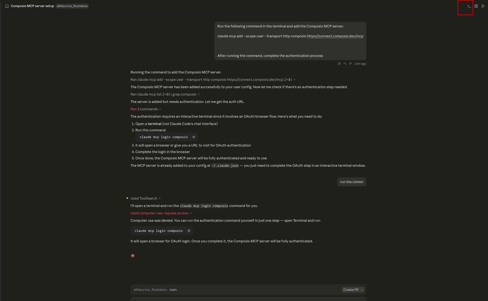
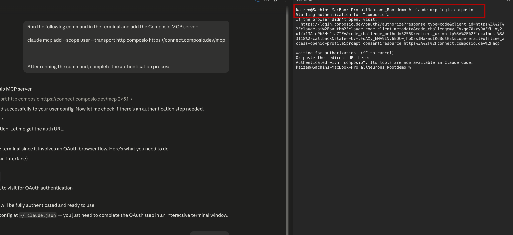
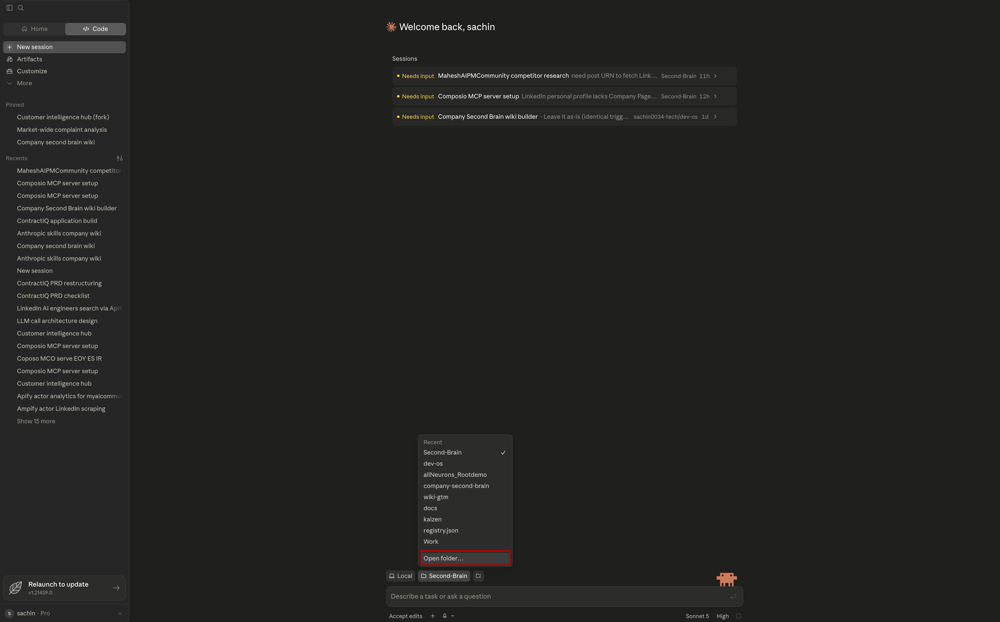
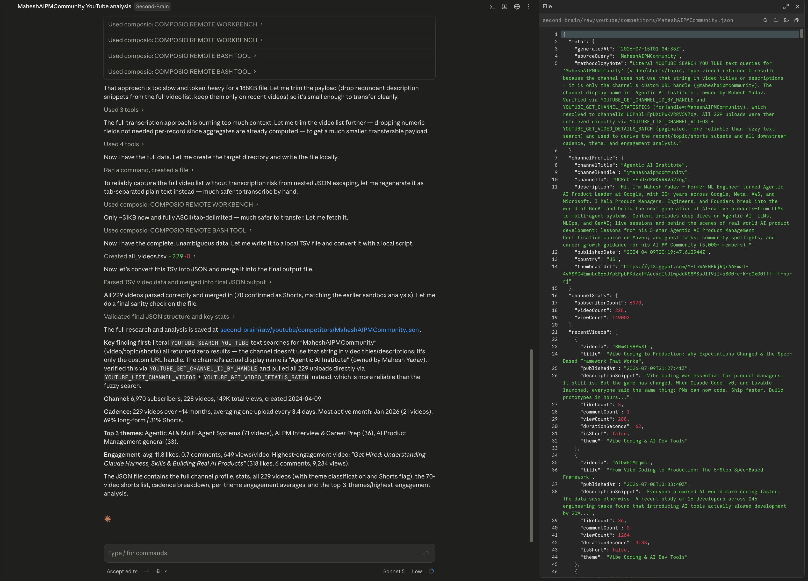
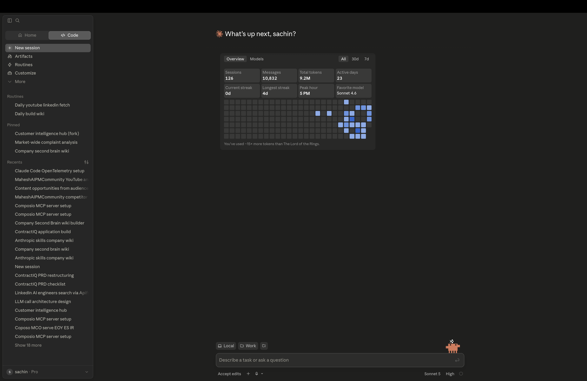
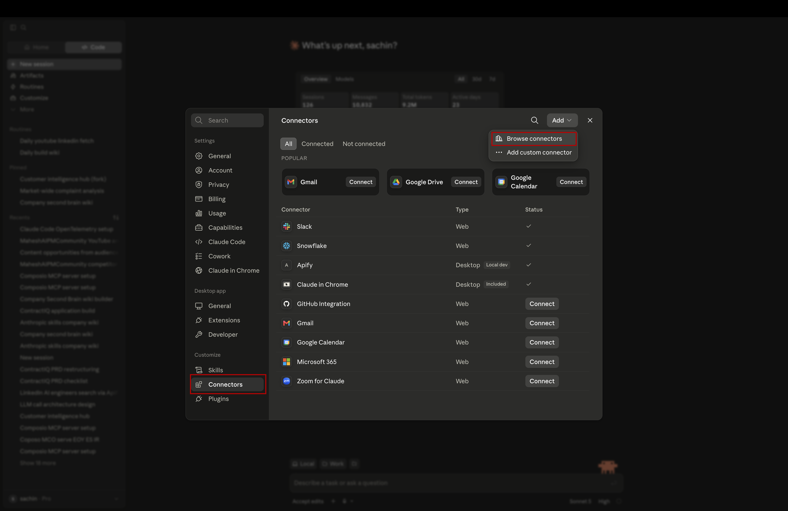
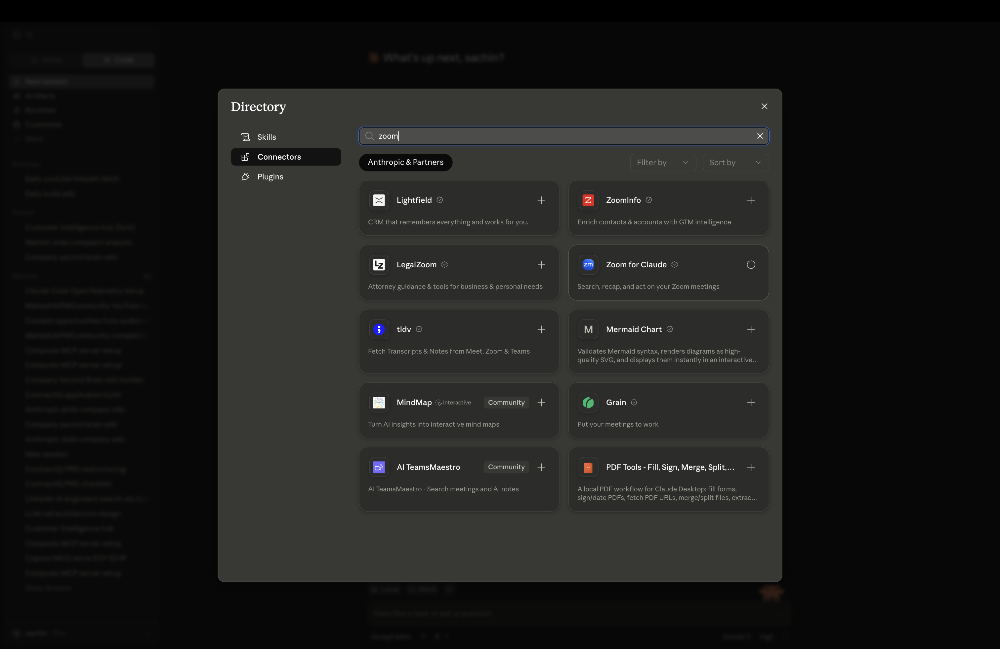
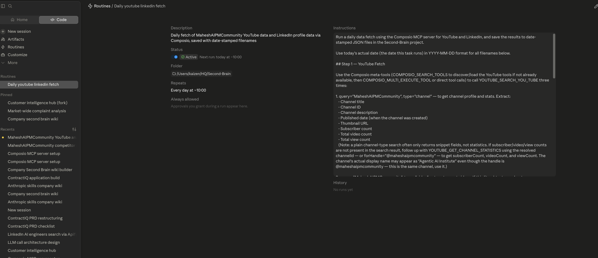

# Connecting Claude to Composio via MCP


---

## What Is MCP?

Before we do anything, let's make sure the concept lands.

MCP stands for **Model Context Protocol**. It's the standard language Claude uses to say: *"I want to use this tool — here's my request, here's what I need back."*

Without MCP, Claude is limited to what you type into the chat. With MCP, Claude can reach out to real systems — write to a database, pull from an API, trigger an action in an external tool — all within a single conversation.

Composio acts as the MCP server. It's the endpoint Claude will call every time it needs to interact with Snowflake, YouTube, or LinkedIn or different channels.

```
Claude
  ↓  (MCP)
Composio Server
  ├── Snowflake
  ├── YouTube
  └── LinkedIn
```

Once we wire this up, that entire stack becomes available to Claude on demand.

---

## Step 1: Generate the MCP URL

Go to this page:

```
https://composio.dev/toolkits/snowflake/framework/claude-code
```

Click **Generate MCP URL** and copy the URL that appears.


Keep that URL handy — you'll use it in the next step.

---

## Step 2: Tell Claude About Composio

Open the Claude desktop app and start a new chat.

Paste this prompt, replacing the placeholder with the URL you just copied:

```
Run the following command in the terminal and add the Composio MCP server:

<paste your MCP URL here>

After running the command, complete the authentication process.
```

Claude will run the command and register Composio as a connected tool.



Once it does, Claude knows where Composio lives. From this point on, Claude can reach out to Composio any time it needs to interact with your connected tools.

---

> **What just happened?**
>
> Claude ran a terminal command that registered Composio's MCP endpoint in its tool configuration. This is a one-time setup step — you do not need to repeat it in future sessions. Claude will remember this connection.

---

## Step 3: Authenticate the Connection

The last step is giving Claude permission to actually use the connection.

After the command runs, Claude will open a browser window asking you to authorize it. Follow the prompts and approve the access.

Once you approve, the connection is live.



That's it. Claude now has a live, authorized connection to Composio.

---

## What You've Actually Built

Let's take stock of where we are.

You haven't written a pipeline yet. You haven't queried a database. But you've done the hard part — you've connected three systems together:

```
Claude
  ↓  (MCP)
Composio
```

This is the backbone of everything we're about to build.

Claude can now reach Composio on demand. Composio already holds your authenticated connection. That means Claude can push data into your database, query it, and retrieve results — all from within a single conversation and also pull the data, without you doing anything manually.

This is exactly what a data engineering team sets up before they write a single line of pipeline code. Authentication first. Integration layer second. Logic third.

---

## Summary

You've done three things that matter:

1. Generated a unique MCP URL that identifies your Composio setup to Claude
2. Registered that URL with Claude so it knows where Composio lives
3. Authorized the connection so Claude has permission to use it

Claude is no longer in a closed room. It now has a direct line to Composio — and through Composio, to every tool you've connected.

---

## Pull Your First Data

The connection is live. Let's actually use it.

Below are ready-to-run prompts you can paste directly into Claude. Each one tells Claude exactly what to fetch and how to structure the output. Try them one at a time — watch Claude reach out through Composio and come back with real data from your accounts.

> **Before you start:** Add your `second-brain` folder to Claude so it can read and write files. You'll see how to do that in the image below.



> **Tip:** To save tokens, switch to the Sonnet model and set thinking to low before running these prompts.
> 

---

### YouTube Analytics

> **Why do these prompts name specific tools like `YOUTUBE_SEARCH_YOU_TUBE`?**
>
> Composio exposes 51 YouTube tools to Claude. Without a specific tool name, Claude has to guess which one to call and often picks wrong or loops through multiple tools before landing on the right one. Naming the tool explicitly:
> 1. **Removes ambiguity** — Claude calls the right tool on the first try
> 2. **Faster execution** — no trial-and-error loop through similar tools
> 3. **Reproducible** — the prompt behaves the same way every time you run it
> 4. **Educational** — you learn which tool maps to which intent

> **YouTube channel used in this prompt:** `https://www.youtube.com/@MaheshAIPMCommunity`

**Fetch Last 15 Videos — Title, Views, Likes**
```
Using Composio, fetch performance data for the last 15 videos from this YouTube channel:
https://www.youtube.com/@MaheshAIPMCommunity

Step 1 — Find the Channel
Use YOUTUBE_SEARCH_YOU_TUBE with query "MaheshAIPMCommunity" and type "channel" to get:
- Channel title
- Channel ID
- Subscriber count
- Total video count
- Total view count

Step 2 — Fetch Last 15 Videos
Use YOUTUBE_SEARCH_YOU_TUBE with query "MaheshAIPMCommunity" and type "video" to find the 15 most recent videos.
For each video collect:
- Video title
- Video ID
- Published date
- View count
- Like count

Step 3 — Save the Data
1. Create the folder second-brain/raw/ if it doesn't exist
2. Save the channel stats and full video list as a single JSON file at:
   second-brain/raw/MaheshAIPMCommunity.json
```

> **Note:** Claude will ask for permission before writing files — approve it when prompted. Once complete, you'll see the `raw/` folder in your second-brain updated with the fetched data.



---

### LinkedIn Analytics

> **Before running:** Find 3–5 of your recent LinkedIn posts, copy their links (three-dot menu → "Copy link to post"), extract the numeric ID from each URL, and format as `urn:li:share:<id>`. You'll paste those into the prompt below.

**Fetch Profile + Post Metrics**
```
Using Composio, fetch my LinkedIn profile and post performance metrics.

Step 1 — Profile Info
Use LINKEDIN_GET_MY_INFO to retrieve:
- Full name
- LinkedIn member URN
- Headline
- Vanity name (my custom LinkedIn URL handle)
- Number of connections (if available)

Step 2 — Post Content
For each of these post URNs, use LINKEDIN_GET_POST_CONTENT to retrieve:
- Full post text
- Published date
- Post type (text, image, article, video)

[paste your post URNs here — format: urn:li:share:<id>]

Step 3 — Post Reactions
For each post URN above, use LINKEDIN_LIST_REACTIONS to retrieve:
- Total reaction count
- Breakdown by reaction type (like, celebrate, support, love, insightful, curious)

Step 4 — Engagement Summary
From the data collected in Step 2 and 3:
- Rank posts from highest to lowest total reactions
- Identify the best performing post
- Calculate average reactions per post
- Identify which post type (text, image, article) gets the most reactions
- Calculate posting cadence (average days between posts)

Finally:
1. Create the folder second-brain/raw/ if it doesn't exist
2. Save the full profile, all post content, reactions, and engagement summary as a single JSON file at:
   second-brain/raw/LinkedIn-initmahesh.json
```


---

### Zoom Meeting Transcripts

Beyond YouTube and LinkedIn, you can also pull meeting transcripts directly from Zoom into your raw folder. This is useful for tracking community calls, course sessions, or any recurring meetings you want Claude to have context on.

> **Note:** Fetching transcripts automatically requires a Zoom **Business or Enterprise plan**. If you're on a free or Pro plan, skip to the manual upload option below.

#### Connect Claude to Zoom

**Step 1** — Open the Claude desktop app and click **Customize** in the top-right corner.



**Step 2** — In the sidebar, click **Connectors**, then click **Browse Connectors**.




**Step 3** — Search for **Zoom** and click on it.



**Step 4** — Click **Connect**.


**Step 5** — Complete the OAuth authentication — Zoom will ask you to log in and approve access. Once you approve, Zoom will appear as a connected integration in your Claude sidebar.

That's it. Claude can now reach your Zoom account directly.

---

#### Fetch Transcripts for Last 2 Meetings

Once Zoom is connected, paste this prompt into Claude:

```
Using the Zoom connector, fetch the transcripts from my 2 most recent meetings.

Step 1 — List Recent Meetings
Retrieve my last 2 completed meetings, including:
- Meeting ID
- Meeting topic / title
- Start time
- Duration

Step 2 — Fetch Transcripts
For each meeting, retrieve the full transcript including:
- Speaker names
- Timestamps
- Full spoken text

Step 3 — Save to Raw Folder
Save each transcript as a separate file in second-brain/raw/zoom/:
- second-brain/raw/zoom/<meeting-title>-<date>.txt

Create the folder if it doesn't exist.
```

---

#### No Zoom Plan? Upload the Transcript Manually

If you're not on a Business or Enterprise plan, Zoom still lets you download transcripts manually from the Zoom web portal under **Recordings**. Once downloaded:

1. Rename the file something clear — e.g. `community-call-2026-07-16.txt`
2. Drop it into `second-brain/raw/zoom/`
3. It will be picked up automatically when the push skill runs

---


You might be thinking — do I need to come back to Claude every day and manually ask it to pull the data? No. That's exactly what the scheduler below solves. Set it once and it triggers itself automatically, fetching fresh data for you every day without any input from you but make sure your claude should be runing 24/7 for that .

### Daily Auto-Fetch Scheduler

> **What this does:** Uses Claude Code's built-in scheduler to set up a cron job that runs every day at 10:00 AM. Claude handles the scheduling — Composio handles the data fetching from YouTube and LinkedIn. Results land in your raw folder with a date stamp automatically.

**Set Up Daily Data Fetch at 10am**
```
Using Claude Code's built-in scheduler, set up a daily automated data fetch that runs every day at 10:00 AM. Use the Composio MCP server for all data fetching from YouTube and LinkedIn.

Step 1 — YouTube Daily Fetch
Use YOUTUBE_SEARCH_YOU_TUBE with query "MaheshAIPMCommunity" and type "channel" to get:
- Channel title
- Channel ID
- Subscriber count
- Total video count
- Total view count

Then use YOUTUBE_SEARCH_YOU_TUBE with query "MaheshAIPMCommunity" and type "video" to get the 15 most recent videos.
For each video collect:
- Video title
- Video ID
- Published date
- View count
- Like count

Step 2 — LinkedIn Daily Fetch
Use LINKEDIN_GET_MY_INFO to retrieve:
- Full name
- LinkedIn member URN
- Headline
- Vanity name
- Number of connections (if available)

Then for each post URN in your tracked list, use LINKEDIN_GET_POST_CONTENT and LINKEDIN_LIST_REACTIONS to retrieve:
- Full post text
- Published date
- Post type
- Total reaction count
- Reaction breakdown by type

Step 3 — Save with Date Stamp
After each fetch, save both results with today's date in the filename:
- second-brain/raw/youtube/daily/YYYY-MM-DD.json
- second-brain/raw/linkedin/daily/YYYY-MM-DD.json

Where YYYY-MM-DD is the actual date the fetch runs (e.g. 2026-07-16).

Create both folder paths if they don't exist.

Schedule this as a recurring cron job that runs automatically every day at 10:00 AM.
```





---

> **What's happening under the hood?**
>
> When you run any of these prompts, Claude is calling Composio's MCP tools in real time. Composio authenticates with YouTube and LinkedIn using the OAuth tokens you set up, fetches the requested data, and returns it to Claude — all within seconds. You're not seeing cached data. You're seeing live numbers from your accounts right now.

---

## What's Next

You've connected Claude to Composio, and you've seen it pull live data from YouTube and LinkedIn with a single prompt.

In the next lesson, we'll take this further — building a proper data pipeline that runs these queries automatically, structures the output, and loads everything into your Snowflake data lake for long-term storage and analysis.

---

## Claude Concepts Covered in This Lesson

| Concept | Where it appeared | Learn more |
|---------|-------------------|------------|
| **MCP (Model Context Protocol)** | **What Is MCP?** — *"MCP stands for Model Context Protocol. It's the standard language Claude uses to say: 'I want to use this tool — here's my request, here's what I need back.'"* | [MCP Documentation](https://docs.anthropic.com/en/docs/claude-code/mcp) |
| **MCP Server** | **What Is MCP?** — *"Composio acts as the MCP server. It's the endpoint Claude will call every time it needs to interact with Snowflake, YouTube, or LinkedIn."* | [Claude Code Overview](https://docs.anthropic.com/en/docs/claude-code) |
| **Tool Connections** | **Pull Your First Data** — *"When you run any of these prompts, Claude is calling Composio's MCP tools in real time."* | [Claude Code Integrations](https://docs.anthropic.com/en/docs/claude-code) |

---

---

## What You've Learned

- What MCP is and why it's the language Claude uses to call external tools
- How to register Composio as an MCP server in Claude with a single URL
- How to authenticate the connection so Claude has live access to your channels
- How to pull real data from YouTube and LinkedIn with ready-to-run prompts
- How to set up a daily scheduler that fetches fresh data automatically at 10am

---

## What's Next

**[Lesson 1.2 → Connect Snowflake to Composio](../1.2-connecting-snowflake-composio/Readme.md)**

You can pull data from YouTube and LinkedIn. Now it's time to give Claude somewhere permanent to write it. In the next lesson you'll connect Snowflake to Composio — so Claude can push data directly into your data lake.

---

[← Back to module index](../../README.md)
