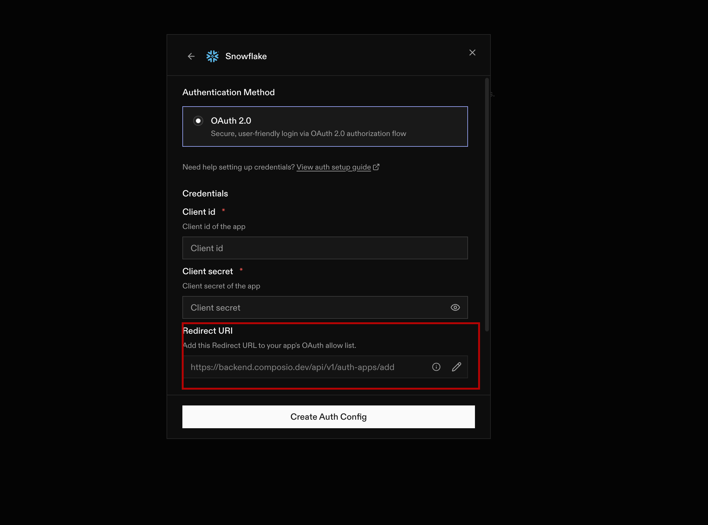
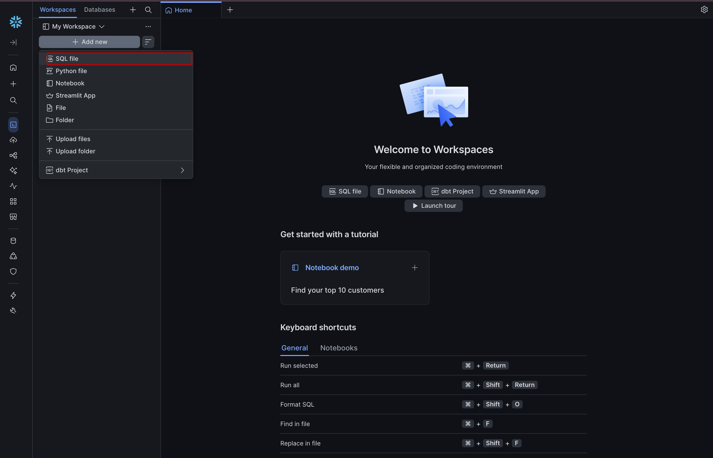
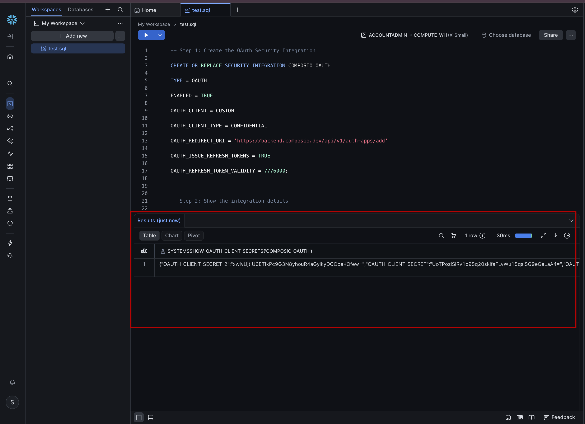

# Connecting Snowflake to Composio

---

You've connected your channels. Claude can now reach YouTube and LinkedIn through Composio.

But here's the problem — where does all that data actually go?

Right now, every time Claude pulls analytics from your channels, the results live inside a single chat conversation. Close the window and they're gone. Run it again next week and you have no way to compare. Share it with a teammate and they see a screenshot, not queryable data.

That's not a data pipeline. That's a manual process with an AI in the middle.

What we need is a **single place where everything gets stored** — structured, searchable, and permanent. A place where data from every pipeline run accumulates over time, so you can spot trends, compare periods, and ask questions across months of history.

That place is Snowflake.

---

## The Problem With Storing Data in Chat

Let's be honest about what "data in a conversation" actually means.

It means:
- It disappears when the session ends
- You can't query it
- You can't join it with other data
- You can't schedule a report from it
- Nobody else on your team can access it

Companies don't run on data that lives in chat windows. They run on data that lives in databases — versioned, structured, and always available.

Before we can build a real pipeline, we need to give Claude somewhere permanent to write.

---

## Snowflake as Your Data Lake

Snowflake is a cloud data warehouse. Think of it as a database that scales automatically, handles large volumes of structured data, and lets you query everything with SQL.

For our pipeline, Snowflake plays one role: **the destination**.

```
YouTube  ──→
              Claude + Composio  ──→  Snowflake
LinkedIn ──→
```

Every time the pipeline runs, Claude will pull data from your channels and push it into Snowflake. The data accumulates run after run — building a historical record you can query, analyze, and report on over time.

But before Claude can write to Snowflake, Composio needs permission to enter. That's what this lesson is about — creating a secure, authorized connection between Composio and your Snowflake account.

---

## Step 1: Add Snowflake as a Toolkit

Open [Composio](https://app.composio.dev) and log into your account.

In the left sidebar, click **Toolkit**.

In the search bar, type **Snowflake**.


Click on the Snowflake integration, then click **Add to Project**.


A setup window will appear — click **Next**.


---

## Step 2: Understand the OAuth Setup

Here's where things get a little more interesting than YouTube or LinkedIn.

Composio needs permission to access your Snowflake account — and it can't just walk in without an invitation. Snowflake uses something called **OAuth** to handle this.

OAuth is a standard protocol for letting one application get permission to access another, without sharing your password. Think of it like a valet key — it gives Composio access to specific things inside Snowflake, but only what you've explicitly authorized.

Unlike YouTube and LinkedIn where OAuth happens in a browser popup, Snowflake requires a few extra steps because you're running your own database. We need to manually register Composio as a trusted application inside Snowflake before the connection can work.

That's what the next steps do.


---

## Step 3: Copy the Composio Redirect URL

Before we leave this Composio window, we need to grab one value.

When OAuth happens between two systems, there's always a moment where Snowflake needs to send Composio a confirmation — a callback saying "yes, this connection is approved." The **Redirect URL** is the address Snowflake will send that confirmation to.

Copy the Redirect URL shown on screen. It will look something like this:

```
https://backend.composio.dev/api/v1/auth-apps/add
```

Keep it somewhere handy — you'll paste it into Snowflake in the next step.



---

## Step 4: Set Up the Connection Inside Snowflake

Now we need to go into Snowflake and run a short SQL script. Don't worry if you've never written SQL — you're not writing anything from scratch. You're running a script that registers Composio as a trusted application inside Snowflake. Think of it as adding Composio to Snowflake's guest list.

### 4.1 — Open the Snowflake Workspace

Log into your Snowflake account and go to **Projects → Worksheets**.


Click **+ Add → SQL Worksheet** to create a new SQL file.



Name it something like `composio-oauth-setup`.


---

### 4.2 — Paste and Run the Setup Script

Copy the SQL below and paste it into the worksheet.

> **Important:** Replace the `OAUTH_REDIRECT_URI` value with the Redirect URL you copied from Composio in Step 3.

```sql
-- Register Composio as a trusted OAuth app in Snowflake
CREATE OR REPLACE SECURITY INTEGRATION COMPOSIO_OAUTH
  TYPE = OAUTH
  ENABLED = TRUE
  OAUTH_CLIENT = CUSTOM
  OAUTH_CLIENT_TYPE = CONFIDENTIAL
  OAUTH_REDIRECT_URI = 'https://backend.composio.dev/api/v1/auth-apps/add'
  OAUTH_ISSUE_REFRESH_TOKENS = TRUE
  OAUTH_REFRESH_TOKEN_VALIDITY = 7776000;

-- Confirm it was created
DESC SECURITY INTEGRATION COMPOSIO_OAUTH;

-- Get the credentials we need
SELECT SYSTEM$SHOW_OAUTH_CLIENT_SECRETS('COMPOSIO_OAUTH');
```

Click **Run All** to execute all three statements.


---

> **What is this script actually doing?**
>
> - The first block creates the integration — it tells Snowflake "Composio is a trusted application, and here's where to send authorization confirmations."
> - The second block checks that the integration was created successfully.
> - The third block generates the secret credentials that Composio will use to prove its identity on every future connection.

---

## Step 5: Copy Your Credentials

After running the script, you'll see output appear at the bottom of the screen.

The third statement returns a result containing two important values:

| Value | What it is |
|-------|-----------|
| `OAUTH_CLIENT_ID` | Like a username for Composio — identifies which application is connecting |
| `OAUTH_CLIENT_SECRET` | Like the password that goes with it — proves Composio is who it says it is |

Together, these two values are how Snowflake will recognize Composio on every future connection. Copy both of them.



---

## Step 6: Paste the Credentials into Composio

Go back to the Composio window from Step 2.

Paste the **Client ID** and **Client Secret** into their respective fields and complete the connection.


Composio will use these to verify itself with Snowflake and confirm that the connection is active.

Once saved, you should see Snowflake listed as a connected toolkit with a green status indicator.

That's it. Composio now has authorized, permanent access to your Snowflake account.

---

## What You've Actually Built

Let's take stock of where we are.

```
Claude
  ↓  (MCP)
Composio
  ├── YouTube  (authenticated ✓)
  ├── LinkedIn (authenticated ✓)
  └── Snowflake (authenticated ✓)
```

Every piece of the pipeline now has a live connection:
- YouTube and LinkedIn are the **sources** — where data comes from
- Snowflake is the **destination** — where data gets stored permanently

Claude can now pull from both channels and write to the database, all in a single automated run.

---

## How Real Teams Think About This

In every serious data engineering team, there's a clear distinction between **transient data** and **persistent data**.

Transient data is what you see in a chat window, a dashboard refresh, or a one-off report. It answers a question right now, then disappears.

Persistent data is what lives in a data warehouse. It accumulates over time, survives team changes, and becomes the foundation for long-term analysis.

| Transient | Persistent (Snowflake) |
|-----------|----------------------|
| Lives in a conversation | Lives in a queryable database |
| Gone when session ends | Available forever |
| Can't be compared over time | Historical trends visible |
| Not shareable across teams | Accessible to everyone with access |
| No audit trail | Every run recorded separately |

By connecting Snowflake today, you've moved from "data that answers a question" to "data that builds a record." That's the difference between a tool and a system.

---

## What You've Learned

- Why data that lives in a chat window disappears — and why Snowflake fixes that
- How OAuth works between Composio and Snowflake, and why it's more secure than storing credentials in code
- How to run the SQL setup script to register Composio as a trusted app inside Snowflake
- How to copy the OAuth Client ID and Secret and complete the connection in Composio
- That Snowflake is now the permanent destination for everything your pipeline produces

---

## What's Next

**[Lesson 1.3 → Push Data to Snowflake](../1.3-puhing-data-to-snowflake/readme.md)**

All three systems are connected. Now it's time to actually move data. In the next lesson you'll use the `push-data-to-snowflake.md` skill to push everything from your `raw/` and `projects/` folders into Snowflake in a single prompt — and set up a daily scheduler to keep it in sync automatically.

---

[← Back to module index](../../README.md)
