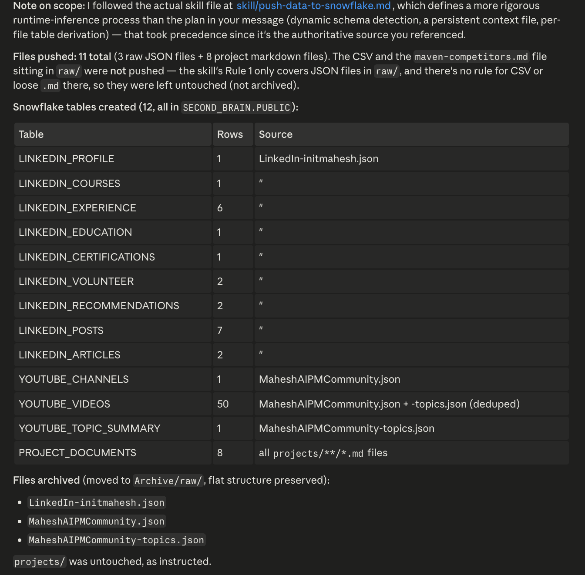
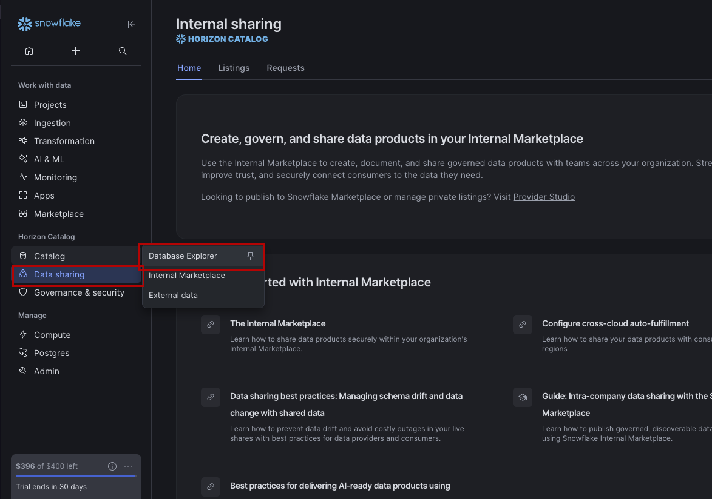

# Pushing Data to Snowflake

---

You've pulled data from YouTube and LinkedIn, and if you've been running calls, Zoom transcripts too. It's all sitting in your `second-brain/raw/` folder — structured, date-stamped, ready.

Now it's time to make it permanent.

Right now that data only exists on your local machine. It can't be queried across time. It can't be shared with a teammate. It can't power a report next month. To do any of that, it needs to live in Snowflake.

This lesson is about pushing everything into your Snowflake data lake in one prompt. And here's where it gets interesting — we're pushing **two different types of data**:

- **Structured JSON** (YouTube, LinkedIn) — parsed field by field into Snowflake columns
- **Raw files** (Zoom transcripts) — pushed as-is, stored as a full text blob in Snowflake

Both end up in Snowflake. The difference is how they get there. Understanding this distinction is what separates a beginner data pipeline from a real one.

---

## What We're Pushing

By this point your `second-brain` folder has data from three sources worth storing:

```
second-brain/
  └── raw/                               ← all channel data straight from the source
      ├── youtube/
      │   └── daily/
      │       └── YYYY-MM-DD.json        ← structured JSON (video title, views, likes)
      ├── linkedin/
      │   └── daily/
      │       └── YYYY-MM-DD.json        ← structured JSON (post text, reactions)
      └── zoom/
          └── community-call-YYYY-MM-DD.txt  ← raw transcript file, pushed as-is
```

Everything in `raw/` goes to Snowflake. But not all data is the same:

| Data type | Example | How it's stored in Snowflake |
|-----------|---------|------------------------------|
| **Structured JSON** | YouTube, LinkedIn | Parsed into columns — one field per column |
| **Raw file** | Zoom transcript | Stored as a text blob — the full file content in one column |

> **This is the key insight of this lesson.** Snowflake can hold both. You don't have to restructure a transcript to store it — you push the file directly and query it later. This is how real data lakes work: ingest first, transform later.

After the push, all files in `raw/` move to `Archive/` — keeping `raw/` clean for the next day's fetch.

---

## How This Works: The Skill File

Instead of writing out every Snowflake table and insert command by hand, we use a **skill file**.

A skill file is a reusable set of instructions stored in your `second-brain` folder. Claude reads it at the start of the prompt and knows exactly what to do — which tables to create, how to structure the data, what to log, and what to do when the push is complete.

The skill we're using lives at:

```
second-brain/skill/push-data-to-snowflake.md
```

When you reference it in a prompt with `@second-brain/skill/push-data-to-snowflake.md`, Claude loads those instructions and executes them against your current data. You don't need to explain the schema every time — the skill handles it.

---

## Push Your Data to Snowflake

Paste this prompt into Claude:

```
@second-brain/skill/push-data-to-snowflake.md

Push all data from second-brain/raw/ to Snowflake using the Composio MCP server.

Step 1 — Push Structured JSON (YouTube + LinkedIn)
Scan second-brain/raw/youtube/ and second-brain/raw/linkedin/ for JSON files.
For each file:
- Detect the source (youtube or linkedin) and data type (daily, my-profile, etc.)
- Create the Snowflake table if it does not exist
- Insert the data as a new row, parsing each JSON field into the appropriate column
- Add a pushed_at timestamp column with the current time
- Log the file path and row count after each successful insert

Step 2 — Push Zoom Transcripts (Raw File)
Scan second-brain/raw/zoom/ for any .txt transcript files.
For each file:
- Do NOT parse the content — push the full file as a raw text blob
- Create a ZOOM_TRANSCRIPTS table in Snowflake if it does not exist, with these columns:
  - meeting_title (extract from filename)
  - meeting_date (extract from filename)
  - transcript_text (the full file content)
  - pushed_at (timestamp of when this push ran)
- Insert one row per transcript file
- Log the filename and confirm the insert

Step 3 — Archive All Pushed Files
Once all files have been pushed successfully:
- Move everything from second-brain/raw/ to second-brain/Archive/raw/
- Preserve the original subfolder structure inside Archive

Step 4 — Summary
After everything is complete, tell me:
- How many files were pushed total (JSON + transcripts)
- Which Snowflake tables were created or updated
- Which files were archived
- If any file failed to push, list it with the reason
```





**Verify the data landed in Snowflake:**

1. Go to your Snowflake account
2. Click **Catalog → Data Explorer**



3. You'll see a database named `SECOND_BRAIN` — open it, go to the `PUBLIC` schema, click any table, and select **Data Preview**


---

> **Why move raw to Archive after pushing?**
>
> Once data is in Snowflake, keeping it in `raw/` creates noise. The next pipeline run will generate a new file with today's date — and you don't want last week's file sitting alongside it pretending to be current. Moving it to `Archive/` means your `raw/` folder always contains only unprocessed data. Clean input. No ambiguity.

---

## What Snowflake Looks Like After the Push

Once Claude finishes, open your Snowflake account and go to **Data → Databases**. You should see tables created for each data type:

**Type 1 — Structured JSON (parsed into columns)**

| Table | Source |
|-------|--------|
| `YOUTUBE_DAILY` | `raw/youtube/daily/YYYY-MM-DD.json` |
| `LINKEDIN_DAILY` | `raw/linkedin/daily/YYYY-MM-DD.json` |

**Type 2 — Raw file (stored as a text blob)**

| Table | Source |
|-------|--------|
| `ZOOM_TRANSCRIPTS` | `raw/zoom/*.txt` — full transcript stored in `transcript_text` column |

Every push adds a new row — so over time you'll have a full historical record across all three channels. The `ZOOM_TRANSCRIPTS` table grows one row per meeting, with the entire transcript queryable as text.

---

## Auto-Sync Scheduler: Push New Files to Snowflake Every Morning

Running the push manually works — but the real power is when it happens automatically.

The scheduler below runs every morning at 6:00 AM using Claude Code's built-in scheduler. It scans both folders, detects any files added since the last run, pushes only the new ones to Snowflake, and archives raw files once they're safely stored. Nothing runs if there's nothing new.

**Set Up Daily Snowflake Sync at 6am**
```
Using Claude Code's built-in scheduler, set up a daily job that runs every morning at 6:00 AM. Use the Composio MCP server to push any new data to Snowflake.

Step 1 — Scan for New Files
Check second-brain/raw/ for files added since the last successful push:
- second-brain/raw/youtube/ (JSON files)
- second-brain/raw/linkedin/ (JSON files)
- second-brain/raw/zoom/ (transcript .txt files)

A file is considered new if it has not already been pushed to Snowflake in a previous run.
Skip any file that was already pushed — do not create duplicate rows.

Step 2 — Push New JSON Files (YouTube + LinkedIn)
For each new JSON file found in raw/youtube/ or raw/linkedin/:
- Detect the source and data type
- Create the Snowflake table if it does not exist
- Insert the data as a new row, parsing JSON fields into columns
- Add a pushed_at timestamp
- Log the file name, table name, and row count

Step 3 — Push New Zoom Transcripts
For each new .txt file found in second-brain/raw/zoom/:
- Do NOT parse the content — push the full file as a raw text blob
- Insert one row into ZOOM_TRANSCRIPTS with meeting_title, meeting_date, transcript_text, and pushed_at
- Log the filename and confirm the insert

Step 4 — Archive Pushed Raw Files
Once all new files have been successfully pushed:
- Move them from second-brain/raw/ to second-brain/Archive/raw/
- Preserve the original subfolder structure inside Archive

Step 5 — Summary Log
After the run completes, print:
- Date and time the job ran
- How many new files were found (JSON + transcripts)
- How many were pushed successfully
- Which Snowflake tables were updated
- Any files that failed, with the reason
- If no new files were found, log: "No new files — nothing to push."

Schedule this as a recurring cron job that runs automatically every day at 6:00 AM.
```

> **Why 6am?** The daily data fetch (set up in lesson 1.1) runs at 10am. By running the Snowflake sync at 6am, you're pushing any files that landed the previous day before the new day's fetch kicks off — keeping the pipeline clean and in sequence.

---

## How Real Teams Think About This

In production data pipelines, there's a pattern called **ELT — Extract, Load, Transform**.

- **Extract** — pull the data from its source (you did this with YouTube and LinkedIn via Composio)
- **Load** — push it into the warehouse as-is (that's what this lesson does)
- **Transform** — reshape and analyze it inside the warehouse (that comes later)

Most teams separate these stages deliberately. Loading raw data first means you always have the original if a transform goes wrong. You can re-run the transform without re-fetching from the source API.

What you've built here follows that same logic: raw data lands in `raw/`, gets pushed to Snowflake unmodified, then moves to `Archive/`. The warehouse becomes the source of truth. Everything downstream queries Snowflake — nothing queries a local file.

---

## What's Next

Your data is in Snowflake. Now it can be queried, compared across time, and shared across your team.

In the next lesson, we'll write SQL queries directly from Claude to start pulling insights out of what you've built — trends, comparisons, and reports that would have taken hours to produce manually.

---

## What You've Learned

- That Snowflake stores two types of data: structured JSON (parsed into columns) and raw files (stored as text blobs)
- How to push YouTube and LinkedIn JSON data to Snowflake, with each field mapped to a column
- How to push a Zoom transcript directly to Snowflake as-is — no parsing required
- Why raw files move to `Archive/` after a successful push — keeping `raw/` clean for new data
- How to verify the push worked by checking Data Explorer in Snowflake
- How the ELT pattern (Extract → Load → Transform) maps to what you've built
- How to set up a 6am daily scheduler that handles all three data types automatically

---

## What's Next

**[Lesson 2.0 → Create Your Wiki](../../02-building-wiki/2.0-personal-knowledge-os/readme.md)**

Your data is in Snowflake. Now it's time to turn it into something you can read and reason over. In the next lesson you'll use the `build-wiki.md` skill to compile everything in Snowflake into a structured, cross-linked wiki — automatically maintained and queryable in Obsidian.

---

## Claude Concepts Covered in This Lesson

| Concept | Where it appeared | Learn more |
|---------|-------------------|------------|
| **Skill files** | **How This Works** — *"A skill file is a reusable set of instructions stored in your second-brain folder."* | [Claude Code slash commands](https://docs.anthropic.com/en/docs/claude-code/slash-commands) |
| **MCP Tool Use** | **Push Your Data** — *"Push all data from the second-brain folder to Snowflake using the Composio MCP server."* | [MCP Documentation](https://docs.anthropic.com/en/docs/claude-code/mcp) |
| **File References** | **How This Works** — *"When you reference it in a prompt with @second-brain/skill/push-data-to-snowflake.md"* | [Claude Code Overview](https://docs.anthropic.com/en/docs/claude-code) |

---

[← Back to module index](../README.md)
