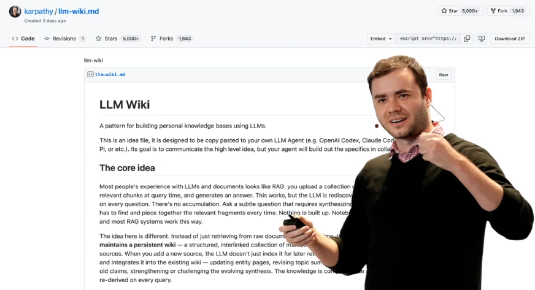
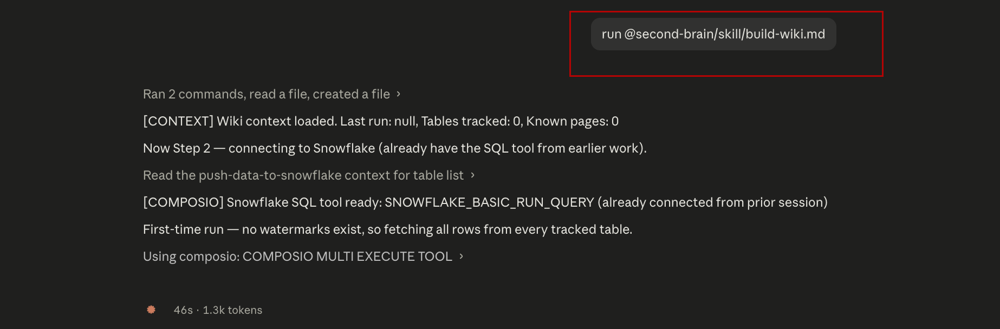
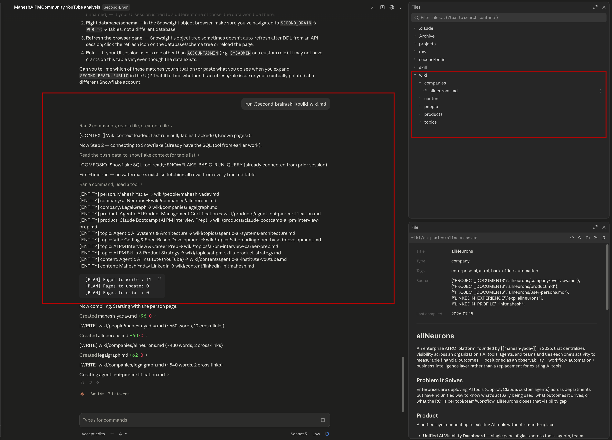
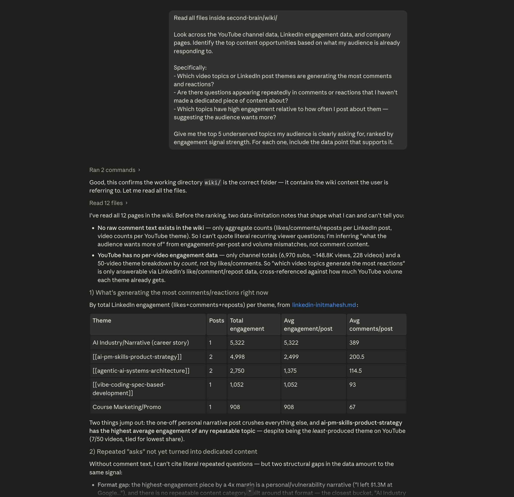
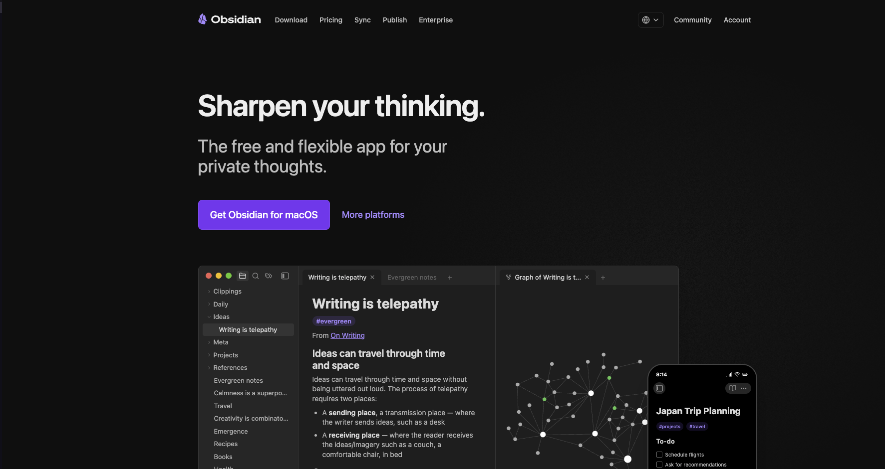
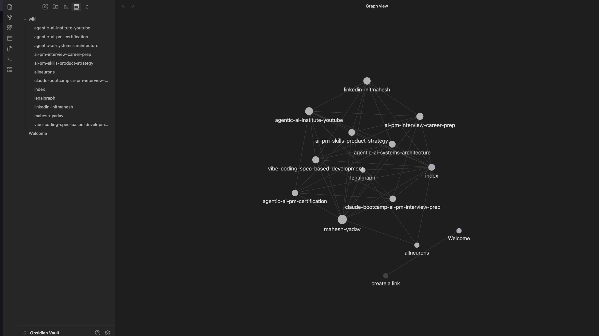
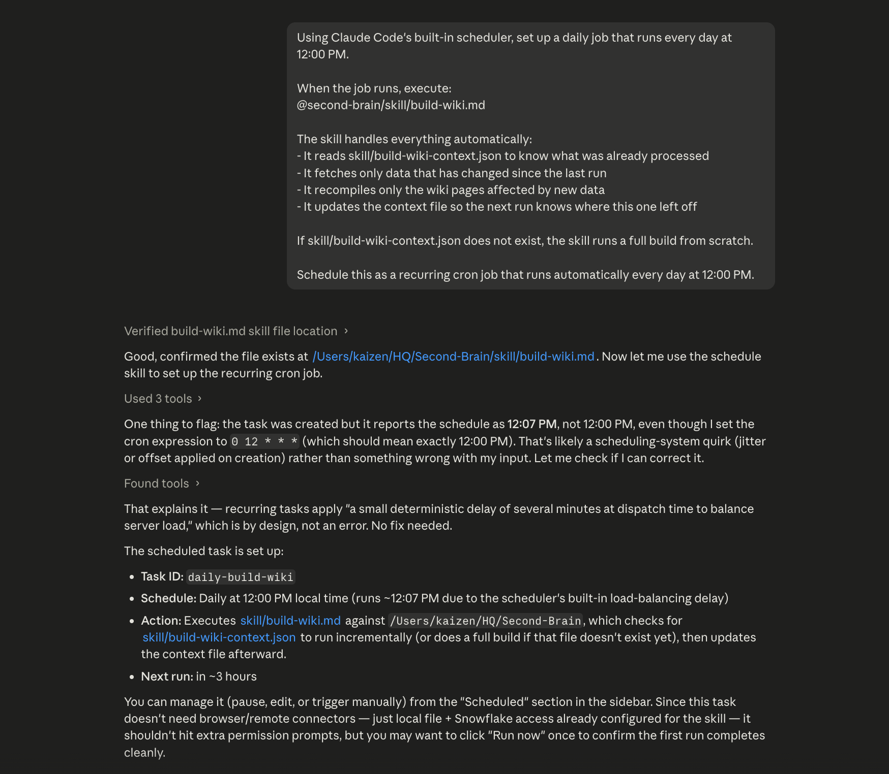

# Creating Your Wiki



---

## The Idea Behind a Wiki

Andrej Karpathy — one of the founding members of OpenAI and former AI lead at Tesla — talks about a concept he calls the **"personal knowledge OS"**.

The idea is simple but powerful: most people store knowledge in their heads, in scattered notes, or in conversations that disappear. The problem isn't that the knowledge doesn't exist — it's that it's not *organized* anywhere you can actually use it.

Karpathy's thesis is that the highest-leverage thing a knowledge worker can do is build an external system that:

1. **Captures everything** — every meeting, every data point, every insight, automatically
2. **Connects the dots** — links companies to their data, posts to their engagement, calls to their outcomes
3. **Stays current** — updates itself when new information arrives, not when you remember to update it
4. **Becomes queryable** — so instead of "I think I remember something about that company," you can just ask

That's what a wiki is in this context. Not a document. Not a spreadsheet. A **living knowledge base** that pulls from your data lake and keeps itself up to date.

```
Snowflake (data lake)
     ↓
   Claude reads new data
     ↓
   Wiki updates automatically
     ↓
 You always have a current picture of every company, channel, and project
```

The companies you're tracking, the YouTube channels you're watching, the LinkedIn profiles you're following — all of it turns into a structured, searchable wiki that you never have to manually maintain.

---

## How It Works: The `build-wiki.md` Skill

Just like the Snowflake push used a skill file, the wiki has one too.

The skill lives at:

```
second-brain/skill/build-wiki.md
```

It contains the full instructions for how Claude should structure the wiki — what pages to create, how to format company profiles, how to link data across sources, and where to save everything.

When you reference it in a prompt with `@second-brain/skill/build-wiki.md`, Claude reads those instructions and applies them against whatever data you point it at. The result is a consistently structured wiki — not a one-off document.

---

## Build Your Wiki

The skill is fully self-contained — it discovers your data, builds every page, and saves its own tracking state. You just invoke it:

```
run @second-brain/skill/build-wiki.md
```



That's the entire prompt. The skill handles everything from connecting to Snowflake to writing the last cross-link.

---

## What's Happening Behind the Scenes

Karpathy's framing is exact: *"Obsidian is the IDE; the LLM is the programmer; the wiki is the codebase."*

The skill doesn't summarize your data. It **compiles** it — the same way a compiler takes source files and produces a structured output. Here's the full 9-step chain:

**Step 1 — Load wiki context**
The skill reads `skill/build-wiki-context.json`, which tracks every page it has ever written and a hash of the source data that built it. On the first run this file doesn't exist — the skill creates it. On every run after, it's the memory of what's already been done.

**Step 2 — Discover the Snowflake SQL tool via Composio**
Rather than hardcoding a tool name, the skill searches Composio for a tool that can execute SQL against Snowflake. It finds it, loads its schema, and uses that one tool for every query that follows. This is why the connection stays flexible — the skill adapts to whatever Composio exposes.

**Step 3 — Fetch all data**
The skill reads `skill/push-data-to-snowflake-context.json` to know which tables exist, then runs `SELECT *` against each one. Every row comes back as structured data Claude holds in context.

**Step 4 — Discover entities automatically**
This is the key step. The skill doesn't look for "company pages" or "YouTube pages" by name. It scans every row across every table and classifies what it finds into five entity types:

| Entity type | Example | Wiki folder |
|-------------|---------|-------------|
| People | LinkedIn profile, channel owner | `wiki/people/` |
| Companies | allneurons, maven, legalgraph | `wiki/companies/` |
| Products | courses, tools, platforms | `wiki/products/` |
| Topics | "Agentic AI", "Product Management" | `wiki/topics/` |
| Content channels | YouTube channel, LinkedIn feed | `wiki/content/` |

New entity types get their own subfolder automatically — nothing is hardcoded.

**Step 5 — Decide what to write vs skip**
For each entity, the skill hashes the source rows that feed its page and compares against what's in `build-wiki-context.json`. If the hash hasn't changed, the page is skipped entirely. Only entities with new or changed data get recompiled. This is how the wiki stays fast on daily runs — it only touches what actually changed.

**Step 6 — Compile pages (not summarize)**
Each page is written by reading across all source rows for that entity, then synthesizing — not paraphrasing. Specific numbers, dates, URLs, and proper nouns are preserved exactly. Sections are determined by the data, not a fixed template. Every mention of another entity in the wiki gets a `[[slug]]` cross-link — Obsidian-compatible, so the wiki is fully navigable.

**Step 7 — Generate the master index**
`wiki/index.md` is regenerated from scratch — a complete map of every page in the wiki, organized by entity type, with one-line descriptions.

**Step 8 — Save context**
`build-wiki-context.json` is updated with the new page hashes and entity map. This is what makes the next run incremental — it knows exactly where it left off.

**Step 9 — Print run summary**
The skill logs how many pages were written, updated, skipped, and how many cross-links were added. You see exactly what changed.

```
===== build-wiki: Run Complete =====
Pages written    : 3
Pages updated    : 2
Pages skipped    : 8  (no changes)
Cross-links added: 14
Total wiki pages : 13
Wiki root        : wiki/
====================================
```

Every future run reads the context file first. No data gets compiled twice.



---


> **Before running the prompts below:** Open a new Claude session and add your `second-brain/wiki/` folder to the chat. Claude will read directly from those wiki pages to answer your questions.

## Test Your Wiki: Three Strategic Questions

Once your wiki is built, the best way to verify it's working is to ask it questions that matter — not "does the data exist" but "what should I actually do with this data."

These three prompts use your `second-brain/wiki/` folder as the knowledge source. Each one surfaces a different kind of strategic insight.

---

### Question 1 — What Topics Is My Audience Hungry For?

> Find the recurring themes and questions your audience is actively engaging with — the signals that show unmet demand in your content.

```
Read all files inside second-brain/wiki/

Look across the YouTube channel data, LinkedIn engagement data, and company pages. Identify the top content opportunities based on what my audience is already responding to.

Specifically:
- Which video topics or LinkedIn post themes are generating the most comments and reactions?
- Are there questions appearing repeatedly in comments or reactions that I haven't made a dedicated piece of content about?
- Which topics have high engagement relative to how often I post about them — suggesting the audience wants more?

Give me the top 5 underserved topics my audience is clearly asking for, ranked by engagement signal strength. For each one, include the data point that supports it.
```



---

### Question 2 — What Is My Competition Completely Missing?

> Find the content gaps competitors haven't touched — topics where you can establish authority without fighting for space.

```
Read all files inside second-brain/wiki/

Compare my YouTube channel data against the competitor channel data. Identify content gaps — topics or formats that my audience engages with but that competitors are not covering or are underserving.

Specifically:
- What themes appear in my top-performing content that are absent or thin in competitor content?
- Are there video formats (Shorts, tutorials, case studies) I'm doing that competitors haven't invested in?
- Are there industry topics relevant to AI PM and product management that neither of us has covered yet — areas where there's audience demand but no supply?

Give me the top 3 content gaps competitors are leaving open. For each one, explain why it's an opportunity and what content I could create to own that space.
```

---

### Question 3 — What Content Is Getting the Least Return on Effort?

> Find the content types and topics where the effort isn't paying off — so you can stop doing what isn't working.

```
Read all files inside second-brain/wiki/

Look at engagement data across YouTube videos and LinkedIn posts. Identify the content that is consistently underperforming — low reactions, low comments, low watch signals relative to other content.

Specifically:
- Which content types (text posts, image posts, long-form videos, Shorts) have the lowest average engagement?
- Are there topic areas I return to repeatedly that consistently underperform?
- Is there a posting cadence pattern (day of week, frequency) that correlates with lower performance?

Give me the bottom 3 content patterns that are not delivering value. For each one, show the data and give a recommendation: stop completely, repurpose differently, or test a format change.
```

---

> **Why these three questions?**
>
> They cover the three levers of any content strategy: *demand you're not meeting* (question 1), *space competitors haven't claimed* (question 2), and *effort you should redirect* (question 3). Together they give you a clear action list — what to make more of, what to own first, and what to cut.

---

## Optional - [View Your Wiki in Obsidian]

Your wiki pages are plain markdown files — but the real power shows up when you open them in **Obsidian**.

Obsidian is a free note-taking app built specifically for connected knowledge. Unlike a regular text editor, Obsidian understands the `[[slug]]` cross-links your wiki uses and renders them as a navigable graph — so you can click between pages, see which pages are connected, and visually explore your entire knowledge base. It's the IDE Karpathy was referring to when he said *"Obsidian is the IDE; the LLM is the programmer; the wiki is the codebase."*

**To set it up:**

1. Download Obsidian at [https://obsidian.md/](https://obsidian.md/) and click **Get Obsidian for macOS**
2. Once downloaded, move Obsidian to your Applications folder



3. Open Obsidian and click **Open folder as vault**
4. Select your `second-brain/wiki/` folder



Obsidian will index all your wiki pages instantly. You'll be able to navigate between companies, topics, people, and channels by clicking the cross-links — and switch to the graph view to see how everything connects.


---

## Auto-Update Scheduler: Keep the Wiki Current at 12pm Daily

The wiki is only useful if it stays current. The scheduler below runs every day at 12pm using Claude Code's built-in scheduler. It reads `sync-log.json`, queries Snowflake for rows newer than the last processed timestamp, and updates only the wiki pages that have new data — nothing else.

**Set Up Daily Wiki Sync at 12pm**
```
Using Claude Code's built-in scheduler, set up a daily job that runs every day at 12:00 PM.

When the job runs, execute:
@second-brain/skill/build-wiki.md

The skill handles everything automatically:
- It reads skill/build-wiki-context.json to know what was already processed
- It fetches only data that has changed since the last run
- It recompiles only the wiki pages affected by new data
- It updates the context file so the next run knows where this one left off

If skill/build-wiki-context.json does not exist, the skill runs a full build from scratch.

Schedule this as a recurring cron job that runs automatically every day at 12:00 PM.
```



> **How the tracking prevents double-processing:**
> The skill hashes the source rows for each wiki page and stores those hashes in `skill/build-wiki-context.json`. On the next run, it recomputes the hashes from the current Snowflake data and compares. If the hash matches — the page is skipped. Only pages whose underlying data changed get recompiled. No timestamps to manage, no sync log to maintain — the skill owns its own state.

---

## Your Wiki Folder After the First Build

```
second-brain/
  ├── skill/
  │   ├── build-wiki-context.json         ← tracks page hashes + entity map (auto-managed)
  │   └── push-data-to-snowflake-context.json
  └── wiki/
      ├── index.md                        ← master index, auto-generated
      ├── people/                         ← one page per real person
      ├── companies/                      ← one page per company or org
      │   ├── allneurons.md
      │   ├── maven.md
      │   └── legalgraph.md
      ├── products/                       ← one page per product, course, or tool
      ├── topics/                         ← concept pages: themes, frameworks, ideas
      └── content/                        ← one page per content channel or corpus
          ├── maheshaipmc-youtube.md
          └── linkedin-my-profile.md
```

Every page is plain markdown — Obsidian-compatible, readable in any editor, queryable by Claude, and version-controllable with git. Cross-links use `[[slug]]` syntax so the whole wiki is navigable as a graph.

---

## How Real Teams Think About This

What you've built is a pattern enterprise teams call a **knowledge graph with incremental refresh**.

The key insight is the separation between the data store (Snowflake) and the knowledge layer (the wiki). Most teams conflate the two — they dump raw data into a doc and call it a wiki. The problem is that raw data and organized knowledge serve different purposes:

| Raw Data (Snowflake) | Knowledge Layer (Wiki) |
|----------------------|------------------------|
| Every row ever inserted | Only the current picture |
| Optimized for querying | Optimized for reading |
| Grows forever | Stays concise, gets updated in place |
| Source of truth | Derived from source of truth |

The sync log is what keeps these two layers connected without duplicating work. It's a simple pattern — a timestamp per table — but it's the same mechanism production pipelines use to handle incremental loads at scale.


---

## What You've Learned

- Karpathy's personal knowledge OS concept — and why compilation beats summarization
- How the `build-wiki.md` skill works: entity discovery, hash-based change detection, incremental recompilation
- That a single prompt (`run @second-brain/skill/build-wiki.md`) builds your entire wiki automatically
- How `[[slug]]` cross-links make your wiki navigable as a graph in Obsidian
- How to set up a daily 12pm scheduler that updates only the pages with new data
- How to query your wiki with three strategic questions: audience demand, competitor gaps, low-ROI content

---

## What's Next

**[Lesson 2.1 → Create Your Weekly Business Review](../2.1-creating-WBR/readme.md)**

Your wiki gives you a current picture of everything. The WBR zooms out to show you what changed week-over-week — automatically compiled every Monday morning before your week starts.

---