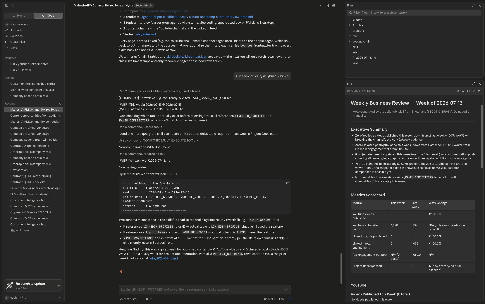

# Creating Your Weekly Business Review (WBR)


---

## What Is a WBR?

A **Weekly Business Review** is a structured document that gives you a complete picture of your business performance in one place, once a week.

Amazon famously runs WBRs every week across the entire company. Every team shows up with the same format — the same metrics, the same structure, the same questions — so leaders can spot problems fast, compare across teams, and make decisions without spending two hours hunting for context.

The same principle applies here. Instead of manually pulling your YouTube numbers, checking your LinkedIn stats, and flipping between your company pages every Monday morning, your WBR compiles everything automatically and presents it in a consistent format — every single week.

Your WBR answers four questions:

1. **What happened this week?** — channel performance, engagement, reach
2. **What changed from last week?** — what went up, what went down, by how much
3. **What's working?** — top content, best engagement, highest-performing company
4. **What needs attention?** — drops, gaps, stalled metrics

When this is automated, you walk into every week with a full briefing already waiting for you.

---

## How It Works: The `build-wbr.md` Skill

The WBR is built by a skill file that lives in your `second-brain` folder:

```
run second-brain/skill/build-wbr.md
```

The skill connects to Snowflake via Composio, queries the last 7 days of data across all your tables, compares it against the previous week, and compiles a structured markdown report. It saves the report to your wiki folder with the week's date in the filename so you build up a historical archive automatically.

```
second-brain/wiki/wbr/
  ├── 2026-07-07.md
  ├── 2026-07-14.md   ← this week
  └── ...
```

You never write the WBR manually. You invoke the skill — Claude does the rest.

---

## Build Your First WBR

Open a Claude session with your `second-brain` folder added, then paste:

```
run @second-brain/skill/build-wbr.md
```



That's it. The skill handles everything — querying Snowflake, comparing week-over-week, writing the report, and saving it to the right place.

---

## What the WBR Contains

The skill compiles a report with these sections every week:

**1. Week Summary**
A 3–5 sentence plain-English overview of what happened this week — written by Claude, not a template fill-in.

**2. Channel Performance**

| Metric | This week | Last week | Change |
|--------|-----------|-----------|--------|
| YouTube subscribers | — | — | — |
| YouTube total views | — | — | — |
| LinkedIn connections | — | — | — |
| LinkedIn post reactions | — | — | — |

**3. Top Content This Week**
The single best-performing YouTube video and LinkedIn post from the last 7 days — title, engagement numbers, and a one-line note on why it performed well.

**4. Company Pulse**
For each company in your `projects/` folder — any new data added this week, notable changes, or flags if nothing has been updated in a while.

**5. What Needs Attention**
Any metric that dropped more than 10% week-over-week. Any company folder that hasn't been updated in 14+ days. Any table in Snowflake with no new rows this week.

**6. One Recommendation**
Based on the week's data, one specific thing to do differently next week — derived from the patterns in the numbers.


> **Note:** The WBR becomes most valuable once you have a few weeks of data accumulated in Snowflake. If you've just set up the pipeline, run it for a week or two first — then come back and the report will have real week-over-week comparisons to show. In the meantime, you can use this same setup to create an **EBR (Executive Business Review)** — a one-time snapshot of all your data in one place, without needing historical comparison.

---

## What's Happening Behind the Scenes

When you run `build-wbr.md`, here's what Claude does:

**1. Connects to Snowflake via Composio**
The skill searches for the Snowflake SQL tool via Composio MCP — same as the wiki skill — and uses it to run all queries.

**2. Queries this week's data**
Pulls rows from every table where the timestamp falls within the last 7 days.

**3. Queries last week's data**
Pulls the same rows for the 7 days before that, so it can calculate week-over-week changes.

**4. Compiles the report**
Writes the WBR in structured markdown — numbers filled in, changes calculated, summary written, recommendation generated.

**5. Saves with the date**
Saves to `second-brain/wiki/wbr/YYYY-MM-DD.md` using the Monday of the current week as the filename. Every week's report is a separate file — you always have the full history.

---

## Automate It: Weekly WBR Every Monday at 8am

Set it once — your WBR is ready before your week starts.

```
Using Claude Code's built-in scheduler, set up a weekly job that runs every Monday at 8:00 AM.

When the job runs, execute:
run @second-brain/skill/build-wbr.md

The skill handles everything automatically:
- Connects to Snowflake via Composio MCP
- Queries this week's and last week's data
- Calculates week-over-week changes
- Writes the WBR report
- Saves it to second-brain/wiki/wbr/YYYY-MM-DD.md

If no data is found for the current week, log: "No data for this week — WBR skipped."

Schedule this as a recurring job that runs automatically every Monday at 8:00 AM.
```

> **Why Monday at 8am?** Your weekly data fetch runs at 10am. By scheduling the WBR for 8am, it processes data from the previous week — everything from Monday through Sunday — before the new week's first fetch kicks in. You get a clean, complete review of the week that just ended.

---

## Your WBR Archive Over Time

After a few months, your `wiki/wbr/` folder becomes one of the most valuable assets in your second brain:

```
second-brain/wiki/wbr/
  ├── 2026-06-01.md
  ├── 2026-06-08.md
  ├── 2026-06-15.md
  ├── 2026-06-22.md
  ├── 2026-06-29.md
  ├── 2026-07-07.md
  └── 2026-07-14.md
```

Every report is a snapshot in time. You can ask Claude to read across all of them and surface trends you'd never catch week-to-week — which months had the best growth, which content themes have been building momentum, where you've been consistently losing ground.

---

## How Real Teams Think About This

Amazon's WBR process is famous for one rule: **the data speaks first**.

Before any discussion, everyone reads the same document with the same numbers. No one summarizes from memory. No one brings a different version of the metrics. The WBR is the shared source of truth — and because it's always in the same format, the team gets faster at reading it every week.

What you've built here follows the same logic. The format is consistent because the skill writes it. The data is current because it comes straight from Snowflake. And because it runs automatically, you never skip a week because you were too busy to pull it together.

The discipline isn't in writing the review. The discipline is in reading it.

---

## Claude Concepts Covered in This Lesson

| Concept | Where it appeared | Learn more |
|---------|-------------------|------------|
| **Skill files** | **How It Works** — *"The WBR is built by a skill file that lives in your second-brain folder."* | [Claude Code slash commands](https://docs.anthropic.com/en/docs/claude-code/slash-commands) |
| **Scheduled tasks** | **Automate It** — *"Set up a weekly job that runs every Monday at 8:00 AM."* | [Claude Code Overview](https://docs.anthropic.com/en/docs/claude-code) |
| **MCP Tool Use** | **Behind the Scenes** — *"The skill searches for the Snowflake SQL tool via Composio MCP."* | [MCP Documentation](https://docs.anthropic.com/en/docs/claude-code/mcp) |

---

---

## What You've Learned

- What a WBR is and why Amazon's "data speaks first" principle makes it powerful
- How the `build-wiki.md` skill compiles your Snowflake data into a structured weekly report
- What the 6 WBR sections cover: summary, channel performance, top content, company pulse, what needs attention, one recommendation
- How the weekly scheduler runs every Monday at 8am — before the daily fetch — so the report covers a clean full week
- That every WBR is saved with a date stamp, building an archive you can query for long-term trends

---

## You've Completed the Module

You've built a full data pipeline from scratch — channels connected, data flowing into Snowflake, a wiki that maintains itself, and a weekly review that arrives before your week starts. Here's what you've built end to end:

```
YouTube + LinkedIn
       ↓  (Composio MCP)
    Claude pulls data
       ↓
    second-brain/raw/
       ↓  (push skill, 6am daily)
    Snowflake (SECOND_BRAIN database)
       ↓  (build-wiki skill, 12pm daily)
    second-brain/wiki/
       ↓  (build-wbr skill, 8am Monday)
    second-brain/wiki/wbr/YYYY-MM-DD.md
```

Every step runs automatically. You set it up once.

---

[← Back to module index](../../README.md)
