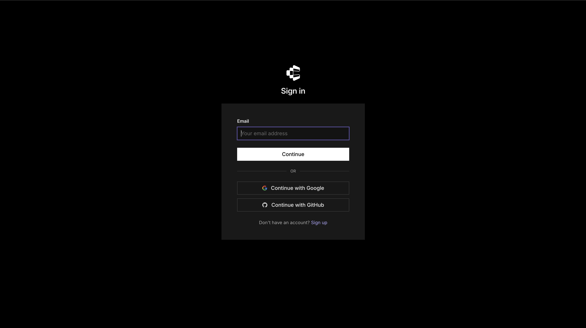

# Creating Your Composio Account

---

Before we start, let’s talk about why this step matters.

In the last lesson, we set up our folder structure. Now we need a way for Claude to connect to the tools we will use. We want Claude to work with data from YouTube, LinkedIn, and Snowflake. But we do not want to connect every tool manually every time.

That is where Composio helps us.

Composio is like a middle layer between Claude and the tools. Instead of Claude talking to each tool directly, Claude talks to Composio. Composio then connects to the right tool for us.

This makes the whole setup much easier. We connect things once, and then we can use them again and again.

---

## What Composio Does

Think of Composio as a bridge.

It helps us connect Claude to the tools we need in one place. Once the connection is set up, Claude can use those tools without us doing extra work each time.

In this course, we will use Composio to connect things like:

- YouTube
- LinkedIn through Apify
- Snowflake

This is an important step because everything else in this course depends on it.

---

## Step 1: Go to Composio

Open your browser and go to:

https://app.composio.dev

---

## Step 2: Create Your Account

Click **Sign Up** and create your account.

You can use Google, or you can sign up with your email and password. Either option is fine.

---

## Step 3: Verify Your Email

If you sign up with email, check your inbox for the verification email. Click the link to activate your account.

---

## Step 4: Open Your Dashboard

Once your account is ready, log in. You will land on the Composio dashboard.

This is where your connections will live. It is the place where you will connect tools and manage them later.

Take a moment to look around. You will see sections like:

- **Toolkit** — where you find and connect tools
- **Projects** — where you can organize your work
- **Connections** — where your connected accounts appear
- **MCP Servers** — where you create the connection for Claude

We will use these sections in the next lessons.

---

## Why This Step Is Important

This step is not just about signing up.

It is about giving Claude access to the tools it needs. Without this setup, Claude cannot easily reach the systems we want to use. With Composio, we create one central place for these connections.

This also helps us avoid a common problem. Instead of putting login details directly into scripts, we let Composio handle the connection securely.

---

## What You Have Learned

By the end of this lesson, you should know:

- what Composio is
- why we use it
- how to create your account
- where to find the main parts of the dashboard

---

## What’s Next

In the next lesson, we will set up Apify. Apify will let Claude collect data from LinkedIn without building a scraper from scratch.

**[Lesson 0.3 → Set Up Apify](../0.3-setup-apify/readme.md)**

---

[← Back to module index](../../README.md)
