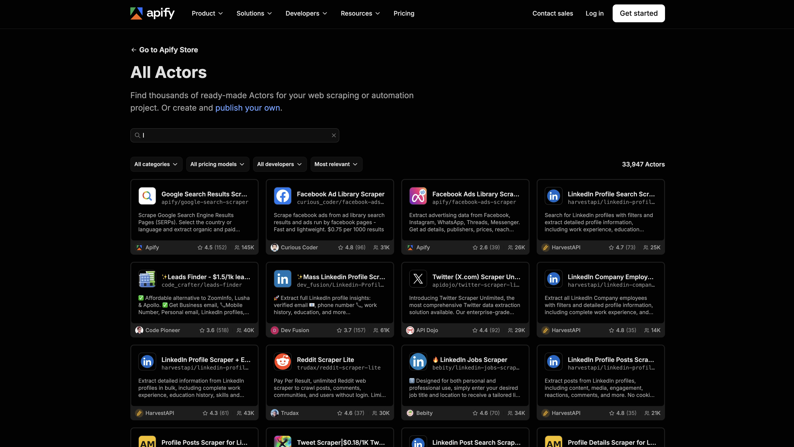
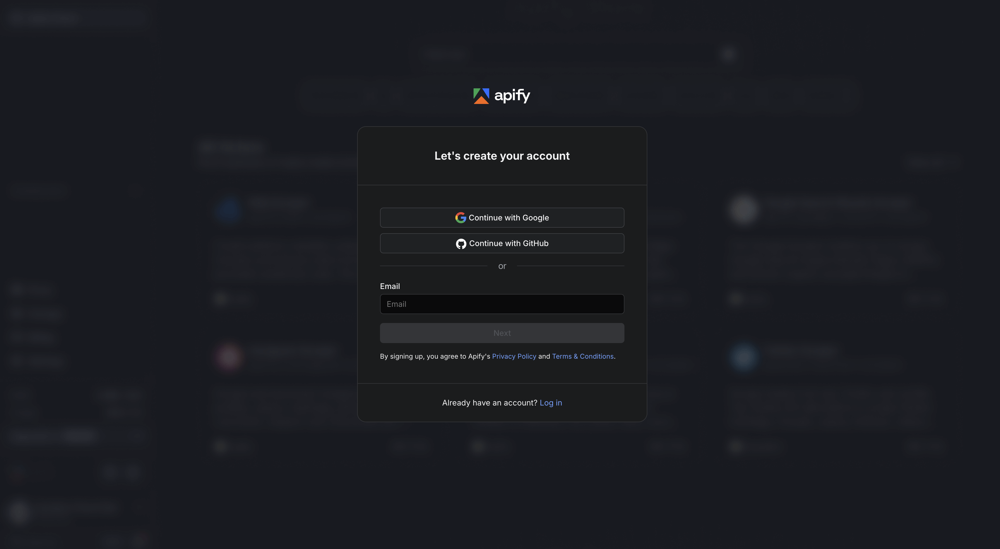
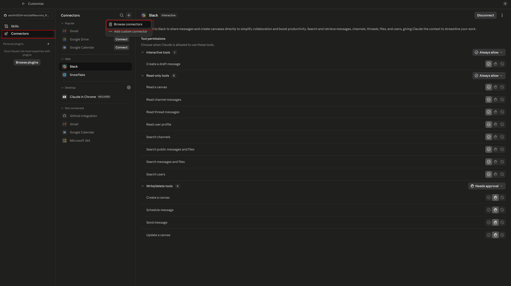
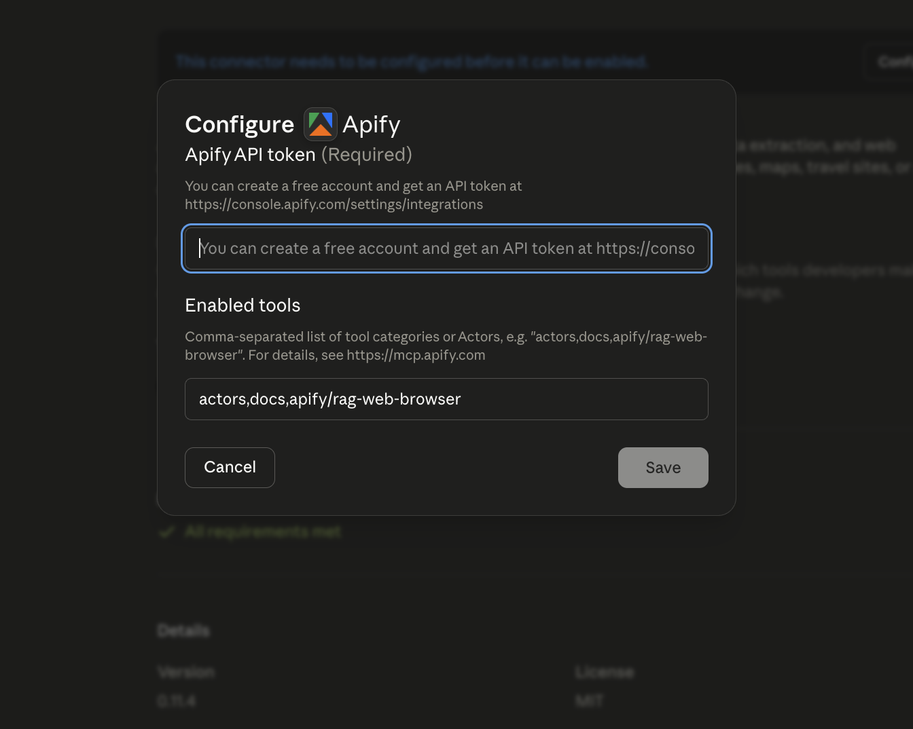
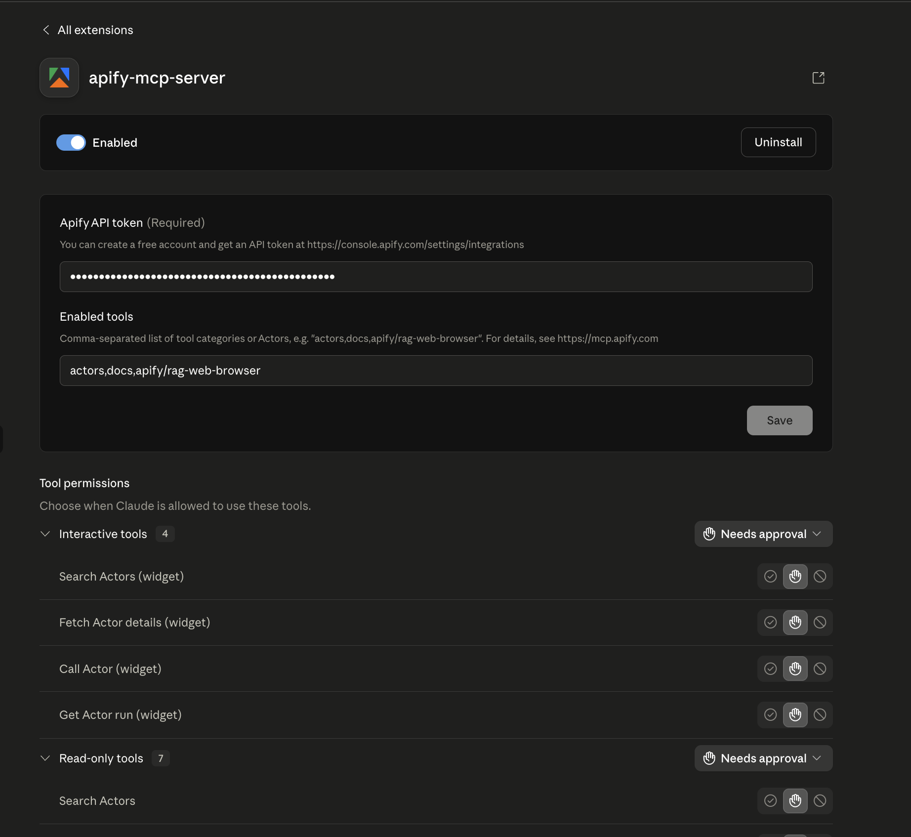
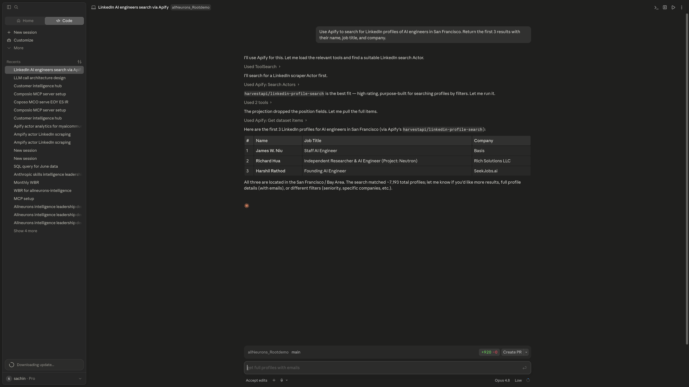

# Setting Up Apify

---

So far, we have already set up Composio and learned how our tools will connect. Now it is time to bring real data from the web into the picture.

This lesson is about Apify. We will use LinkedIn as our example. If we want to collect people, companies, or job posts from LinkedIn, we could try to build our own scraper. That takes time and often breaks. Instead, we will use Apify, which gives us a much easier and faster way to collect that data.

Apify is a platform that already has ready-made tools for collecting data from websites. We will use it to pull LinkedIn data in a clean format. Once we collect that data, the next step will be Snowflake, where we can store and organize it.

---

## What Apify Does

Think of Apify as a helper for web data.

Instead of building a scraper from scratch, we use a pre-built tool that already knows how to collect data from websites. This saves time and makes the process much more reliable.

In our case, we will use Apify to pull LinkedIn data. That means we can get useful information without doing all the hard scraping work ourselves.

---

## Step 1: Create Your Apify Account

Open your browser and go to the Apify Store:

https://apify.com/store



Click **Get Started**.


You can sign up with Google, or you can use your email. Either option is fine.

Once you are in, you will see your Apify dashboard.



---

## Step 2: Copy Your API Token

To let Claude use Apify, we need to give it permission. That permission comes from an API token.

Follow these steps:

1. Click your profile icon in the top-right corner
2. Open **Settings**
3. Go to **API & Integrations**
4. Copy the personal API token

Keep this token private. It is like a password for your Apify account.


---

## Step 3: Install the Apify Connector in Claude

Now we need to tell Claude that Apify is available.

1. Open the Claude desktop app
2. Click **Customize**
3. Go to **Connectors** → **Browse Connectors**
4. Search for **Apify**
5. Click **Install**




---

## Step 4: Paste Your API Token

After installation, Claude will ask for your API token.

1. Paste the token you copied earlier
2. Click **Connect**



---

## Step 5: Check That It Works

Once it is connected, you should see Apify in your connectors list with a green **Enabled** status.

That means Claude is ready to use Apify.



---

## Step 6: Test It With a LinkedIn Example

Now let’s try a real example.

Open a new chat in Claude and paste this prompt:

```text
Use Apify to search for LinkedIn profiles of AI engineers in San Francisco. Return the first 3 results with their name, job title, and company.
```

Claude will use Apify to fetch the data and show the results in the chat.

It may take a little time, but that is normal. The important thing is that Claude is pulling real data from the web.



If the results are not perfect, that is okay. Sometimes web data is messy. The important part is that the connection works and the data is coming through.

---

## Why This Matters

This is a big step because now Claude can go out and collect real-world data for us.

That means we are no longer limited to data we already have. We can pull fresh information from the web and use it in our workflow.

In the next step, we will connect this flow to our larger system so the data can be stored and used properly.

---

## What's Next

**[Lesson 0.4 → Set Up Snowflake](../0.4-creating-snowflake-account/Readme.md)**

In the next lesson, we will create our Snowflake account. Snowflake will be the permanent home where all the data we collect gets stored and organized.

---

[← Back to module index](../../README.md)
