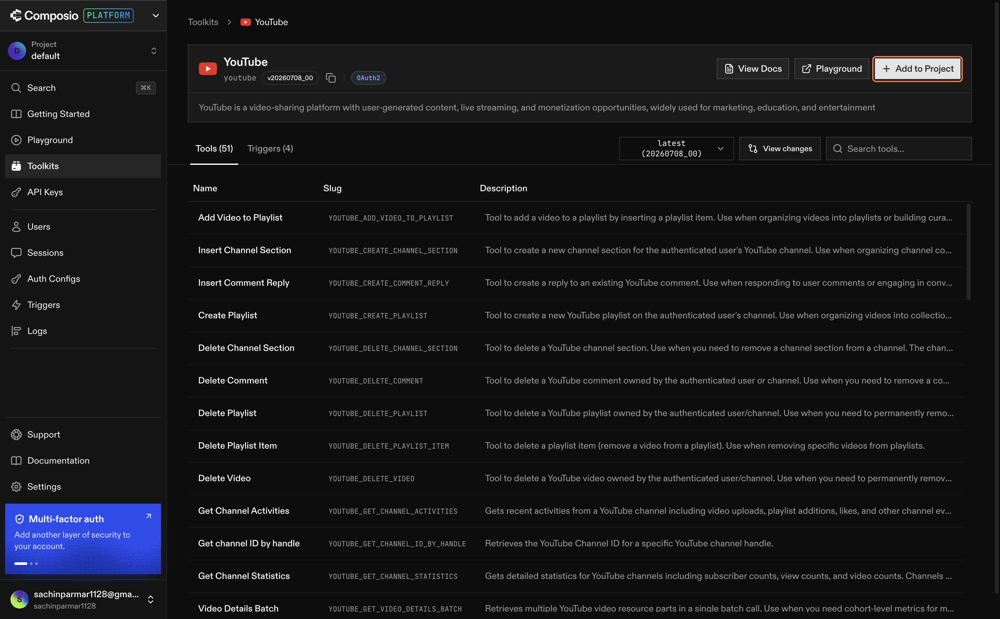
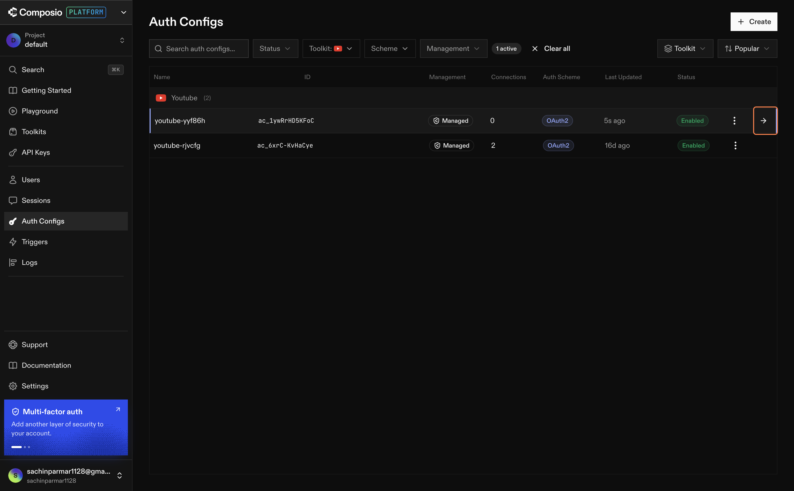

# Enabling Your Channels in Composio

---

So far, we have set up the basic pieces of our system. We now have the tools, the account, and the plan. The next step is simple but important: we need to connect our data sources.

In this lesson, we will connect YouTube and LinkedIn to Composio. YouTube will connect directly, while LinkedIn will be connected through Apify. Once that is done, Claude will be able to reach these platforms through one central setup.

Think of this as opening the doors to the places where our data lives. Without these connections, Claude cannot pull data from the outside world. With them, it can start working with real information.

---

## What We Are Doing

Composio acts as the middle layer between Claude and the tools we use.

Instead of connecting to each platform separately every time, we connect them once in Composio. After that, Claude can use them through one simple setup.

In this lesson, we will open two doors:

- one for YouTube
- one for LinkedIn

Once both are open, Claude can use them whenever we need it.

---

## Step 1: Connect YouTube

Open [Composio](https://app.composio.dev) and log in to your account.

### 1.1 — Find the YouTube Toolkit

In the left sidebar, click **Toolkit**.

In the search bar, type **YouTube**.

Click the YouTube integration when it appears.

### 1.2 — Add It to Your Project

Click **Add to Project**.

On the next screen, click **Next**.

### 1.3 — Create the Auth Config

On the authentication screen, click **Create Auth Config**.

This step sets up the connection securely so Composio can talk to YouTube on our behalf.

### 1.4 — Connect Your Account

Click the connect icon shown on the screen.

A pop-up will open and ask you to choose a Google account. Select the account that owns your YouTube channel.

Then grant the permissions that are requested.

Click **Continue**.

### 1.5 — Confirm the Connection

You will be sent back to Composio. If everything worked, you will see your YouTube account connected with a green status.

That means Claude now has access to your YouTube data through Composio.

---

## LinkedIn is already connected through Apify

---

## Why This Matters

This step is important because it gives Claude access to real data sources.

Without these connections, all we have is a setup. With them, Claude can start pulling information from YouTube and LinkedIn whenever we ask it to.

This is also the cleaner way to work. Instead of manually logging in each time or storing credentials in random places, Composio handles the connection for us.

---

## What You Have Learned

By the end of this lesson, you should know:

- why we connect channels in Composio
- how to connect YouTube and LinkedIn
- why this makes Claude more useful in your workflow

---

## What’s Next

**[Lesson 1.1 → Connect Claude to Composio via MCP](../1.1-connecting-snowflake-composio/Readme.md)**

Now that your channels are connected, the next step is to connect Claude itself to Composio so everything works together in one flow.

---

[← Back to module index](../../README.md)
