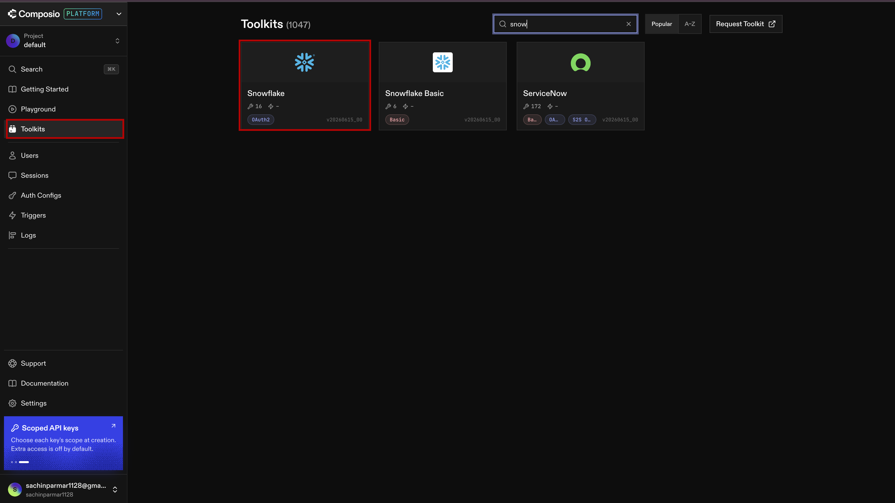
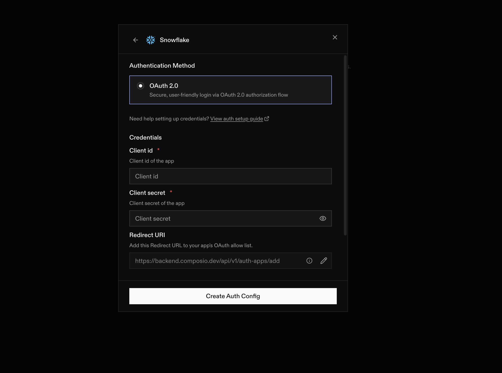
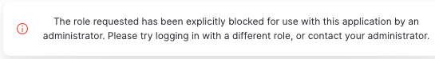

# Connecting Snowflake to Composio

---

So far, we have pulled data from the outside world and connected the main tools. Now comes the part that makes everything useful: we need a place to keep that data permanently.

You already know the problem. If data only lives inside a chat, it disappears when the session ends. You cannot compare it later. You cannot build reports from it. And you cannot really use it as a system.

That is why this lesson matters.

In this lesson, we will connect Snowflake to Composio. Once that connection is ready, Claude will be able to send data from YouTube, LinkedIn, and Zoom into Snowflake and keep it there for future use.

Think of this as the moment where your setup stops being just a demo and becomes a real workflow.

---

## Why This Step Matters

A lot of people stop at the point where they can fetch data. But that is only half the job.

If the data is not stored somewhere permanent, then it is not really part of a system yet. It is just a one-time result.

Snowflake gives us that permanent home. It is where the data can live, grow, and be used later.

So the goal of this lesson is simple:

- connect Composio to Snowflake
- give Claude permission to write there
- make sure the data has a real place to go

---

## What We Are Building

Here is the flow we are setting up:

```text
YouTube → Claude + Composio → Snowflake
LinkedIn → Apify → Claude → Snowflake
Zoom → Claude + Composio → Snowflake
```

This means:

- YouTube, LinkedIn, and Zoom are the sources
- Composio is the bridge
- Snowflake is the destination

Once this connection is live, Claude can pull data from the sources and store it in Snowflake automatically.

---

## Step 1: Add Snowflake as a Toolkit

Open [Composio](https://app.composio.dev) and log in to your account.

In the left sidebar, click **Toolkit**.

In the search bar, type **Snowflake**.



Click the Snowflake integration, then click **Add to Project**.


A setup window will appear. Click **Next**.

---

## Step 2: Understand the OAuth Setup

This part is a little different from the earlier steps, but it is still simple once you see what is happening.

Composio needs permission to talk to Snowflake. It cannot just walk in without approval. That is why Snowflake uses **OAuth**.

OAuth is just a secure way to give one app permission to access another app without sharing your password.

Think of it like giving a trusted helper a special key to open one room, instead of handing over your main key to everything.

Because Snowflake is a database platform, the setup needs a few extra steps. We first register Composio as a trusted app inside Snowflake, and then we complete the connection.

---

## Step 3: Copy the Composio Redirect URL

Before we move on, we need one value from Composio.

Snowflake will send a confirmation back to Composio once the connection is approved. That confirmation uses something called the **Redirect URL**.

Copy the Redirect URL shown on the screen. It will look something like this:

```text
https://backend.composio.dev/api/v1/auth-apps/add
```

Keep it handy. We will use it in the next step.


---

## Step 4: Set Up the Connection Inside Snowflake

Now we go into Snowflake and run a short setup script.

This does not require you to write SQL from scratch. You are just registering Composio as a trusted app inside Snowflake.

### 4.1 — Open the Snowflake Workspace

Log in to your Snowflake account and go to **Projects → Worksheets**.


Click **+ Add → SQL Worksheet** to create a new SQL file.


Name it something like `composio-oauth-setup`.

---

### 4.2 — Paste and Run the Setup Script

Copy the SQL below into the worksheet.

> **Important:** Replace the `OAUTH_REDIRECT_URI` value with the Redirect URL you copied from Composio in Step 3.

```sql
CREATE OR REPLACE SECURITY INTEGRATION COMPOSIO_OAUTH
  TYPE = OAUTH
  ENABLED = TRUE
  OAUTH_CLIENT = CUSTOM
  OAUTH_CLIENT_TYPE = CONFIDENTIAL
  OAUTH_REDIRECT_URI = 'https://backend.composio.dev/api/v1/auth-apps/add'
  OAUTH_ISSUE_REFRESH_TOKENS = TRUE
  OAUTH_REFRESH_TOKEN_VALIDITY = 7776000;

DESC SECURITY INTEGRATION COMPOSIO_OAUTH;

SELECT SYSTEM$SHOW_OAUTH_CLIENT_SECRETS('COMPOSIO_OAUTH');
```

Click **Run All**.


---

### What This Script Is Doing

This script is doing three simple things:

- it creates the Snowflake integration for Composio
- it checks that the integration was created successfully
- it generates the credentials Composio will use to connect next time

That is why this step is important. It gives Snowflake the information it needs to trust Composio.

---

## Step 5: Copy Your Credentials

After the script runs, you will see output at the bottom of the screen.

You need two values from that output:

| Value | What it means |
|---|---|
| `OAUTH_CLIENT_ID` | A public identifier for the Composio app |
| `OAUTH_CLIENT_SECRET` | The secret key that proves the app is authorized |

Copy both values and keep them safe.


---

## Step 6: Paste the Credentials into Composio

Go back to the Composio window.

Paste the **Client ID** and **Client Secret** into their fields and complete the connection.



Once this is done, Snowflake will appear as a connected toolkit with a green status.

That means the connection is live.

---

## What You Have Built

Now the full setup looks like this:

```text
Claude
  ↓
Composio
  ├── YouTube
  ├── LinkedIn
  ├── Zoom
  └── Snowflake
```

This is the real backbone of the system.

- YouTube, LinkedIn, and Zoom are the sources
- Composio is the bridge
- Snowflake is the destination

So now Claude can pull live data and store it in a proper database instead of leaving it inside a chat.

---

## Why This Is a Big Step

This is where the project moves from “interesting” to “real.”

Before this, you had a setup. Now you have a place where your data can live over time. That means you can build reports, compare results, and keep a proper history of what happened.

That is the difference between a temporary experiment and a working system.

---

## What You Have Learned

By the end of this lesson, you should know:

- why Snowflake is needed as a permanent home for your data
- how OAuth works between Composio and Snowflake
- how to run the SQL setup script in Snowflake
- how to copy the client credentials and finish the connection in Composio

---
## Troubleshooting

If you face the issue below while authenticating Composio and Snowflake:



Run the following SQL queries in Snowflake, replacing `<username>` with your username, then try again:

```sql
DESCRIBE SECURITY INTEGRATION composio_oauth;
ALTER USER <username> SET DEFAULT_ROLE = SYSADMIN;
```


---
## What’s Next

**[Lesson 1.3 → Push Data to Snowflake](../1.2-connecting-claude-composioMCP/readme.md)**

Now that Snowflake is connected, the next step is to actually move data into it. In the next lesson, you will push your collected files into Snowflake and set up the daily sync.

---

[← Back to module index](../../README.md)
