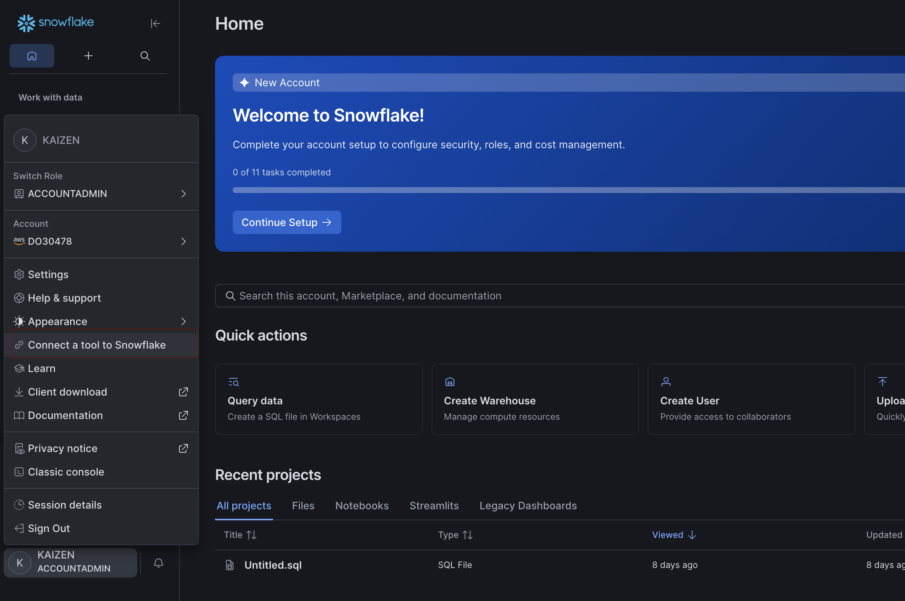
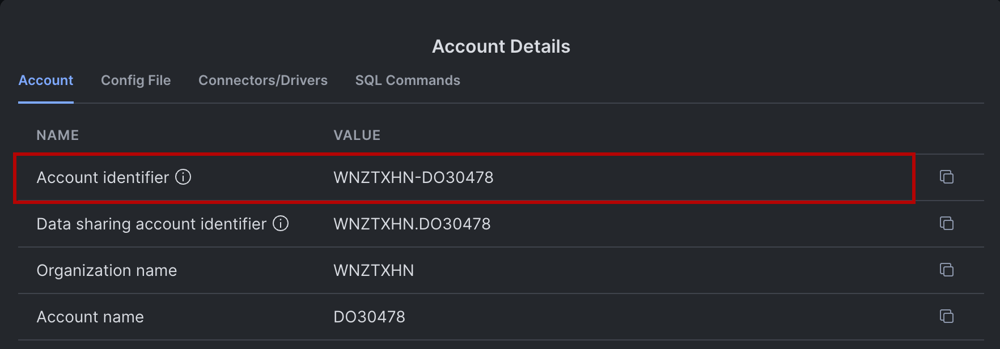
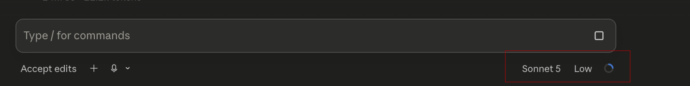
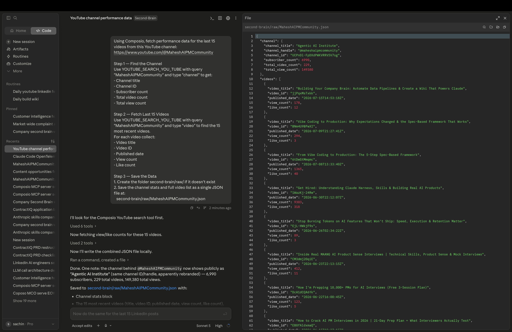
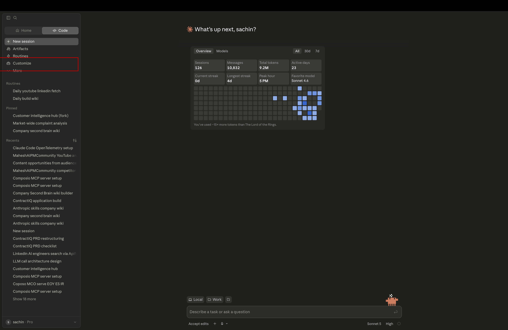
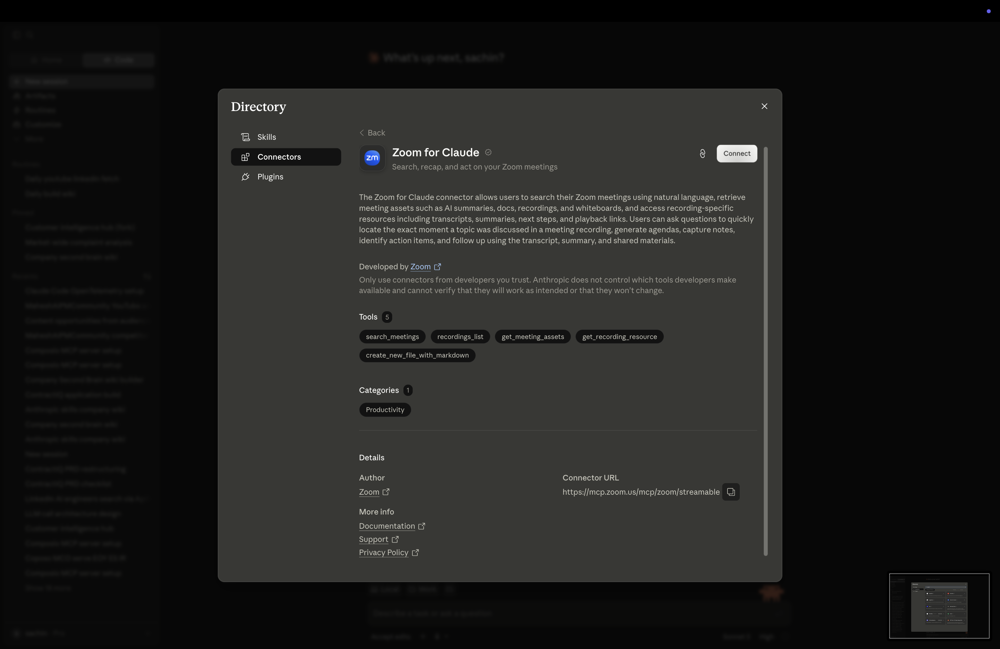
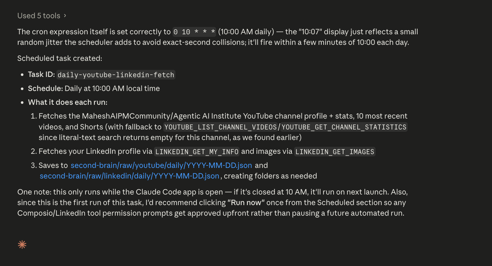

# Connecting Claude to Composio via MCP


---

So far, we have connected our tools and prepared the data sources. Now it is time for Claude to actually use them.

This lesson is about making that connection real. We will connect Claude to Composio through MCP, which is the bridge that lets Claude talk to the tools we set up earlier.

Once this is done, Claude will be able to pull live data from YouTube, LinkedIn, and Zoom, and then use that data in your workflow.

---

## What Is MCP?

MCP stands for **Model Context Protocol**.

In simple words, it is the way Claude talks to external tools. Instead of only using what is inside the chat, Claude can reach out to tools, services, and systems that you connect to it.

Composio acts as the MCP server. It is the place Claude calls when it needs to use your connected tools.

```text
Claude
  ↓
Composio
  ├── YouTube
  ├── LinkedIn
  └── Snowflake
```

Once this connection is live, Claude can use all of those tools in one flow.

---

## Step 1: Connect Claude to Composio

1. Open **Claude Code** in your terminal.

2. Run this prompt — paste it exactly as written:

```text
Run claude mcp remove composio for this project, confirm it's gone from ~/.claude.json, then run claude mcp add composio --transport http https://connect.composio.dev/mcp again and show me the output.
```

3. Once that completes, run this second prompt:

```text
Run claude mcp list and check the status of the composio connection. If it shows as needing authentication, run whatever command triggers the OAuth/login flow for it (check claude mcp auth composio or similar) and open the resulting URL.
```

Claude will handle the commands and may open a browser window for authentication. Complete the login flow there.


---

## Step 2: Provide Your Snowflake Credentials

After connecting Composio, Claude will ask you to authenticate with Snowflake. You will need three things:

- **Username** — the email or username you used when you created your Snowflake account
- **Password** — the password you set when creating your Snowflake account
- **Account Identifier** — follow these steps to find it:

  1. Log in to your Snowflake account
  2. Click on your **profile icon** in the bottom-left corner
  3. Select **Connect a tool to Snowflake**
  
  4. Your account identifier will be displayed there — it looks something like `abc12345.us-east-1`
  

Enter all three when Claude asks for them.

---

## What You Have Built

At this point, you have connected the main pieces of the system:

```text
Claude
  ↓
Composio
```

That is the backbone of everything that comes next.

Now Claude can reach your connected tools on demand. That means it can pull data, run actions, and help you work with your information without you doing every step manually.

---

## Pull Your First Data

Now let us try it with real examples.

Before you begin, make sure your `second-brain` folder is added to Claude so it can read and write files.


If you want, you can switch to the Sonnet model and keep thinking low to save tokens.



---

### YouTube Analytics

Use this prompt in Claude:

```text
Using Composio, fetch performance data for the last 15 videos from this YouTube channel:
https://www.youtube.com/@MaheshAIPMCommunity

Step 1 — Find the Channel
Use YOUTUBE_SEARCH_YOU_TUBE with query "MaheshAIPMCommunity" and type "channel" to get:
- Channel title
- Channel ID
- Subscriber count
- Total video count
- Total view count

Step 2 — Fetch Last 15 Videos
Use YOUTUBE_SEARCH_YOU_TUBE with query "MaheshAIPMCommunity" and type "video" to find the 15 most recent videos.
For each video collect:
- Video title
- Video ID
- Published date
- View count
- Like count

Step 3 — Save the Data
1. Create the folder raw/ if it doesn't exist
2. Save the channel stats and full video list as a single JSON file at:
   raw/MaheshAIPMCommunity.json
```

Claude will ask for permission before writing files. Allow it and check the `raw/` folder in your second-brain folder.



---

### LinkedIn Analytics

For LinkedIn, we will use Apify because it is easier for this kind of data.

Before you run the prompt, make sure you have your Apify API token ready.

Use this prompt:

```text
Use the Apify API to scrape the Mahesh AI PM Community LinkedIn page.
https://www.linkedin.com/company/mahesh-ai-pm-community/

Wait for the run to finish, then fetch the results from the dataset.

Step 2 — Extract the Data
From the actor results, collect:
- Company name
- Follower count
- For each of the 10 posts:
  - Post text
  - Published date
  - Reaction count
  - Comment count
  - Repost count

Step 3 — Save the Data
1. Create the folder /raw if it doesn't exist
2. Save the full results as a single JSON file at: raw/LinkedIn-MaheshAIPM.json
```

---

### Zoom Meeting Transcripts

Before you fetch Zoom meeting transcripts, you need to enable the Zoom connector in Claude.

Follow these steps:

1. Go to the **Customize** section in Claude.
   
   

2. Open the **Connectors** browser.
   
   

3. Search for **Zoom** and connect it.
   
   

4. Complete the authentication and allow access.
   
   

5. Once the connection is ready, restart Claude if needed.

---

### Zoom Meeting Transcripts

You can also pull meeting transcripts from Zoom if you want to capture calls and discussions.

If you have a Zoom Business or Enterprise plan, you can connect Zoom and use this prompt:

```text
Using the Zoom connector, fetch the transcripts from my 2 most recent meetings.

Step 1 — List Recent Meetings
Retrieve my last 2 completed meetings, including:
- Meeting ID
- Meeting topic / title
- Start time
- Duration

Step 2 — Fetch Transcripts
For each meeting, retrieve the full transcript including:
- Speaker names
- Timestamps
- Full spoken text

Step 3 — Save to Raw Folder
Save each transcript as a separate file in raw/zoom/:
- raw/zoom/<meeting-title>-<date>.txt

Create the folder if it doesn't exist.
```

If you do not have a Zoom plan that supports transcripts, you can upload the file manually later.

---

## Set Up a Daily Auto-Fetch

You do not need to come back and run these prompts every day by hand.

You can set up a scheduler so Claude runs them for you automatically.

Use this prompt:

```text
Using Claude Code's built-in scheduler, set up a daily automated data fetch that runs every day at 10:00 AM. Use the Composio MCP server for all data fetching from YouTube and LinkedIn.

Step 1 — YouTube Daily Fetch
Use YOUTUBE_SEARCH_YOU_TUBE with query "MaheshAIPMCommunity" and type "channel" to get:
- Channel title
- Channel ID
- Subscriber count
- Total video count
- Total view count

Then use YOUTUBE_SEARCH_YOU_TUBE with query "MaheshAIPMCommunity" and type "video" to get the 15 most recent videos.
For each video collect:
- Video title
- Video ID
- Published date
- View count
- Like count

Step 2 — LinkedIn Daily Fetch
Make a POST request to the Apify actor:
https://api.apify.com/v2/acts/bebity~linkedin-company-posts-scraper/runs?token=<your-apify-token>

With this JSON body:
{
  "startUrls": ["https://www.linkedin.com/company/mahesh-ai-pm-community/"],
  "maxPosts": 10
}

Wait for the run to finish, fetch the dataset results and collect:
- Follower count
- For each post: post text, published date, reaction count, comment count, repost count

Step 3 — Save with Date Stamp
After each fetch, save both results with today's date in the filename:
- second-brain/raw/youtube/daily/YYYY-MM-DD.json
- second-brain/raw/linkedin/daily/YYYY-MM-DD.json

Create both folder paths if they don't exist.

Schedule this as a recurring cron job that runs automatically every day at 10:00 AM.
```




---

## Why This Matters

This is a big step because it turns your setup into something that can actually work on its own.

You are no longer just talking about ideas. You are connecting Claude to real tools and letting it bring back real data.

That is the foundation for the rest of the course.

---

## What You Have Learned

By the end of this lesson, you should know:

- what MCP is
- how Claude uses MCP to talk to tools
- how to connect Claude to Composio
- how to pull data from YouTube, LinkedIn, and Zoom
- how to set up a daily auto-fetch flow

---

## What’s Next

**[Lesson 1.2 → Connect Snowflake to Composio](../1.1-connecting-snowflake-composio/Readme.md)**

Now that Claude can access your tools, the next step is to give it a place to store the data permanently in Snowflake.

---

[← Back to module index](../../README.md)
