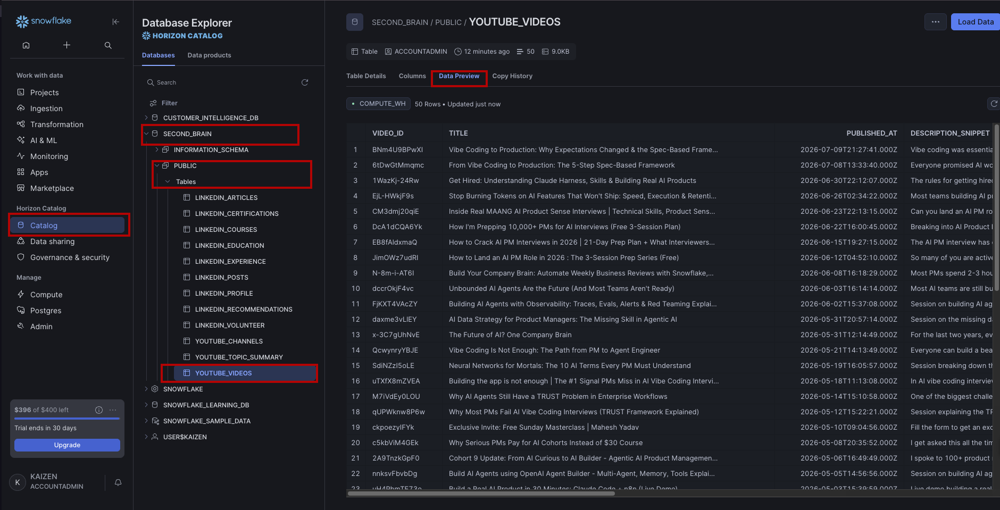
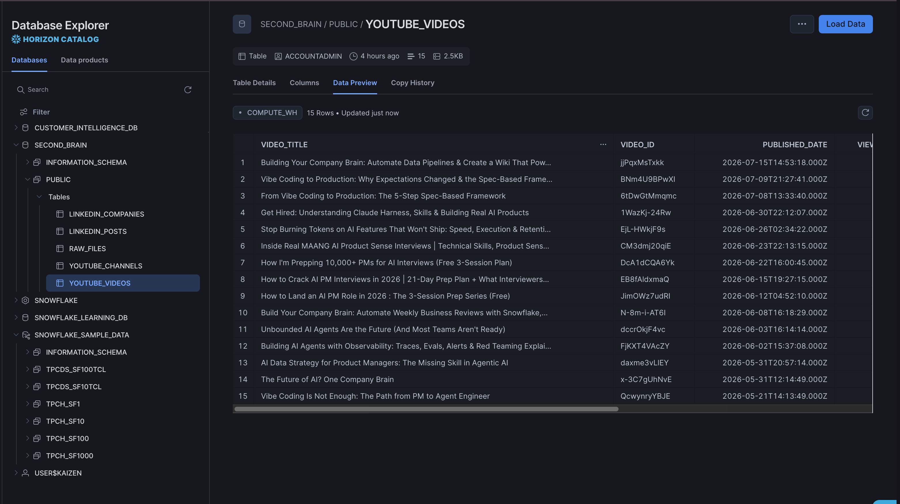
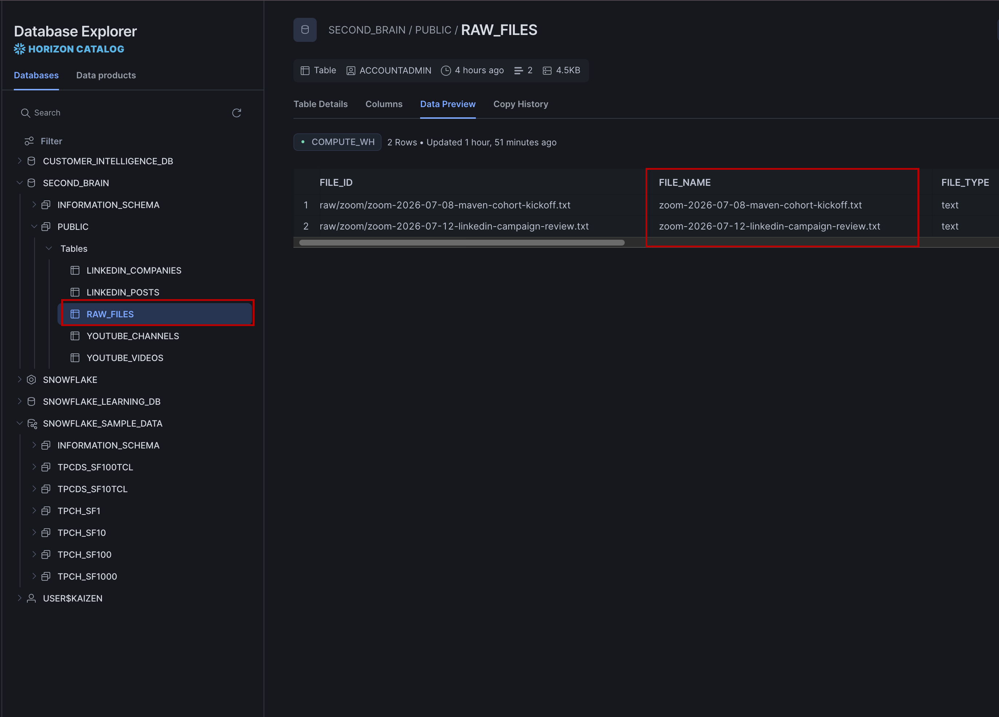

# Pushing Data to Snowflake

---

By now, you have already pulled data from YouTube, LinkedIn, and Zoom. The files are sitting in your second-brain folder, ready to be used.

But there is one problem: they are still just files on your machine.

That means they are not yet part of a real system. They cannot be queried later. They cannot be shared easily. And they cannot grow into a proper history of your work.

This lesson fixes that.

We will take everything from your raw folder and push it into Snowflake. That way your data becomes permanent, organized, and ready for future analysis.

---

## Why This Step Matters

A lot of people stop after they collect data. But collecting data is only the first half of the work.

The real value comes when that data lives somewhere dependable.

Snowflake gives you that home. It becomes the place where your YouTube stats, LinkedIn posts, and Zoom transcripts can live over time.

So this lesson is not just about moving files. It is about turning your workflow into something that can actually scale.

---

## What We Are Pushing

At this point, your second-brain folder likely contains data from three sources:

```text
second-brain/
  └── raw/
      ├── youtube/
      │   └── daily/
      │       └── YYYY-MM-DD.json
      ├── linkedin/
      │   └── daily/
      │       └── YYYY-MM-DD.json
      └── zoom/
          └── community-call-YYYY-MM-DD.txt
```

Not all of this data is the same.

Here is the important difference:

- For YouTube and LinkedIn, we are storing the actual data inside Snowflake. The JSON is parsed and saved into tables so it can be queried later.
- For Zoom transcripts, we are not breaking the file into columns. We are storing the file itself as a raw text record in Snowflake.

So in simple terms:

- YouTube and LinkedIn data becomes structured data in Snowflake
- Zoom transcript becomes a stored file record in Snowflake

That is the key idea here: Snowflake can hold both structured data and raw files. You do not have to force every file into the same shape before you store it.

After the push, the files move into an Archive folder so your raw folder stays clean for the next run.

---

## How the assets File Helps

Instead of writing every Snowflake table and insert command by hand, we use a assets file.

That assets file contains the instructions Claude needs to:

- create the right Snowflake tables
- map the JSON fields into columns
- store Zoom transcripts as raw text
- archive the files after a successful push

You can think of it as a reusable playbook for your pipeline.

The assets file is usually stored here:

```text
second-brain/assets
/push-data-to-snowflake.md
```

When you reference it in a prompt, Claude loads those instructions and runs them for you.

---

## Push Your Data to Snowflake

Paste this prompt into Claude:

```text
@second-brain/assets/push-data-to-snowflake.md

Push all data from raw/ and wiki/ to Snowflake using the Composio MCP server.

Step 1 — Push Structured JSON (YouTube + LinkedIn)
Scan second-brain/raw/youtube/ and second-brain/raw/linkedin/ for JSON files.
For each file:
- Detect the source (youtube or linkedin) and data type
- Create the Snowflake table if it does not exist
- Insert the data as a new row, parsing each JSON field into the appropriate column
- Add a pushed_at timestamp column with the current time
- Log the file path and row count after each successful insert
- Also push the data inside the assets/ folder into Snowflake

Step 2 — Push Zoom Transcripts (Raw File)
Scan second-brain/raw/zoom/ for any .txt transcript files.
For each file:
- Do NOT parse the content — push the full file as a raw text blob
- Create a ZOOM_TRANSCRIPTS table in Snowflake if it does not exist, with these columns:
  - meeting_title
  - meeting_date
  - transcript_text
  - pushed_at
- Insert one row per transcript file
- Log the filename and confirm the insert

Step 3 — Archive All Pushed Files
Once all files have been pushed successfully:
- Move everything from second-brain/raw/ to Archive/raw/
- Preserve the original subfolder structure inside Archive

Step 4 — Summary
After everything is complete, tell me:
- How many files were pushed total
- Which Snowflake tables were created or updated
- Which files were archived
- If any file failed to push, list it with the reason
```


### Verify the data in Snowflake

After the run finishes, check your Snowflake account:

1. Open **Catalog → Data Explorer**
2. Find the database named `SECOND_BRAIN`
3. Open the `PUBLIC` schema
4. Click a table and choose **Data Preview**




---

## Why Files Move to Archive

Once data is safely stored in Snowflake, keeping it in the raw folder creates noise.

The next time the pipeline runs, you do not want old files sitting next to new ones and making everything confusing.

So after a successful push, the files move to Archive. That keeps your raw folder focused on one thing: new data that still needs to be processed.

---

## What Snowflake Looks Like After the Push

Once the push is complete, you will see that your data is no longer just sitting in folders on your computer. It is now stored inside Snowflake.

There are two different types of data being stored:

1. **Structured data for YouTube and LinkedIn**
   - The JSON files are parsed and inserted into Snowflake tables.
   - This means the actual data points like titles, views, likes, posts, and reactions are stored as real rows and columns.
  


2. **Raw file storage for Zoom transcripts**
   - For Zoom, we are not breaking the transcript into separate columns.
   - We are storing the full transcript file as a raw text record inside Snowflake.
   - This is useful when you want to keep the original content intact and query it later.



For example, after the push you may see tables like these:

| Table | What it stores |
|-------|-----------------|
| `YOUTUBE_DAILY` | Structured YouTube data from daily JSON files |
| `LINKEDIN_DAILY` | Structured LinkedIn data from daily JSON files |
| `ZOOM_TRANSCRIPTS` | Full Zoom transcript files stored as text records |

Every new run adds more rows. Over time, your Snowflake account becomes a history of your channel data rather than just a folder of files on your machine.

---

## Set Up a Daily Auto-Sync

The manual push works, but the real power comes when it runs automatically.

You can set up a daily scheduler so every morning Claude checks for new files, pushes them to Snowflake, and archives the ones that are already done.

Use this prompt:

```text
Using Claude Code's built-in scheduler, set up a daily job that runs every morning at 6:00 AM. Use the Composio MCP server to push any new data to Snowflake.

Step 1 — Scan for New Files
Check second-brain/raw/ for files and /wiki added since the last successful push:
- second-brain/raw/youtube/ (JSON files)
- second-brain/raw/linkedin/ (JSON files)
- second-brain/raw/zoom/ (transcript .txt files)
- all the /wiki files also

A file is considered new if it has not already been pushed to Snowflake in a previous run.
Skip any file already pushed so you do not create duplicates.

Step 2 — Push New JSON Files (YouTube + LinkedIn)
For each new JSON file found in raw/youtube/ or raw/linkedin/:
- Detect the source and data type
- Create the Snowflake table if it does not exist
- Insert the data as a new row, parsing JSON fields into columns
- Add a pushed_at timestamp
- Log the file name, table name, and row count

Step 3 — Push New Zoom Transcripts
For each new .txt file found in second-brain/raw/zoom/:
- Do NOT parse the content — push the full file as a raw text blob
- Insert one row into ZOOM_TRANSCRIPTS with meeting_title, meeting_date, transcript_text, and pushed_at
- Log the filename and confirm the insert

Step 4 — Archive Pushed Raw Files
Once all new files have been successfully pushed:
- Move them from second-brain/raw/ to second-brain/Archive/raw/
- Preserve the original subfolder structure inside Archive

Step 5 — Summary Log
After the run completes, print:
- Date and time the job ran
- How many new files were found
- How many were pushed successfully
- Which Snowflake tables were updated
- Any files that failed, with the reason
- If no new files were found, log: "No new files — nothing to push."

Schedule this as a recurring cron job that runs automatically every day at 6:00 AM.
```

> Why 6:00 AM? The daily data fetch usually runs later in the morning. This earlier sync makes sure anything collected the previous day is already stored before the next run begins.

---

## How Real Teams Think About This

This is the same pattern used in real data pipelines.

It is often called **ELT**:

- **Extract** — pull the data from the source
- **Load** — put it into the warehouse
- **Transform** — clean and analyze it later

That order matters. You load first so you always have the original source data preserved. Then you can transform it later without needing to fetch everything again.

That is exactly what you are building here.

---

## What You Have Learned

By the end of this lesson, you should know:

- why Snowflake is needed as a permanent home for your data
- how to push structured JSON data into Snowflake
- how to push Zoom transcripts as raw text files
- why files move into Archive after a successful push
- how to verify that the data landed correctly in Snowflake
- how to set up a daily scheduler for the push step

---

## What’s Next

**[Lesson 2.0 → Create Your Wiki](../../02-building-wiki/2.0-personal-knowledge-os/readme.md)**

Your data is now stored in Snowflake. The next step is to turn it into something useful and readable. In the next lesson, you will use your wiki workflow to turn all of this information into a structured knowledge base.

---

[← Back to module index](../../README.md)
