# Lesson 02 — Connecting Your Azure AI Agent to Your App

---

## Before We Begin

You have already built a smart AI agent inside Azure AI Foundry, and you have a working web application from Week 1. Right now, those two things exist in completely separate worlds — your app does not know about your agent, and your agent has no idea your app exists.

In this lesson, you are going to build the bridge between them. By the end, your app will talk to your Azure AI agent, and you will be able to watch every conversation happening in real time — including how many AI tokens are being used and exactly what it is costing you.

---

## Prerequisites — Do These First

Before you touch anything in this lesson, make sure you have completed:

- **Week 1 Lab** — This is where you built your web application. If you have not done this yet, stop here, complete that lab, and come back.
- **Week 3 — Lab 01** — This is where you created your AI agent inside Azure AI Foundry.

Both of those need to be done before this lesson makes any sense. Think of them as building the two ends of a bridge — this lesson is the final connection.

---

## What Is Azure AI Foundry? (Quick Explanation)

Azure AI Foundry is Microsoft's platform for building and managing AI agents — think of it as a control room where your AI assistant lives. It not only runs your agent but also keeps a detailed diary of everything the agent does: how many words it processed, how much it cost, and how long it took. Once we connect your app to this control room, you get all of that visibility for free.

---

## Let's Build the Bridge — Step by Step

---

### Step 1 — Open Your Week 1 Project

Open VS Code and load the project you built in Week 1. If you were using **DevOS**, open that in your VS Code.

> **VS Code** is the code editor you have been using throughout the bootcamp — the tool where you write and edit code. **DevOS** is a ready-made, cloud-hosted version of that environment so you do not need to set anything up on your personal computer.

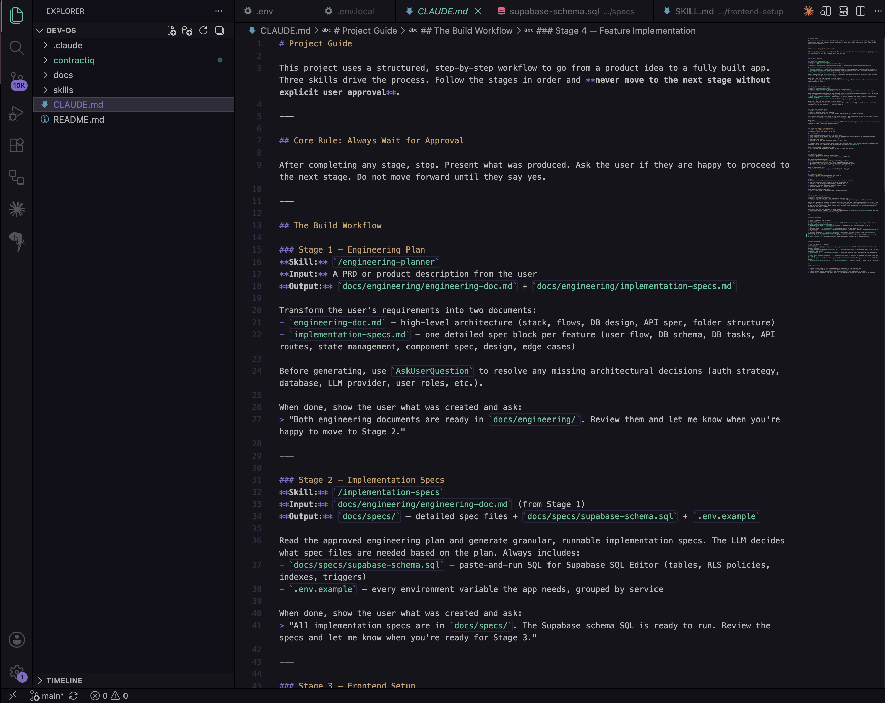

---

### Step 2 — Download the Skill File

Download the skill file provided for this lesson using the link below. Once downloaded, move it into your project's main folder — the same folder where your app code lives.

➡️ **[Download `skill.md`](https://pragyaallc-my.sharepoint.com/:t:/g/personal/sachin_parmar_legalgraph_ai/IQB0EdIgyxlBS6H9iuk2pgsCAWqhPAOj37dTbb9u0-BOG8s?e=oaHxYG)**

---

### Step 3 — Create the Right Folder for the Skill

Inside your project, find the folder called **skills**. Inside that folder, create a new folder and name it exactly:

```
azure-ai-foundry
```

Now move the skill file you just downloaded into that new `azure-ai-foundry` folder.

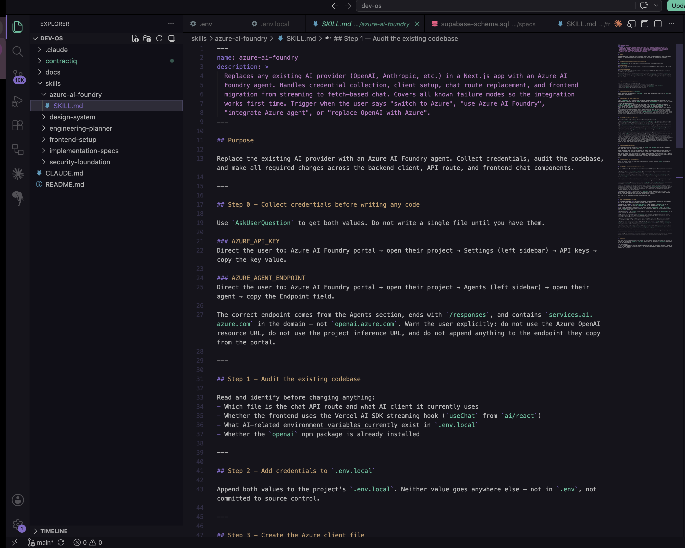

> **Why does this folder name matter?** Claude Code looks for skills in specific locations. Putting the file in the right place is how Claude knows which skill to use when you ask it to help.

---

### Step 4 — Run Claude and Let It Do the Work

Open a new **terminal** inside VS Code.

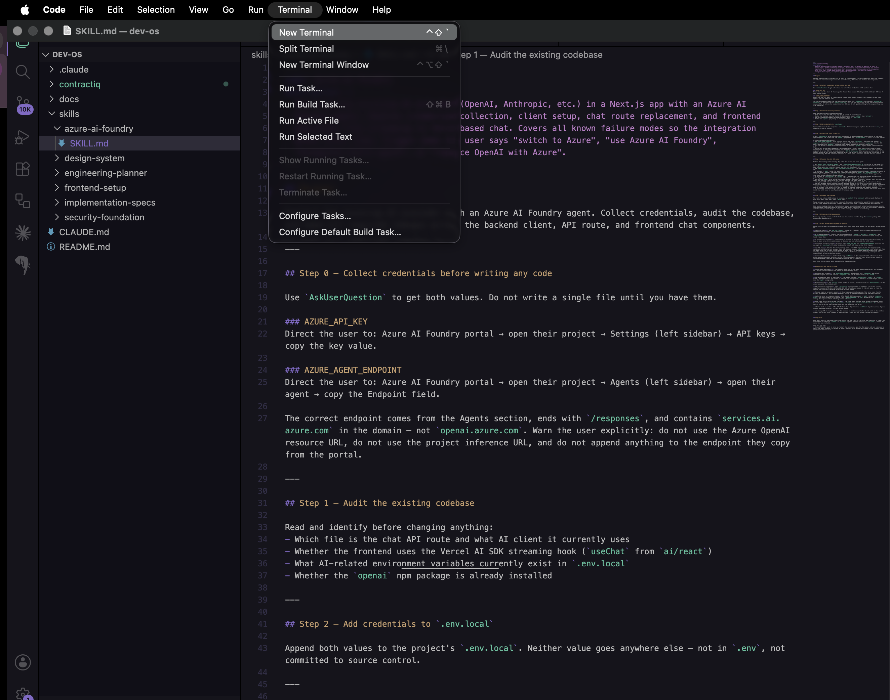

> **Terminal** is the text-based interface where you type commands directly to your computer. Think of it as a direct line to give your computer instructions without clicking buttons.

In the terminal, start Claude Code by typing `claude` and pressing Enter. Once Claude is running, paste in the prompt below exactly as written:

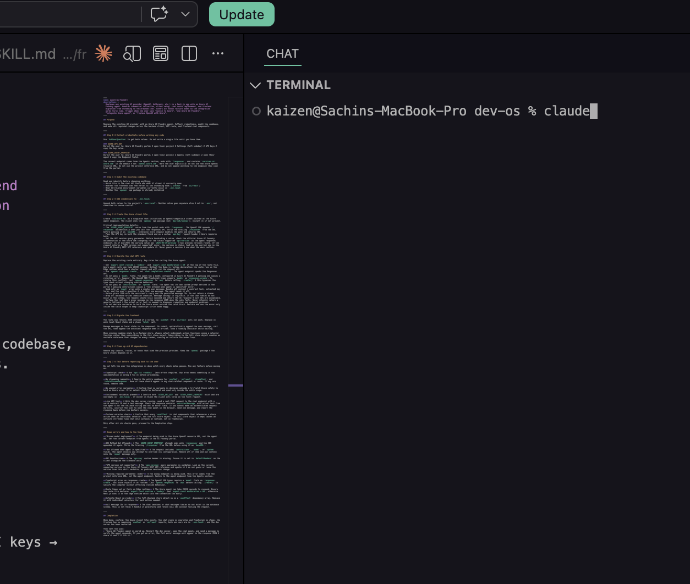

> **Prompt to paste into Claude:**
> ```
> Use the @skills/azure-ai-foundry/skill.md file to replace the existing OpenAI backend pipeline with the Azure AI Foundry agent.
> ```

Claude will read the skill and start updating your codebase automatically. This is the moment the bridge gets built — let it run without interrupting it.

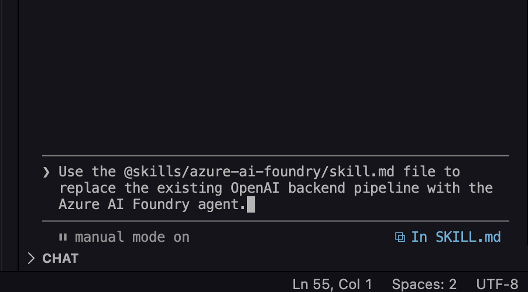

---

### Step 5 — Update Your Environment File

Once Claude finishes, you need to add two new keys to your `.env` file: `AZURE_API_KEY` and `AZURE_AGENT_ENDPOINT`. Here is how to get both from Azure AI Foundry.

> **What is a .env file?** Think of it as a private settings file for your app. It stores sensitive information — like passwords and connection keys — that the app needs to run but that you never want to share publicly. It lives in your project folder and is never uploaded to the internet.

**How to get your Azure keys:**

1. Make sure you have completed Week 3 — Lab 01 before proceeding.
2. Open the **Azure AI Foundry** dashboard.
3. Go to the **API Keys** section and copy your `AZURE_API_KEY`.

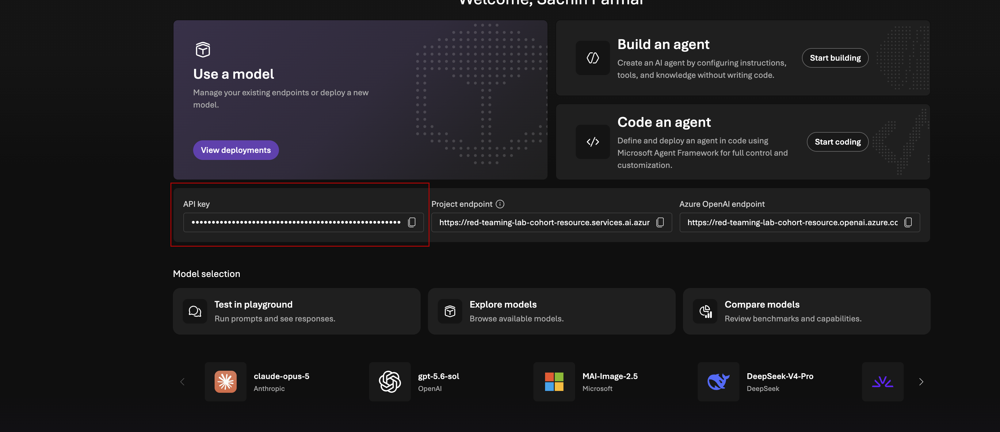

4. Navigate to the **Agents** section and select your agent.
5. Click **View Endpoint** to retrieve your `AZURE_AGENT_ENDPOINT`.

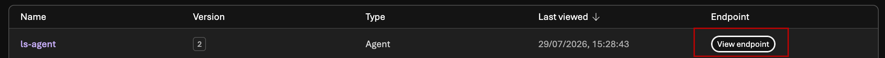

6. Keep both values handy — you will need them in the next step.

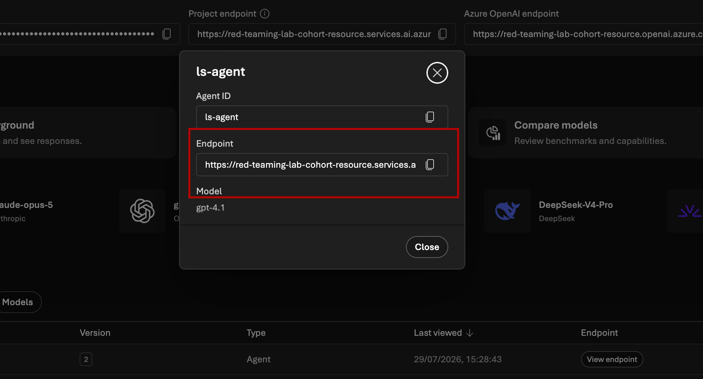

Now open your `.env` file and add both keys:

```
AZURE_API_KEY=your-key-here
AZURE_AGENT_ENDPOINT=your-endpoint-here
```

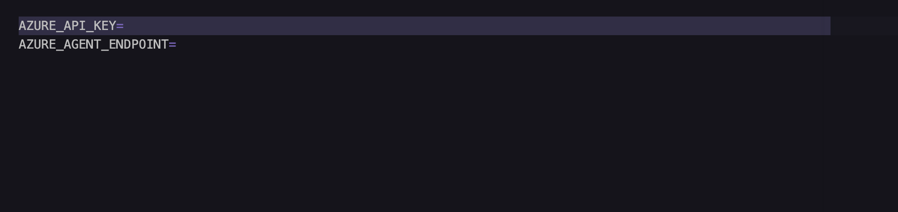

---

### Step 6 — Test Your App Locally

Now it is time to see if everything works. Open your terminal and navigate into your project folder. If your app lives inside a subfolder (for example, one called `contractiq`), go there first:

```bash
cd contractiq
npm run dev
```

If your project is already in the root folder, just run:

```bash
npm run dev
```

> **npm run dev** is the command that starts your web application on your own computer so you can test it before sharing it with the world. "npm" stands for Node Package Manager — it is the tool that manages all the code libraries your app depends on.

Open your browser and test the app. Click through the features, try sending a message through your AI agent, and make sure everything responds correctly. If it works, you are in great shape.

If the app is not getting a response from your Azure AI Foundry agent, go back into Claude and describe the issue — Claude can help you troubleshoot the connection.

---

### Step 7 — Deploy the Updated App to Netlify

Now let's get your updated app live on the internet.

While you are still in Claude, paste in this prompt to push your latest changes to GitHub:

> **Prompt to paste into Claude:**
> ```
> push latest changes to github
> ```

Claude will handle the push for you. Since you connected GitHub to **Netlify** back in Week 1, Netlify will automatically detect the new code and redeploy your app without you needing to do anything extra.

> **Netlify** is the platform that hosts your web app and makes it accessible to anyone on the internet. **GitHub** is where your code is stored — and the two are linked so that every time you push new code to GitHub, Netlify automatically picks it up and updates your live site.

**Now add your Azure keys to Netlify.** Netlify has its own copy of your settings file — it does not automatically read from your local `.env`. Follow these steps:

1. Open the **Netlify Dashboard** and select your project.
2. Go to **Project Configuration** → **Environment Variables**.
3. Click **Add Variable** → **Import from `.env` File**.
4. Add the two new Azure environment variables from your `.env` file.
5. Click **Save** to apply the changes.

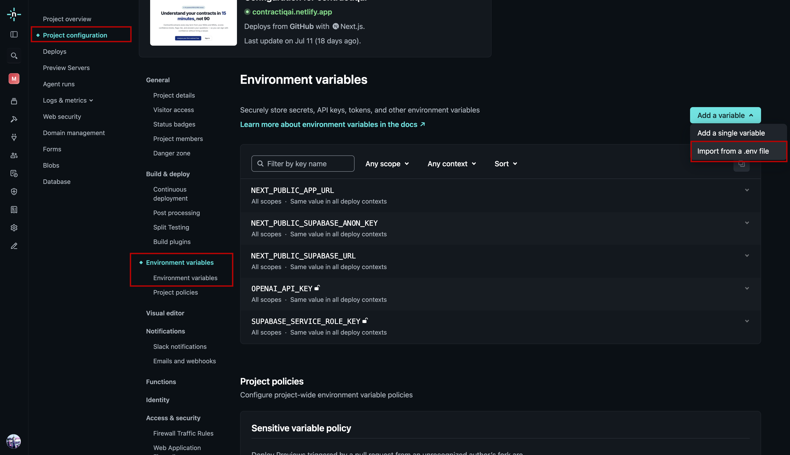

---

### Step 8 — Watch Your Agent Work in Real Time

Here is the bonus that makes Azure AI Foundry worth using. Go back to your Azure AI Foundry dashboard and find the **Traces** section.

> **Traces** are like a detailed activity log. Every time a user sends a message to your app, Azure records it as a trace — showing you exactly what was sent, what the AI responded, how many tokens were used, and what it cost. A **token** is roughly a word or a piece of a word that the AI processes — the more tokens, the more it costs.

**How to view your agent traces:**

1. Open the Azure AI Foundry project that contains your agent.
2. Select the agent you created.
3. Navigate to the **Traces** section.
4. Here you can view detailed information for each request, including:
   - **Tokens In** and **Tokens Out**
   - **Total Token Usage**
   - **Execution Cost**
   - Full request and response traces for debugging

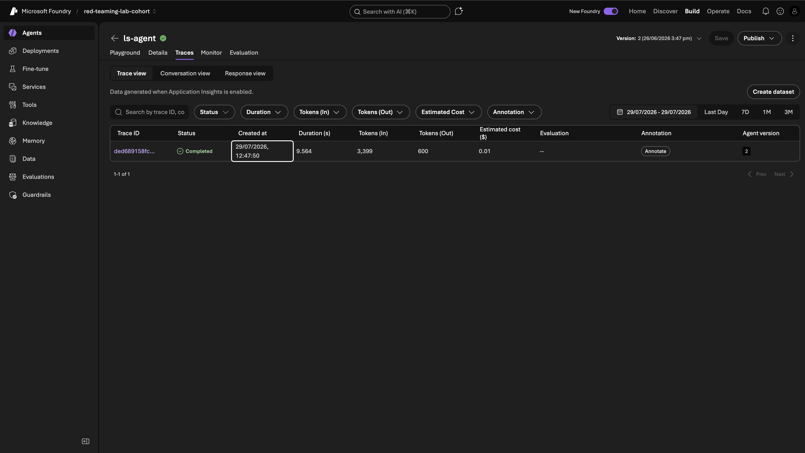

This is where you can monitor your app's real usage, catch problems early, and understand what your AI agent is actually doing behind the scenes.

---

## You Did It

You have connected your web app to your Azure AI agent. Your app now has a brain powered by Azure AI Foundry, and you can watch that brain work in real time through the Traces dashboard.

In the next lesson, you will go deeper into how to read and act on those traces — turning raw data into real insights about how your AI is performing.