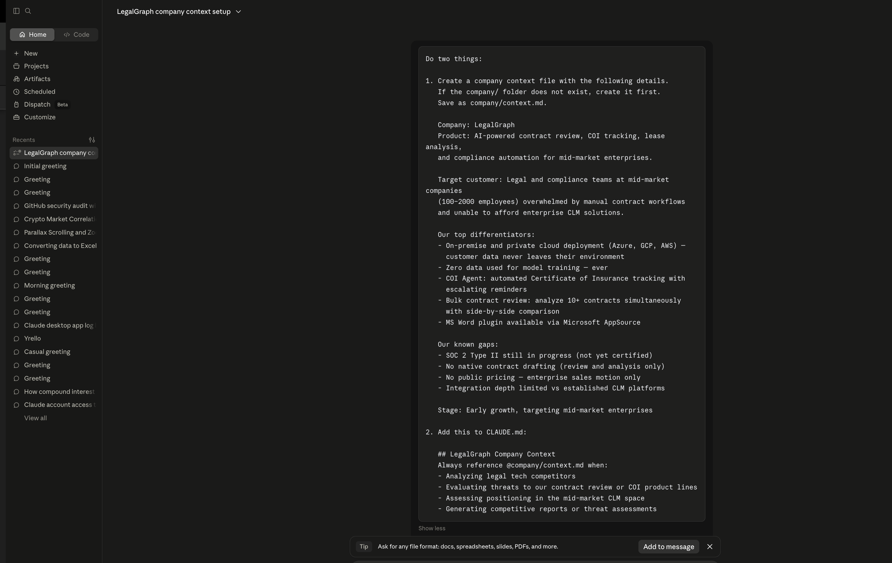
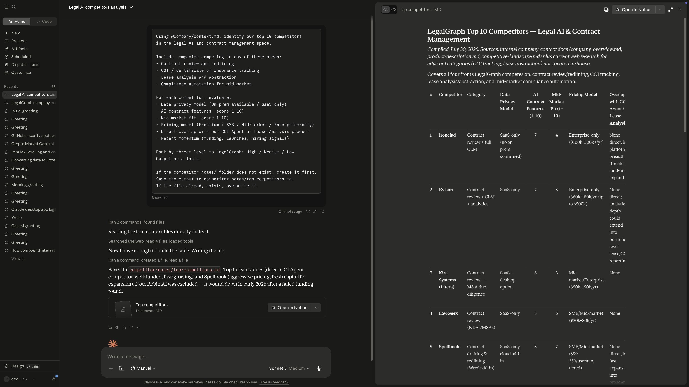
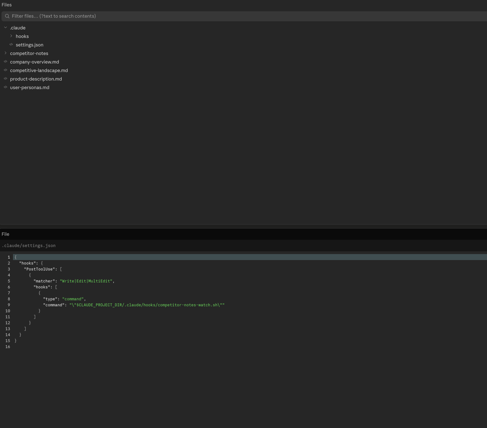
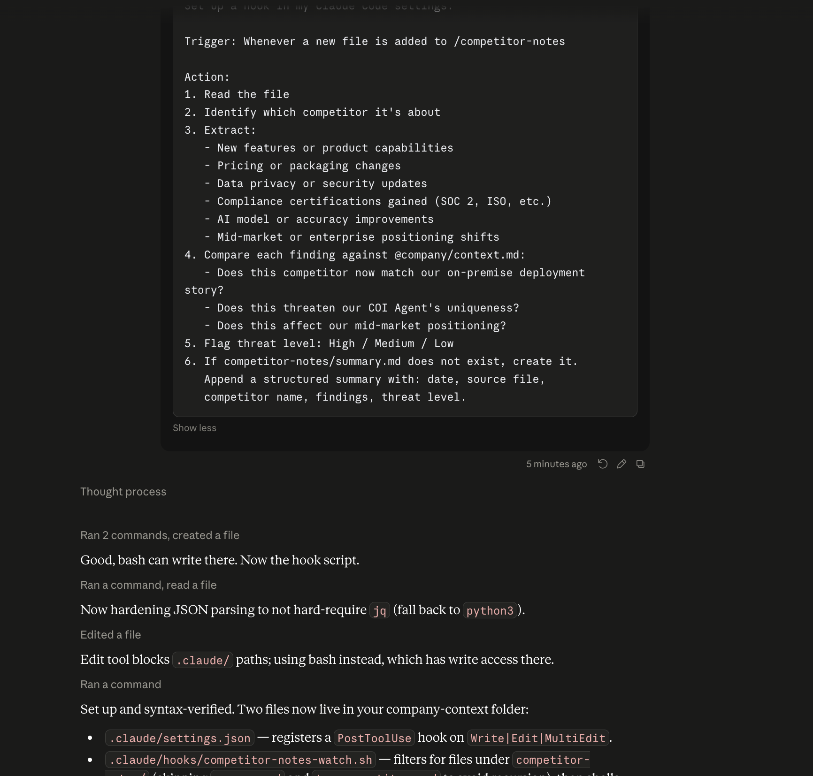

# Lab 4: Competitor Monitoring Using Claude Hooks

In this lab you'll learn how to use **Claude Code hooks** to build an automated competitive intelligence system — one that monitors a folder, analyzes new research the moment it lands, and logs findings to a running summary without you lifting a finger.

We'll be working from the perspective of a Product Manager at a fictional legal AI company called LegalGraph. Legal tech moves fast — Harvey AI, Ironclad, Spellbook, Luminance — and the challenge is staying current without it becoming a full-time job. That's the problem this lab solves.

By the end of this lab, you'll have a system that handles all of this automatically. Here's the rough shape of what you're building:

```
Prompt 1 — Give Claude context about LegalGraph + save it to memory

Prompt 2 — Pull a ranked list of your top 10 competitors

Prompt 3 — Hook: auto-analyze whenever anyone shares competitor research
```

Three prompts. No code. Let's go.

---

## Step 1 — Give Claude Your Company Context

Before asking Claude to analyze competitors, you need to ground it in your company's specifics.

Out of the box, Claude knows the legal tech market broadly but it doesn't know your customers, your differentiators, or your gaps. Without that context, any competitor analysis it produces is generic and not particularly useful.

This step fixes that. You'll create a `company/context.md` file with LegalGraph's details and register it in `CLAUDE.md` so Claude automatically references it in every competitive analysis going forward.

---

### Prompt 1 — Build Context and Register It in Claude's Memory

This is one prompt that does two things: creates a context file with LegalGraph's details, and adds a note to CLAUDE.md so Claude knows to always reference it during competitive analysis.

> **Want to skip ahead?** Download the sample `context.md` for LegalGraph [here →](https://github.com/sachin0034-tech/MLAI-community-labs/blob/main/Class-Labs/Bootcamp_2/Module-1%20-%20ClaudeFoundation/Lesson1.2-understand-the-interface.md). Create a `company/` folder, drop the file in, add it to Claude — then jump straight to Prompt 2.
>
> ⚠️ **Note:** Don't jump to Lesson 1.3 until you've finished Lesson 1.2.

> **Pro tip:** The more company context you add to this prompt, the sharper the results. Don't be vague — specific details about your customers, differentiators, and gaps are what make this useful. The prompt below is a starter to show you how to create your company context using Claude.

```
Do two things:

1. Create a company context file with the following details.
   If the company/ folder does not exist, create it first.
   Save as company/context.md.

   Company: LegalGraph
   Product: AI-powered contract review, COI tracking, lease analysis,
   and compliance automation for mid-market enterprises.

   Target customer: Legal and compliance teams at mid-market companies
   (100–2000 employees) overwhelmed by manual contract workflows
   and unable to afford enterprise CLM solutions.

   Our top differentiators:
   - On-premise and private cloud deployment (Azure, GCP, AWS) —
     customer data never leaves their environment
   - Zero data used for model training — ever
   - COI Agent: automated Certificate of Insurance tracking with
     escalating reminders
   - Bulk contract review: analyze 10+ contracts simultaneously
     with side-by-side comparison
   - MS Word plugin available via Microsoft AppSource

   Our known gaps:
   - SOC 2 Type II still in progress (not yet certified)
   - No native contract drafting (review and analysis only)
   - No public pricing — enterprise sales motion only
   - Integration depth limited vs established CLM platforms

   Stage: Early growth, targeting mid-market enterprises

2. Add this to CLAUDE.md:

   ## LegalGraph Company Context
   Always reference @company/context.md when:
   - Analyzing legal tech competitors
   - Evaluating threats to our contract review or COI product lines
   - Assessing positioning in the mid-market CLM space
   - Generating competitive reports or threat assessments
```

Once this runs, open `company/context.md` and verify it looks correct. This file is the foundation for everything downstream — every competitor analysis in this lab reads from it.




---

### Prompt 2 — Find Your Top 10 Competitors

> ⚠️ **Before you run this:** Make sure you've added the `company/` context folder to Claude first.


Run this prompt to generate a ranked competitor table using the context you just created.

```
Using @company/context.md, identify our top 10 competitors
in the legal AI and contract management space.

Include companies competing in any of these areas:
- Contract review and redlining
- COI / Certificate of Insurance tracking
- Lease analysis and abstraction
- Compliance automation for mid-market

For each competitor, evaluate:
- Data privacy model (On-prem available / SaaS-only)
- AI contract features (score 1–10)
- Mid-market fit (score 1–10)
- Pricing model (Freemium / SMB / Mid-market / Enterprise-only)
- Direct overlap with our COI Agent or Lease Analysis product
- Recent momentum (funding, launches, hiring signals)

Rank by threat level to LegalGraph: High / Medium / Low
Output as a table.

If the competitor-notes/ folder does not exist, create it first.
Save the output to competitor-notes/top-competitors.md.
If the file already exists, overwrite it.
```

Because Claude has LegalGraph's context, the output is ranked by relevance to your specific position — not just market size. A competitor with aggressive mid-market pricing and SOC 2 certification ranks higher than a well-funded enterprise player that never touches your ICP.

---

> **Checkpoint**
>
> Review the table. Does the ranking reflect your actual competitive landscape?
> If any players are missing — a niche COI tool, a regional CLM — add them to `company/context.md` under a "Known competitors" section before continuing.




---

## A Quick Note on `.claude/settings.json`

Before setting up the hook, it's worth understanding where it lives.

When Claude Code creates a hook, it writes the configuration to `.claude/settings.json` in your project folder. That file controls hooks, permissions, environment variables, and other project-level behavior for your Claude Code session.

Here's what it looks like after you run Prompt 3:

```json
{
  "hooks": {
    "FileChanged": [
      {
        "matcher": "competitor-notes/*",
        "if": "file.endsWith('.md')",
        "handler": "analyze-competitor-file"
      }
    ]
  }
}
```

A few things worth knowing about this file:

- **It's per-project** — `.claude/settings.json` only applies to the project it lives in. Your other projects aren't affected.
- **You can edit it directly** — if you want to tweak the hook (change the folder it watches, add a condition), just open the file and edit it. Claude will pick up the change next time an event fires.
- **There's also a global version** — `~/.claude/settings.json` in your home directory applies to *every* Claude Code session on your machine. Project-level settings take priority over global ones.
- **Don't delete it by accident** — if you wipe this file, your hooks stop working. Worth adding it to version control so your team shares the same setup.

When something isn't working the way you expect — a hook not firing, a permission being blocked — this is the first file to check.



---

## Step 2 — Hook: Auto-Extract Competitor Intelligence

> ⚠️ **Hooks only work in Claude Code — not the claude.ai web app.**
>
> Hooks watch for events on your local machine (file changes, tool calls, session stops). The browser app has no access to your local filesystem, so hooks simply can't run there.
>
> **Works:** Claude Code CLI · VS Code extension · JetBrains extension
> **Doesn't work:** claude.ai web app · Claude mobile app · Claude API directly
>
> **Get set up in 3 steps before continuing:**
> 1. Open your project folder in VS Code
> 2. Open the integrated terminal (`Ctrl+`` ` or `Cmd+`` ` on Mac)
> 3. Run `claude` in the terminal to start a Claude Code session
>
> Once you see the Claude Code prompt in your terminal, you're ready.

The competitor table from Step 1 is a one-time snapshot. The real problem is keeping it current — new funding rounds, feature launches, pricing changes happen constantly, and manually tracking them doesn't scale.

This step sets up a hook that solves that. Whenever Claude writes a file to the `competitor-notes/` folder, the hook fires automatically: it reads the file, identifies the competitor, extracts relevant intelligence, compares it against `company/context.md`, and appends a structured summary to `competitor-notes/summary.md`.

**What this hook does**

When you tell Claude to save notes about a competitor, Claude writes the file — and the hook immediately picks it up. It reads the content, extracts key signals (new features, pricing changes, compliance certifications), evaluates the threat level relative to LegalGraph, and logs a clean entry to the summary file. No additional prompt required.

**Here's how it actually works under the hood.**

When an event fires in a Claude Code session, Claude packages a JSON context about that event and sends it to your hook handler. The handler reads it, does its thing, and optionally returns a decision back to Claude.

The five events you'll use most as a PM:

| Event | When it fires |
|---|---|
| `FileChanged` | When a watched file changes on disk |
| `PostToolUse` | After a tool call succeeds |
| `UserPromptSubmit` | When you submit a prompt, before Claude processes it |
| `PreToolUse` | Before a tool call runs — can block it |
| `Stop` | When Claude finishes responding |

For this use case we're using **`FileChanged`** — it watches `competitor-notes/` and fires the moment a new research file lands there.

Here's what happens step by step when a file like `harvey-ai-update.md` lands in the folder:

**1 — Event fires**
The `FileChanged` event fires. Claude Code packages the file details as JSON:
```json
{ "event": "FileChanged", "file": "competitor-notes/harvey-ai-update.md" }
```

**2 — Matcher checks**
Your hook has a matcher set to `"competitor-notes/*"`. File path matches. Hook group activates.

**3 — If condition checks**
The `if` condition verifies it's a `.md` file inside `competitor-notes/`. It is, so the handler runs. If your sales rep had dropped a PNG screenshot instead, the `if` check fails, handler skips — no wasted processing.

**4 — Hook handler runs**
Reads `harvey-ai-update.md`, extracts the intelligence, compares it against `@company/context.md`, appends findings to `summary.md`. Exits with code `0` — job done.

**5 — Summary updated**
`competitor-notes/summary.md` now has a new entry with Harvey AI's update, threat level, and implications for LegalGraph — without any additional prompt.

> Want to go deeper on hooks? [Read the full hooks documentation →](https://code.claude.com/docs/en/hooks#hook-lifecycle)

---

### Prompt 3 — Set Up the Competitor Notes Hook

```
Set up a hook in my Claude Code settings:

Trigger: Whenever a new file is added to /competitor-notes

Action:
1. Read the file
2. Identify which competitor it's about
3. Extract:
   - New features or product capabilities
   - Pricing or packaging changes
   - Data privacy or security updates
   - Compliance certifications gained (SOC 2, ISO, etc.)
   - AI model or accuracy improvements
   - Mid-market or enterprise positioning shifts
4. Compare each finding against @company/context.md:
   - Does this competitor now match our on-premise deployment story?
   - Does this threaten our COI Agent's uniqueness?
   - Does this affect our mid-market positioning?
5. Flag threat level: High / Medium / Low
6. If competitor-notes/summary.md does not exist, create it.
   Append a structured summary with: date, source file,
   competitor name, findings, threat level.

Once the hook is set up, test it automatically:
1. Create a file called competitor-notes/hook-test.md with these contents:
   "Harvey AI launched native contract drafting inside Microsoft Word.
   Available to enterprise customers. Announced this week."
2. Trigger the hook by processing that file through the same action above.
3. Open competitor-notes/summary.md and confirm a new entry was added.
4. Tell me: did the hook work? Show me what was written to summary.md.
   If something went wrong, tell me what failed and why.
```

---

**How the hook fits together**

```
You tell Claude about a competitor
        ↓
Claude writes a file to competitor-notes/
        ↓
PostToolUse fires (Claude used its Write tool)
        ↓
Hook reads the file + analyzes it
        ↓
Summary appears in competitor-notes/summary.md
```

You never create the file directly — you give Claude the raw information, Claude writes the file, and the hook handles the rest.



---

**3 — Verify the result**

Open `competitor-notes/summary.md`. You should see a new entry with the findings and threat level — added automatically by the hook.

---

> **Checkpoint**
>
> Try two prompts back to back in your Claude Code session:
>
> Prompt 1: `Save these notes to competitor-notes/harvey-update.md: Harvey AI added native contract drafting inside Word. Enterprise tier only.`
>
> Prompt 2: `Save these notes to competitor-notes/ironclad-update.md: Ironclad launched a new mid-market pricing tier at $299/mo. Targeting 50–200 seat companies.`
>
> Open `competitor-notes/summary.md` after each one.
> Notice how Claude is evaluating each finding relative to LegalGraph — not just describing what the competitor did.

---

## What You Built

```
You tell Claude about a competitor
              ↓
Claude writes the file to competitor-notes/
              ↓
PostToolUse hook fires automatically
              ↓
Claude reads the file + compares against company context
              ↓
Findings logged to competitor-notes/summary.md
```

**Before this lab:**
- Competitive intelligence was manual and scattered
- Competitor updates surfaced reactively, often weeks late
- No consistent place to track what changed and why it mattered

**After this lab:**
- Claude has LegalGraph's context and can evaluate threats relative to your actual position
- Any research shared through Claude is automatically analyzed and logged
- A running summary in `competitor-notes/summary.md` stays current without manual effort

Three prompts. No code.

---

## Claude Concepts Covered in This Lesson

| Concept | Where it appeared | Learn more |
|---------|-------------------|------------|
| **CLAUDE.md memory** | Step 1 — telling Claude to always reference the company context file | [Memory & CLAUDE.md →](https://docs.anthropic.com/en/docs/claude-code/memory) |
| **Hooks** | Step 2 — auto-analyzing files the moment Claude writes them to the folder | [Claude Code overview →](https://docs.anthropic.com/en/docs/claude-code) |
| **Context grounding** | Step 1 — ranking competitors relative to LegalGraph's specific position, not just market size | [Prompt engineering →](https://docs.anthropic.com/en/docs/build-with-claude/prompt-engineering/overview) |
| **System prompts** | Step 1 — making every downstream analysis grounded in your actual company | [System prompts →](https://docs.anthropic.com/en/docs/build-with-claude/system-prompts) |
