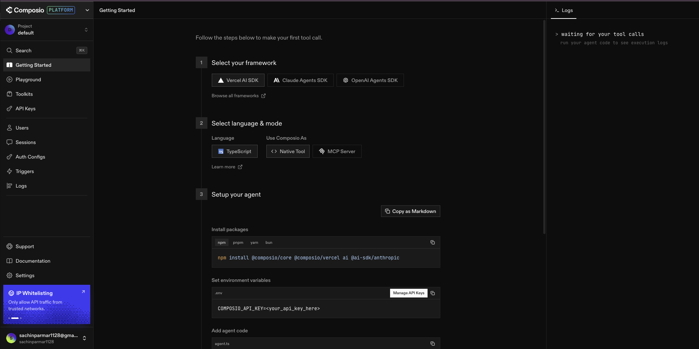

# Creating Your Composio Account

---

## Composio as Your Integration Hub

Composio is a platform that connects AI agents to external tools.

Instead of Claude needing to know how to call the YouTube, the LinkedIn, and the Snowflake — Claude just talks to Composio. Composio knows how to talk to everything else.

```
Claude
  ↓
Composio (your integration hub)
  ├── YouTube
  ├── LinkedIn
  ├── Snowflake
  └── 250+ other tools
```

Every tool you connect in Composio becomes available to Claude through a single MCP server. One setup. One connection. Everything unlocked.

This is the foundation everything else in this module depends on. Let's create your account.

---

## Step 1: Go to Composio

Open your browser and go to:

```
https://app.composio.dev
```


---

## Step 2: Sign Up

Click **Sign Up** and create your account.

You can sign up with Google or with an email and password — either works.


---

## Step 3: Verify Your Email

If you signed up with email, check your inbox for a verification link. Click it to activate your account.

---

## Step 4: Log Into Your Dashboard

Once your account is active, log in. You'll land on the Composio dashboard.

This is your integration hub — where all your tool connections will live.



Take a moment to look around. On the left sidebar you'll see:

| Section | What it's for |
|---------|---------------|
| **Toolkit** | Browse and connect external tools |
| **Projects** | Organize your integrations by project |
| **Connections** | See all your active authenticated accounts |
| **MCP Servers** | Generate MCP URLs for Claude |

We'll be using all of these in the next few lessons.

---

## What You've Actually Set Up

Your Composio account is now the central hub for every external tool Claude will use in this module.

Think of it like this — you've just opened the doors to a building that connects to everything. Right now the building is empty. Over the next few lessons, we'll walk in and connect:

- YouTube — so Claude can pull channel data and video analytics
- LinkedIn — so Claude can read posts and engagement data
- Snowflake — so Claude can store everything in your data lake

Each connection we add makes Claude more capable inside your project. None of it requires managing credentials manually — Composio holds all of that for you.

---

## How Real Teams Think About This

In a production data engineering team, nobody embeds API keys directly into pipeline code.

Keys get rotated. Tokens expire. Services change their auth flows. If your credentials are hardcoded into a script, you're one expiry away from a broken pipeline at 2am.

Real teams use a managed integration layer — a system that handles auth lifecycle, connection health, and credential storage separately from the application code. Engineers write pipeline logic. The integration layer handles authentication.

Composio is that layer for our setup.

| What you'd do manually | What Composio handles for you |
|------------------------|-------------------------------|
| Get API credentials from each platform | One OAuth flow per tool |
| Store and rotate secrets securely | Composio manages tokens automatically |
| Handle auth errors in pipeline code | Composio surfaces connection health |
| Learn each platform's API syntax | Claude calls one consistent interface |
