# Enabling Your Channels in Composio

---

## Toolkit Integrations in Composio

Composio is the MCP server that sits between Claude and the outside world. Every external platform Claude can talk to is connected through Composio as a **Toolkit integration**.

Think of each integration as a door. Right now there are no doors. By the end of this lesson, we'll have two: one into YouTube, one into LinkedIn.

```
Claude
  ↓  (MCP)
Composio
  ├── YouTube  ← we're building this door
  └── LinkedIn ← and this one
```

Once both are open, Claude can walk through either one on demand — pulling live data, reading comments, fetching analytics — without you having to log in or export anything manually.

Let's build them.

---

## Step 1: Connect YouTube

Open [Composio](https://app.composio.dev) and log into your account.

---

### 1.1 — Find the YouTube Toolkit

In the left sidebar, click **Toolkit**.

In the search bar, type **YouTube**.


You'll see the YouTube integration appear. Click on it.


---

### 1.2 — Add It to Your Project

Click **Add to Project**.


On the next screen, click **Next**.

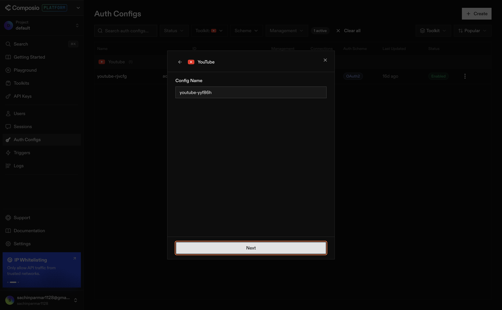

---

### 1.3 — Create the Auth Config

You'll land on the authentication screen. Click **Create Auth Config**.

This is where Composio sets up the OAuth connection to YouTube's API — your credentials are handled securely and never stored in plain text.

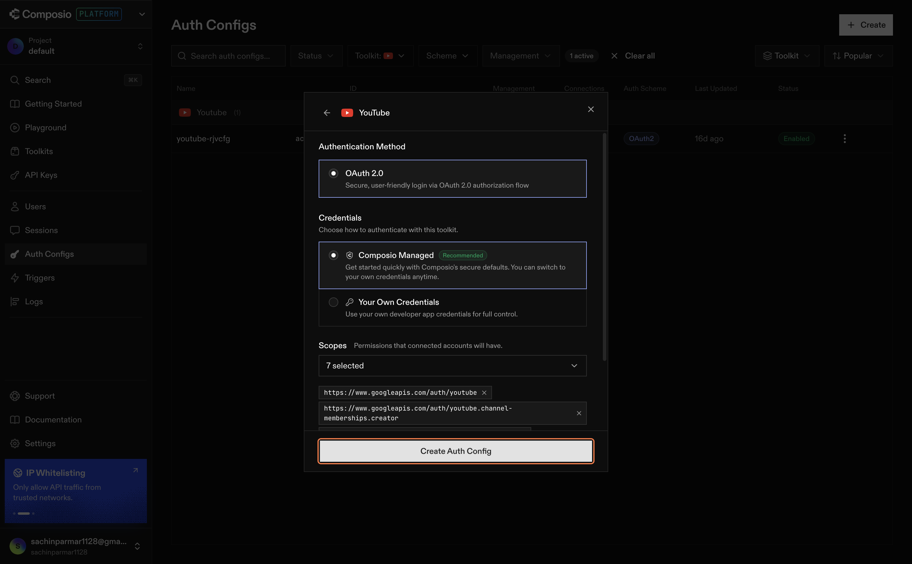

---

### 1.4 — Connect Your Account

Click on the connect icon shown on screen.


A popup will open asking you to choose a Google account. Select the account that owns your YouTube channel.


Grant all the requested permissions — Composio needs these to read your channel data, video analytics, and comments on your behalf.


Click **Continue**.


---

### 1.5 — Confirm the Connection

You'll be redirected back to Composio. You should now see your YouTube channel listed as a connected account with a green status indicator.

That's it. Claude now has authenticated access to your YouTube data.

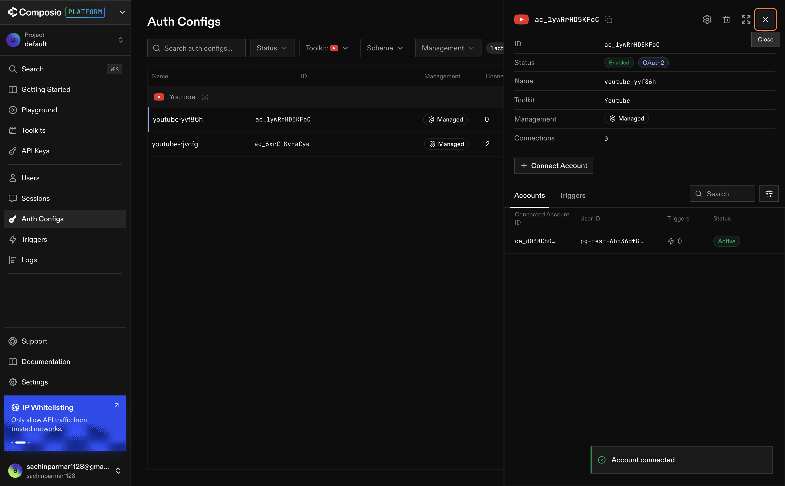

---

> **What just happened?**
>
> Composio registered an OAuth token on your behalf. From this point on, whenever Claude needs to pull YouTube data, it goes through Composio — which handles the authentication handshake automatically. You don't need to log in again or manage tokens manually.

---

## Step 2: Connect LinkedIn

Now let's do the same for LinkedIn. The process is identical — but the platform matters separately. LinkedIn is where your professional audience lives, and for most B2B companies it's the highest-signal channel for content performance.

---

### 2.1 — Find the LinkedIn Toolkit

Still inside Composio, go back to **Toolkit**.

In the search bar, type **LinkedIn**.

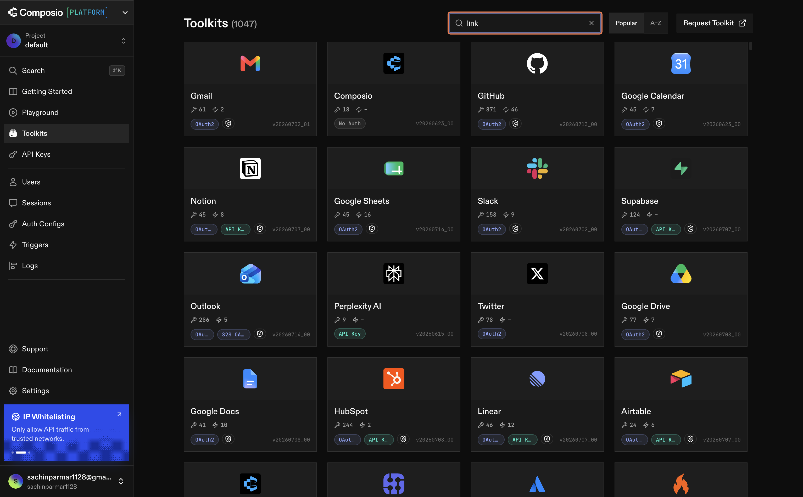

Click on the LinkedIn integration.

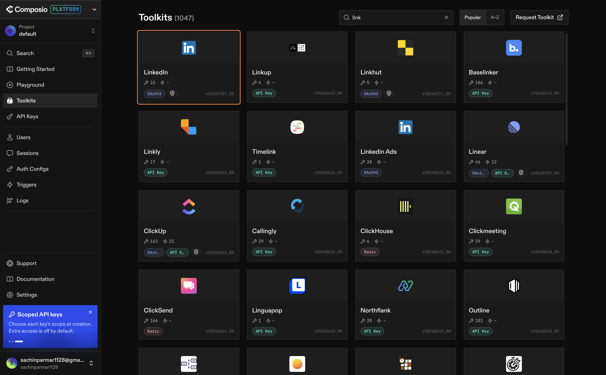

---

### 2.2 — Add It to Your Project

Click **Add to Project**.

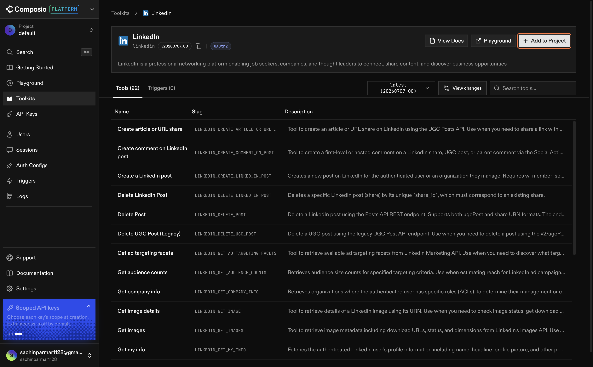

On the next screen, click **Next**.

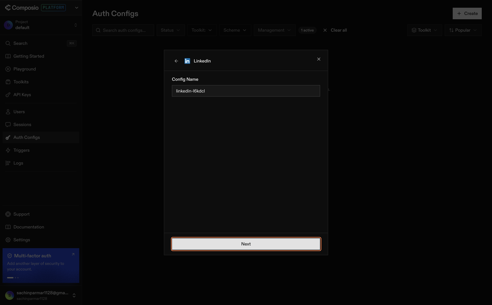

---

### 2.3 — Create the Auth Config

Click **Create Auth Config**.

Same pattern as YouTube — Composio will prepare the OAuth flow for LinkedIn's API.

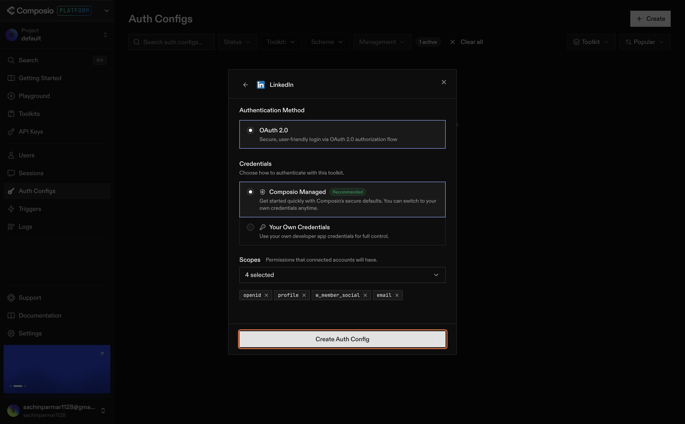

---

### 2.4 — Connect Your Account

Click on the connect icon shown on screen.

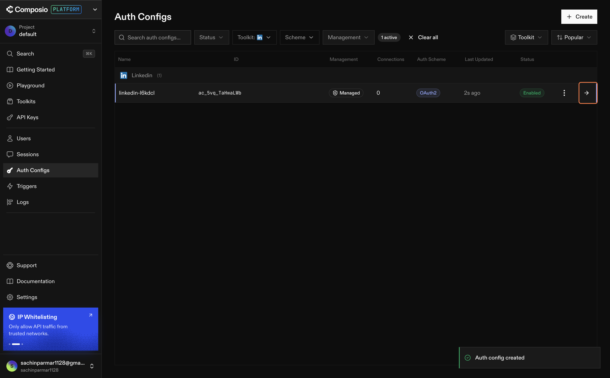

LinkedIn will ask you to log in and choose the account you want to connect. Select your company page or personal account — whichever you want to pull data from.

Grant all requested permissions and click **Continue**. Once done, you'll see a confirmation message that your account has been connected.

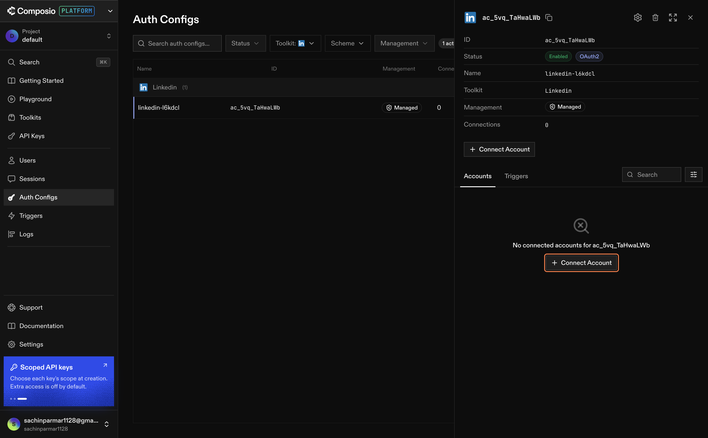

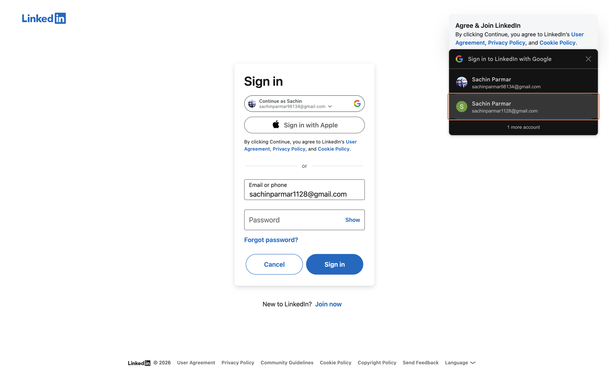

---

### 2.5 — Confirm the Connection

You'll be redirected back to Composio. You should now see your LinkedIn account listed as connected with a green status indicator.

Both channels are now live.

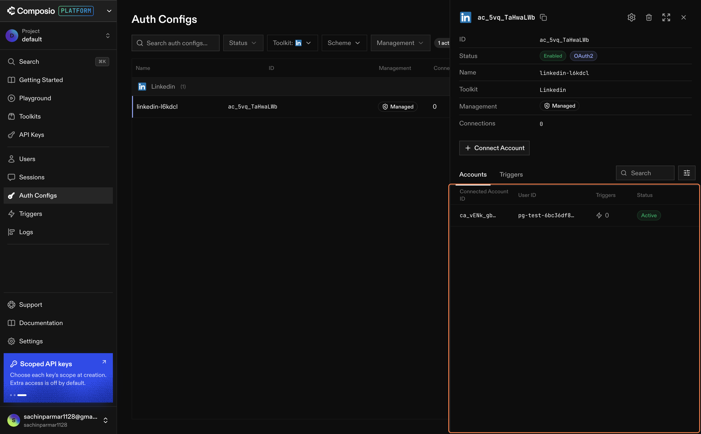

---

## What You've Actually Built

Let's take a moment to understand what's sitting in your Composio account right now.

You haven't written any code. You haven't touched an API. But you've created something real:

```
Claude
  ↓  (MCP)
Composio
  ├── YouTube  (authenticated ✓)
  └── LinkedIn (authenticated ✓)
```

Every time Claude runs your data pipeline, it will flow through this bridge. Composio holds the tokens, manages the authentication lifecycle, and presents Claude with a clean interface for each platform.

This is how real data engineering teams handle third-party integrations — not by embedding credentials directly in code, but by using a managed auth layer that can be rotated, scoped, and audited separately from the application logic.

---

## How Real Teams Think About This

In a typical product or data engineering team, connecting to external platforms is never a developer's first step.

| Role | What they're thinking about |
|------|----------------------------|
| **Product Manager** | Which channels are worth ingesting? What business questions do we need to answer? |
| **Data Engineer** | How do we authenticate reliably? What's the rate limit? What's the schema? |
| **Tech Lead** | Where does this integration live? Who owns the credentials? What's the rotation policy? |
| **DevOps** | How do we monitor connection health? What happens when a token expires? |

Nobody said "let's start coding." The integration decision comes after a clear understanding of what data is needed and why.

By connecting YouTube and LinkedIn through Composio today, you've handled the authentication and connection layer — exactly what a data engineer does before writing a single line of pipeline code.

