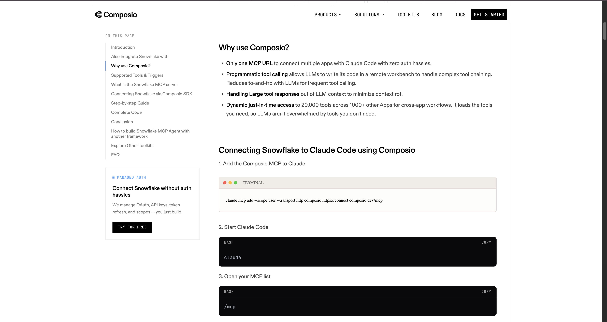

# Connecting Claude to Composio via MCP

---

## What Is MCP?

Before we do anything, let's make sure the concept lands.

MCP stands for **Model Context Protocol**. It's the standard language Claude uses to say: *"I want to use this tool — here's my request, here's what I need back."*

Without MCP, Claude is limited to what you type into the chat. With MCP, Claude can reach out to real systems — write to a database, pull from an API, trigger an action in an external tool — all within a single conversation.

Composio acts as the MCP server. It's the endpoint Claude will call every time it needs to interact with Snowflake, YouTube, or LinkedIn or diff chanels.

```
Claude
  ↓  (MCP)
Composio Server
  ├── Snowflake
  ├── YouTube
  └── LinkedIn
```

Once we wire this up, that entire stack becomes available to Claude on demand.

---

## Step 1: Generate the MCP URL

Go to this page:

```
https://composio.dev/toolkits/snowflake/framework/claude-code
```

Click **Generate MCP URL** and copy the URL that appears.



Keep that URL handy — you'll use it in the next step.

---

## Step 2: Tell Claude About Composio

Open the Claude desktop app and start a new chat.

Paste this prompt, replacing the placeholder with the URL you just copied:

```
Run the following command in the terminal and add the Composio MCP server:

<paste your MCP URL here>
```

Claude will run the command and register Composio as a connected tool.


Once it does, Claude knows where Composio lives. From this point on, Claude can reach out to Composio any time it needs to interact with your connected tools.

---

> **What just happened?**
>
> Claude ran a terminal command that registered Composio's MCP endpoint in its tool configuration. This is a one-time setup step — you don't need to repeat it in future sessions. Claude will remember this connection.

---

## Step 3: Authenticate the Connection

The last step is giving Claude permission to actually use the connection.

After the command runs, Claude will open a browser window asking you to authorize it. Follow the prompts and approve the access.


Once you approve, the connection is live.


That's it. Claude now has a live, authorized connection to Composio.

---

## What You've Actually Built

Let's take stock of where we are.

You haven't written a pipeline yet. You haven't queried a database. But you've done the hard part — you've connected three systems together:

```
Claude
  ↓  (MCP)
Composio
```

This is the backbone of everything we're about to build.

Claude can now reach Composio on demand. Composio already holds your authenticated connection. That means Claude can push data into your database, query it, and retrieve results — all from within a single conversation and also pull the data, without you doing anything manually.

This is exactly what a data engineering team sets up before they write a single line of pipeline code. Authentication first. Integration layer second. Logic third.

-
## Summary

You've done three things that matter:

1. Generated a unique MCP URL that identifies your Composio setup to Claude
2. Registered that URL with Claude so it knows where Composio lives
3. Authorized the connection so Claude has permission to use it

Claude is no longer in a closed room. It now has a direct line to Composio — and through Composio, to every tool you've connected.

---

## Pull Your First Data

The connection is live. Let's actually use it.

Below are ready-to-run prompts you can paste directly into Claude. Each one tells Claude exactly what to fetch and how to structure the output. Try them one at a time — watch Claude reach out through Composio and come back with real data from your accounts.

---

### YouTube Analytics

The prompts below cover two scenarios: pulling data from **your own authenticated channel** and researching **competitor channels**. Replace the `[YOUR CHANNEL URL]` placeholder with your actual channel URL before running.

> **Competitor channel example used in these prompts:** `https://www.youtube.com/@MaheshAIPMCommunity`

> **Why do the prompts name specific tools like `YOUTUBE_LIST_USER_PLAYLISTS`?**
>
> Composio exposes 51 YouTube tools to Claude. Without a specific tool name, Claude has to guess which one to call and often picks wrong or loops through multiple tools before landing on the right one. Naming the tool explicitly:
> 1. **Removes ambiguity** — Claude calls the right tool on the first try
> 2. **Faster execution** — no trial-and-error loop through similar tools
> 3. **Reproducible** — the prompt behaves the same way every time you run it
> 4. **Educational** — you learn which tool maps to which intent

---

**My Channel Overview**
```
Using Composio, pull data for my YouTube channel:
[YOUR CHANNEL URL]

1. Use YOUTUBE_LIST_USER_PLAYLISTS to retrieve all playlists I own and list:
   - Playlist name
   - Number of videos
   - Privacy status (public/private/unlisted)

2. Use YOUTUBE_SEARCH_YOU_TUBE with my channel name and type "channel" to confirm:
   - Channel title
   - Channel ID
   - Channel description
   - Total video count

Give me a summary of my channel's current content structure.

Then:
1. Create a folder at second-brain/projects/my-channel/ if it doesn't exist
2. Save all results as a JSON file at:
   second-brain/projects/my-channel/channel-overview.json
```

**My Video Inventory**
```
Using Composio, fetch my full YouTube video library.

1. Use YOUTUBE_LIST_USER_PLAYLISTS to get all my playlists
2. For the "Uploads" playlist (and any others), list each video with:
   - Video title
   - Video ID
   - Published date
   - Playlist it belongs to

Sort by most recently published. Flag the 5 most recent videos.

Then:
1. Create a folder at second-brain/projects/my-channel/ if it doesn't exist
2. Save the full video inventory as a JSON file at:
   second-brain/projects/my-channel/video-inventory.json
```

**My Playlist Structure Snapshot**
```
Using Composio, map out the full playlist structure for my YouTube channel.

1. Use YOUTUBE_LIST_USER_PLAYLISTS to get all playlists
2. For each playlist return:
   - Playlist title
   - Playlist ID
   - Video count
   - Privacy status
   - Description

Then tell me: based on this structure, how is my content organized, and what gaps or opportunities do you see?

Finally:
1. Create a folder at second-brain/projects/my-channel/ if it doesn't exist
2. Save the playlist data plus the insight as a JSON file at:
   second-brain/projects/my-channel/playlist-structure.json
```

**My Subscriptions Landscape**
```
Using Composio, pull my YouTube subscription list to map the channels I follow.

1. Use YOUTUBE_LIST_USER_SUBSCRIPTIONS to get all channels I'm subscribed to
2. For each subscription return:
   - Channel title
   - Channel ID
   - Subscription date (if available)

Then:
- Count total subscriptions
- Identify any channels in the AI, product management, or community space

This maps what signals I'm already consuming and where to look for inspiration.

Then:
1. Create a folder at second-brain/projects/my-channel/ if it doesn't exist
2. Save the full subscriptions list as a JSON file at:
   second-brain/projects/my-channel/subscriptions.json
```

---

**Competitor Channel Research**
```
Using Composio, research this competitor YouTube channel:
https://www.youtube.com/@MaheshAIPMCommunity

1. Use YOUTUBE_SEARCH_YOU_TUBE with query "MaheshAIPMCommunity" and type "channel" to find the channel
2. From the results, extract:
   - Channel title
   - Channel ID
   - Channel description
   - Published date (when the channel was created)
   - Thumbnail URL

3. Use YOUTUBE_SEARCH_YOU_TUBE again with query "MaheshAIPMCommunity" and type "video" to find their 10 most recent videos:
   - Video title, video ID, published date, description snippet

4. Group videos by topic theme (e.g. AI tools, product management, tutorials, community)

Then tell me:
- What topics does this channel focus on?
- How frequently do they publish?
- What content angles are they covering that I could learn from or respond to?

Finally:
1. Create a folder at second-brain/projects/competitor-channels/ if it doesn't exist
2. Save all data plus the analysis as a JSON file at:
   second-brain/projects/competitor-channels/MaheshAIPMCommunity.json
```

**Competitor Video Topic Analysis**
```
Using Composio, do a deep topic analysis on this competitor channel:
https://www.youtube.com/@MaheshAIPMCommunity

1. Use YOUTUBE_SEARCH_YOU_TUBE with query "MaheshAIPMCommunity AI PM" and type "video"
2. For each result collect:
   - Video title
   - Video ID
   - Published date
   - Description snippet

3. Group by content theme and count videos per theme
4. Identify the top 3 most-covered themes

Then tell me:
- What are the top 3 content themes this channel owns?
- What titles or formats repeat most?
- What gaps exist — topics they haven't covered that are relevant to this space?

Then:
1. Create a folder at second-brain/projects/competitor-channels/ if it doesn't exist
2. Save the topic breakdown and gap analysis as a JSON file at:
   second-brain/projects/competitor-channels/MaheshAIPMCommunity-topics.json
```

---

### LinkedIn Analytics

The prompts below target a **company page** as the data source. The example company used throughout is `mahesh-ai-pm-community` — swap the vanity name for any company page you want to pull from.

> **Company page URL format:** `https://www.linkedin.com/company/<vanity-name>/`
> Example: `https://www.linkedin.com/company/mahesh-ai-pm-community/`

---

**Company Page Overview**
```
Using Composio, pull data for the LinkedIn company page at:
https://www.linkedin.com/company/mahesh-ai-pm-community/

Use LINKEDIN_GET_COMPANY_INFO to find the company and retrieve its organization URN.
Then use LINKEDIN_GET_NETWORK_SIZE to get the current follower count.

Give me:
- Company name
- Organization URN
- Total follower count
- Page headline / description (if available)

Then:
1. Create a folder at second-brain/projects/mahesh-ai-pm-community/ if it doesn't exist
2. Save all results as a JSON file at:
   second-brain/projects/mahesh-ai-pm-community/company-overview.json
```

**Company Post Engagement Report**
```
Using Composio, pull share statistics for the LinkedIn company page:
https://www.linkedin.com/company/mahesh-ai-pm-community/

1. Use LINKEDIN_GET_COMPANY_INFO to resolve the organization URN
2. Use LINKEDIN_GET_SHARE_STATS to pull post performance metrics

For each post, collect:
- Post preview (first 100 characters of content)
- Published date
- Impressions
- Clicks
- Reactions (likes)
- Comments
- Shares
- Engagement rate (reactions + comments + shares / impressions)

Sort by engagement rate, highest first.

Then:
1. Create a folder at second-brain/projects/mahesh-ai-pm-community/ if it doesn't exist
2. Save the full results as a JSON file at:
   second-brain/projects/mahesh-ai-pm-community/post-engagement.json
```

**Company Page Statistics**
```
Using Composio, pull page view statistics for the LinkedIn company page:
https://www.linkedin.com/company/mahesh-ai-pm-community/

1. Use LINKEDIN_GET_COMPANY_INFO to resolve the organization URN
2. Use LINKEDIN_GET_ORG_PAGE_STATS to retrieve page performance data

Give me:
- Total page views (lifetime)
- Page views for the last 30 days
- Custom button clicks (if any)
- Breakdown by page section (Overview, About, Posts, etc.) if available

Then tell me: based on this data, which section of the page is getting the most attention?

Finally:
1. Create a folder at second-brain/projects/mahesh-ai-pm-community/ if it doesn't exist
2. Save the statistics plus the insight as a JSON file at:
   second-brain/projects/mahesh-ai-pm-community/page-stats.json
```

**Network Size Tracker**
```
Using Composio, check the current follower count for this LinkedIn company page:
https://www.linkedin.com/company/mahesh-ai-pm-community/

1. Use LINKEDIN_GET_COMPANY_INFO to get the organization URN
2. Use LINKEDIN_GET_NETWORK_SIZE to get the follower count

Return:
- Company name
- Organization URN
- Current follower count
- Timestamp of this snapshot

Then:
1. Create a folder at second-brain/projects/mahesh-ai-pm-community/ if it doesn't exist
2. Append this snapshot to a JSON file at:
   second-brain/projects/mahesh-ai-pm-community/follower-snapshots.json
   (if the file exists, add a new entry to the array; if not, create it with the first entry)
```

---

### Combined Cross-Channel Report

Once both channels are pulling data, try this:

```
Using Composio, pull the last 30 days of analytics from both my YouTube channel
and my LinkedIn page. Then give me:

1. A side-by-side comparison of total reach (views vs impressions)
2. Which platform had higher engagement rate
3. My top-performing piece of content on each platform
4. One recommendation for where to focus more effort this month, and why

Then:
1. Get both the YouTube channel name and LinkedIn page name
2. Create a shared folder at second-brain/projects/cross-channel/ if it doesn't exist
3. Save the full combined report as a JSON file at:
   second-brain/projects/cross-channel/30-day-report.json
```

This is the kind of query that used to require a business analyst, a spreadsheet, and two hours of manual data pulling. Now it's one prompt — and the results are automatically saved to your project folder, ready for the next pipeline step.

---

> **What's happening under the hood?**
>
> When you run any of these prompts, Claude is calling Composio's MCP tools in real time. Composio authenticates with YouTube and LinkedIn using the OAuth tokens you set up, fetches the requested data, and returns it to Claude — all within seconds. You're not seeing cached data. You're seeing live numbers from your accounts right now.

---

## What's Next

You've connected Claude to Composio, and you've seen it pull live data from YouTube and LinkedIn with a single prompt.

In the next lesson, we'll take this further — building a proper data pipeline that runs these queries automatically, structures the output, and loads everything into your Snowflake data lake for long-term storage and analysis.

---

## Claude Concepts Covered in This Lesson

| Concept | Where it appeared | Learn more |
|---------|-------------------|------------|
| **MCP (Model Context Protocol)** | **What Is MCP?** — *"MCP stands for Model Context Protocol. It's the standard language Claude uses to say: 'I want to use this tool — here's my request, here's what I need back.'"* | [MCP Documentation →](https://docs.anthropic.com/en/docs/claude-code/mcp) |
| **MCP Server** | **What Is MCP?** — *"Composio acts as the MCP server. It's the endpoint Claude will call every time it needs to interact with Snowflake, YouTube, or LinkedIn."* | [Claude Code Overview →](https://docs.anthropic.com/en/docs/claude-code) |
| **Tool Connections** | **Pull Your First Data** — *"When you run any of these prompts, Claude is calling Composio's MCP tools in real time."* | [Claude Code Integrations →](https://docs.anthropic.com/en/docs/claude-code) |

---

[← Back to module index](../README.md)
