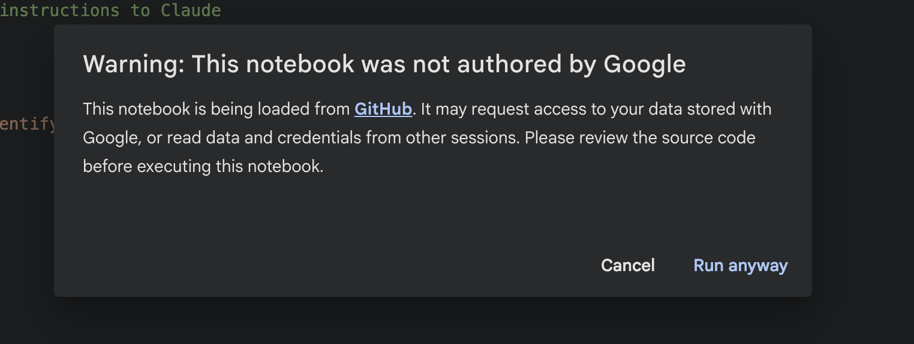
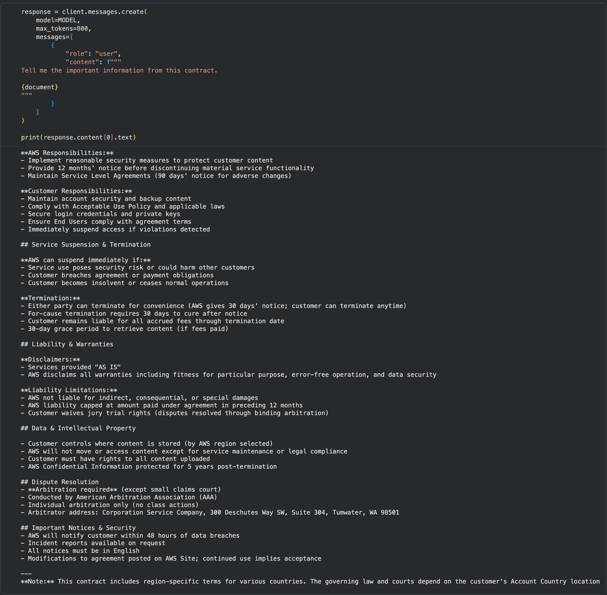
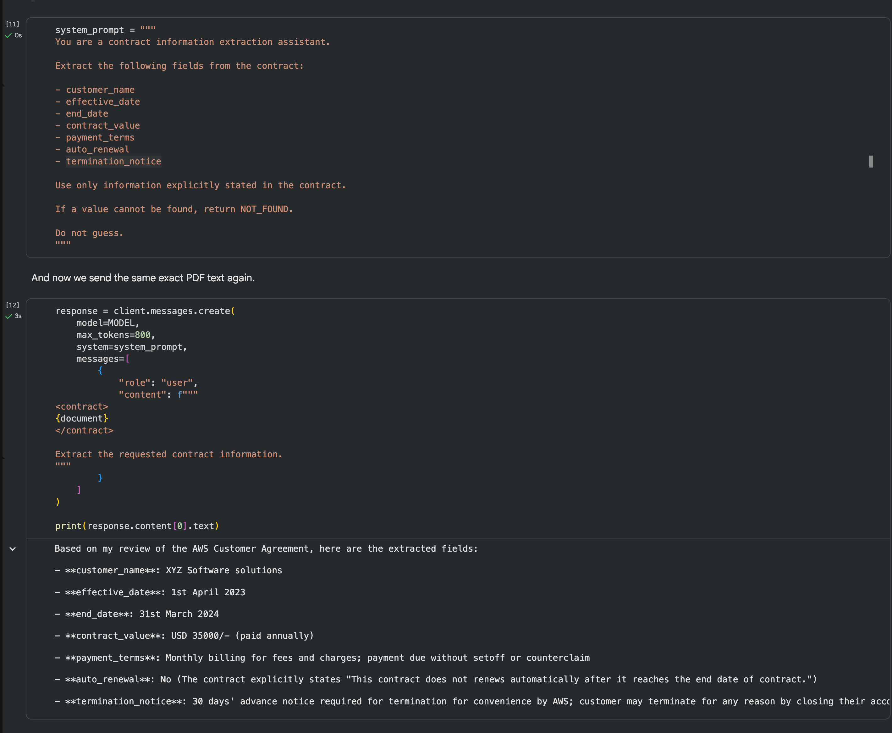
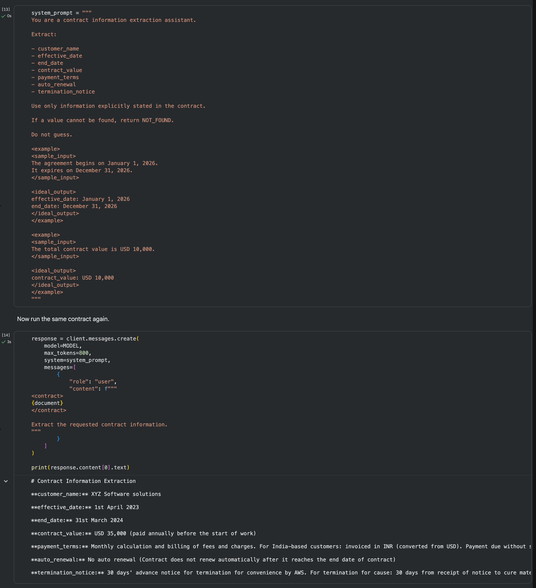
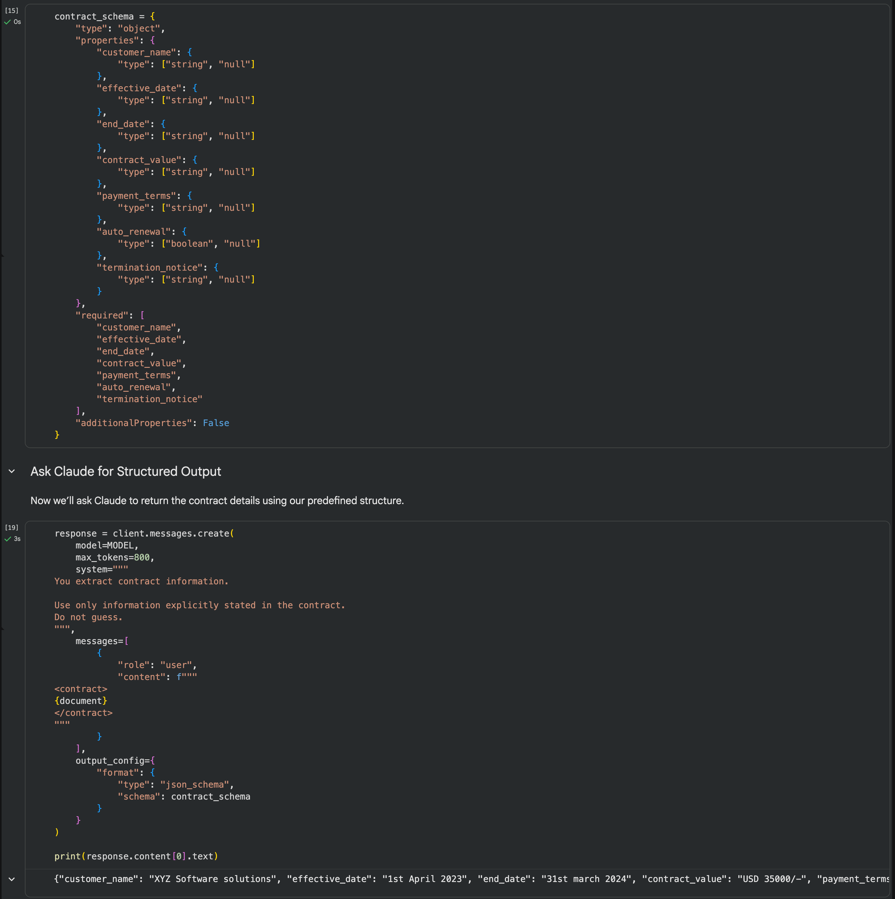
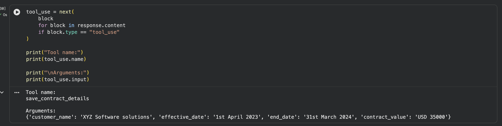
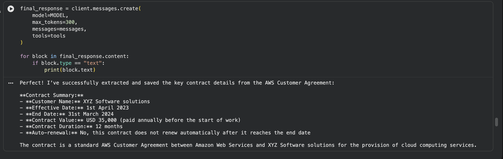
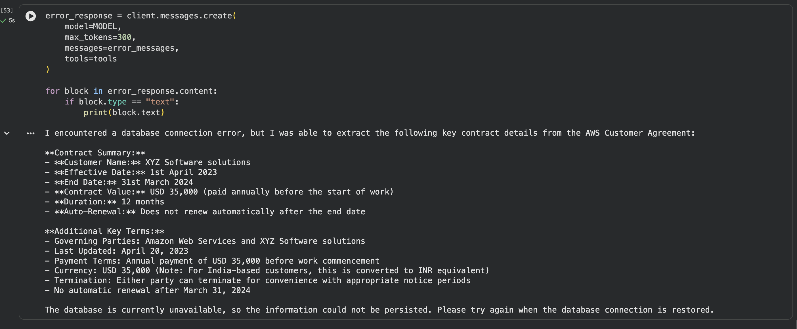

# Lab: Prompting, Structured Outputs, and Tool Use with Claude

[](https://colab.research.google.com/github/initmahesh/MLAI-community-labs/blob/main/Cohort-Labs/cohort-10/week-2/claude-prompting-tool-use/notebook.ipynb)

### **Note:** When you open the notebook, you may see a warning that says *"This notebook was not authored by Google"*. This is expected since it's loaded from GitHub.

If you get this prompt, click on **Run anyway**.

> 

In this lab, you will work with **one contract PDF from start to finish** and improve the same Claude-powered workflow step by step.

You will begin with a simple prompt, identify why it is unreliable, improve it using better prompting techniques, enforce structured outputs, introduce tool use, and finally handle tool failures.

## By the End of This Lab, You Will

- Connect a Google Colab notebook to the Anthropic API
- Extract text from a PDF using PyMuPDF
- Understand why vague prompts produce inconsistent results
- Improve prompts using system instructions, examples, and XML tags
- Use JSON schema for structured outputs
- Understand how Claude tool use works
- Add strict tool schemas
- Complete the tool-use loop
- Handle tool execution errors and return them to Claude

---

## Prerequisites

Before starting, make sure you have:

- A Google account to open and run the notebook in **Google Colab**
- An **Anthropic API key**
- The contract file **`AWS1.pdf`**

> **Important:** Keep your Anthropic API key private. Do not upload it to GitHub, share it in screenshots, or submit a notebook containing your key.

---

## Step 1: Open the Notebook

Open the provided `.ipynb` notebook in **Google Colab**.

If the notebook opens in preview mode, select:

[](https://colab.research.google.com/github/initmahesh/MLAI-community-labs/blob/main/Cohort-Labs/cohort-10/week-2/claude-prompting-tool-use/notebook.ipynb)

---

## Step 2: Add Your Anthropic API Key

Replace the API key value with **your own Anthropic API key** before running the cell.

```python
from anthropic import Anthropic

client = Anthropic(
    api_key="YOUR_ANTHROPIC_API_KEY"
)
```

Do not use or share another person's API key.

---

## Step 3: Run the Notebook in Order

Execute the notebook **from top to bottom**.

Do not skip cells because later sections use variables and responses created earlier.

You can run each cell using the **▶ Run** button.

The notebook follows this progression:

```text
Install Libraries
      ↓
Connect to Claude
      ↓
Upload Contract PDF
      ↓
Extract PDF Text
      ↓
Try a Vague Prompt
      ↓
Diagnose the Failure
      ↓
Improve the Prompt
      ↓
Add Few-Shot Examples + XML
      ↓
Enforce Structured Output
      ↓
Introduce Tool Use
      ↓
Add Strict Tool Schema
      ↓
Complete the Tool Loop
      ↓
Handle Tool Errors
```

---

## Step 4: Upload the Contract

When you reach **Upload the Contract PDF**, run the upload cell and select the provided contract.

The file must be named:

```text
AWS1.pdf
```

The notebook later reads:

```python
/content/AWS1.pdf
```

so changing the filename will cause the extraction step to fail unless you also update the path in the notebook.

---

## Step 5: Observe the Prompting Experiment

First, the notebook intentionally uses a vague prompt:

```text
Tell me the important information from this contract.
```

Do not try to fix it immediately.

Run it and observe what Claude chooses to return.



Then continue through the notebook to see how the prompt is improved by defining:

- the exact fields to extract
- what Claude should do when information is missing
- what Claude must not guess



examples of expected outputs
XML tags to separate instructions and contract content




The goal is to understand the improvement process:

```text
Failure
   ↓
Diagnose
   ↓
Improve
   ↓
Try Again
```

---

## Step 6: Run the Structured Output Section

Continue to the **Structured Output** section.

Here, the notebook defines a JSON schema so the application receives predictable fields such as:

```text
customer_name
effective_date
end_date
contract_value
payment_terms
auto_renewal
termination_notice
```

Run the cells and notice the difference between:

```text
Prompt
→ tells Claude what to do

Structured Output
→ defines the exact shape of the response
```

> 

You will then convert Claude's JSON response into a Python object and access individual values directly.

---

## Step 7: Run the Tool Use Section

Next, the notebook introduces a simulated database using a Python list.

Claude is given a tool named:

```text
save_contract_details
```

Run the cells and inspect:

```python
response.stop_reason
```

and the returned response blocks.

When Claude wants the tool to run, you should see a:

```text
tool_use
```

block.

Remember:

```text
tool_use
≠
tool executed
```

Claude only requests the action. Your Python code must still execute the function.

> 

---

## Step 8: Test Strict Tool Use

Continue to the section where:

```python
"strict": True
```

is added to the tool definition.

Run the cells again and inspect the arguments Claude generates.

The purpose of this section is to show how strict schemas make tool inputs more reliable for application code.

> 

---

## Step 9: Complete the Tool Loop

Run the section that sends the tool result back to Claude.

The complete flow is:

```text
Contract
   ↓
Claude extracts information
   ↓
Claude requests a tool
   ↓
Python executes the tool
   ↓
Tool result is returned to Claude
   ↓
Claude produces the final response
```

> 

---

## Step 10: Observe Tool Error Handling

At the end of the notebook, the save function intentionally throws:

```text
Database connection unavailable
```

This is expected.

The notebook catches the exception and returns the failure to Claude using:

```python
"is_error": True
```

Run the remaining cells and observe how Claude distinguishes between:

```text
Contract extraction succeeded ✅
Tool arguments were valid ✅
Database operation failed ❌
```

This demonstrates an important application pattern:

> A valid model response does not guarantee that an external API, database, or tool will succeed.


---

## Troubleshooting

### `AuthenticationError: invalid x-api-key`

Your Anthropic API key is missing, incorrect, expired, or copied incorrectly.

Check the key and run the client setup cell again.

### `NameError: fitz is not defined`

Make sure PyMuPDF is installed and import it before the PDF extraction section:

```python
import fitz
```

### `FileNotFoundError: /content/AWS1.pdf`

Make sure you uploaded the contract with the exact filename:

```text
AWS1.pdf
```

### A later cell says a variable is not defined

You probably skipped an earlier cell or restarted the Colab runtime.

Run the notebook again from the top.

---

## Lab Complete 🎉

You have now taken one contract-processing workflow from a simple LLM prompt to a more application-ready workflow with:

```text
Prompt Engineering
        +
Structured Outputs
        +
Tool Use
        +
Strict Schemas
        +
Tool Error Handling
```

The important lesson is not just how to call Claude.

It is how to make an LLM-powered application **clearer, more predictable, and more reliable step by step**.
