# Build a Contract Relationship Graph in Microsoft Fabric

In this lab, we are going to use a real contract to see this happen step by step — starting with the document, preparing its data, and finally turning that data into a graph.

We’ll create a workspace, add a Lakehouse named **`ContractLakehouse`**, upload a real contract PDF, and then use that data to understand how Fabric Graph represents and queries relationships.

By the end, you’ll have followed this complete flow:

```text
Create Workspace
    ↓
Create ContractLakehouse
    ↓
Upload Contract PDF
    ↓
Fabric Notebook
    ↓
Extract selected contract fields
    ↓
Create Lakehouse tables
    ↓
Fabric Graph
    ↓
Create nodes + edges
    ↓
Query the contract relationships
```

---

## Create Your Microsoft Fabric Workspace

Open **Microsoft Fabric** and go to **Workspaces**.

Select:

```text
+ New workspace
```

Give your workspace a name, then select **Create**.

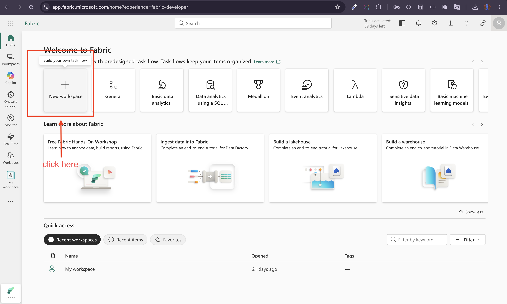
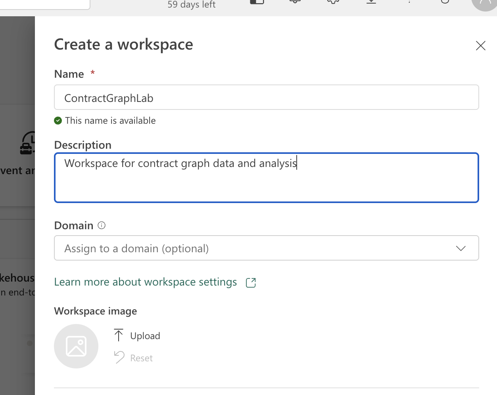
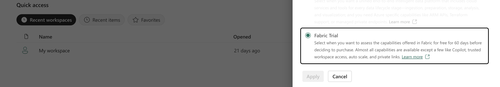

### You should see

Your new workspace open and ready for items to be added.

---

## Create `ContractLakehouse`

Before we upload the contract, we need a place to store both the original PDF and the structured tables we create later.

A **Lakehouse** is a storage area in Microsoft Fabric where files and tables can live together. In this lab, it will hold our contract PDF first, and later the table data that Fabric Graph will use.

From your workspace, select:

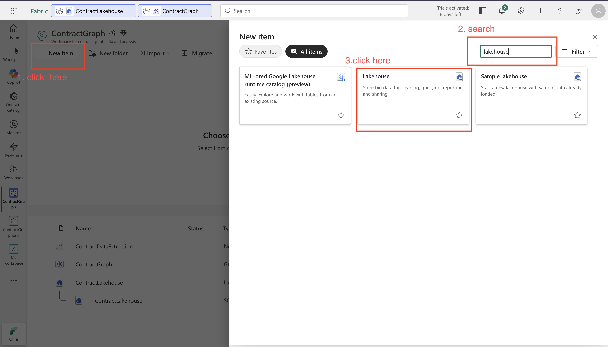

```text
+ New item
```

Search for:

```text
Lakehouse
```

Select **Lakehouse**.

Name it:

```text
ContractLakehouse
```

Then select:

```text
Create
```

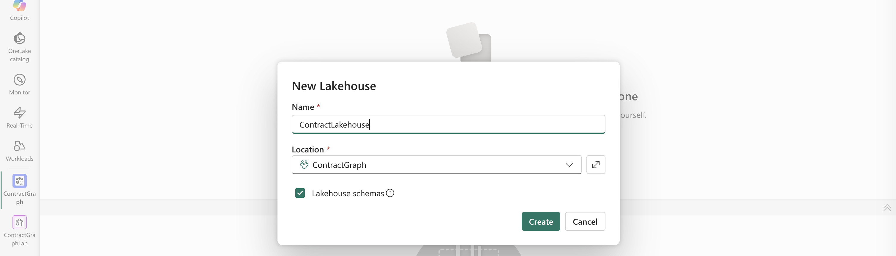

### You should now see

```text
ContractLakehouse
├── Tables
└── Files
```

That gives us the place where our contract data will live.

---

## 1. Open Your Microsoft Fabric Workspace

Open **Microsoft Fabric** and go to the workspace where you created:

```text
ContractLakehouse
```

You should be able to see your workspace items, including the Lakehouse.

> **Note:** You may see other items such as a Notebook or Graph model in the workspace in screenshot. Ignore them for now — we’ll create and use those later in the lab.

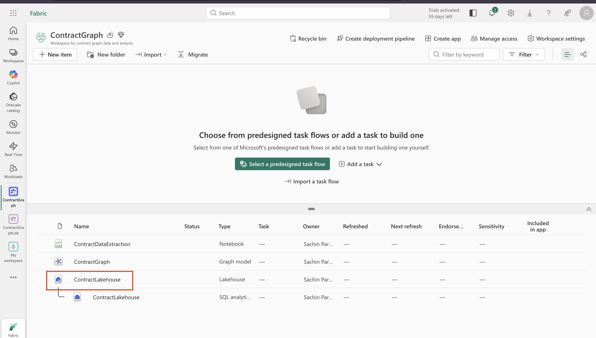

### You should see

Something similar to:

```text
Workspace
└── ContractLakehouse
```

That’s our starting point.

We’re not creating another Lakehouse. We’ll keep building on the one you already have.

---

## 2. Open `ContractLakehouse`

Select:

```text
ContractLakehouse
```

Inside the Lakehouse, notice the two main areas:

```text
Tables
Files
```

- **Tables** — Store structured data in rows and columns, like `Contracts`, `Parties`, or `Clauses`.
- **Files** — Store raw files such as PDFs, CSVs, images, or documents before or alongside processing them into tables.

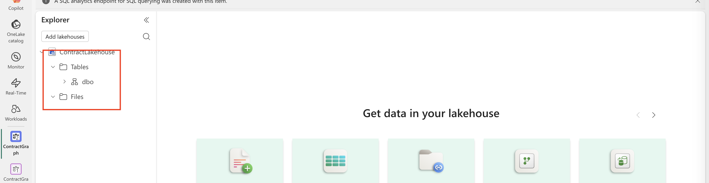

Right now, our contract is still just a PDF on our computer.

Let’s bring it into the Lakehouse first.

---

## 3. Upload the Contract PDF

Inside **`ContractLakehouse`**, go to the **Files** area and select:

```text
Upload
→ Upload files
```

Upload:
AWS1.pdf - [Download Link](https://drive.google.com/file/d/1XSe2pSsGN1ssAbif92rvb80AnHb_Ni0F/view?usp=sharing)


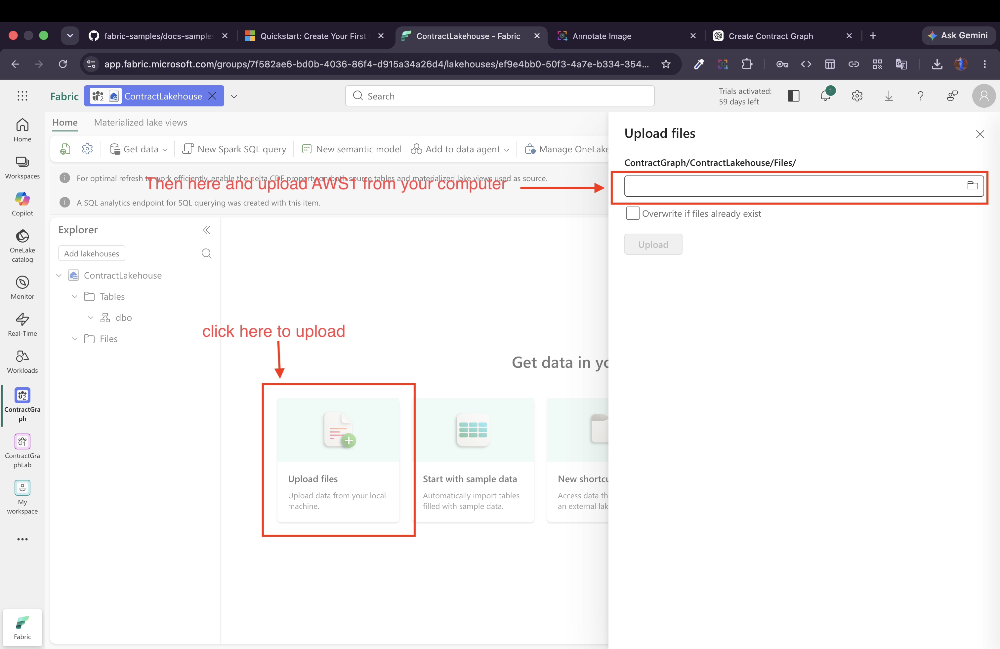

When the upload finishes, expand **Files**.

### You should now see

```text
ContractLakehouse
├── Tables
└── Files
    └── AWS1.pdf
```

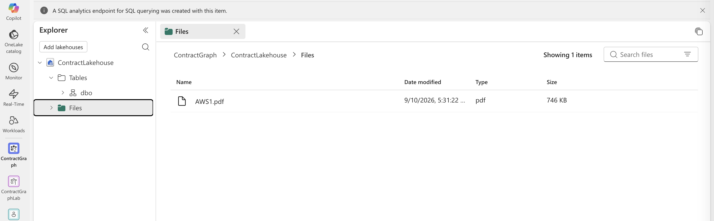

Nice — the actual contract is now inside Fabric.

But here’s the interesting part.

A PDF by itself is not yet a graph.

Fabric Graph works with **structured tabular data stored in OneLake/Lakehouse tables**. So before we can create nodes and relationships, we need to turn a few useful pieces of the PDF into rows and columns.

That is what the notebook will do.

---

## 4. Create a Notebook

Go back to your workspace.

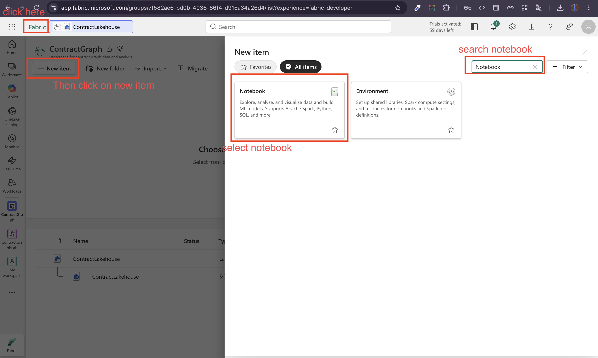

Select:

```text
+ New item
```

Search for:

```text
Notebook
```

Then select **Notebook**.

Name the notebook:

```text
ContractDataExtraction
```

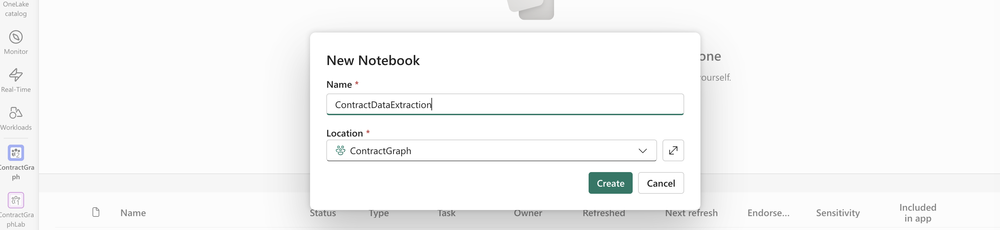

We now have a place to work with the PDF using Python.

But the notebook still needs access to the Lakehouse where we uploaded it.

---

## 5. Connect the Existing Lakehouse

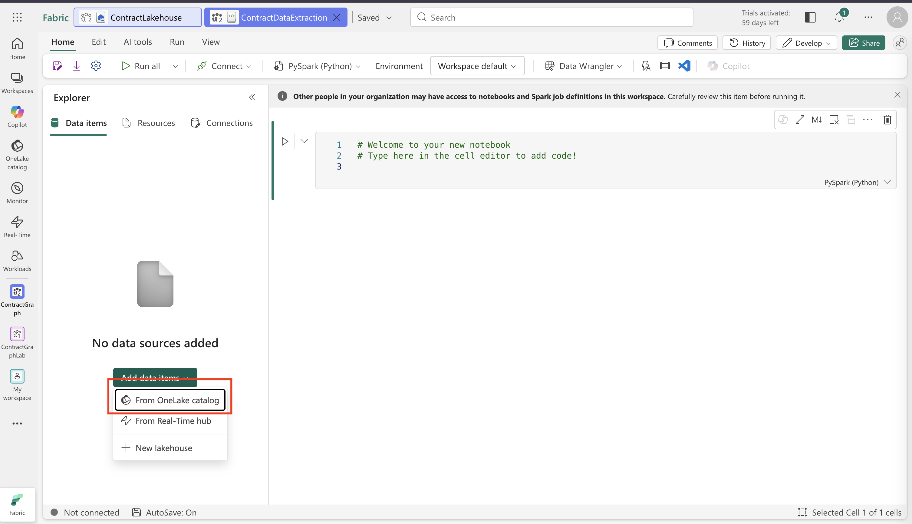

Inside the notebook, select:

```text
Add lakehouse
→ Existing lakehouse
```

Choose:

```text
ContractLakehouse
```

Then select:

```text
Add
```

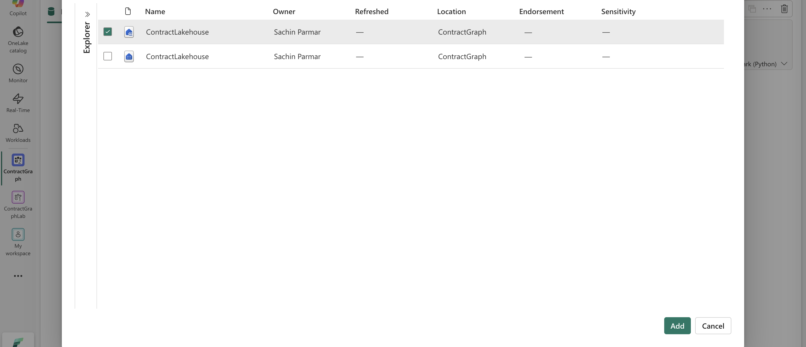

### You should now see

`ContractLakehouse` attached to the notebook.

Now the notebook and the contract file are finally in the same working flow.

Fabric exposes the default attached Lakehouse in notebooks under:

```text
/lakehouse/default/
```

So our PDF can be reached at:

```text
/lakehouse/default/Files/AWS1.pdf
```

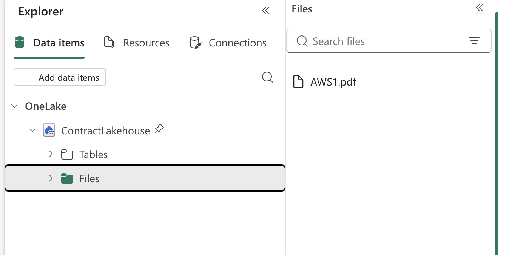

---

## 6. Read the Real Contract

First install a small PDF-reading library and then lets read the file by printing it:

```python
%pip install pypdf

from pypdf import PdfReader

pdf_path = "/lakehouse/default/Files/AWS1.pdf"

reader = PdfReader(pdf_path)

contract_text = ""

for page in reader.pages:
    contract_text += page.extract_text() + "\n"

print(contract_text)
```

Run it.

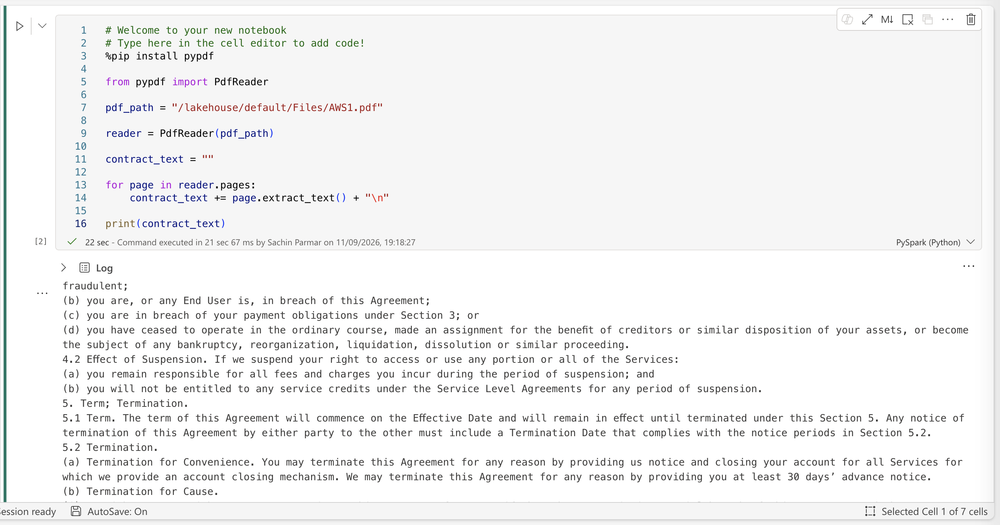

### Take a look at the output

You should now see text coming from the actual contract.

That is our first important transition:

```text
PDF file
   ↓
Readable contract text
```

We haven’t created a graph yet — but we have successfully brought the unstructured contract into a form our notebook can work with.

---

## 7. Decide What Is Worth Turning Into a Graph

Take a look at the contract text.

A contract contains a lot of words, but we do **not** need to turn every sentence into a node.

For this first graph, we’ll focus on three things:

```text
Contract
Party
Clause
```

Why these three?

Because they naturally create relationships.

For example:

```text
Party → belongs to → Contract
Contract → contains → Clause
```

That is exactly the kind of question a graph is good at representing.

For this first version, we’ll create a small structured set of records from the contract.
We’re using a small, ready-made dataset so the lab stays focused on how contracts, parties, and clauses are connected in a graph, rather than on preparing the data itself.

Add a new cell.

> for that if you hover below the previous cell you will see + code click on that
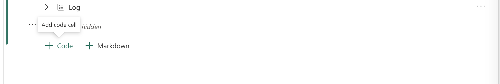

```python
contracts = [
    {
        "contract_id": "C001",
        "contract_name": "AWS Customer Agreement",
        "effective_date": "2023-04-01",
        "end_date": "2024-03-31",
        "contract_value_usd": 35000,
        "auto_renewal": "No"
    }
]

parties = [
    {
        "party_id": "P001",
        "party_name": "Amazon Web Services",
        "party_type": "Provider"
    },
    {
        "party_id": "P002",
        "party_name": "XYZ Software Solutions",
        "party_type": "Customer"
    }
]

clauses = [
    {
        "clause_id": "CL001",
        "contract_id": "C001",
        "clause_name": "AWS Responsibilities"
    },
    {
        "clause_id": "CL002",
        "contract_id": "C001",
        "clause_name": "Customer Responsibilities"
    },
    {
        "clause_id": "CL003",
        "contract_id": "C001",
        "clause_name": "Fees and Payment"
    },
    {
        "clause_id": "CL004",
        "contract_id": "C001",
        "clause_name": "Temporary Suspension"
    },
    {
        "clause_id": "CL005",
        "contract_id": "C001",
        "clause_name": "Term and Termination"
    }
]
```

Run the cell.

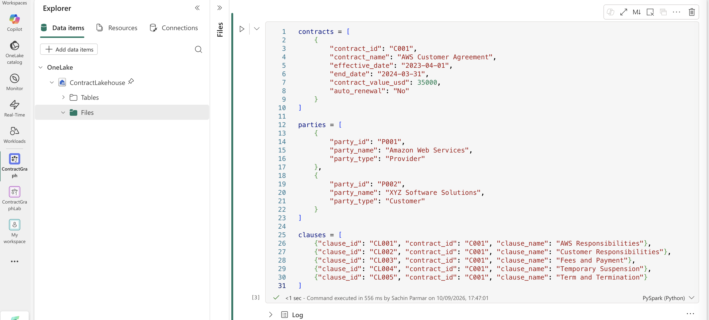

At this point, we’ve done something important without making it complicated:

```text
Contract text
     ↓
Selected useful entities
```

But we’re still missing one piece.

We know the parties exist.

We know the contract exists.

How do we tell Fabric that those parties are connected to that contract?

We need a relationship.

---

## 8. Create the Party-to-Contract Relationships

Add another cell:

```python
contract_parties = [
    {
        "relationship_id": "R001",
        "contract_id": "C001",
        "party_id": "P001",
        "role": "Provider"
    },
    {
        "relationship_id": "R002",
        "contract_id": "C001",
        "party_id": "P002",
        "role": "Customer"
    }
]
```

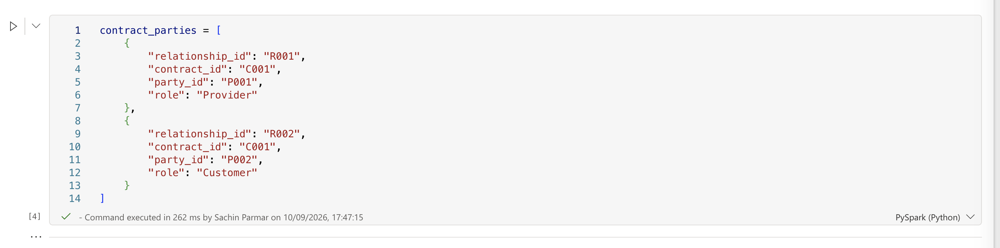

Run it.

Now we can describe the contract like this:

```text
Amazon Web Services ─────┐
                         │ PARTY_TO
                         ▼
                 AWS Customer Agreement
                         ▲
                         │ PARTY_TO
XYZ Software Solutions ──┘
```

And the clauses like this:

```text
AWS Customer Agreement
        │
        ├── CONTAINS → AWS Responsibilities
        ├── CONTAINS → Customer Responsibilities
        ├── CONTAINS → Fees and Payment
        ├── CONTAINS → Temporary Suspension
        └── CONTAINS → Term and Termination
```

This is the graph we are about to build.

We just need to get these Python records into Lakehouse tables first.

---

## 9. Turn the Records Into Spark DataFrames

Right now, `contracts`, `parties`, `clauses`, and `contract_parties` are just Python lists.

Before we can save them as Lakehouse tables, we need to convert them into **Spark DataFrames**.

A **DataFrame** is basically a table-like structure with rows and columns. In Fabric, Spark DataFrames make it easy to work with data and then write that data into the Lakehouse.

Add another cell:

```python
contracts_df = spark.createDataFrame(contracts)
parties_df = spark.createDataFrame(parties)
clauses_df = spark.createDataFrame(clauses)
contract_parties_df = spark.createDataFrame(contract_parties)
```

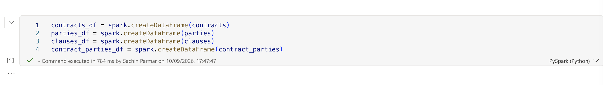

Run it.

Now preview the contract data:

```python
display(contracts_df)
```

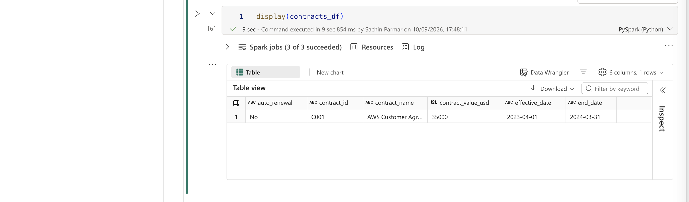

### You should see

A small table containing fields such as:

```text
contract_id
contract_name
effective_date
end_date
contract_value_usd
auto_renewal
```

That means our contract information is no longer just Python objects.

It is now tabular data — exactly what we need before moving into Fabric Graph.

---

## 10. Save the Data as Lakehouse Tables

Right now, our contract data exists as **Spark DataFrames inside the notebook**.

The next step is to save those DataFrames as actual **Lakehouse tables** so Fabric Graph can use them later.

Add another cell:

```python
contracts_df.write.mode("overwrite").format("delta").saveAsTable("contracts")

parties_df.write.mode("overwrite").format("delta").saveAsTable("parties")

clauses_df.write.mode("overwrite").format("delta").saveAsTable("clauses")

contract_parties_df.write.mode("overwrite").format("delta").saveAsTable("contract_parties")
```

Run it.

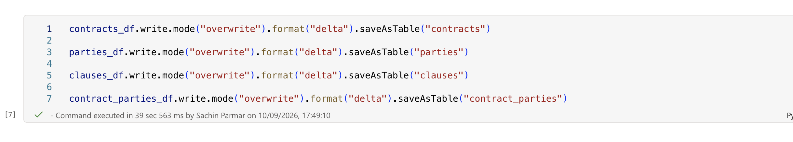

Now return to:

```text
ContractLakehouse
```

Refresh **Tables** if required.

### You should now have

```text
Tables
├── contracts
├── parties
├── clauses
└── contract_parties
```

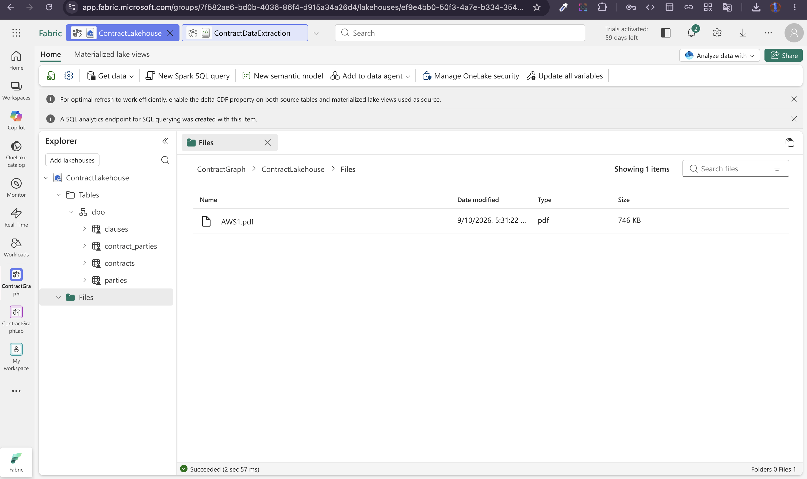

This is the moment where the whole first half of the lab comes together:

```text
AWS1.pdf
    ↓
Notebook
    ↓
Readable text
    ↓
Structured contract records
    ↓
Lakehouse tables
```

The PDF gave us the information.

The notebook turned that information into structure.

And now the structure is ready for a graph.

---

# Build the Graph

So far, we have taken information from our contract and stored it in Lakehouse tables.

But those tables still keep the information separately. Now we want to tell Fabric **how those pieces are connected

## 11. Create a Graph Model

Go back to your workspace.

Select:

```text
+ New item
```

Search for:

```text
Graph
```

Then select:

```text
Graph model
```

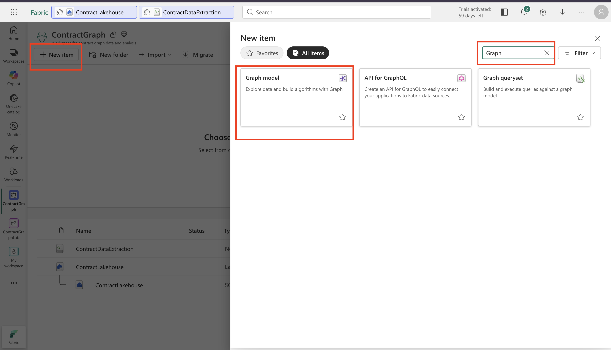

Name it:

```text
ContractGraph
```

Select **Create**.

### You should now see

The Graph model experience with options such as:

```text
Save
Get data
Add node
Add edge
```

- **Node** — Represents a thing in the graph, such as a **Contract**, **Party**, or **Clause**.
- **Edge** — Represents the relationship between nodes, such as **Party → belongs to → Contract** or **Contract → contains → Clause**.

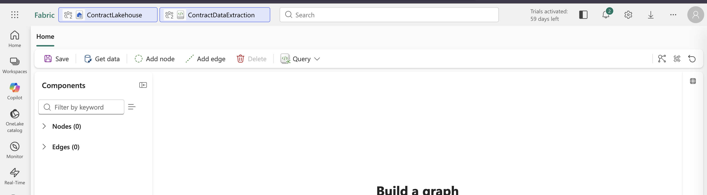

Right now the graph is empty.

That is expected.

The tables exist in the Lakehouse, but the graph does not know which tables represent **things** and which fields represent **relationships**.

Let’s define that.

---

## 12. Bring the Lakehouse Tables Into the Graph

Inside **`ContractGraph`**, select:

```text
Get data
```

Choose your Lakehouse from the OneLake catalog:

```text
ContractLakehouse
```

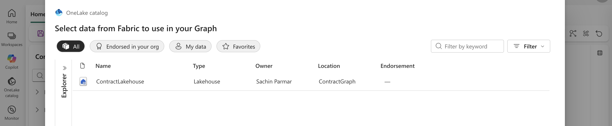

Select the tables:

```text
contracts
parties
clauses
contract_parties
```

Then load them.

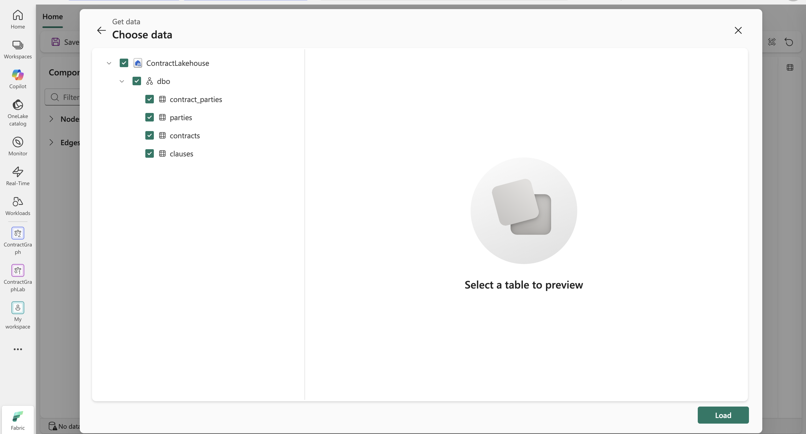

### You should now see

The four tables available in the Graph data pane.

The data is here.

Now we get to decide what those tables **mean** inside the graph.

---

## 13. Create the `Contract` Node

Select:

```text
Add node
```

Create a node using:

```text
Node type: Contract
Source table: contracts
Key: contract_id

Add the remaining columns as properties. click on add property then click on add all columns -> Apply
```

- **Node type: — The name of the node we are creating in the graph. Each record will represent a contract.

- **Source table: — The Lakehouse table from which Fabric will read the contract data.

- **Key: — The unique value used to identify each contract node.

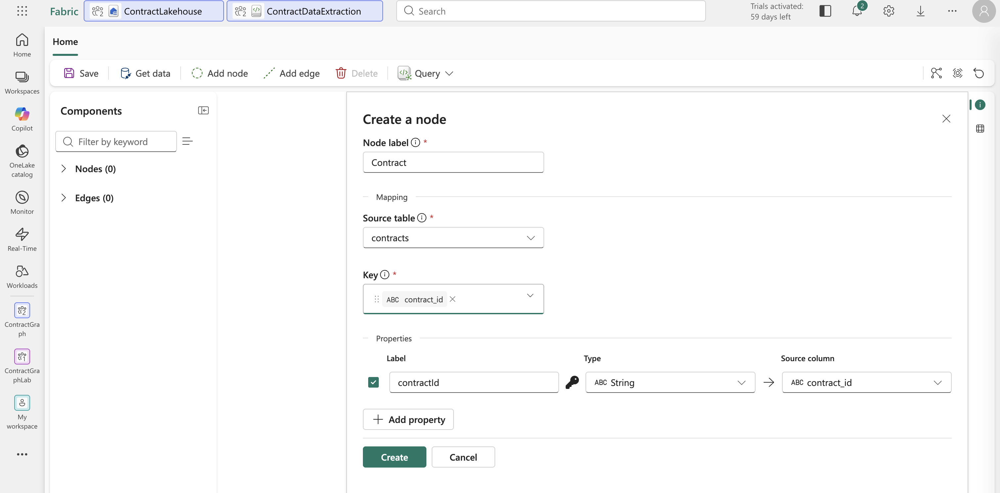
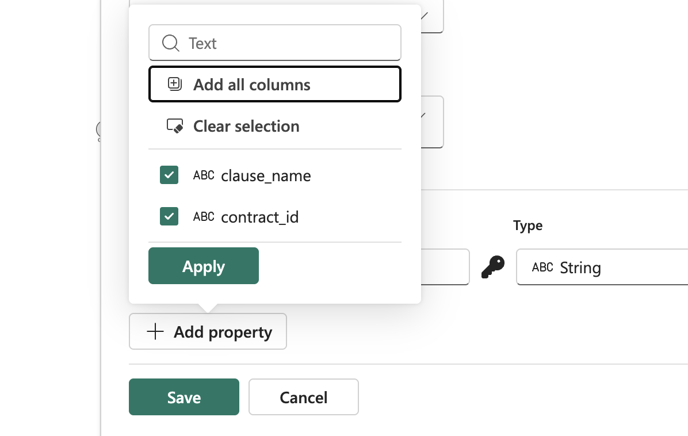

Save the node.

### What did we just do?

We told Fabric:

> Every row in the `contracts` table represents a Contract.

And:

> `contract_id` uniquely identifies each Contract node.

So this row:

```text
C001 | AWS Customer Agreement | ...
```

can now become a graph node.

---

## 14. Create the `Party` Node

Add another node:

```text
Node type: Party
Source table: parties
Key: party_id

Add the remaining columns as properties. click on add property then click on add all columns -> Apply
```

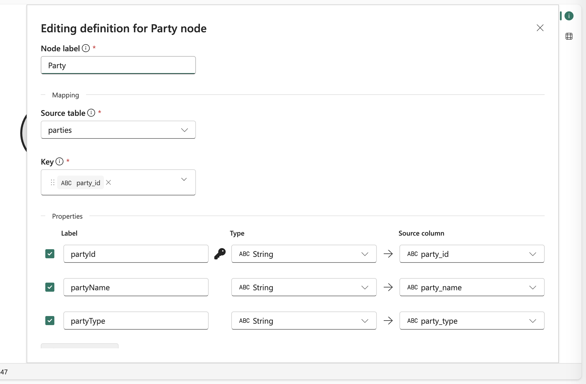

Now Fabric knows that rows such as:

```text
P001 | Amazon Web Services | Provider
P002 | XYZ Software Solutions | Customer
```

represent parties.

We have the things.

Next comes the connection between them.

But before that, let’s add our third type of thing.

---

## 15. Create the `Clause` Node

Add another node:

```text
Node type: Clause
Source table: clauses
Key: clause_id

Add the remaining columns as properties. click on add property then click on add all columns -> Apply
```

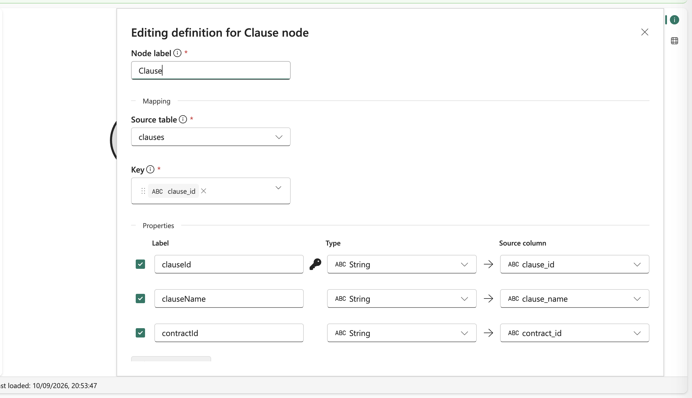

### Your graph model should now contain three node types

```text
Contract
Party
Clause
```
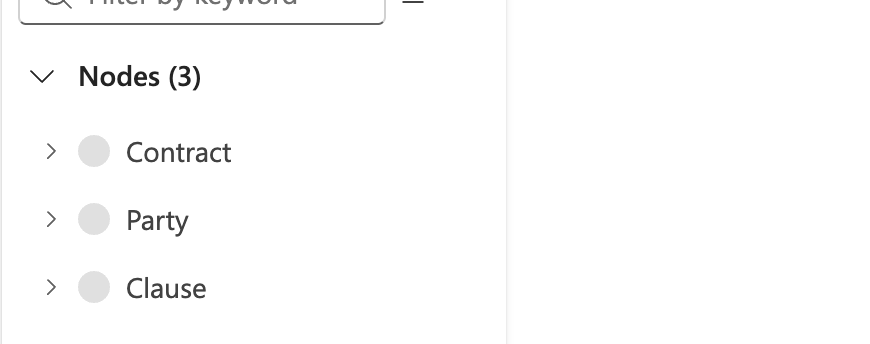

At the moment they are still disconnected.

That’s the next discovery.

Having entities is useful.

Having **relationships between entities** is what makes this a graph.

---

# Connect the Data

## 16. Connect `Party` to `Contract`

Select:

```text
Add edge
```

Create:

```text
Party ── PARTY_TO ──> Contract
```

Use:

```text
Source table:
contract_parties
```

Map the origin:

```text
Origin node: Party
Party key: party_id
Edge field: party_id
```

Map the target:

```text
Target node: Contract
Contract key: contract_id
Edge field: contract_id
```

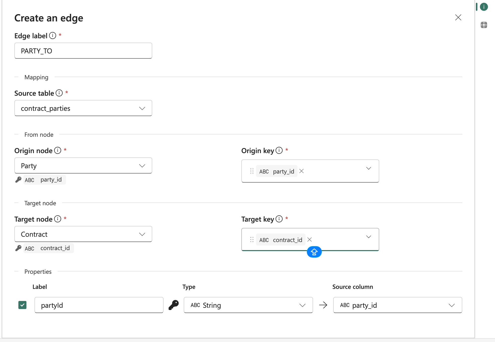

Save the edge.

### You should now have

```text
Party ── PARTY_TO ──> Contract
```

Now the graph knows that Amazon Web Services and XYZ Software Solutions are not just isolated records.

They are connected to a particular contract.

---

## 17. Connect `Contract` to `Clause`

We already stored `contract_id` inside every row of the `clauses` table.

So we can use that same table to create the next relationship.

Select:

```text
Add edge
```

Create:

```text
Contract ── CONTAINS ──> Clause
```

Use:

```text
Source table:
clauses
```

Map the origin:

```text
Origin node: Contract
Contract key: contract_id
Edge field: contract_id
```

Map the target:

```text
Target node: Clause
Clause key: clause_id
Edge field: clause_id
```

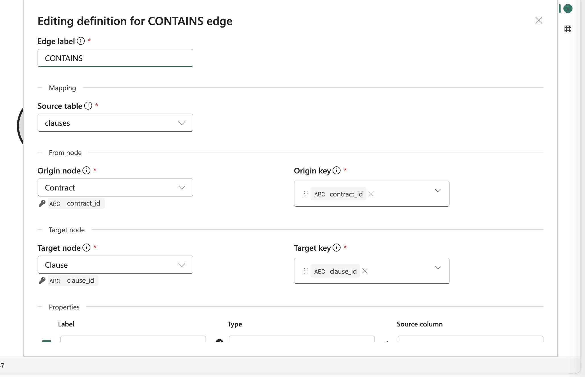

Save it.

### Take a look at the model now

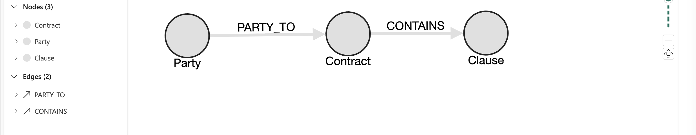

This is what we were working toward:

```text
Amazon Web Services
        │
        │ PARTY_TO
        ▼
AWS Customer Agreement
        │
        │ CONTAINS
        ├──────────────→ AWS Responsibilities
        ├──────────────→ Customer Responsibilities
        ├──────────────→ Fees and Payment
        ├──────────────→ Temporary Suspension
        └──────────────→ Term and Termination


XYZ Software Solutions
        │
        │ PARTY_TO
        └──────────────→ AWS Customer Agreement
```

The contract that started as a PDF now has a relationship structure.

Save the graph model.

Click Save.

After saving, look at the bottom-left corner of the page. You should see the status change to:

Loaded

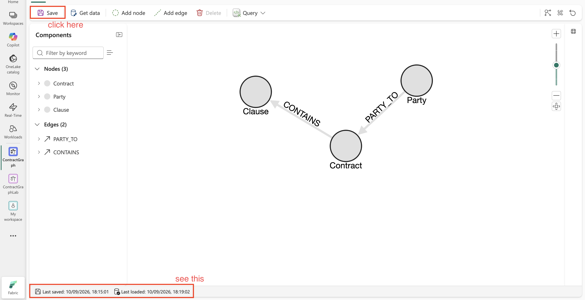

---

Once the graph finishes loading:

1. Go to the **top-right end** of the Graph model.
2. Click **Query**.
3. Click **Query Now**
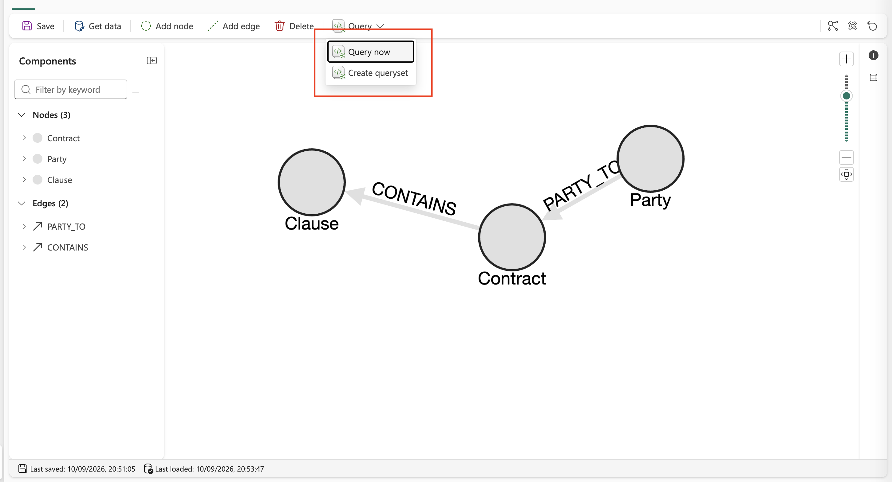

On Queryset page -->
3. Open **Query Builder** on the top-left side.
4. Select **Code editor** to start writing your graph query.
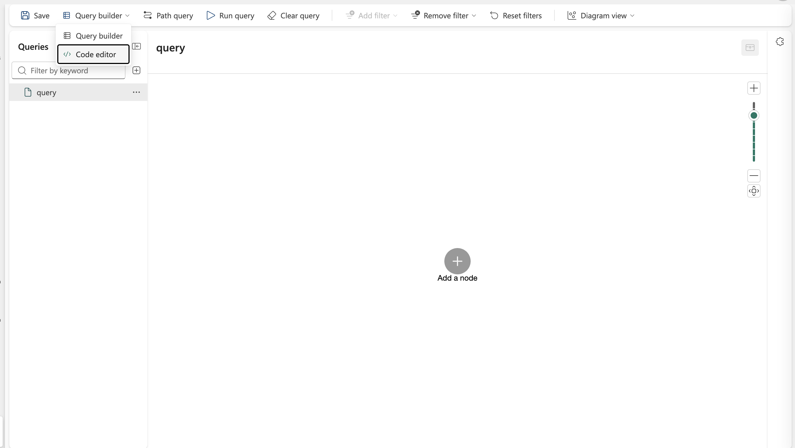


---

# Query What You Built

## 18. Ask the Graph Which Parties Belong to the Contract

Run:

```gql
MATCH (p:Party)-[:PARTY_TO]->(c:Contract)
RETURN p.partyName, c.contractName
```

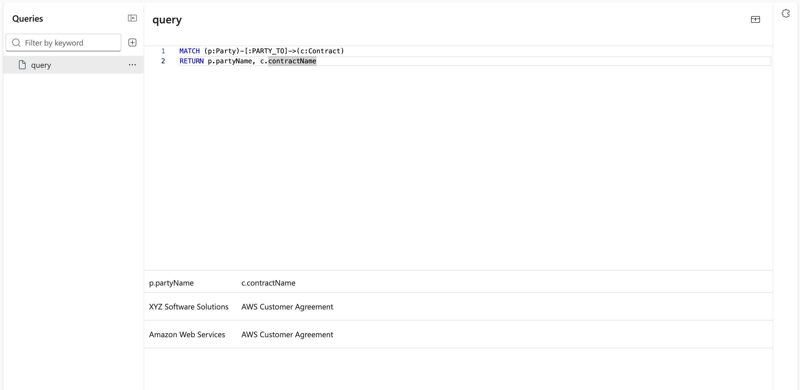

### You should get results connecting the parties to the contract

For example:

```text
Amazon Web Services       → AWS Customer Agreement
XYZ Software Solutions    → AWS Customer Agreement
```

Notice what changed.

Earlier, we had separate tables.

Now we are asking for a **relationship pattern**:

```text
Party → Contract
```

That is the shift from thinking only in rows to thinking in connected information.

---

## 19. Ask Which Clauses the Contract Contains

Now run:

```gql
MATCH (c:Contract)-[:`CONTAINS`]->(cl:Clause)
RETURN c.contractName, cl.clauseName
```

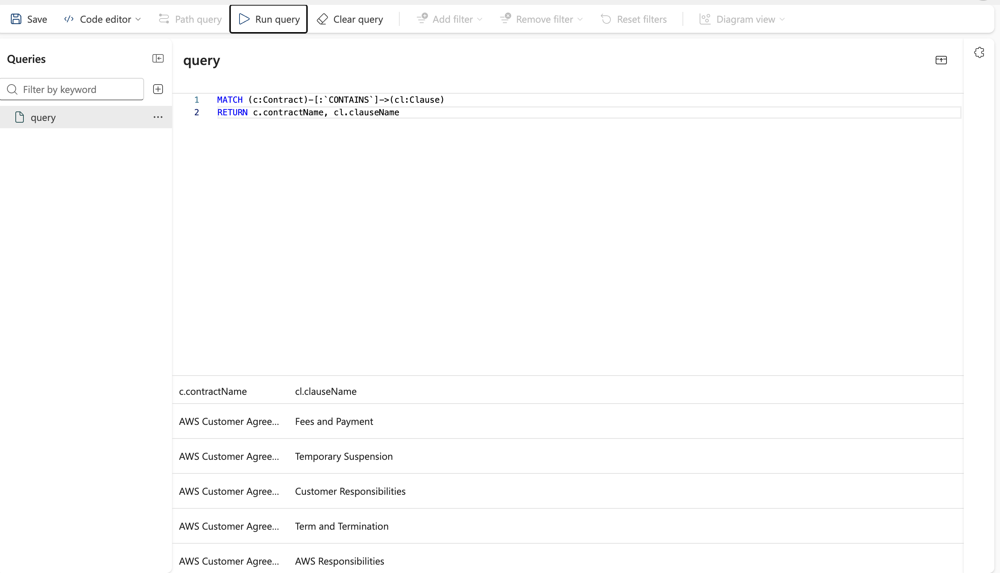

### You should see the contract connected to its clauses

Something like:

```text
AWS Customer Agreement → AWS Responsibilities
AWS Customer Agreement → Customer Responsibilities
AWS Customer Agreement → Fees and Payment
AWS Customer Agreement → Temporary Suspension
AWS Customer Agreement → Term and Termination
```

And that completes the full path.

---

# Look Back at What Just Happened

We started with this:

```text
AWS1.pdf
```

A document meant for people to read.

Then we progressively turned it into:

```text
AWS1.pdf
    ↓
Contract text
    ↓
Structured records
    ↓
Lakehouse tables
    ↓
Nodes + edges
    ↓
Queryable contract relationships
```

The notebook was the bridge between the PDF and the graph.

The tables gave the contract information structure.

The nodes represented the things we cared about:

```text
Contract
Party
Clause
```

And the edges represented how those things were related:

```text
Party ── PARTY_TO ──> Contract
Contract ── CONTAINS ──> Clause
```

---

# Final Test

Before you finish, make sure you can do both of these:

```gql
MATCH (p:Party)-[:PARTY_TO]->(c:Contract)
RETURN p.partyName, c.contractName
```

and:

```gql
MATCH (c:Contract)-[:`CONTAINS`]->(cl:Clause)
RETURN c.contractName, cl.clauseName
```

If both return the expected relationships, you have a working contract graph built from a real contract PDF.

---

# What You Learned

By the end of this lab, you should understand how **Fabric Graph** works and why it is useful.

You learned:

- why graph is useful when your data has relationships,
- how Lakehouse tables become the source for a graph,
- what **nodes** are and how they represent things such as `Contract`, `Party`, and `Clause`,
- what **edges** are and how they represent relationships such as `PARTY_TO` and `CONTAINS`,
- how IDs connect records together,
- and how GQL can be used to query those relationships.

Most importantly, you saw the difference between looking at data as separate tables and looking at the same data as connected information.

```text
Tables
Contract | Party | Clause

        ↓

Graph
Party → Contract → Clause
