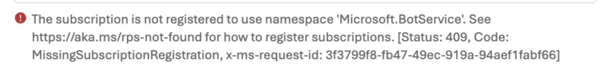
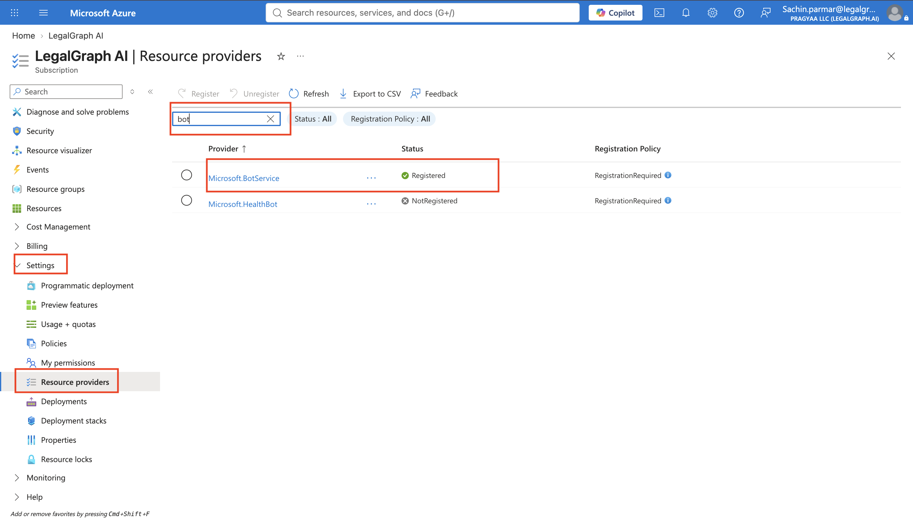
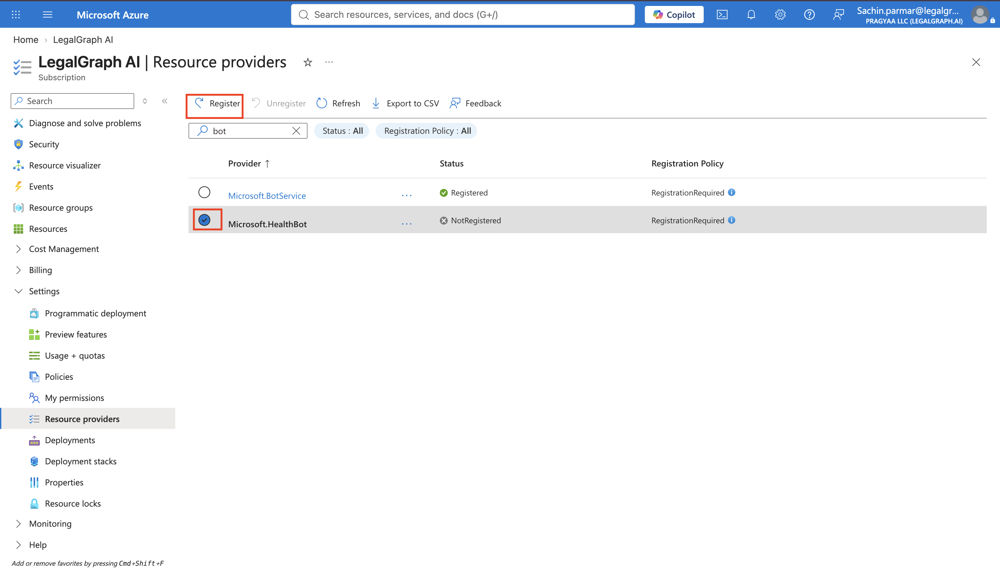

# Troubleshooting: "Subscription Is Not Registered to Use Namespace Microsoft.BotService"

## When Publishing Your Agent Fails with a Bot Service Error

You click **Publish** on your agent, and under **Azure Bot Services** you see this error:

```
The subscription is not registered to use namespace 'Microsoft.BotService'.
```



Nothing is wrong with your agent. Azure only lets a subscription use a service after its **resource provider** has been registered, and new subscriptions often don't have `Microsoft.BotService` registered yet. Publishing to channels such as Teams needs it, so the publish is blocked until you register it.

This fix takes a few minutes and you only need to do it once per subscription.

---

## Why This Happens

Each Azure service (Bot Service, Storage, Compute and so on) lives in a resource provider namespace. A subscription must be registered to a namespace before it can create resources in it. Publishing an agent creates an Azure Bot resource, so if `Microsoft.BotService` is not registered on your subscription, Azure rejects the request.

---

## Step 1: Open the Manage Page

**What you're doing**: Going to the Manage page, where your subscription is listed.

**Action items**:

1. In the **top navigation bar**, click **Manage**.

---

## Step 2: Open Your Subscription

**What you're doing**: Opening the subscription that the publish is failing on in the Azure portal.

**Action items**:

1. On the Manage page, look for **Subscription** and click on **your subscription**.
2. This takes you to your subscription's page in the Azure portal (`portal.azure.com`).

**Output**: Your subscription is open in the Azure portal.

---

## Step 3: Register Microsoft.BotService

**What you're doing**: Registering the Bot Service resource provider on that subscription.

**Action items**:

1. In the **left sidebar** of the subscription page, click **Settings**, then under it click **Resource providers**.
2. Use the **search bar on the Resource providers page itself** (the one just above the list of providers) and search for **Microsoft.BotService**.

   > **Note**: Do **not** use the global search bar at the very top of the Azure portal — it searches across all of Azure and won't filter this list.
3. Check its status. If it shows **Registered** with a green checkmark, it is already registered — connect with Tech-Team.



4. If it is not registered, click the **three dots** (**...**) next to it, then click **Register**.

   > **Note**: The screenshot below shows the example of **Microsoft.HealthBot**. You need to do the same for **Microsoft.BotService**.


5. Registration takes a while. The status changes from **Registering** to **Registered**. Click **Refresh** at the top and wait until it shows **Registered** with a green checkmark.

**Output**: `Microsoft.BotService` shows as **Registered** on your subscription.

---

## Step 4: Publish Again

**What you're doing**: Retrying the publish now that the provider is registered.

**Action items**:

1. Go back to your agent and click **Publish** again.
2. Under **Azure Bot Services**, the namespace error should no longer appear.

---

## Testing Your Agent in Teams

You can test your published agent in Microsoft Teams **only if you are signed in with an enterprise / work email address**. Personal email accounts can't be used for Teams testing of the published agent.

---

## Quick Reference

| Problem | Cause | Fix |
|---|---|---|
| "The subscription is not registered to use namespace 'Microsoft.BotService'" | The Bot Service resource provider is not registered on your subscription | Manage → Settings → Service providers → search Microsoft.BotService → ... → Register |
| Status stays at "Registering" | Registration is still in progress | Click Refresh and wait until it shows Registered |
| Publish still fails after registering | Status not yet updated to Registered | Confirm the green checkmark, then publish again |
| Can't test the agent in Teams | Signed in with a personal email | Use an enterprise / work email address |
