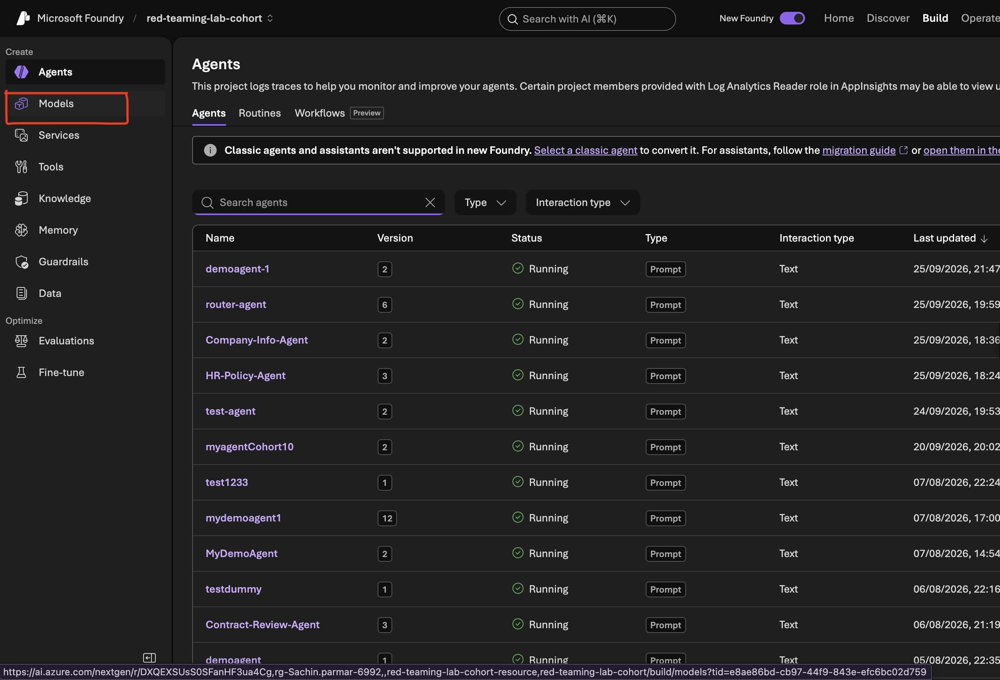
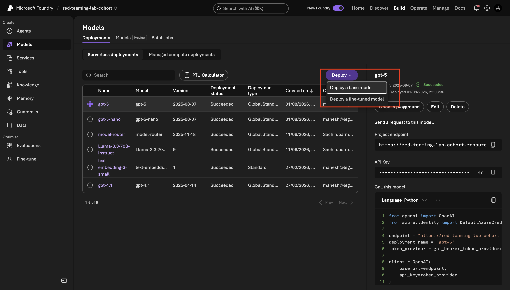
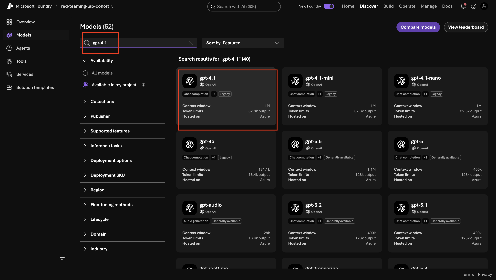
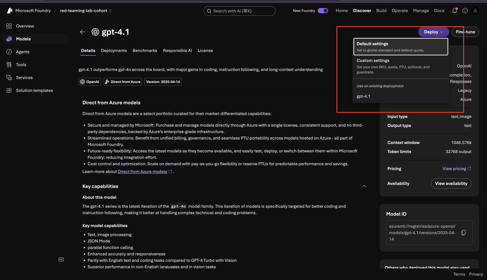

# Troubleshooting: Greyed-Out Judge Model in Azure AI Foundry

## When the Dropdown Stays Locked — Why It Happens and How to Fix It

You're setting up an evaluation in Azure AI Foundry. You've uploaded your dataset and selected your evaluation criteria, and then you hit a wall: the **Judge model** dropdown is greyed out and unclickable. Nothing's broken — billing is set up fine, your account is active — and yet the dropdown won't respond.

This guide explains exactly why that happens and walks you through the fix. It takes about five minutes and you only need to do it once per Foundry project.

---

## Why the Dropdown Is Greyed Out

The Judge model dropdown only lists models that are already **deployed** inside your Foundry project. It does not pull from a general catalogue — it pulls from your project's own deployments tab. If you have not deployed any models yet, the dropdown has nothing to show, so it locks itself.

The fix is straightforward: deploy a model first, then come back and configure the evaluation.

---

## What You'll Do

- **Step 1**: Deploy **gpt-4.1** as your first model — this unlocks the Judge model dropdown.
- **Step 2 (only if Step 1 fails with "Insufficient quota")**: Check your subscription type, upgrade if needed, set a budget alert, and deploy with Custom settings.
- **Step 3**: Return to your evaluation and confirm the dropdown is now active.
- **Step 4 (optional)**: Deploy a second, stronger model such as **gpt-5** if you want to compare how different judges score the same evaluation.

Work through the steps in order. Skip Step 2 if your deployment in Step 1 succeeds. Step 4 can be done now or any time you want another judge available.

---

## Step 1: Deploy gpt-4.1

**What you're doing**: Adding a model deployment to your Foundry project so the Judge model dropdown has something to show.

**Why this matters**: The Judge model dropdown is not a catalogue you browse — it reads from whatever models you have already deployed in this specific project. No deployments means an empty, locked dropdown. One deployment means the dropdown opens.

**Action items**:

1. Inside your Azure AI Foundry project, look at the **left sidebar** and click **Models**.

2. Click the **Deployments** tab. If the list is empty, that confirms the problem — this is what you need to fix.

3. Click **Deploy a base model** in the top-right corner.

4. In the search bar, type **gpt-4.1** and select it from the results.

   > **Note**: You may see **gpt-4.1** labelled as "Legacy" in the Foundry interface. This label means the model is on a slower release track, not that it is broken or unavailable. It works correctly as a judge model.

   > **Note — "Insufficient quota" error?** Quota depends on your region, subscription type and project scope, among other factors, so a deployment can fail with an *insufficient quota* message and a quota increase request may be rejected. If that happens, deploy **gpt-4.1-mini** instead of gpt-4.1. It is a smaller model that usually needs far less quota, and it unlocks the Judge model dropdown in exactly the same way.

   

5. Click **Deploy**, choose **Default settings**, and confirm.

   > **Note**: If **Default settings** is greyed out, or the deployment fails with *insufficient quota*, go to Step 2.

6. Wait for the status to update to **Succeeded**. This usually takes under a minute.

**Output**: Your Foundry project now has one active model deployment — gpt-4.1. The Judge model dropdown in your evaluation setup will recognise it.

---

## Step 2: Fix "Insufficient Quota" (Only If Step 1 Failed)

**What you're doing**: Finding out why your subscription has no quota for OpenAI models and fixing it.

**Why this matters**: **Azure Free Trial ($200 credit) subscriptions get 0 quota for OpenAI models.** No amount of retrying, changing region or requesting a quota increase will help on a Free Trial — the subscription itself has to be upgraded. Upgrading is free, and you keep your remaining credit.

**Action items**:

1. **Check your subscription.** In the Azure portal, go to **Subscriptions** → select your subscription → **Overview**, and look at the offer / plan name. If it says Free Trial, continue with the next step.

2. **Upgrade to Pay-As-You-Go.** Click the **Upgrade** button at the top of the portal. When asked to choose a support plan, keep **Basic (free)** — you do not need a paid support plan. Your remaining credit is kept.

3. **Set a budget alert.** Pay-As-You-Go bills for usage, so protect yourself from surprises: go to **Cost Management** → **Budgets** → **Add**, set a small amount (for example **$10**) and add an **email alert**.

4. **Deploy with Custom settings.** Go back to **Models** → **Deployments** → **Deploy a base model**, select your model and, if **Default settings** is greyed out, click **Deploy** → **Custom settings**. Set **Deployment type** to **Standard**.

   > **Note**: If **Global Standard** still shows *insufficient quota*, switch the deployment type to **Standard** — this has been seen to provide 50K TPM (tokens per minute), which is plenty for an evaluation.

   > **Note**: If you still cannot get quota for gpt-4.1, deploy **gpt-4.1-mini** instead.

5. Wait for the status to show **Succeeded**.

**Output**: Your project has a successful model deployment, and your subscription has a budget alert in place.

---

## Step 3: Return to Your Evaluation

**What you're doing**: Going back to the evaluation you were configuring and confirming the Judge model dropdown is now unlocked.

**Action items**:

1. In the left sidebar, click **Evaluations**.
2. Click **Create** (or open the evaluation run you were configuring before you hit the greyed-out dropdown).
3. Navigate to the **Criteria** section.
4. Click the **Judge model** dropdown — it should now show **gpt-4.1** as an option.
5. Select **gpt-4.1** and continue with the rest of the evaluation setup.

**Output**: The Judge model dropdown is active and gpt-4.1 is selected. You can now complete your evaluation run.

---

## Step 4 (Optional): Deploy a Second Judge Model

**What you're doing**: Deploying another model, such as gpt-5, so you can use a different judge for an evaluation.

**Why this matters**: Different judge models can score the same outputs differently. Running the same evaluation with a stronger judge is a common way to check how much your results depend on the judge. Just as gpt-4.1 had to be deployed before it appeared in the dropdown, any other model must be deployed before it appears there too.

**Action items**:

1. In the left sidebar, click **Models**, then open the **Deployments** tab.
2. Click **Deploy a base model**.
3. Search for **gpt-5** (or the model you want) and select it.

   > **Note**: If gpt-5 fails with *insufficient quota* (or your quota request is rejected because of region, project scope or other factors), deploy **gpt-5-nano** instead. It needs much less quota. Keep in mind it is a smaller model, so it may be a less strict judge than gpt-5.

4. Click **Deploy**, choose **Default settings** (or **Custom settings** → **Standard**, as in Step 2), and confirm.
5. Wait for the status to show **Succeeded**.

**Output**: The new model is deployed in your Foundry project and will appear in the Judge model dropdown the next time you set up an evaluation.

---

## Quick Reference

| Problem | Cause | Fix |
|---|---|---|
| Judge model dropdown is greyed out | No models deployed in this Foundry project | Deploy gpt-4.1 via Models → Deployments → Deploy a base model |
| A model you want is not in the dropdown | It has not been deployed in this project | Deploy it the same way, then return to the evaluation |
| "Insufficient quota" when deploying gpt-4.1 or gpt-5, or quota request rejected | Quota varies by region, subscription type and project scope | Deploy **gpt-4.1-mini** in place of gpt-4.1, and **gpt-5-nano** in place of gpt-5 |
| Free Trial subscription: 0 quota for OpenAI models | Azure Free Trial ($200 credit) gets no OpenAI quota | Upgrade to Pay-As-You-Go (keep Basic support), set a budget alert, then redeploy — see Step 2 |
| Default settings greyed out, or Global Standard shows "Insufficient quota" | Quota not available for that deployment type | Deploy → Custom settings → Deployment type: **Standard** |
| Model shows as "Legacy" | Release track label, not a quality issue | Ignore it — gpt-4.1 works correctly as a judge |

---

## What's Next

Head back to your evaluation, select your judge model, and run it. If you deployed more than one model, you can repeat the run with a different judge and compare the scored reports side by side.
