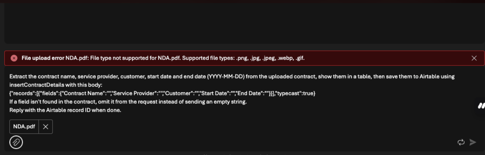

# Troubleshooting: "File upload error .pdf: File type not supported"

## When Your PDF Upload Is Rejected in the Chat or Playground

You try to attach a PDF to your chat, and you see this error:

```
File upload error .pdf: File type not supported .pdf. Supported file types: .png, .jpg, .jpeg, webp, gif.
```



Nothing is wrong with your PDF.

---

## Why This Happens

The upload options in the chat depend on the model the agent is using. If no model is deployed and selected in your agent, the chat falls back to image-only uploads (`.png`, `.jpg`, `.jpeg`, `.webp`, `.gif`) and rejects PDFs.

## The Fix

Make sure you have a model deployed and selected in your agent:

1. Deploy a model in your project if you haven't already. Follow the [deploy a model troubleshooting lab](../greyed-out-foundry-judge-model/Readme.md) for the step-by-step walkthrough, including quota fixes.
2. Open your agent and select the deployed model.
3. Save the agent, then try uploading your PDF again.