## Path B: Build from Scratch

This is the path that actually teaches you something. You'll add each node yourself, connect them, and see exactly what each one contributes. By the end, you'll understand not just *how* it works but *why* it's built this way.

Open n8n, click **"Create Workflow"**, and let's go.

---

### Step 1. Add the Chat Trigger

Every workflow needs a starting point — something that tells n8n "start running now." That's what a **Trigger** does.

Click **"Add Node"** on the canvas.

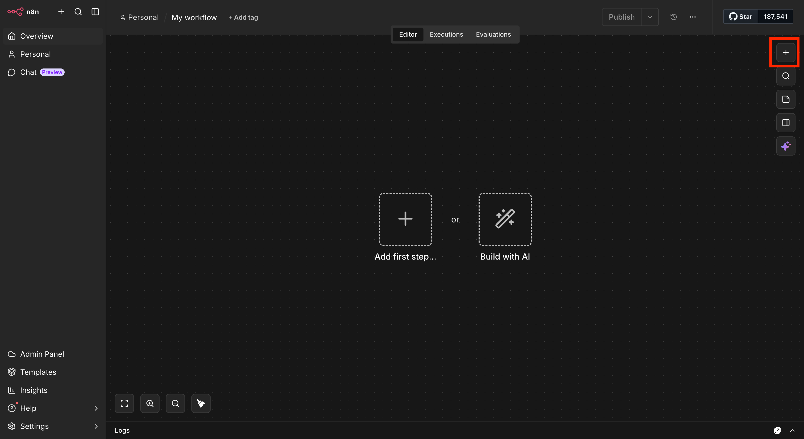

Search for **Chat Trigger** and select it.

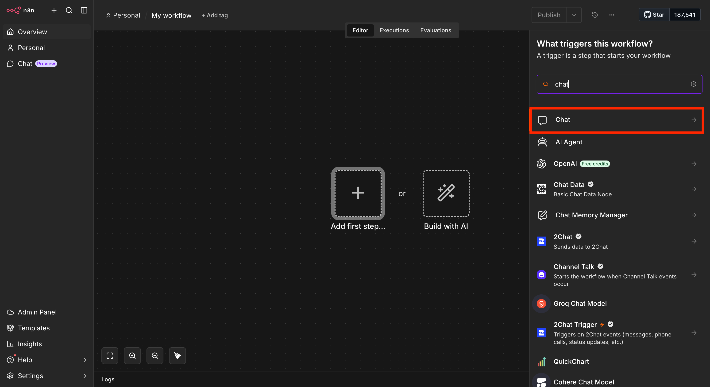

> **Why a Chat Trigger?** Because we're building a chatbot. The Chat Trigger is what listens for incoming messages. Every time a user sends something — whether it's a question or an uploaded file — this node wakes up and kicks off the rest of the workflow. No trigger, no workflow. It's the on-switch.

---

### Step 2. Set the Event to "On a New Chat Message"

Click on the trigger node's output point and select **"On a new chat message"** as the event type.


> **What's an event?** Triggers don't just activate randomly — they listen for a specific thing to happen. In this case, the event is a new chat message arriving. When it does, n8n fires the workflow. You could have other triggers listen for emails, form submissions, webhook calls, or a timer. The event type determines what activates your agent.

---

### Step 3. Allow File Uploads

Right now the chat can only receive text. We need it to also accept a PDF. Inside the Chat Trigger settings, click **"Add Field"** and enable **"Allow File Upload"**.

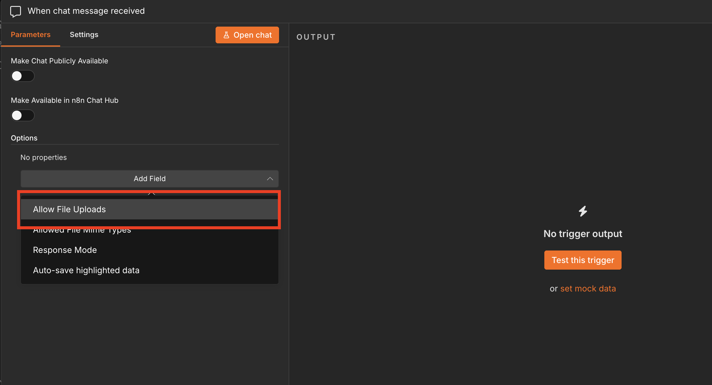


> **Why do we need this?** Our agent needs to read a contract — and contracts live in PDF files, not in text boxes. Enabling file upload is what gives users the ability to hand the document to the agent. Without this, the chatbot is just... a chatbot. With it, it becomes a document-aware assistant.

---

### Step 4. Test the Trigger

Before building further, let's confirm the trigger is actually working.

Click **"Open Chat"** at the bottom of the canvas. Upload the sample contract and type any question — it doesn't matter what yet.

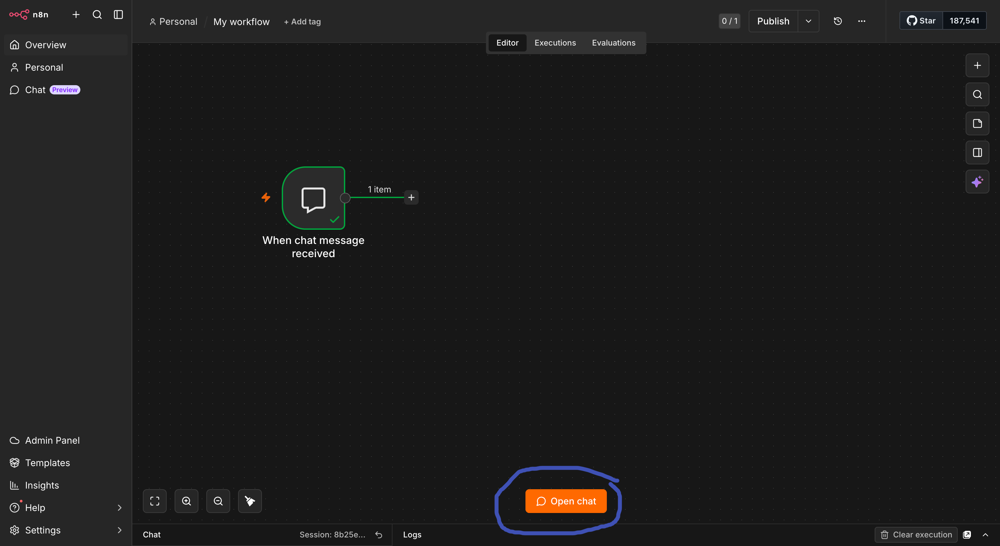

Now click on the Chat Trigger node in the canvas. You'll see exactly what it captured.

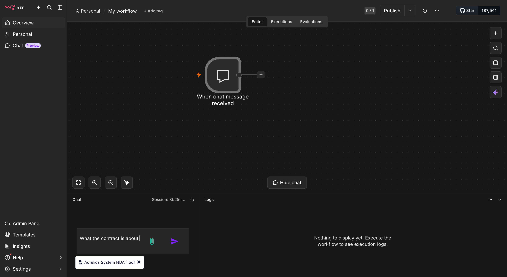

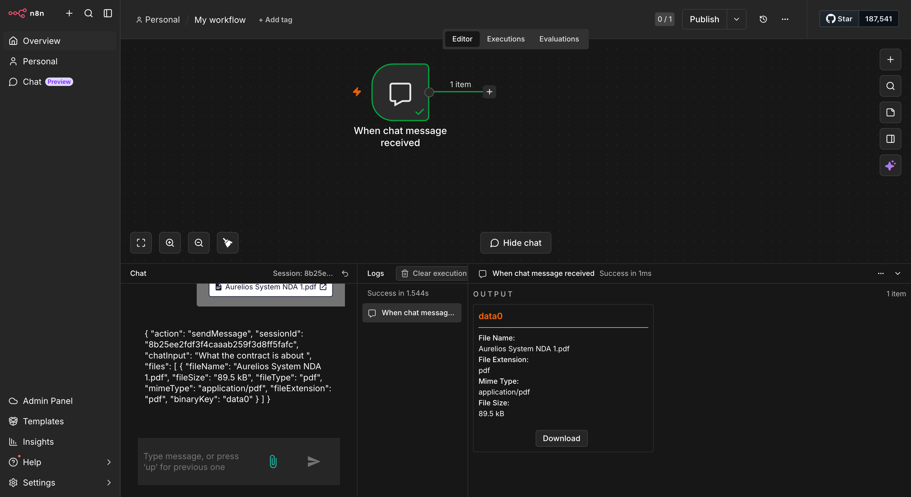

> **What you're looking at:** The node received two things — your text message (as a readable string) and the uploaded file (as binary data). Binary data is raw file bytes — it's not readable text yet. That's the problem we solve in the next step. The agent can't read binary; it needs actual words. This is exactly why Extract From File exists.

---

### Step 5. Add the Extract From File Node

Here's something most people don't think about: when a user uploads a PDF, the file doesn't arrive as readable text. It arrives as **binary data** — the raw bytes that make up the file. Your AI model can't read bytes. It needs actual words. So before we can hand the contract to the agent, we need to extract the text out of it first.

That's exactly what this node does. Click **"Add Node"**, search for **Extract From File**, and select it.

You'll see a list of actions — choose **"Extract from PDF"**.

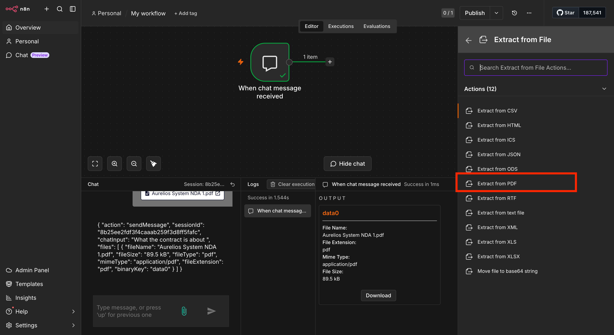

> **Why this node?** Think of it like this: the PDF is a locked box and the file contents are inside. The Chat Trigger hands us the box. Extract From File is the key — it opens it and pulls out the readable text. Once we have the text, the AI can reason over it like any other document. Without this step, the agent would receive raw bytes it can't understand, and your workflow would fail silently.

---

### Step 6. Configure the File Input

Inside the Extract From File settings, find **"Input Binary Field"** and set it to `data0`.

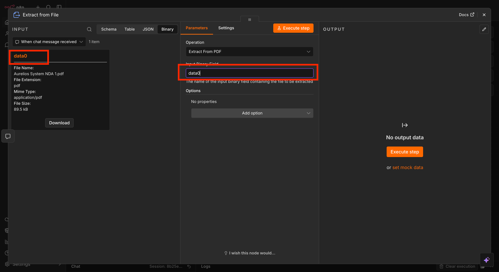

> **What is `data0`?** When the Chat Trigger receives a file, it stores it internally under the key `data0`. That's the name n8n gives the first attached file. You can see it in the left panel after running the trigger. By telling Extract From File to look at `data0`, you're pointing it to exactly where the file is sitting. If you upload multiple files, they'd be `data1`, `data2`, and so on.

---

### Step 7. Test the Extraction

Let's confirm it's working. Open the chat again, upload the contract, and send a query. Then click the Extract From File node.

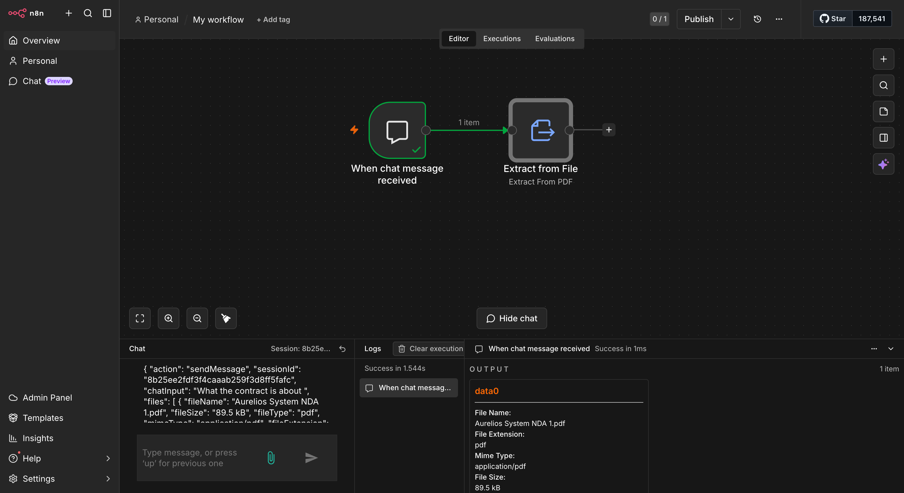

You should now see the full text content of the contract in the output — every clause, every paragraph, all of it as readable text. That's exactly what gets handed to the AI in the next step.

> ✓ If you see text in the output, you're good to continue. If you see an error, double-check that the Input Binary Field is set to `data0` and that the file you uploaded is a PDF.

---

### Step 8. Add the AI Agent Node

Here's where things get interesting. Click **"Add Node"**, search for **Agent**, and select it. Connect it to the Extract From File node.

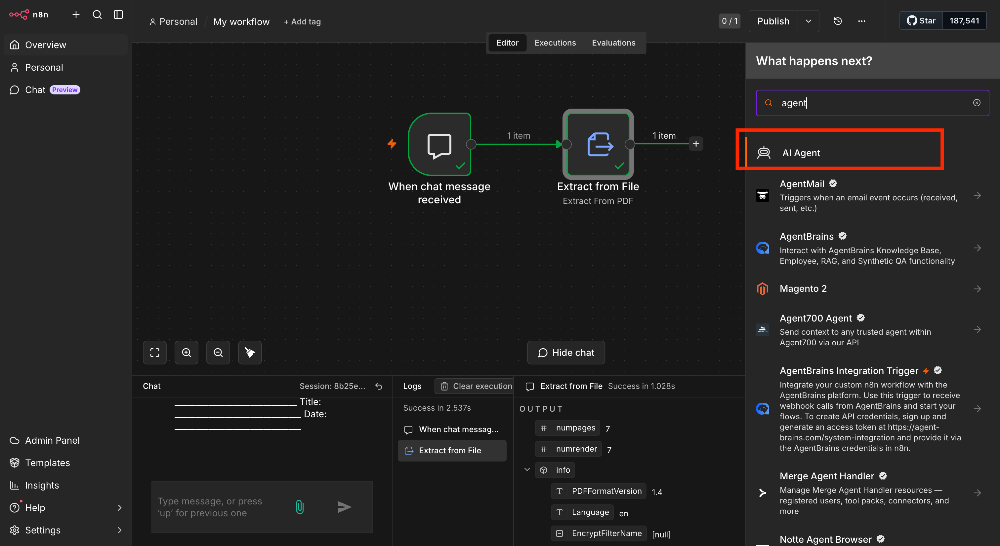

> **What is an Agent node?** This is the brain of the workflow. The Agent node takes inputs — in our case, the user's question and the extracted contract text — combines them with a set of instructions (the system message), and sends everything to an AI model. The model reads it all and writes back a response. The Agent node is the orchestrator. It doesn't do the reasoning itself — it packages everything up and hands it to the model.

---

### Step 9. Configure the User Message

The system message shapes every single response. The user message is what changes each time someone asks a question. You control the system message completely — and that's where all the product decisions live.

Now let's configure both.

Inside the Agent settings, find **"Source for Prompt (User Message)"** and set it to **"Define Below"**.

Then click **"Add Option"** and add a **System Message** field.

You now have two inputs to fill: the user message and the system message.

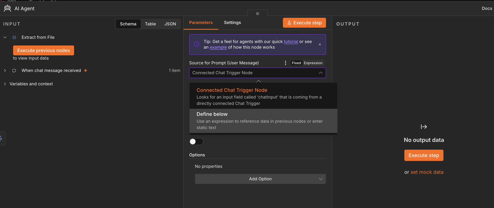

In the **User Message** field, add both of these:

```
User Query: {{ $('Chat Trigger').item.json.chatInput }}

File Context: {{ $('Extract From File').item.json.text }}
```

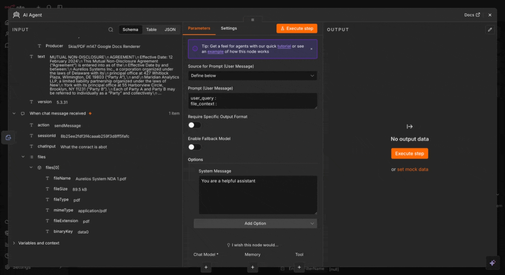

> **What's happening here?** The double curly braces `{{ }}` are n8n expressions — they pull live data from other nodes. The first line grabs exactly what the user typed in the chat. The second line grabs the full contract text from the extraction step. You're now combining both into a single prompt that the AI receives. The model will see the user's question and the entire document side by side, and reason over both at once.


Before you touch anything, here's the most important concept in this entire lab — the difference between a **System Message** and a **User Message**. These two fields control everything the agent does.

| | **System Message** | **User Message** |
|---|---|---|
| **What it is** | The agent's standing instructions — its role, rules, and how it should respond | The question or input from the person using the agent |
| **Who writes it** | You, the builder | The end user, at runtime |
| **When it runs** | Once, before every conversation starts | Every time the user sends a message |
| **Example** | "You are a contract review expert. Only answer from the contract. Always cite the clause." | "What are the payment terms in this contract?" |
| **Think of it as** | The job description you give a new hire | The task you give them on a given day |

---

### Step 10. Write the System Message

This is the most important part of the entire lab.

Imagine someone starting a new job without being told their role, responsibilities, or rules. They would have to guess what they should do. An LLM works in a similar way when it doesn't have clear instructions.

A system message acts like the agent's job description. It tells the model what its role is, what it should do, what it should avoid, and how it should respond. These instructions are set before the conversation starts and guide the model throughout the interaction.

**Why does this matter so much for a contract assistant specifically?** Because the cost of guessing is high. A generic chatbot making things up is annoying. A contract assistant making things up — inventing a termination clause that isn't there, or casually dispensing legal advice — is a liability. The system message is the only thing standing between "helpful tool" and "confidently wrong tool." It's the PM's highest-leverage lever, and it's plain text. No code required.

---

**See the difference a prompt makes.** Below are three versions of the same instruction — bad, good, and best. Each one is a real prompt you could paste into the System Message field. Only one of them should actually go into your workflow.

| | **Bad** | **Good** | **Best** |
|---|---|---|---|
| **Prompt** | `You are a contract assistant. Answer questions about the contract.` | `You are a contract assistant. Only answer using the contract text provided. If the answer isn't in the contract, say so. Don't give legal advice.` | The full Role / Instructions / Guardrails / Response Format prompt below |
| **What happens** | Model answers confidently even when the clause isn't in the document. No format, no boundaries — it behaves like a general-purpose chatbot that happens to have a PDF nearby. | Better — it grounds itself and refuses to guess. But answers are inconsistent in length and structure, and nothing stops it from narrating its process ("I checked the contract and found...") or drifting into a legal opinion when the language is ambiguous. | Consistent, structured, defensive by design. Every answer follows the same format, every edge case (no match, unclear language) has a scripted response, and the model is explicitly blocked from the failure modes that matter most for a legal document tool. |
| **Missing** | Role, guardrails, output format, fallback behavior | Output format, tone control, explicit fallback for ambiguous language | Nothing — this is what you'll paste |


In the **System Message** field, paste this:

```
Role
You are an AI Contract Assistant.

Instructions
1. Always use the contract content provided before answering.
2. Search for relevant clauses based on the user query.
3. Extract only the most relevant contract content.
4. If multiple clauses match, use the most relevant one.
5. Answer directly and concisely. Do not explain your internal process.
6. If no information is found, say: "This information is not mentioned in the contract."

Guardrails
1. Never make assumptions.
2. Never provide legal advice.
3. Never answer without checking the contract first.
4. If contract language is unclear, say: "This may need professional legal review."
5. Never say things like "I searched the contract", "Based on my analysis", or "I extracted..."

Response Format
Answer: [Direct answer]
Evidence: [Relevant clause/section]
```

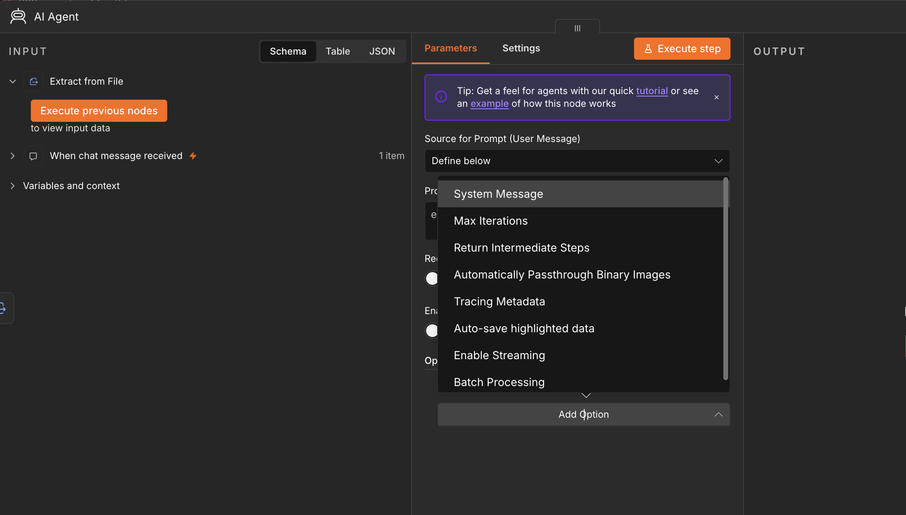

> **Why does this prompt matter so much?** The model has no idea who it is or what it's for until you tell it. Without a system message, it would answer any question, from any domain, based on its general training — including making things up. The system message is what transforms a general-purpose AI into a focused contract assistant. The guardrails stop hallucination. The response format ensures answers are always grounded in the document. This is the single highest-leverage thing you control as a PM building on AI.

> **Why "Bad → Good → Best" instead of just giving you the answer?** Because you'll write dozens of system messages after this lab, for agents that have nothing to do with contracts. The pattern generalizes: define the role, give explicit instructions, add guardrails for the specific ways this agent could fail, and force a consistent output format. Every strong system message you'll ever write follows that same shape.


---

### Step 11. Add the Language Model

The Agent node knows how to orchestrate. But it needs a brain to do the actual reasoning. That's the language model.

Click **"Add Node"**, search for **Language Model**, and choose **"OpenAI Chat Model"**. Connect it to the Agent node as a sub-node (it attaches below the agent, not inline).

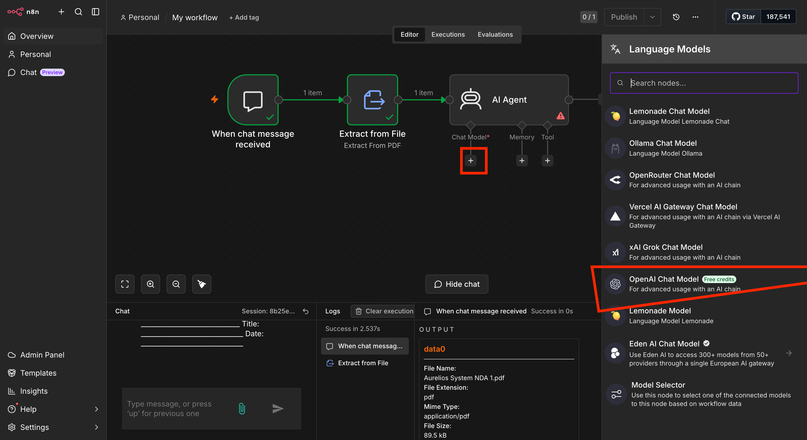

> **Why is this separate?** Because the model is swappable. Today you're using OpenAI. Tomorrow you might want to use Claude or a local model. By keeping the model as its own node, you can swap it without touching anything else in the workflow. This modularity is the entire point of building in n8n.

**Which model should you select?** Inside the OpenAI Chat Model node, open the **Model** dropdown and select **`gpt-5-mini`**.

| Model | Best for | Relative cost |
|---|---|---|
| **gpt-5-mini** | Document Q&A, clause extraction, structured output — this lab | Low |
| **gpt-4.1-mini** | Fallback if gpt-5-mini isn't available on your account tier | Lower |
| **gpt-4.1-nano** | Maximum cost savings — simpler documents, less precise extraction | Lowest |

> **Why gpt-5-mini for this lab?** Three reasons: speed, cost, and fit. Our agent's job is narrow — extract relevant clauses and answer a direct question. That doesn't require the full reasoning depth of gpt-4.1. gpt-5-mini handles document Q&A well, costs significantly less per token, and responds faster. Model selection is always a cost-capability trade-off. As your agents grow more complex — multi-step reasoning, conflicting clauses, long contracts — you'll revisit this decision.

---

### Step 12. Add Your OpenAI API Key

Inside the OpenAI Chat Model settings, click **"Credential"** → **"Create New Credential"** → paste your API key → Save.


> **What is an API key?** It's how OpenAI knows who's making the request and which account to charge. When n8n sends your prompt to OpenAI, it includes your key in the request. OpenAI's servers verify it, run the model, and send the response back. The whole round trip — question in, answer out — happens in about a second. You pay per round trip, which is why model choice is a cost decision as much as a capability one.

> ★ **Save your API key before you paste it.** Once stored in n8n, the key is encrypted and cannot be viewed or retrieved again. Copy it to a password manager *before* entering it here. If you lose it, you'll need to generate a new key from platform.openai.com — your old one won't be recoverable.

Your agent is now fully built. Head back to the main readme to test it and see the [Testing Your Agent](./readme.md#testing-your-agent) section.

---

[← Back to Lab 1.1 main readme](./readme.md)
