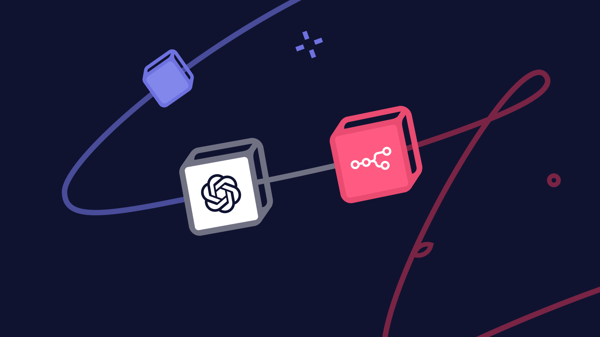
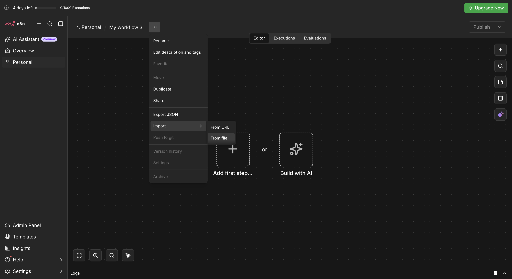
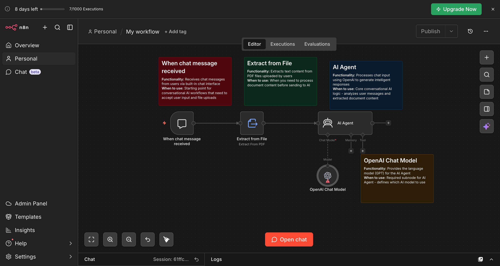
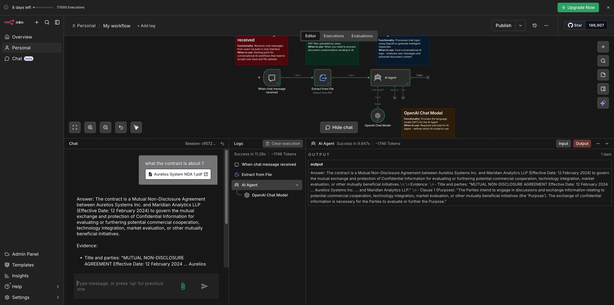
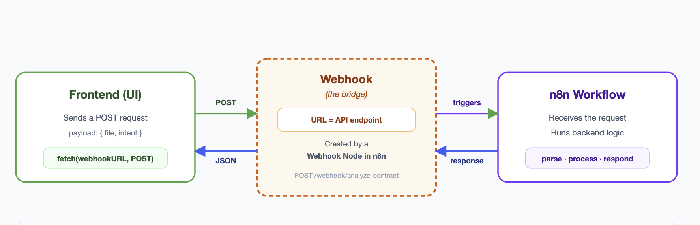
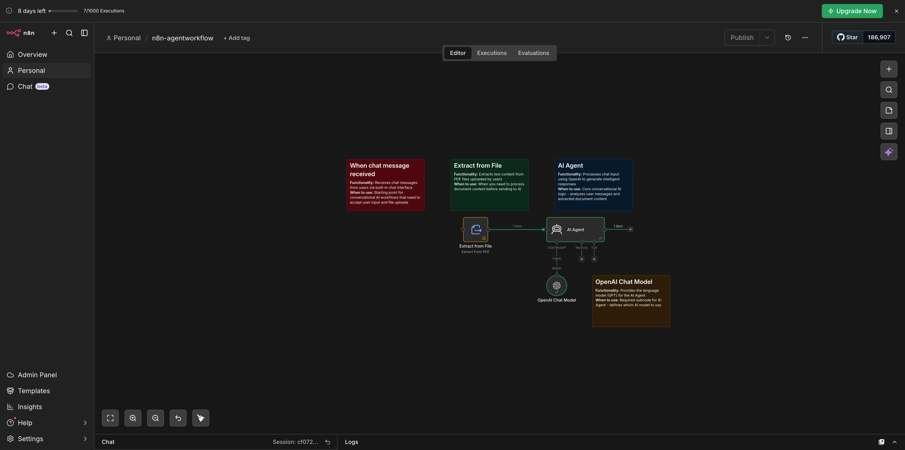
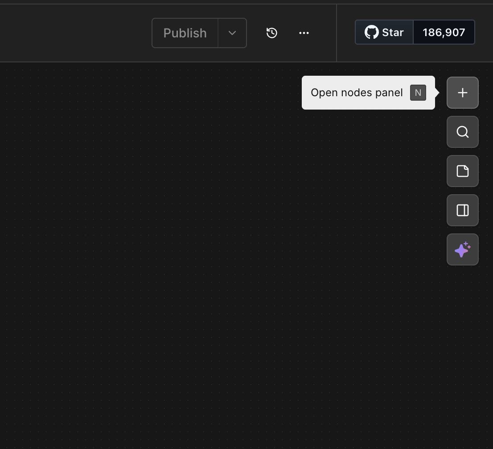
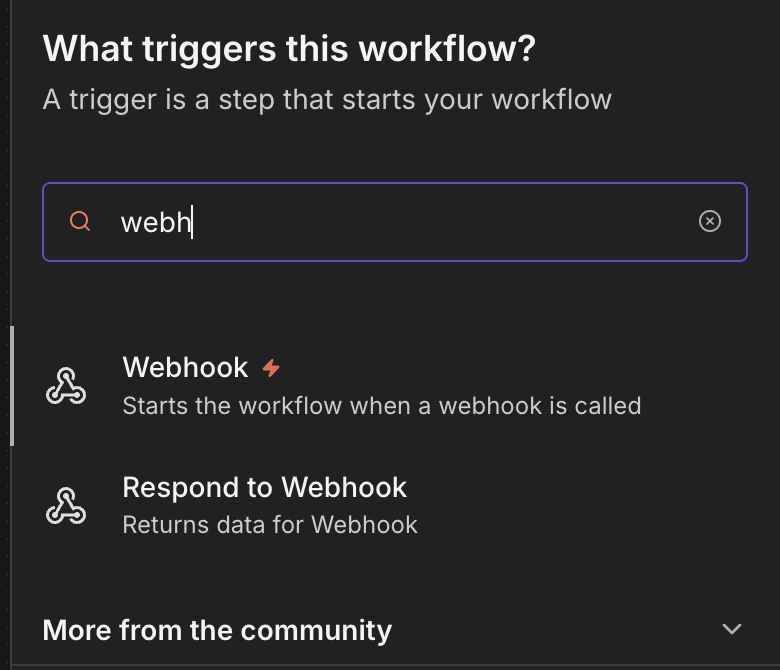
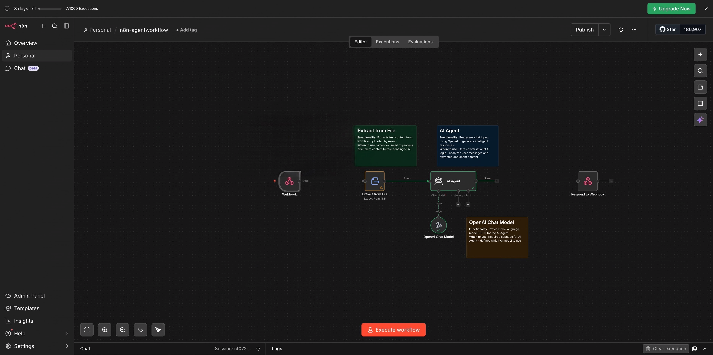
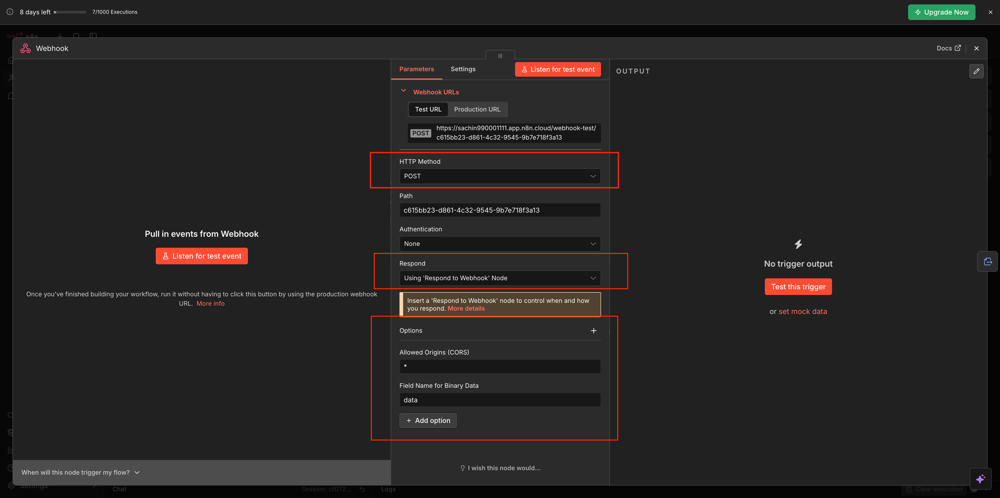

# Lab 1.1 : Build Your First AI Agent in n8n



By the end of this lab, you will:

- Have a live AI agent running inside n8n
- Understand what a system message is and why it controls everything — and see it prove itself across bad, good, and best prompts
- Know how to connect OpenAI to your workflow and pick the right model
- Be able to upload any document and interrogate it with natural language questions
- Expose your agent to the outside world with a Webhook, so any app can reach it

---

## What Are We Building?

A **Contract Q&A Chatbot.**

Here's the scenario: a user uploads a contract PDF, types a question, and the agent reads the document and replies with a direct answer — payment terms, termination clauses, renewal conditions, all of it. No scrolling through 40 pages. No legal background required.

Here's how the pieces connect:

1. A **Chat Trigger** — listens for the user's message and receives the uploaded file
2. **Extract From File** — pulls readable text out of the PDF so the AI can work with it
3. An **AI Agent** — takes the user's question + the extracted text, reasons over both, and writes a response
4. An **OpenAI Chat Model** — the actual intelligence powering the reasoning

Each of these is a node in n8n. You'll add them one by one, connect them, and watch the data flow through. Let's get into it.

---

## A Quick Mental Model Before You Start

Think of n8n like an assembly line. Each station (node) does one specific job and hands the result to the next station. The data moves left to right input goes in one end, processed output comes out the other.

Your agent is not magic. It's a chain of simple steps:

User message + file → Chat Trigger → Extract From File → AI Agent → Response

```
User sends message + file
        ↓
Chat Trigger receives it
        ↓
Extract From File pulls the text out
        ↓
AI Agent reads the text + question, writes an answer
        ↓
Response goes back to the user
```

Once you see it this way, every agent you'll ever build is just a variation of this pattern.

---

## Prerequisites

Make sure you have all four of these before starting:

✅ An **n8n account** — sign up free at n8n.io, the cloud version works fine. [Follow this setup guide](../../../Cohort%209/week%200%20%20-%20foundation/n8n-loginSetup/Doc.md) to create and configure your account.

✅ An **OpenAI API key** — go to platform.openai.com, create an account, and generate a key under API Keys. [Watch this video](https://youtu.be/J3y1dOpz9R4?si=fBqIP0TTShbH_6-n) for a step-by-step walkthrough.

✅ The **starter workflow file** — [download n8n-workflow.json](https://pragyaallc-my.sharepoint.com/:u:/g/personal/sachin_parmar_legalgraph_ai/IQCxwBn3DSxjTrx2_WxRoFTeAQ1ni4W0bV2cKybboqYJYC8?e=JQfaYk)

✅ The **sample contract PDF** — [download the sample contract](https://pragyaallc-my.sharepoint.com/:b:/g/personal/sachin_parmar_legalgraph_ai/IQC2WQJhhIuyRq5JrVY13FwNAdwS4M5gB5w-qzBAm9V4mRQ?e=XyvLU4) (a fictional vendor agreement we've prepared for this lab)

> ✓ Tip. n8n gives you a small free OpenAI credit when you start. It's enough to get going, but it won't last through all the labs. Add $5 of credits to your OpenAI account now and you won't have to think about it again.

---

✅ if you want to build from scratch [build-from-scratch.md](./build-from-scratch.md)

---

## Two Ways to Build This

| | **Import the Workflow** | **Build from Scratch** |
|---|---|---|
| **Best for** | Getting up and running fast | Understanding every component |
| **Time** | ~5 minutes | ~25 minutes |
| **What you do** | Import a pre-built file and configure it | Add and connect each node yourself |

Both paths produce the same working agent. Path B is recommended if this is your first time — building it node by node is how you actually internalize how agents work.

---

## Import the Workflow

**Step 1. Create a new workflow.**

Open your n8n account and click **"Create Workflow"** in the top right. You'll land on a blank canvas — this is your build surface.


---

**Step 2. Import the starter file.**

Click the **three-dot menu (⋮)** at the top left, select **"Import from File"**, and upload the `n8n-workflow.json` file from the prerequisites.

Your canvas will populate with all the nodes already connected.



---

**Step 3. Verify the connections.**

Every node should be linked with a visible line. If anything looks disconnected, drag the small circle on the right edge of that node and connect it to the next one.



> ✓ Tip. If your agent isn't responding, the first thing to check is always node connections. One broken link stops the entire workflow silently.

---

**Step 4. Add your OpenAI API key.**

Click the **"OpenAI Chat Model"** node. In the Parameters panel, click **"Credential"** → **"Create New Credential"** → paste your API key → Save.

n8n encrypts and stores it. You won't need to paste it again across any of the labs.


> ★ Your API key is tied to your OpenAI billing account. Never paste it into a public file or share it in a message. Treat it like a password.

> ★ **Save your API key before you paste it here.** Once you save a credential in n8n, the key is encrypted — you cannot view or retrieve it again. Copy it to a password manager or a secure note *before* entering it. If you lose it, you'll need to generate a new one from platform.openai.com and update the credential.

---

**Step 5. Open the chat and test.**

Click **"Open Chat"** at the bottom of the canvas. Upload the sample contract PDF and ask: *"What the Contract is about?"*




---

## Testing Your Agent

Your agent is live. Open the chat, upload the sample contract, and try these one at a time:

*"What is this contract about?"*

*"What are the key terms I should know before signing?"*

*"What happens if either party wants to terminate early?"*

*"Are there any auto-renewal clauses?"*

Watch how it responds — specific, grounded in the document, citing the actual clause. That consistency isn't accidental. It's exactly what the system message told it to do.


> **Why doesn't it make things up?** Because the system message told it to only answer from the contract, and the user message contains the entire contract text. This technique is called **grounding** — you constrain the model to reason over a specific source rather than its general training knowledge. Grounding is one of the most important reliability patterns in production AI. Without it, models hallucinate. With it, they stay on topic and cite their sources.

---

## Testing Prompt Quality: From Basic to Better

Now that your chatbot is set up, let's test how different instructions affect its responses.

We'll start with a basic system message, test the chatbot, and then improve the instructions step by step. After each change, we'll ask the same questions so you can clearly compare the results.

### 🔴 Basic Poor Prompt

**Input:**

```
Extract these Information from the document: Key Term, Description, and Location in Contract.
```

**Output:**

```
Here are some key terms extracted from the document along with their descriptions and locations in the contract:

1. **Key Term:** Kaseya Master Agreement
   **Description:** A binding legal contract between Kaseya and the entity making purchases under this Agreement.
   **Location in Contract:** Introduction (Effective as of April 1, 2024)

2. **Key Term:** Scope
   **Description:** Governs the interactions between the customer and Kaseya, including access to Kaseya portals and platforms, and the right to purchase Kaseya Products.
   **Location in Contract:** Section 1(a)

3. **Key Term:** Product Terms of Use
   **Description:** Terms applicable to the use, marketing, resale, and distribution of Kaseya Products.
   **Location in Contract:** Section 1(a)

4. **Key Term:** License
   **Description:** The right to use a Product pursuant to the terms of the Agreement and as defined in the applicable Documentation.
   **Location in Contract:** Section 2(c)

5. **Key Term:** End User
   **Description:** The person or entity that purchases a Product for its own use and owns, licenses, or uses Content.
   **Location in Contract:** Section 16

6. **Key Term:** Confidential Information
   **Description:** Any business, operational, and/or technical information that is designated as confidential or that a reasonable person would believe to be confidential.
   **Location in Contract:** Section 7(a)

7. **Key Term:** Termination for Convenience
   **Description:** Either party may terminate the Agreement at any time without cause upon 30 calendar days written notice.
   **Location in Contract:** Section 9(b)

8. **Key Term:** Indemnification
   **Description:** Obligations of Kaseya and the customer to defend and hold harmless against certain claims.
   **Location in Contract:** Section 11

9. **Key Term:** Governing Law
   **Description:** The laws of the State of Delaware, USA, govern all disputes arising out of the Agreement.
   **Location in Contract:** Section 14(a)

10. **Key Term:** Fair Use
    **Description:** Policies that prohibit excessive use of Products that harms Kaseya's resources or circumvents the intended use of the Product.
    **Location in Contract:** Section 2(f)

These terms provide a foundational understanding of the Kaseya Master Agreement and its key components.
```

#### ⚠️ Issue With This Prompt

When you give an AI a vague prompt like this:

- You might get a response, but it **might not be structured** the way you expected
- The reason? You didn't specify _how_ you want the output to be formatted
- _Imagine_ you're asking a friend to summarize a book. If you don't tell them whether you want bullet points, a table, or a short paragraph, they might just ramble on in their own way

---

### 🟡 Better Prompt

Let's improve upon the basic prompt by adding structure and specificity.

**Input:**

```
Create a table with the following columns: Key Term, Description, and Location in Contract.
Populate it with the extracted details of the service provider name, customer name, and termination clauses.
```

**Output:**

```
Here's a table with the requested details extracted from the Kaseya Master Agreement:

| Key Term                        | Description                                                                          | Location in Contract  |
|----------------------------------|---------------------------------------------------------------------------------------|------------------------|
| Service Provider Name           | Kaseya US, LLC (for customers in the United States)                                  | Exhibit A             |
| Customer Name                   | The entity purchasing under this Agreement (referred to as "you")                    | Introduction, para. 1 |
| Termination for Convenience     | Either party may terminate anytime, without cause, on 30 days' written notice.       | Section 9(b)          |
| Termination for Material Breach | Either party may terminate on notice if the other's breach goes uncured for 30 days. | Section 9(c)          |
| Effect of Termination           | No new orders or resale without consent; all rights and licenses terminate.          | Section 9(d)          |

This table summarizes the key terms related to the service provider name, customer name, and termination clauses as specified in the Kaseya Master Agreement.
```

#### ✅ Why This Works

You see, when we **clearly define the format** of the output, the AI follows our instructions and provides the response in the exact structure we need. Instead of a random or unstructured reply, we now get information that is _neatly organized_.

For example, in this case, we used a **table format**, which ensures that the AI categorizes key terms properly. Each term is placed under three distinct columns:

- **Key Term** — What is being defined
- **Description** — A brief explanation
- **Location in Contract** — Where it is found in the document

By setting this structure in the prompt, we **eliminate ambiguity**, making the AI's response clear, concise, and easy to navigate. This approach enhances readability and ensures that we receive the information in a way that is _practical and useful_.

---

### 🟢 Optimized Prompt

Now, let's take it to the next level with a comprehensive, detailed prompt that maximizes AI effectiveness.

**Input:**

```
Create a comprehensive contract analysis table with three columns: 'Key Term', 'Description',
and 'Location in Contract (Section/Page)'. Extract and populate this table with the following
specific elements:

1. Service Provider Name (including full legal entity name and any DBA names)
2. Customer Name (including full legal entity name)
3. All Termination Clauses (including for-cause and without-cause termination provisions,
   required notice periods, and any termination fees)
4. Contract Term/Duration (initial term and renewal provisions)
5. Payment Terms (including due dates, late fees, and escalation clauses)
```

**Output:**

```
Here's a comprehensive contract analysis table based on the provided Kaseya Master Agreement:

| Key Term                       | Description                                                                                                                                                                                                 | Location in Contract (Section/Page) |
|--------------------------------|-------------------------------------------------------------------------------------------------------------------------------------------------------------------------------------------------------------|-------------------------------------|
| Service Provider Name          | "Kaseya US, LLC" (for customers in the United States) and other entities for different countries as specified in Exhibit A.                                                                                 | Exhibit A, Page 1                   |
| Customer Name                  | The entity making purchases under this Agreement, as specified by the customer during the registration process.                                                                                             | Section 1, Page 1                   |
| Termination Clauses            | **For-Cause Termination:** "Kaseya may terminate this Agreement... for: (i) non-payment that is not cured within ten (10) days after notice; or (ii) your violation of Section 2 (Use of Products and Restrictions)." <br> **Without-Cause Termination:** "Either Party may terminate this Agreement, at any time, without cause, upon 30 calendar days written notice." <br> **Termination Fees:** "You are required to continue to make payments for a Trailing Subscription until its expiration." | Section 9, Page 12                  |
| Contract Term/Duration         | "This Agreement will commence upon the earlier of: (i) your acceptance of this Agreement... and then will continue until terminated in accordance with the provisions of this section." <br> "Committed Service Terms set forth in Orders will automatically renew for additional Committed Service Terms equal in length to the expiring Committed Service Term unless either party gives notice to the other of non-renewal at least thirty (30) days prior to the end of the relevant Committed Service Term." | Section 9, Page 11                  |
| Payment Terms                  | "You agree to pay all charges applicable to the Products ordered by you including... Fees and payments will be calculated by us based on records maintained by us." <br> "If you are more than thirty (30) days overdue on payments, you agree that Kaseya has the right to... charge interest/late fees at the rate of 2.0% per month." | Section 6, Page 8                   |

This table summarizes the key terms of the Kaseya Master Agreement, providing direct quotes
and plain-language summaries for clarity, along with specific locations for easy reference.
```

#### ✅ Why This Works

This optimized prompt produces **superior results** because it:

1. **Specifies exactly what information to extract** — 5 key elements versus just 3
2. **Requests specific formatting** — comprehensive table with defined columns
3. **Details what should be included in each column** — e.g., "including full legal entity name and any DBA names"
4. **Asks for both direct quotes and plain-language summaries** — for better understanding
5. **Requests precise location information** — both section and page numbers
6. **Clarifies the depth of analysis needed** — for each element (especially for termination clauses)
7. **Structures the request in a numbered list** — for clarity and organization

By following this progression from _basic_ to _optimized_, you can see how adding **specificity**, **structure**, and **clear expectations** transforms the quality of AI responses dramatically.

---

## Connect a Webhook to Receive Messages

**What is a Webhook?**

Imagine you're at home and someone comes to your door to deliver a package. They don't just walk in — they ring the doorbell. That ring is the signal: "Someone is here. They have something for you." You go to the door, take the package, and send them on their way.

A webhook works exactly like that doorbell.

Your agent needs a way for the outside world to reach it. A **webhook** is a URL — a specific address on the internet — that your agent publishes and listens to. When your web app wants to send a contract and ask a question, it calls that address. The agent wakes up, receives what was sent, does its thinking, and sends the answer back.




> When you save a workflow in n8n, it stays on n8n's servers — not your computer. You can close the browser, come back days later, and everything is exactly as you left it.

---

### Delete the "When Chat Message Received" node

Find the node at the very beginning of your workflow labeled **"When Chat Message Received"**. Click it to select it, then press Delete.

This node only works inside n8n's own built-in chat. It listens for messages typed in n8n — and nowhere else. Your web app is outside of n8n, so this node can't hear it. We need to replace it with something that's open to the outside world.



> Don't worry about breaking anything. Removing this node only disconnects the starting point. You'll reconnect everything in the next steps.

---

### Add the Webhook and Respond to Webhook nodes

The two nodes always work as a pair:

| Node | What it does |
|---|---|
| **Webhook** | The doorbell — or the phone. Receives the contract and question from your web app. |
| **Respond to Webhook** | The reply. Sends the agent's answer back to your web app. |

Click the **(+)** button on the canvas, search for **"Webhook"**, and add it to the canvas. Then search for **"Respond to Webhook"** and add that one too.

You should now have both nodes sitting on the canvas, unconnected.





> Every question-and-answer interaction on the internet works this way. Something asks. Something else answers. Your web app will ask — the Webhook node receives it. Your agent will answer — the Respond to Webhook node delivers it. This is the same pattern behind every search, every login, every payment. You're building the same thing, just visually in n8n.

---

### Connect the Webhook node to the Extract from File node

Draw a connection from the **Webhook** node's output to the **Extract from File** node — the same node that was previously connected to the trigger you just deleted.

Your workflow now starts at the Webhook instead.



> When a user uploads a contract in your web app, the file arrives at the webhook in a raw format that isn't readable text yet. The Extract from File node is what converts it into actual words the AI can read. Think of it like opening a sealed envelope — the file arrives sealed, this node opens it, and then the agent can read what's inside.

---

### Configure the Webhook node

Click the **Webhook** node to open its settings. Make these four changes in order:

**1. Set the HTTP Method to POST.**

There are two ways to use a webhook address — you can ask it for information, or you can send it information. We're sending it a contract and a question, so set this to **POST** (sending data). Think of it as the difference between checking a mailbox and dropping a letter in it. We're dropping a letter.

**2. Set the Response field to "Using 'Respond to Webhook' node".**

This tells n8n to wait until the agent finishes thinking before it sends a reply. Without this, n8n would send an empty response immediately — before the agent even reads the contract.

**3. Click "Add Option" and add: Field Name for Binary Data.**

This gives the uploaded contract a label so the rest of the workflow knows how to find it.

**4. Click "Add Option" again and add: Allowed Origins (CORS). Set the value to `*`.**

This one needs a small explanation. Browsers have a built-in safety rule: by default, your web app is only allowed to send information to the same place it was loaded from. Your prototype loads from your own computer, but the webhook lives on n8n's servers somewhere else. Without this setting, your browser will refuse to send anything — it'll block the request before n8n even gets a chance to receive it. Setting this to `*` is like telling the browser: "it's okay, you have permission to reach out to that address." Fine for building and testing.



> If your app ever stops responding with no clear reason, and n8n shows no activity, this permission setting is almost always the cause. It's the most common invisible blocker when connecting a web app to an outside service.

After saving, you'll see your webhook address appear in the parameters panel. It looks something like:

```
https://your-instance.app.n8n.cloud/webhook-test/your-unique-id
```

Copy this and keep it somewhere handy — you'll paste it into your web app in the next phase.


---

### Connect the AI Agent to the Respond to Webhook node

Draw a connection from the **AI Agent** node's output to the **Respond to Webhook** node.

Your full workflow now follows this path:

**Webhook → Extract from File → AI Agent → Respond to Webhook**


Before moving on, trace every connection visually. Every node in that chain must be linked. One missing connection and the whole thing stops.

> Your agent now has an address the outside world can reach. Once the workflow is running, any app — your prototype, a mobile app, anything — can send it a contract and a question and get a real AI answer back. This is exactly how real AI products work in production.

---


## What You Built

You just built a working AI agent from scratch. Here's what you now understand that most people don't:

**Triggers are the on-switch.** Every workflow needs something that says "start now." You started with the Chat Trigger to test inside n8n, then swapped it for a Webhook so anything outside n8n — your web app included — could reach the agent. Change the trigger and you change when and how the agent activates.

**Binary data needs processing.** A PDF file isn't readable text — it's bytes. Extract From File is what converts it. Skip this step and the AI sees gibberish. This pattern (receive → process → pass forward) repeats constantly in agent building.

**The Agent node is the orchestrator.** It doesn't reason on its own — it packages the user's question, the document context, and the system instructions, then hands everything to the model. Understanding what it assembles is how you debug and improve agent behavior.

**The system message is where product decisions live.** Tone, scope, guardrails, output format — all of it comes from one block of plain text you wrote. Two agents running the same model can behave completely differently because of their system messages. This is the PM's highest-leverage tool.

**Models are swappable.** The OpenAI node is just one option. Swap it for Claude, Gemini, or a local model without touching the rest of the workflow. This is why the architecture separates orchestration from reasoning.

---

## Known Issues

These are the most common problems learners hit in this lab. Check here before asking for help.

---

**OpenAI credits exhausted**

Your agent stops responding with an error like `429 - You exceeded your current quota` or `insufficient_quota`. This means your OpenAI account has no remaining credits.

Fix: go to **platform.openai.com → Billing → Add payment method** and add $5 of credits. Your API key stays the same — just retry in n8n once billing is active.

> ✓ Tip. n8n gives you a small OpenAI credit when you start. It's enough for a few test runs but won't last through all the labs. Add credits now and you won't have to think about it mid-session.

---

**Model not available — permission error**

You may see an error like `model_not_found` or `The model does not exist or you do not have access to it`. This usually means your OpenAI account hasn't been granted access to that model tier.

Fix: go to **platform.openai.com → Settings → Limits** and verify which models your account can access. Free-tier and new accounts often have restrictions. If `gpt-5-mini` is blocked, try `gpt-3.5-turbo` as a fallback while your account upgrades.

---

> ✓ This list grows as cohort members surface new issues. If you hit something not covered here, bring it to the session — it'll be added for the next cohort.

---

## What's Next

In the next lab, you'll take this same concept and build it as a real prototype using **Claude Code** — moving from a visual canvas to actual working code.

Save this n8n workflow. You'll come back to it.

---

[→ Continue to Lab 1.2: Build Your First Prototype with Claude Code](../1.2%20-%20claude-prototype/readme.md)
