# Lab 1.2: Build and Connect Your Prototype with Claude Code

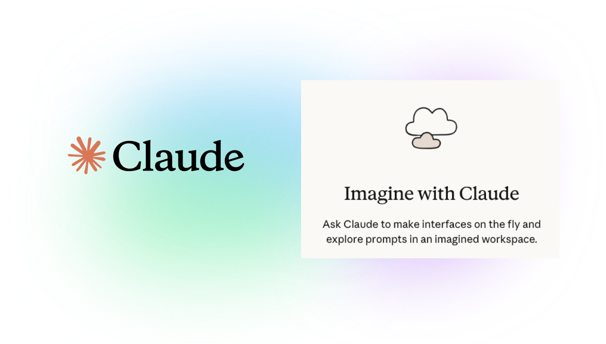

You just built an AI agent in n8n. Now you're going to build the actual web app that sits in front of it — using Claude Code to write all the code — and wire the two together into one real, working product.

But here's what's different about this lab. We're not going to explain everything upfront. We're going to build first. And somewhere in the middle, something's going to feel slightly off — and that friction is exactly the point.

By the end of this lab, you will have a fully working contract review product — not a simulation, not a dummy response, a real app talking to a real agent. You'll know how to go from a single prompt to a testable prototype in one session. You'll finally understand the difference between Claude Chat, Claude Cowork, and Claude Code — and which model tier to reach for once you're in Claude Code. You'll know how to read your own session as you build: what tokens and the context window actually are, and how `/context`, `/usage`, and `/design` let you check and control both. And you'll understand the two-sided shape every AI product shares, and how to bridge the two sides with a webhook.

No coding experience needed. Just the Claude app and about 50 minutes.

---

## What Are We Building?

A **Contract Review Web App** — the same use case from Lab 1.1, now as a real interface, wired directly into the agent you already built.

A user opens the app, uploads a contract PDF, types a question in the chat panel, and gets a response. We start with the responses simulated so you can validate the shell first — then connect the real AI agent later in this same lab. The goal is to build something that works, looks like a real product, and ends up actually talking to your agent.

---

## Before You Build: Pick the Right Claude

Claude isn't one thing. There are three modes, and using the wrong one caps what's possible.

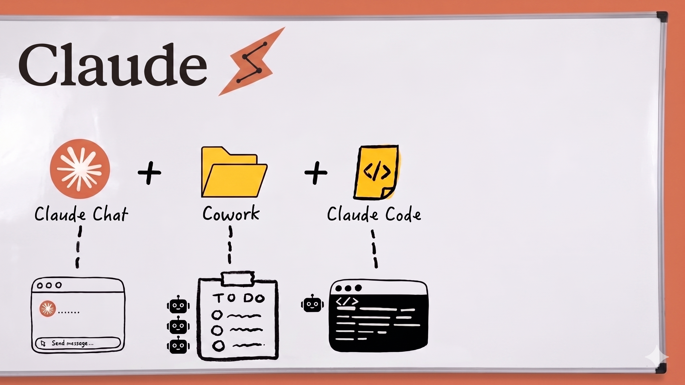

**See it on this exact project.** Before you touch the contract review app, here's how the same task would route through each mode:

- **Chat** — You're not sure yet whether reviewers should ask questions in a free-text chat or pick from a dropdown of common clauses. You open Claude Chat and talk through the trade-offs. Nothing gets built. You leave with a decision.

- **Cowork** — Your team lead wants a one-page status brief on the prototype before your next standup — what's built, what's simulated, what's next. You describe it to Claude Cowork and it generates the doc. No files in your project folder are touched.

- **Code** — You have a spec: upload panel on the left, chat panel on the right, dummy responses for now. You open Claude Code, point it at your project folder, and it writes `index.html`, `style.css`, and `script.js` directly to disk. This is what you're about to do in Part 1.

This lab uses Claude Code.

> ✓ A simple decision rule: does this involve code or files? Go to Code. Want a doc or report automated? Go to Cowork. Still figuring out what you want? Start in Chat.

---

## Before You Build: Pick the Right Model

Picking Claude Code gets you the right capability layer. But inside Claude Code, there's a second choice stacked on top of it: which model tier actually does the work.

Think of it this way: the capability layer decides *what* Claude does. The model decides *how well* it does it, and at what cost in speed. Different model tiers span a range from efficient-and-fast to thorough-and-capable. Matching the tier to the task avoids two failure modes at once — over-engineering routine work, and under-resourcing a decision that actually needs depth.

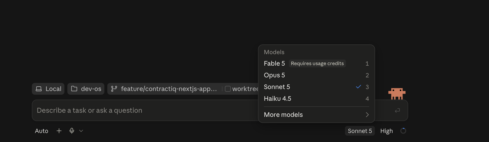

| Model | Best for | Speed / cost |
|---|---|---|
| **Haiku** | Simple and repetitive tasks, straightforward summarization | Fastest, cheapest |
| **Sonnet** | Most everyday tasks that need good-quality results | Balanced |
| **Opus** | Complex tasks that need deeper thinking | Slower, highest cost per call |
| **Fable** | Creative and narrative work — tone-sensitive copy, storytelling, voice-driven writing | Specialized for craft, not a speed/capability rung |

**Decision logic:** Use Haiku for simple tasks, Sonnet for most everyday work, Opus for complex tasks, and Fable for creative writing.

**Why does this matter for the app you're about to build?**

In this lab, you'll use Claude Code to build a website where users can upload a contract and ask questions about it. Choosing the right model helps you get good results without using more resources than needed.

Choosing the right model helps balance capability, speed, and usage.

> [!TIP]
> For this module, choose Sonnet. It gives you the right balance of quality and speed for building the contract chat website.

---

## Prerequisites

✅ **Lab 1.1 complete** — your n8n contract review workflow is built, the AI agent responded correctly inside n8n's own chat interface, and you've swapped the Chat Trigger for a Webhook (the "Prepare the Agent to Receive Outside Messages" section at the end of that lab). You'll come back to this same workflow partway through this lab.

✅ The **Claude desktop app** — [download here](https://claude.ai/download). New to Claude Code? [Follow this setup guide](../../0.0%20foundations/how-to-setup-claude/installation.md) to get it running in under 5 minutes.

✅ **Claude Code** — built into the Claude desktop app, no extra install needed.

✅ The **sample contract PDF** from Lab 1.1 — same file, use it again here. [Download it here](https://pragyaallc-my.sharepoint.com/:b:/g/personal/sachin_parmar_legalgraph_ai/IQC2WQJhhIuyRq5JrVY13FwNAdwS4M5gB5w-qzBAm9V4mRQ?e=XyvLU4) if you don't have it.

---

## Part 1: Build First, Ask Questions Later

Open the Claude desktop app. If you haven't installed it yet, go to claude.ai/download, install it for your OS, and sign in with your Claude account.

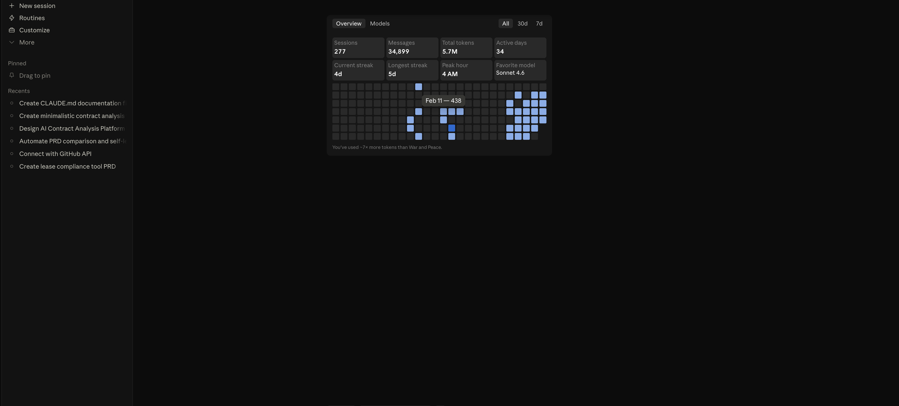

Once you're in, find **Claude Code** in the sidebar and click it. You'll land in a terminal-style interface — this is Claude working directly in your file system, not a chat window. It feels different from the chat you're used to. That's intentional. This is the building environment.

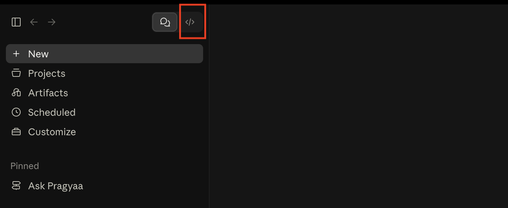

Next, create a new folder on your Desktop called `contract-review-app` and point Claude Code at it using the folder picker. Everything Claude builds will land here.

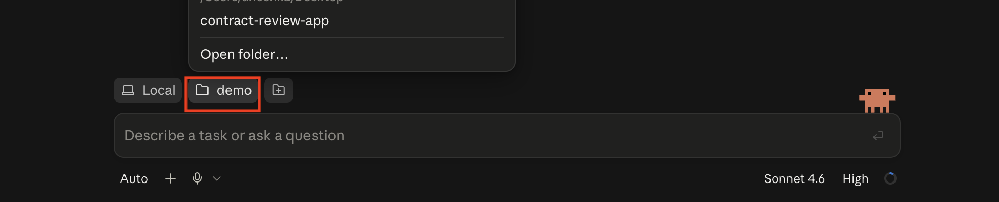

Now — don't overthink this next part. Just run this prompt exactly as written:

```
Build a contract review web app.

The app should have:
- A file upload area where users can upload a PDF contract
- A chat panel where users can type questions and see responses
- When the user types anything and hits send, respond with:
  "This is a simulated response. AI integration coming soon."
- A clean two-column layout: contract on the left, chat on the right

Create all files in the current directory using plain HTML, CSS, and JavaScript.
No frameworks, no npm, no build tools. Just files I can open in a browser.
```

Before you hit enter, here's what actually happens the moment you do.

> A token is a small piece of text Claude uses to understand what you give it. Your words, sentences, and documents are broken into these smaller pieces before Claude processes them.

**Claude processes information using tokens.** When you send a prompt, Claude breaks your text into small pieces called **tokens**. A token can be a whole word, part of a word, or punctuation. These tokens take up space in Claude's context window.

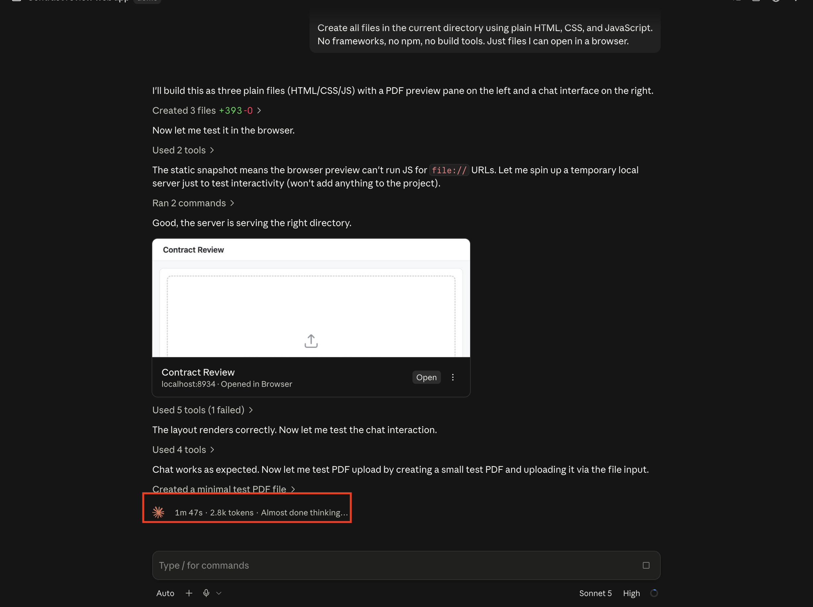

Watch Claude work. It'll generate `index.html`, `style.css`, and `script.js` in your folder.

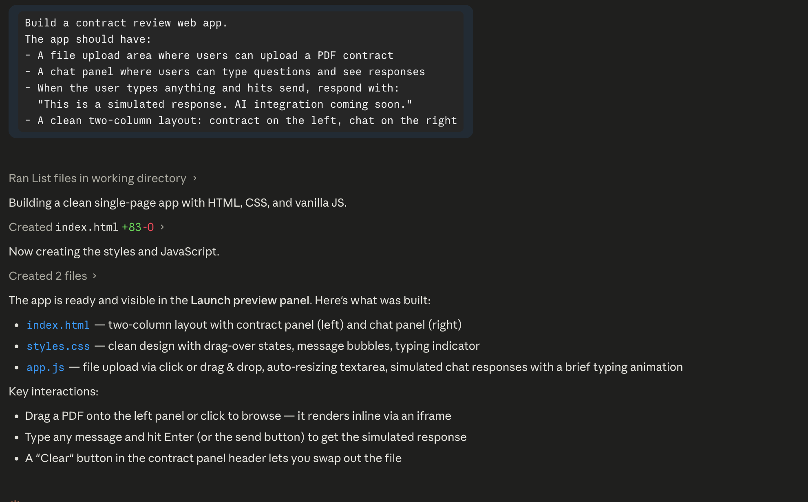

### Check Your Current Context Usage

At this point in Claude Code, type:

```text
/context
```

It shows how Claude's **context window is being used in the current session**. The space is divided between your conversation, Claude's instructions, connected tools, skills, project memory, and reserved space for compaction. **Free space** shows how much room is still available for the session.

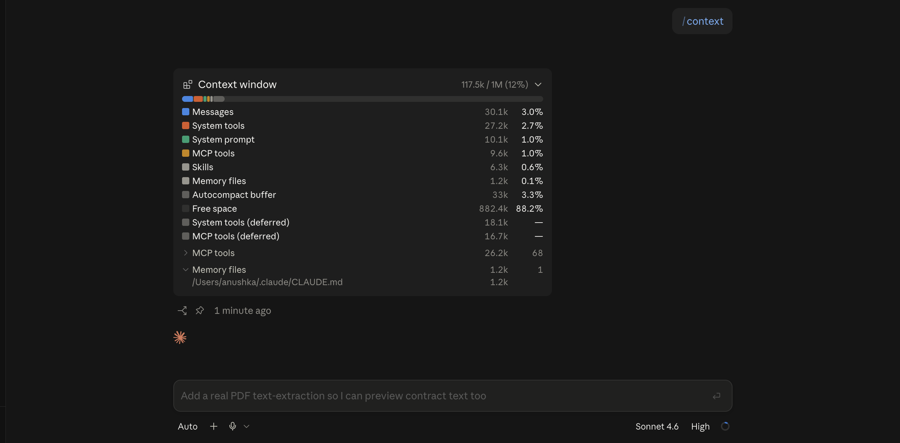

 Run /context after your first build — you've now seen how small it is, then check again later in the lab once you've iterated further — you'll watch that number climb as the session carries more history forward.

That context window has a limit. Think of it like a bag with limited space — your conversation, instructions, files, tools, and Claude's responses all take up some of that space.

As you continue working, more of the context window gets used.

| What happens | Result |
|---|---|
| There isn't enough space for the new input | Claude may not be able to process the request |
| The context fills while Claude is responding | The response may stop before it is complete |

Right now, you still have plenty of **Free Space** — as you saw when you ran `/context`. But as you continue through the lab, your conversation, files, and other information will gradually use more space.

> ✓ **Tip:** Claude Code gives you two useful commands for managing this. `/compact` summarizes the current conversation to free up context space while keeping the important information. `/clear` starts the conversation with a fresh context window — your project files remain unchanged, but the conversation history is cleared.

When it's done, go to your `contract-review-app` folder and open the app:

**On Mac:** Open Finder → Desktop → contract-review-app → right-click `index.html` → Open With → your browser

**On Windows:** Open File Explorer → Desktop → contract-review-app → double-click `index.html`

You should see the app load in a new browser tab.

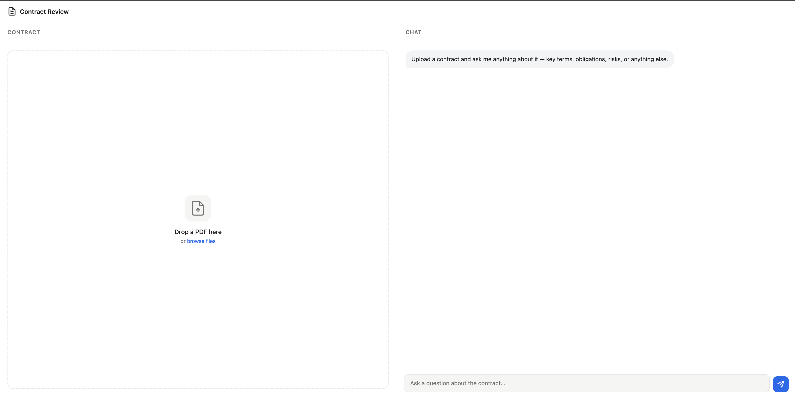

Try it. Upload the sample contract PDF. Type *"What is this contract about?"* and hit send. Type *"What are the payment terms?"* You'll get the same dummy response every time — that's expected. The AI isn't connected yet. What we're testing is the structure: does the upload work, does the chat work, do both panels show up?

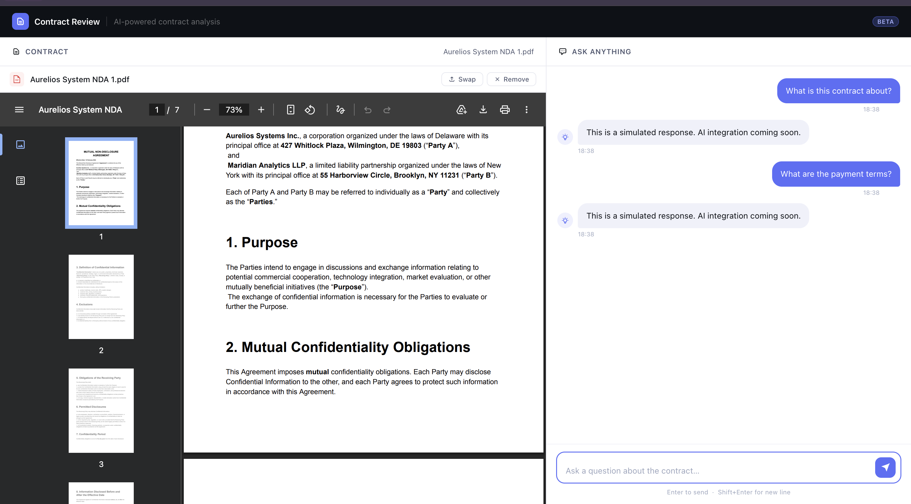

If yes — the shell is working. Move on.

---

## Part 2: The Thing That's Missing

Take a moment and really look at what Claude built.

It works. The upload button takes a file. The chat takes a message and replies. The two-column layout is there.

But be honest with yourself. Does it look like something *your team* would ship? Does it use your brand colors? Your preferred font? The spacing and visual style your design system follows?

Probably not.

Claude made decisions on your behalf. It picked a font, chose some colors, set a spacing rhythm — and they're fine. They're just not *yours*. And here's the thing that will start to bother you after a few sessions: tomorrow, if you open a new project and run a similar prompt, Claude will make completely different decisions again. It has no memory of what you showed it today. Every session starts from zero. You'd have to describe your preferences all over again, and the week after that, and every time after that.

This is the friction that quietly kills momentum for most people who start building with AI tools.

---

## Part 3: One More Iteration

The structure is solid and the style is aligned. Now let's improve two things: the visual finish and a contract preview panel so users can read the document while they chat.

Before changing the code, let's first sketch how we want the improved app to look. Type:

```text
/design
```

/design opens a visual canvas where you can experiment with the app's layout without changing your actual project code. Use it to sketch the same improvements we're about to make — a more polished interface and a contract preview alongside the chat.

In the design canvas, enter:

```text
/design Create a visual design for my contract review app with a two-column layout.

- Left side: contract PDF preview
- Right side: chat panel
- Use a navy and orange color palette for a clean, professional feel
- Make the layout clean, professional, and easy to read
- Keep both panels visible side by side
```

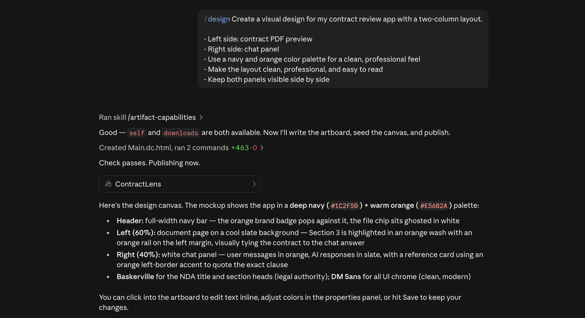

`/design` makes no changes to your app's code — it just opens a canvas so you can see the direction before committing to it.

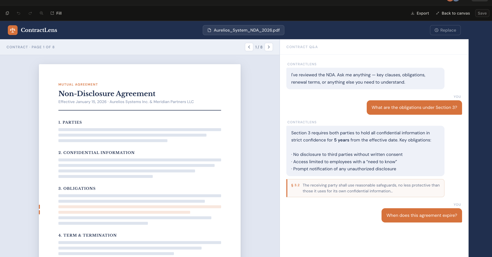

This is the canvas: a two-column mockup you can look over and approve before asking Claude Code to build it for real.

Once you're happy with the direction, bring that design back into your app:

```
Improve the prototype with two changes, matching the layout and polish
I just sketched in /design:

1. UI polish — refine the interface to feel more like a production-ready product.
   Better spacing, visual hierarchy, and polish throughout.

2. Contract preview — when the user uploads a PDF, display the contract
   in the left panel so they can read it while asking questions in the chat.
   Both panels should be visible and independently scrollable.
```

Refresh the browser when Claude finishes and test it end to end. Upload the sample contract — it should appear in the left panel. Type a question in the chat — you get the simulated response back. Try scrolling both panels independently.

By now this session has carried you through Part 1 and this iteration — two separate builds, all in one continuous conversation. Worth checking what that actually cost. Type:

```text
/usage
```

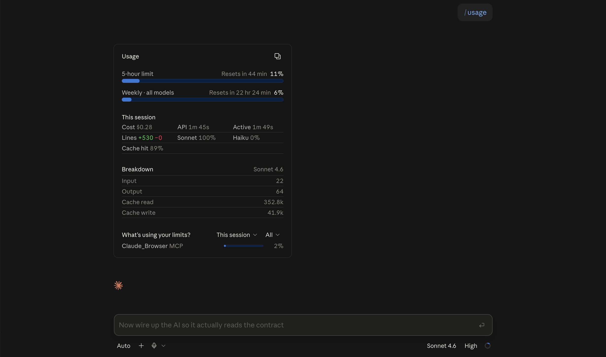

 **`/context` vs. `/usage` — they show two different things.** `/context` shows how much of your current conversation's available space is being used, while `/usage` shows how much Claude you've used while working. Think of `/context` as checking how full your backpack is, and `/usage` as checking how far you've travelled.

> ★ A prototype with dummy responses is still a prototype. You can show this to a stakeholder right now, get feedback on the layout, and validate the concept — before connecting a single line of real AI logic. Shell first. Intelligence second.

If the contract doesn't show up in the left panel after uploading, just describe it to Claude: *"The PDF isn't rendering in the left panel — the chat still works but the preview is blank."* One message is usually enough to fix it.

---

## Part 4: Connect to Your Real Agent

Right now you have two things that don't know the other exists. An AI agent in n8n that reads contracts and answers questions — built in Lab 1.1. And a polished web app that collects a file and a question, but only ever replies with a dummy string — the thing you just finished.

Every AI product has this same two-sided shape. A **user-facing side** — the buttons, the layout, the chat panel — that lives in the browser and doesn't do any real thinking. And an **intelligence side** — your n8n agent — that never appears on screen, but does the actual reading and reasoning. Right now those two sides are isolated. This part builds the bridge, using the webhook.

---

### Get Your Webhook Address from n8n

**Webhook → Extract from File → AI Agent → Respond to Webhook**

### Open the workflow from Lab 1.1

Go back to your n8n workspace and open the contract review workflow you built in Lab 1.1. This is the same workflow — your agent, your Extract from File node, all of it — now starting from the Webhook node instead of the Chat Trigger.

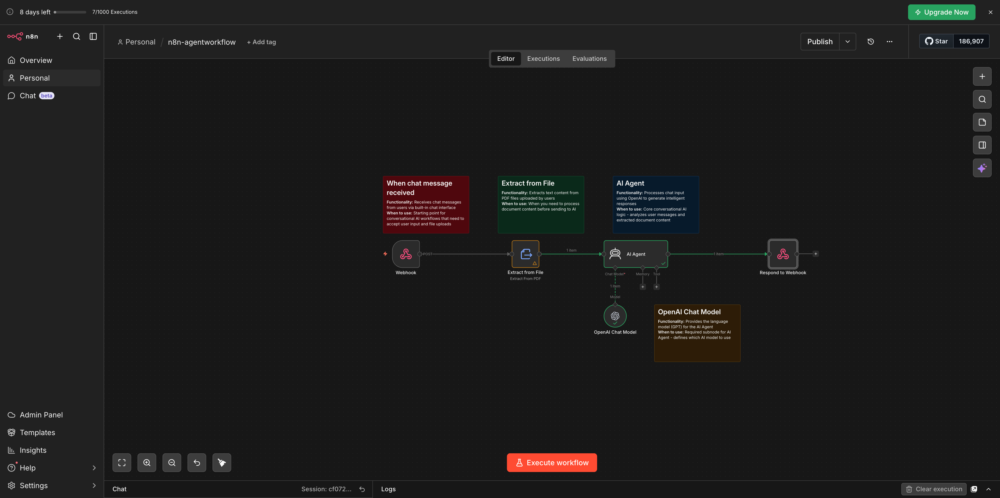

> If your workflow still starts with the Chat Trigger, you haven't finished the "Prepare the Agent to Receive Outside Messages" section of Lab 1.1 yet. Go back and complete that before continuing — this lab picks up exactly where that one left off.

---

### Copy your webhook address

Click the **Webhook** node to open its settings. Your webhook address is already sitting there from when you configured it in Lab 1.1 — it looks something like:

```
https://your-instance.app.n8n.cloud/webhook-test/your-unique-id
```

Copy it.

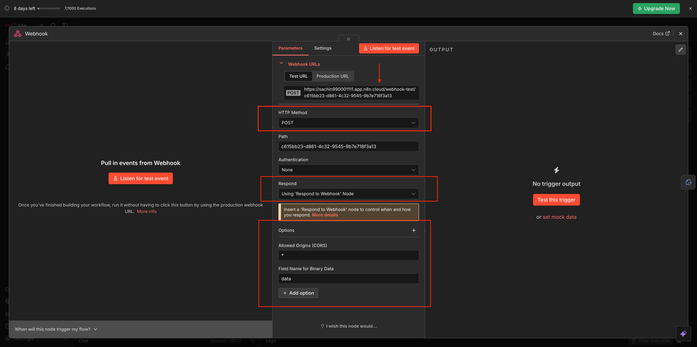

### Run the integration prompt

Stay in the same Claude Code conversation you've been using all lab — it already knows your app's structure. Copy the prompt below. Before running it, replace `<Your Webhook URL>` with the address you just copied.

```
Now add this feature to the existing prototype:

A user uploads a contract file in the UI.
The user enters a message in the chat input.
When the user clicks the Send button:

1. Collect both:
   - The uploaded contract file
   - The user's chat message

2. Send both to this webhook URL:
   <Your Webhook URL>

3. After the webhook processes the request:
   - Capture the response returned by the webhook
   - Display that response inside the chat UI as the assistant reply

Replace the dummy hardcoded responses with this webhook integration.
```

Paste it into Claude Code and run it.

Claude will update only the part of the app that needs changing — the Send button behaviour. It won't touch the layout, the design, or anything else that's already working.

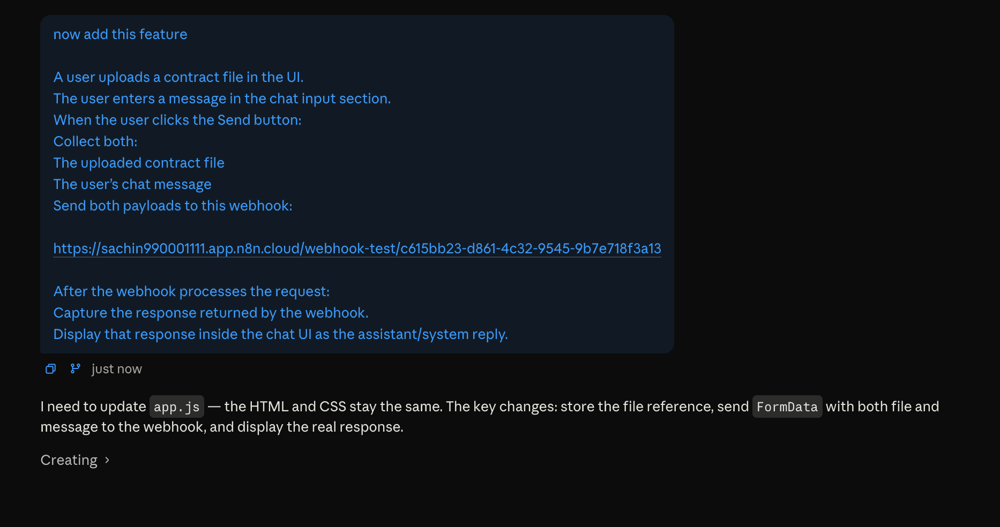

---

### Activate the workflow in n8n, then send your first real message

Before testing in the browser, go back to n8n and click **"Execute Workflow"** first.

This is important. Your webhook address only works when the workflow is actively running. If you skip this step and go straight to testing, n8n won't receive anything and the app will appear to hang.

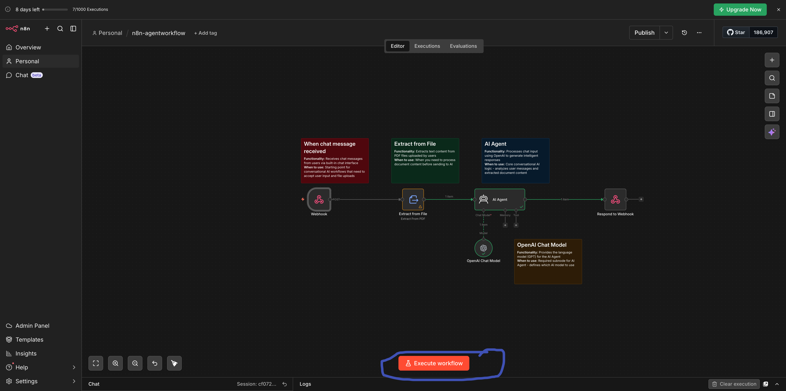

With the workflow running, go to your browser, open `index.html`, upload the sample contract, type a question, and click Send.

You'll likely see an error. That's completely normal — and it's actually a good sign.

It means your web app successfully reached the agent. The error is coming from inside the workflow, not from a broken connection. The bridge is working. There's just one small configuration left.

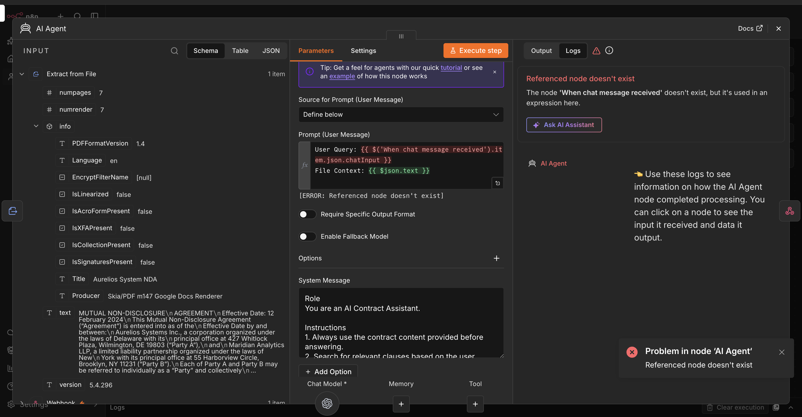

> An error at this stage means your two sides are talking to each other. The connection is live. Now we just need to make sure the agent is reading the right message.

---

### Point the agent to the right input

Go back to n8n and open the **AI Agent** node.

Find the **user message** field. It's currently set to read from the old n8n chat — which no longer exists in this workflow. You need to update it to read from the webhook instead.

Replace whatever is in that field with this:

```
{{ $json.body.message }}
```

This tells the agent: "don't look for a hardcoded question — read whatever message the user just sent from the web app." The curly braces are n8n's way of saying "pull this value in live from what just arrived."

If that doesn't work, click on the Webhook node after a test run — you'll see exactly what arrived and can match the field name from there.

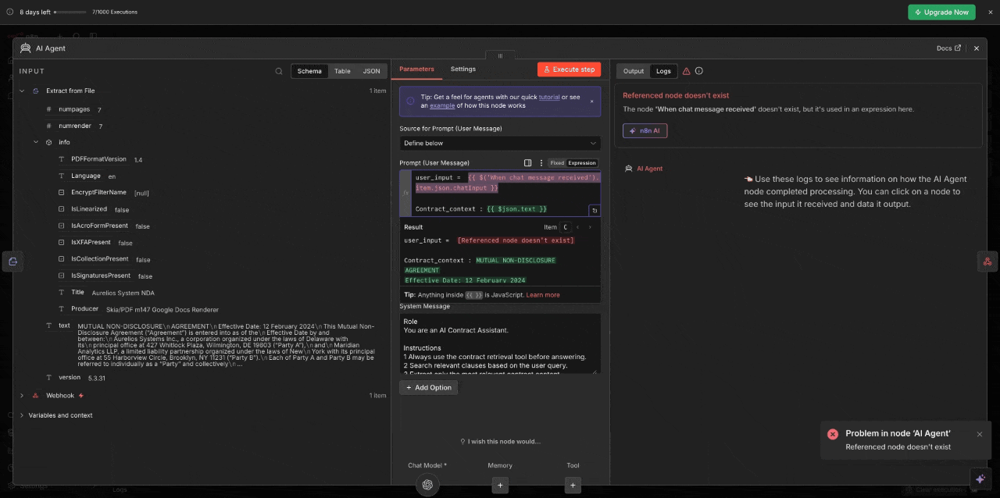

The contract file doesn't need updating — that part of the workflow is already reading it correctly. Only the user message field needs this change. Save the node.

> Not sure what field name to use? Go back to your Claude Code session and ask: "What field name are you sending the user message under?" You'll get the exact answer in one message.

---

### The final test

Go to n8n and click **"Execute Workflow"** again to put the agent back into listening mode.

Go to your browser. Upload the sample contract. Type this and click Send:

*"What is this contract about?"*

This time you'll get a real answer — pulled from the actual contract, reasoned over by your agent, and displayed right in your web app.

Try a few more:

*"What are the payment terms?"*

*"What happens if either party wants to terminate early?"*

*"Are there any auto-renewal clauses?"*

Every answer comes from the actual document. Every response travels through your agent. The two sides of your product are now one.

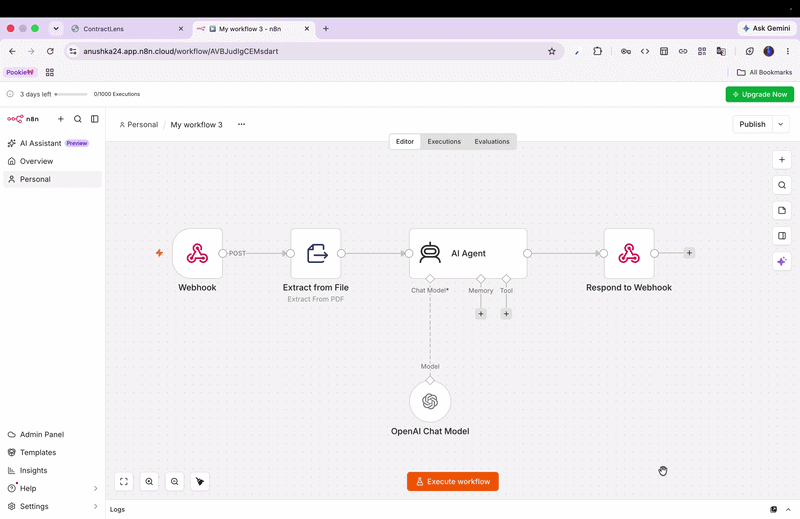

---

## What You Learned

You started this lab by just building — no setup, no theory, straight into a working prototype. Along the way you learned to read the tools around the build itself: which mode to reach for, which model tier fits the task, what your session is costing you as it grows, and how to preview a design before committing to it. By the end, you connected that prototype to a real agent (over a webhook — the one non-Claude piece of this lab) and had a working product talking back to you.

| What | What it means | Why it matters |
|---|---|---|
| **Chat, Cowork, Code — three modes** | Chat for thinking something through, Cowork for generating a doc or report, Code for actually writing files to disk | Using the wrong mode doesn't just cost time — it caps what's even possible for the task |
| **Model tier is a dial** | Haiku for routine, structured work · Sonnet for most everyday building · Opus for genuinely hard judgment calls · Fable for creative, tone-sensitive writing | Set per task, not once for the whole project — avoids over-engineering simple work and under-resourcing hard work |
| **Tokens** | The small pieces (words, word-parts, punctuation) Claude breaks your text into before processing it | It's the actual unit Claude reads and prices in |
| **Context window** | A fixed ceiling on how much of your conversation, instructions, files, and tool output can fit in one request | Run out of room and Claude may not process a request, or a response can cut off mid-way |
| **`/context`** | Shows how your current session's context window is being used right now | Lets you check how full your "bag" is before it becomes a problem |
| **`/usage`** | Shows how much Claude you've used across the session | Tells you how far you've traveled, not just how full your backpack is |
| **`/compact` and `/clear`** | `/compact` summarizes the conversation to free up space; `/clear` starts a fresh context window without touching your project files | Two different ways to manage a filling context window, depending on whether you want to keep history or drop it |
| **`/design`** | Opens a visual canvas to sketch layout and style changes without touching your app's actual code | Lets you preview and approve a direction before spending a build turn on it |
| **Iteration-first prototyping** | Structure first, polish second, AI integration third | Trying to do all three at once is how prototypes stall |
| **Two-sided product shape** | A user-facing side (what you build in Claude Code) and an intelligence side (your agent) that don't know about each other until you connect them | Most AI products fail because these two sides never get wired together |

---

[← Back to Week 1 Overview](../readme.md)
