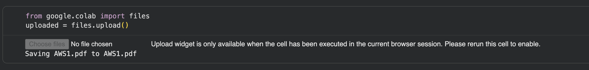
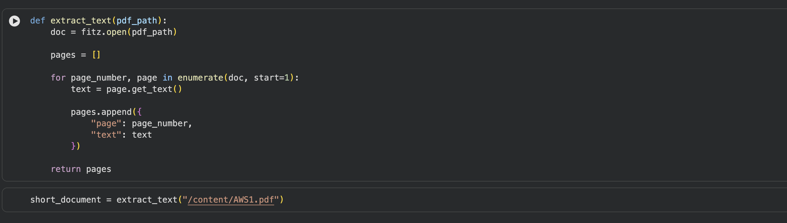
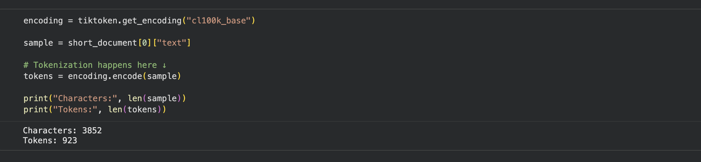
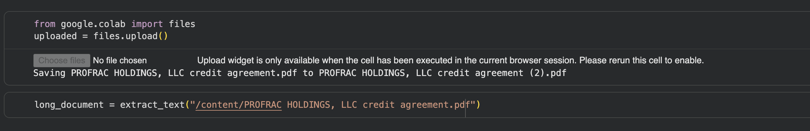
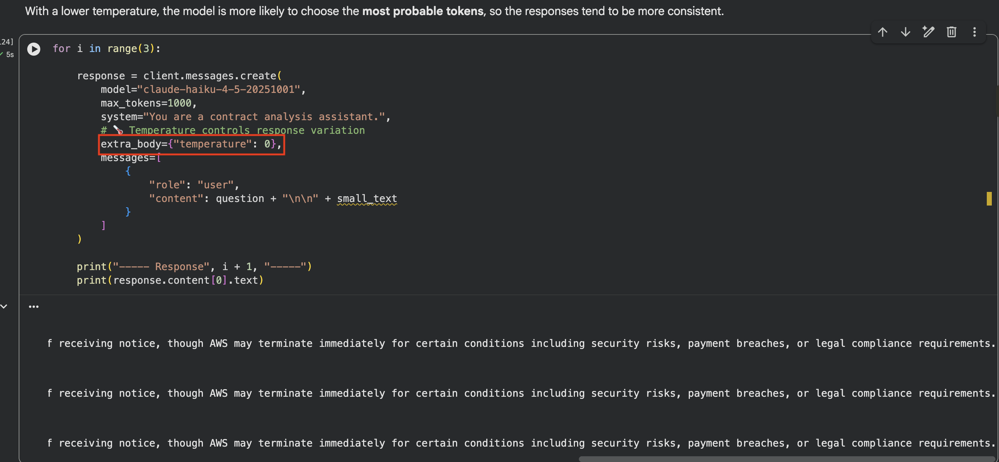
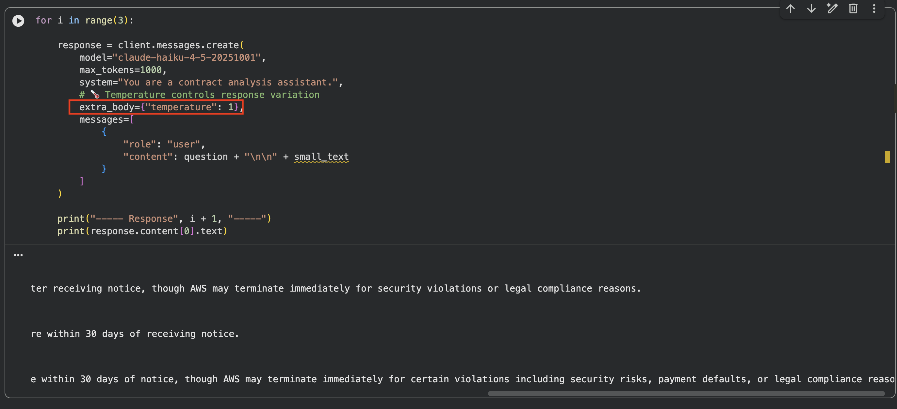
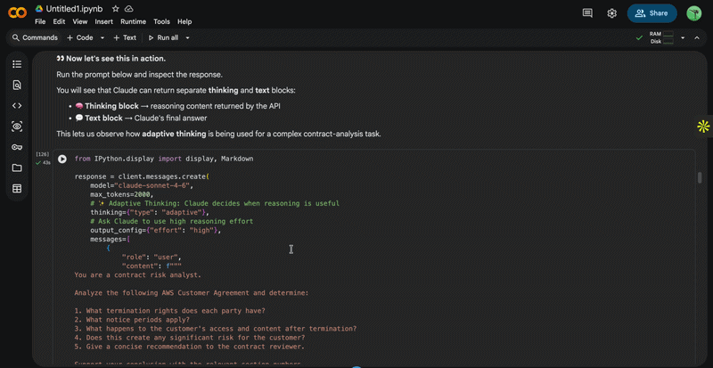

# Open the Jupyter Notebook in Google Colab

You can open this Jupyter notebook directly in Google Colab by clicking the link below:

[](https://colab.research.google.com/github/anushka2423/MLAI-community-labs/blob/main/Cohort-Labs/cohort-10/week-1-intro-agents/1.3-google-collab/notebook.ipynb)

## Contents

- [Pre-requisites](#pre-requisites)
- [Installing the Packages](#installing-the-packages)
- [Imports](#imports)
- [Connecting to Claude](#connecting-to-claude)
- [Uploading Our First Contract](#uploading-our-first-contract)
- [Extracting Text from the PDF](#extracting-text-from-the-pdf)
- [What Does Claude Actually See? — Tokens](#what-does-claude-actually-see--tokens)
- [Adding a Much Larger Contract](#adding-a-much-larger-contract)
- [Sending a PDF Directly to Claude](#sending-a-pdf-directly-to-claude)
- [How Does Claude Generate an Answer? — Sampling](#how-does-claude-generate-an-answer--sampling)
- [Non-Determinism Leads Us to Evals](#non-determinism-leads-us-to-evals)
- [Choosing a Model](#choosing-a-model)
- [Reasoning and Adaptive Thinking](#reasoning-and-adaptive-thinking)
- [Now Let's Improve the Prompt](#now-lets-improve-the-prompt)
- [Different Ways to Call Claude](#different-ways-to-call-claude)
  - [Synchronous Request](#synchronous-request)
  - [Streaming](#streaming)
  - [Async](#async)
  - [Message Batches](#message-batches)
- [What we Learned so far](#what-we-learned-so-far)

In this lab, we're going to build a small **contract-analysis flow using Claude**.

But instead of only sending a contract to Claude and getting an answer, we're going to use this example to understand what is actually happening behind the scenes.

As we move through the notebook, we'll understand **tokens, context windows, sampling, evaluations, model selection, reasoning, prompting**, and finally the different ways we can call the **Claude API**.

So let's start from the setup.

### Pre-requisites

1. **Anthropic API key** — you'll need one to call Claude from the notebook.
2. **Google Colab setup.** If you haven't used Colab before, follow this guide: [Click Here](https://medium.com/@aditya_dev30/getting-started-with-google-colab-your-ultimate-setup-guide-for-generative-ai-projects-53fe25f3fc04)
3. Two sample contracts are used in this lab:
   - **AWS1.pdf** (short, ~12 pages) — [Download Link](https://drive.google.com/file/d/1XSe2pSsGN1ssAbif92rvb80AnHb_Ni0F/view?usp=sharing)
   - **PROFRAC HOLDINGS, LLC Credit Agreement.pdf** (long, ~216 pages) — [Download Link](https://drive.google.com/file/d/1UyOxeaEQsK5TFxXHI63PshoKmj0yjTmW/view?usp=sharing)

Download both PDFs before you start — you'll be asked to upload them at specific points in the notebook.

---

## Installing the Packages

The first thing we need to do is install a few Python packages that we'll use throughout the notebook.

Here we install **Anthropic, PyMuPDF, and tiktoken**.

`anthropic` gives us the Python SDK that we'll use whenever we want to send a request to Claude.

`PyMuPDF`, which we access through `fitz`, helps us open our contract PDFs and extract their text.

And `tiktoken` is being used in this lab to demonstrate how normal text gets broken down into **tokens**.

So we're installing these now because each one will come into our workflow later.

```python
!pip install -q -U anthropic
!pip install -q -U PyMuPDF tqdm tiktoken
```

---

## Imports

Next, we're importing those libraries at the beginning.

We import `anthropic` for the Claude API, `fitz` for our PDFs, `tiktoken` for the token demonstration, and `asyncio`, which we'll use much later when we look at asynchronous API calls.

We keep these imports near the beginning so that once our environment is ready, the rest of the notebook can reuse them.


---

## Connecting to Claude

Now we actually connect our Python code to Claude.

Here we're creating an Anthropic client.

I'm keeping my actual API key inside **Colab Secrets**, rather than writing it directly in the notebook.

Once this client is created, whenever you see something like:

`client.messages.create`

later in the lab, that is our Python code making a request to the **Anthropic API and calling a Claude model**.

So now our environment is ready and Claude is connected.


---

## Uploading Our First Contract

Next, we need some data to work with.

Our use case is contract analysis, so I'll upload our first contract, `AWS1.pdf`.

Colab's `files.upload()` simply lets us select a file from our computer and make it available inside this notebook.

From this point onward, we're going to use this same contract to understand how an LLM actually handles information.

Imagine the user eventually asks:

**"What is the termination notice period in this contract?"**

Before answering that question, let's understand what happens to this PDF.



---

## Extracting Text from the PDF

Our PDF itself isn't yet a simple Python string that we can inspect.

So here we've created an `extract_text` function.

`fitz.open()` opens the PDF, and then we loop through every page and extract its text.

We're storing both the **page number** and **text**, so instead of having one huge block immediately, our contract is initially represented page by page.

Then in the next cell, we combine all of those pages together using `join`.

Now `contract_text` contains the complete extracted contract text.

And we'll keep reusing this variable throughout the rest of the notebook rather than extracting the PDF again every time.



---

## What Does Claude Actually See? — Tokens

Now that we have text, we can ask an important question:

**Does an LLM actually read this text the same way we do?**

Not exactly.

LLMs process text as smaller units called **tokens**.

Here, we take the first page of our contract and pass it through a tokenizer.

Then we compare the number of **characters** in the original text with the number of **tokens**.

You'll notice they're not the same.

This matters because when we send information to an LLM, its capacity isn't simply measured by pages or words — **tokens are one of the core units involved in how the model processes context and usage.**

And that naturally brings us to our next question:

**How many tokens, or how much information, can we actually give the model at once?**



---

## Adding a Much Larger Contract

To test that, we're going to upload another contract.

Our first contract has around **12 pages**, while this second credit agreement has **216 pages**.

We run the same PDF extraction function again, so now we have both a relatively small document and a much larger one.

And we're going to see what happens when we try to send these documents directly to Claude.



---

## Sending a PDF Directly to Claude

Until now we extracted text ourselves.

But Claude's API can also receive PDFs as document content.

For this example, we open the PDF and convert it into **Base64**.

You don't need to overthink Base64 here.

We're basically doing:

**Open PDF → read its contents → encode it into a format we can put into the API request.**

Then inside `client.messages.create`, notice that our message contains two things.

First, the **document itself**.

And second, the text instruction:

**"Analyze this contract and summarize the key terms."**

So Claude receives both the document and what we want it to do.

Our 12-page PDF succeeds.

Then we try the same approach with the 216-page PDF, and that request is rejected because the PDF exceeds the allowed page limit used in this example.

And this gives us our **context-management lesson**.

A model cannot simply accept unlimited information in one request.

You can think of its context as its **working space**.

So as applications become larger, we have to think carefully about **what information we're sending and how we're sending it**, rather than blindly putting everything into one request.


---

## How Does Claude Generate an Answer? — Sampling

Now let's go back to our smaller contract.

Suppose I ask:

**"In one sentence, explain the termination notice period."**

Claude doesn't generate the entire sentence in one step.

It generates the response progressively by predicting possible **next tokens**.

There can be multiple reasonable next tokens with different probabilities.

The process of choosing between these possibilities is related to **sampling**.

And here we're going to use `temperature` to make that behaviour easier to observe.

First, we ask exactly the same question three times with temperature set to `0`.

The responses should generally be more predictable and consistent.

Then we change temperature to `1` and ask the **same question again three times**.

Now we're allowing more variation in token selection, so we may see more variation in the responses.





---

## Non-Determinism Leads Us to Evals

And this reveals something important about LLM applications.

The exact same question doesn't necessarily produce exactly the same sentence every time.

One answer might say:

**"The termination notice period is 30 days."**

Another might phrase the same information differently.

This behaviour is called **non-determinism**.

And now we have a testing problem.

In traditional software, we might write:

**expected output equals actual output.**

But if two differently worded LLM responses are both correct, exact matching isn't always enough.

Instead, we might evaluate:

Is the answer **correct**?

Is it **relevant**?

Is it **complete**?

And is it **grounded in our contract**?

These are our **evals**.

And evals become very important in the next part because we now need to decide which model and prompting strategy works best.

---

## Choosing a Model

Not every contract task has the same difficulty.

Finding an effective date might be relatively simple.

Summarizing a clause is a little harder.

Determining whether that clause creates a significant business risk requires more analysis.

Claude models therefore give us different trade-offs between **capability, latency, and cost**.

So the goal isn't:

**always use the biggest model.**

The goal is to use the model that performs well enough for our task.

And how do we know whether it performs well enough?

That's where the **evals we just discussed** help us.

---

## Reasoning and Adaptive Thinking

Sometimes changing the model isn't the only option.

A complex task may also benefit from more **reasoning**.

Here, we're asking Claude to analyze termination rights, notice periods, what happens after termination, the risks involved, and finally make a recommendation.

That's much more involved than simply extracting one date.

So in this request we're enabling:

```python
thinking={"type": "adaptive"}
```

With adaptive thinking, Claude can determine when additional reasoning is useful for the task.

We're also setting the reasoning effort to `high`.

When we inspect the API response, the notebook separates the returned **thinking block** from the **final text answer**.

The important idea is that **simple extraction and complex analysis don't necessarily need the same amount of reasoning**.

Again, model choice and reasoning are things we should evaluate rather than automatically maximizing.



---

## Now Let's Improve the Prompt

So far we've mostly told Claude what we want.

Now let's see what happens when we start giving it **examples**.

We'll use the same contract-extraction task for all three approaches.

### Zero-Shot

First is **zero-shot**.

Here we simply say:

**Extract these key terms from the contract.**

There are **no examples**.

We're relying on Claude to understand the instructions and determine how to answer.

For straightforward tasks, that may already be enough.

### One-Shot

Next we add **one example**.

Notice that the example demonstrates not only what information to extract, but also how we want the answer represented in **JSON**.

So instead of describing every formatting rule, we're showing Claude one example of the desired behaviour.

That's **one-shot prompting**.

### Few-Shot

Finally, we provide multiple examples.

One demonstrates **text**.

One demonstrates a **number**.

One demonstrates a **date**.

And another demonstrates what to do when a value **cannot be found — return `null`.**

Now we're teaching Claude how to handle several different cases.

That's **few-shot prompting**.

But the lesson isn't that we should keep adding examples forever.

Every example makes our prompt larger.

So if we're heading toward a huge prompt, we should evaluate whether better results would come from **examples, model choice, reasoning, context, or better output constraints**.

That decision should again be driven by **evals**.


---

## Different Ways to Call Claude

Now that we know how to construct our requests, the last part of the lab asks:

**How should our application actually receive the response?**

We'll look at four patterns using the same contract use case.

---

## Synchronous Request

First is the normal **synchronous request** we've mostly been using.

We call `client.messages.create`, send the contract and question, and Python waits until Claude finishes.

Only after the full response returns does the next line execute.

So:

**Request → wait → complete response.**

This is great when we simply need one answer now.

---

## Streaming

But imagine this is a chatbot.

We probably don't want the user staring at a blank screen until the entire response has been generated.

That's where **streaming** comes in.

Instead of `messages.create`, here we're using `messages.stream`.

And `stream.text_stream` lets us receive and print pieces of the answer as Claude generates them.

So instead of:

**wait → full response**

we get:

**piece → piece → piece → complete response.**

That's why streaming is very useful for interactive chat experiences.

---

## Async

Now imagine we have multiple independent questions about our contract.

If we handle everything synchronously, one request may wait for another.

So here we introduce `AsyncAnthropic`, `async def`, and `await`.

The important idea isn't just the Python syntax.

It's that while one API operation is waiting, asynchronous code can allow other work to progress.

And in the next cell we make that much clearer.

We create five independent questions and use `asyncio.gather` to run those Claude requests concurrently.

So rather than thinking:

**Question 1, finish it, then Question 2, finish it...**

we can have multiple independent requests in progress.

---

## Message Batches

Finally, let's scale the idea further.

Suppose we're doing **evaluations**.

We have **two contracts** and **three common questions**.

That means:

**2 contracts × 3 questions = 6 independent requests.**

We create those six requests and submit them together using an **Anthropic Message Batch**.

Unlike the async example, we're not trying to get all the answers back immediately.

We submit the collection as a batch, receive a **batch ID**, check its processing status, and retrieve the results once processing has completed.

This makes Message Batches useful when we have a large number of independent jobs — especially things like **large-scale evaluations**.

So the easiest way to remember these patterns is:

**Sync:** I need one complete answer now.

**Streaming:** I want the user to see the answer as it's generated.

**Async:** I need several requests running concurrently.

**Batch:** I have many independent jobs and don't need the results immediately.

---

## What we Learned so far

We started with a PDF contract and connected it to Claude.

Then we looked underneath the application to understand **tokens and context**, followed the generation process into **sampling and non-determinism**, and saw why that leads us to **evals**.

Those evals then help us make better decisions about **models, reasoning, and prompting**.

And finally, once our prompt is ready, we looked at different ways an actual application can communicate with Claude using **sync, streaming, async, and Message Batches**.

So rather than treating these as separate concepts, think of them as different decisions we make while building one real Claude application.
